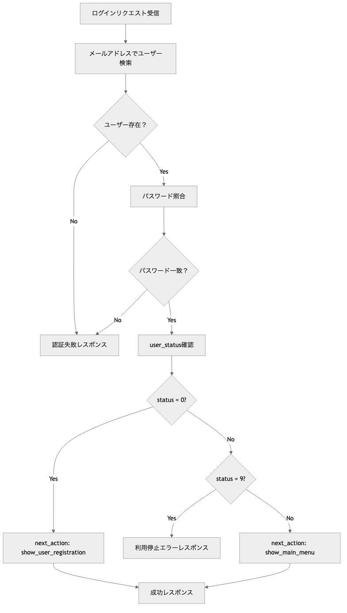

# OptiServe 認証モジュール プログラム仕様書 / Auth Module Program Specification

## 概要 / Overview

このモジュールは、OptiServeシステムにおけるユーザーログイン認証機能を提供します。
メールアドレスとパスワードによる認証を行い、ユーザーの状態に応じた次の画面遷移指示を含むレスポンスを返却します。

**[English]**
This module provides user login authentication functionality for the OptiServe system.
It performs authentication using email and password, and returns responses including next screen transition instructions based on user status.

## 1. システム構成 / System Architecture

| 項目 / Item | 内容 / Content |
|-------------|----------------|
| 使用フレームワーク / Framework | FastAPI |
| 認証方式 / Authentication | Email + Password（平文比較） |
| トークン / Token | なし（PoC段階） / None (PoC stage) |
| DB接続 / Database | SQLite（開発用）/ PostgreSQL（本番予定） |
| APIパス / API Path | `/api/v1/auth/login` |
| HTTPメソッド / HTTP Method | POST |

## 2. 関連ファイル / Related Files

| ファイル名 / File Name | 役割 / Role |
|------------------------|-------------|
| `routers/auth.py` | APIエンドポイントの定義 / API endpoint definition |
| `schemas/auth.py` | リクエスト・レスポンスのPydanticモデル定義 / Request/Response Pydantic model definition |
| `models/pg_optigate/mst_user.py` | `mst_user` テーブルのORMモデル / ORM model for mst_user table |
| `database.py` | データベース接続設定 / Database connection configuration |

## 3. API仕様 / API Specifications

### エンドポイント / Endpoint

```http
POST /api/v1/auth/login
Content-Type: application/json
```

### リクエスト仕様 / Request Specification

**Schema**: `LoginRequest` (schemas/auth.py)

| フィールド名 / Field | 型 / Type | 必須 / Required | 説明 / Description |
|---------------------|-----------|-----------------|-------------------|
| `e_mail` | str | ✅ | ログイン用メールアドレス / Login email address |
| `password` | str | ✅ | パスワード（平文） / Password (plain text) |

**リクエスト例 / Request Example**:
```json
{
  "e_mail": "user@example.com",
  "password": "password123"
}
```

### レスポンス仕様 / Response Specification

**Schema**: `LoginResponse` (schemas/auth.py)

| フィールド名 / Field | 型 / Type | 説明 / Description |
|---------------------|-----------|-------------------|
| `success` | bool | ログイン成功フラグ / Login success flag |
| `user_id` | str \| None | ユーザーID / User ID |
| `entity_type` | int \| None | 組織種別（1=医療機関, 9=システム管理者） / Entity type |
| `entity_relation_id` | int \| None | 組織ID / Entity relation ID |
| `user_status` | int \| None | ユーザー状態（0=仮登録, 1=稼働中, 9=利用停止） / User status |
| `next_action` | str | 次の画面遷移指示 / Next action instruction |
| `message` | str | 結果メッセージ / Result message |

## 4. データモデル / Data Models

記述無し

**[English]**
No description

## 5. 機能詳細 / Functional Details

### 5.1 業務フロー / Business Flow



### 処理ステップ / Processing Steps

1. **ユーザー検索 / User Search**
   - `mst_user.e_mail` でユーザーを検索
   - 存在しない場合は認証失敗

2. **パスワード照合 / Password Verification**
   - 平文での単純比較（PoC段階のため）
   - 不一致の場合は認証失敗

3. **ユーザー状態判定 / User Status Check**
   - `user_status = 0`: 仮登録状態
   - `user_status = 1`: 稼働中
   - `user_status = 9`: 利用停止（ログイン拒否）
   - その他: 通常運用として扱う

4. **レスポンス生成 / Response Generation**
   - 成功時: ユーザー情報と次の行動指示を返却
   - 失敗時: エラーメッセージを返却

### 5.2 権限管理 / Permission Management

記述無し

**[English]**
No description

### 5.3 バリデーション / Validation

### 入力値検証 / Input Validation
- `e_mail`: Pydanticによるメールアドレス形式チェック
- `password`: 必須入力（形式チェックなし）

### ビジネスロジック検証 / Business Logic Validation
- ユーザー存在チェック
- パスワード一致チェック
- ユーザー状態チェック

### 5.4 エラーハンドリング / Error Handling

### 認証失敗レスポンス / Authentication Failure Response

**共通エラーメッセージ**: "メールアドレス、またはパスワードが間違っています"

```json
{
  "success": false,
  "user_id": null,
  "entity_type": null,
  "entity_relation_id": null,
  "user_status": null,
  "next_action": "none",
  "message": "メールアドレス、またはパスワードが間違っています"
}
```

### ステータスコード / Status Codes

| ステータス / Status | 条件 / Condition |
|-------------------|------------------|
| 200 OK | 認証成功・失敗問わず / Both success and failure |
| 422 Unprocessable Entity | リクエスト形式エラー / Request format error |
| 500 Internal Server Error | サーバーエラー / Server error |

### 5.5 データベース連携 / Database Integration

#### 使用テーブル / Used Tables
- **`mst_user`**: ユーザーマスタテーブル

#### 参照カラム / Referenced Columns
- `user_id`: ユーザーID（主キー）
- `e_mail`: メールアドレス（ログインID）
- `password`: パスワード
- `entity_type`: 組織種別
- `entity_relation_id`: 組織ID
- `user_status`: ユーザー状態

### 5.6 next_action定義 / Next Action Mapping

| user_status | next_action | 意味 / Meaning | メッセージ / Message |
|-------------|-------------|----------------|-------------------|
| 0 | `show_user_registration` | 仮登録状態→本登録画面へ遷移 / Temporary registration → Go to full registration | `"仮登録状態です。本登録を完了してください。"` |
| 1 | `show_main_menu` | 通常運用→メイン画面へ遷移 / Normal operation → Go to main menu | `"ログイン成功"` |
| 9 | `none` | 利用停止→ログイン拒否 / Suspended → Login denied | `"対象のユーザーは利用できません。"` |
| null | `none` | 認証失敗 / Authentication failed | `"メールアドレス、またはパスワードが間違っています"` |

## 6. セキュリティ考慮事項 / Security Considerations

### 現在の実装 / Current Implementation
- **パスワード**: 平文比較（PoC段階）
- **トークン**: 未使用
- **セッション**: 未管理

### 本番環境での改善予定 / Production Environment Improvements
- パスワードハッシュ化（bcrypt等）
- JWTトークン発行
- セッション管理
- HTTPS通信
- レート制限
- アカウントロック機能

## 7. パフォーマンス考慮事項 / Performance Considerations

以下の項目は一部実装済みの機能もありますが、本格的なプロダクション環境での運用を想定し、将来的に検討・実装すべきパフォーマンス改善案を記載しています。

**[English]**
While some of the following items are partially implemented, this section outlines performance improvement measures that should be considered and implemented for full-scale production environment operation.

### データベース最適化 / Database Optimization
- インデックス最適化（e_mailでの高速検索）
- コネクションプール設定
- 認証処理の負荷分散

### キャッシュ戦略 / Caching Strategy
- 認証結果の短期キャッシュ
- セッション情報のRedisキャッシュ

## 8. テスト項目 / Test Cases

### 正常系 / Normal Cases
1. **仮登録ユーザーログイン**: user_status=0 → next_action="show_user_registration"
2. **稼働中ユーザーログイン**: user_status=1 → next_action="show_main_menu"

### 異常系 / Error Cases
1. **存在しないメールアドレス**: 認証失敗レスポンス
2. **パスワード不一致**: 認証失敗レスポンス
3. **利用停止ユーザー**: user_status=9 → success=false, message="対象のユーザーは利用できません。"
4. **不正なメールアドレス形式**: 422バリデーションエラー
5. **空パスワード**: 422バリデーションエラー

### 利用停止ユーザーテスト / Suspended User Tests
1. **テストシナリオ**: ユーザー作成 → inactive化（user_status=9） → ログイン試行
2. **期待結果**: success=false, next_action="none", message="対象のユーザーは利用できません。"
3. **実装場所**: `tests/test_03_user_api.py::test_login_suspended_user`

## 9. 今後の拡張予定 / Future Enhancements

1. **セキュリティ強化**
   - bcryptによるパスワードハッシュ化
   - JWTトークン発行・検証
   - リフレッシュトークン機能

2. **機能拡張**
   - パスワードリセット機能
   - 2要素認証
   - ログイン履歴記録

3. **運用改善**
   - ログイン試行回数制限
   - IPアドレス制限
   - 異常ログイン検知

## 10. 運用考慮事項 / Operational Considerations

記述無し

**[English]**
No description

## 11. 関連資料 / Related Documents

- [User API仕様書](api_users.md)
- [データベース設計書](../database/pg_optigate/mst_user.yaml)
- [認証テスト仕様](../../tests/test_user_api.py)
