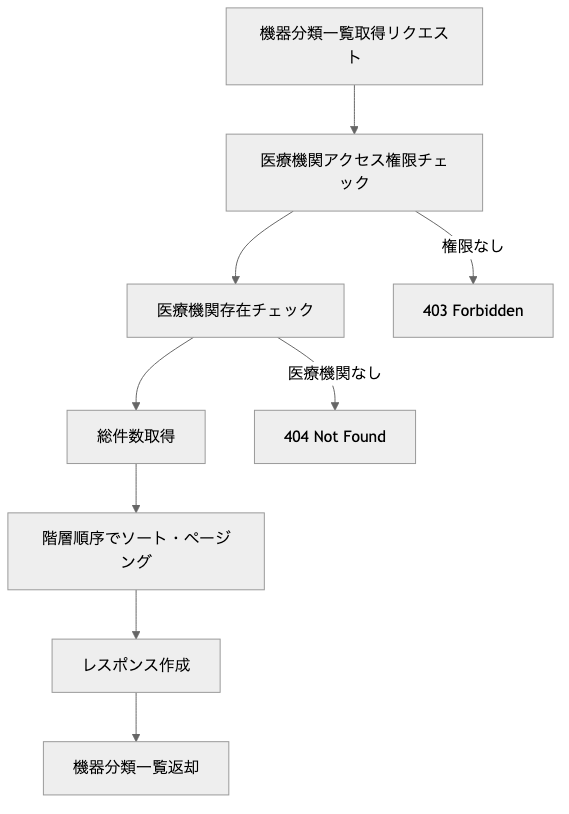
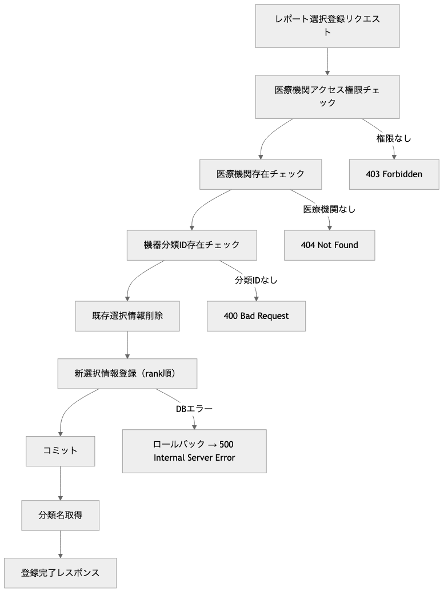
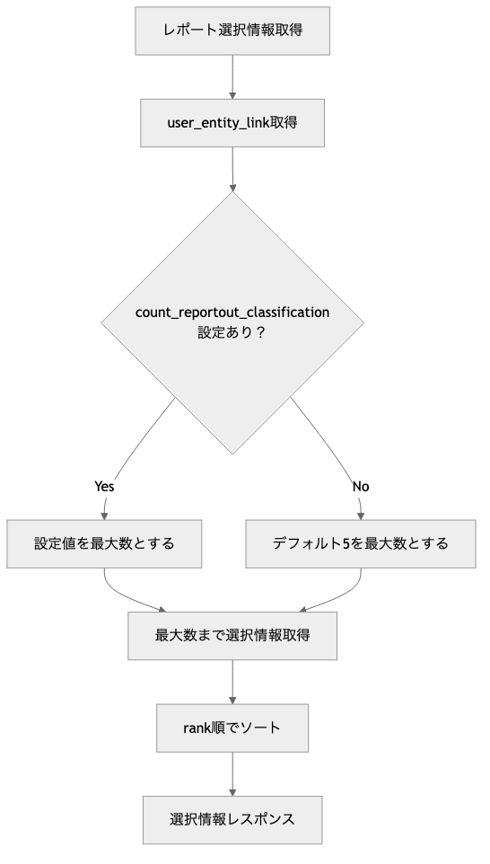

# OptiServe 機器分類管理モジュール プログラム仕様書 / Equipment Classifications Management Module Program Specification

## 概要 / Overview

このモジュールは、OptiServeシステムにおける機器分類マスタの照会とレポート出力用機器分類選択機能を提供します。
医療機関ごとの機器分類情報の取得と、医療機関向けレポート作成時に優先表示する機器分類の選択・管理機能を含む、階層構造対応のAPIを提供します。

**[English]**
This module provides equipment classification master inquiry and report output equipment classification selection functionality for the OptiServe system.
It includes hierarchical structure-compatible APIs that provide retrieval of equipment classification information by medical facility and selection/management of equipment classifications to be prioritized in medical facility reports.

## 1. システム構成 / System Architecture

| 項目 / Item | 内容 / Content |
|-------------|----------------|
| 使用フレームワーク / Framework | FastAPI |
| 認証方式 / Authentication | X-User-Id ヘッダー + AuthManager |
| 権限管理 / Permission | 医療機関ユーザー（自組織のみアクセス） |
| DB接続 / Database | SQLite（開発用）/ PostgreSQL（本番予定） |
| APIパス / API Path | `/api/v1/equipment-classifications` |
| データモデル / Data Model | SQLAlchemy ORM + Pydantic |
| 階層構造 / Hierarchical Structure | 大分類・中分類・小分類の3階層 |
| ログ出力 / Logging | Python標準ライブラリlogging |

## 2. 関連ファイル / Related Files

| ファイル名 / File Name | 役割 / Role |
|------------------------|-------------|
| `routers/equipment_classifications.py` | APIエンドポイントの定義 / API endpoint definition |
| `schemas/equipment_classification.py` | Pydanticモデル定義 / Pydantic model definition |
| `models/pg_optigate/mst_equipment_classification.py` | 機器分類マスタテーブル / Equipment classification master table |
| `models/pg_optigate/equipment_classification_report_selection.py` | レポート選択テーブル / Report selection table |
| `models/pg_optigate/user_entity_link.py` | ユーザー組織連携（選択数制限） / User entity link |
| `utils/auth.py` | 認証・認可管理 / Authentication & authorization |

## 3. API仕様 / API Specifications

### 3.1 機器分類階層構造 / Equipment Classification Hierarchy

```plaintext
大分類 (classification_level=1)
├── 中分類 (classification_level=2, parent_classification_id=大分類ID)
│   ├── 小分類 (classification_level=3, parent_classification_id=中分類ID)
│   └── 小分類 (classification_level=3, parent_classification_id=中分類ID)
└── 中分類 (classification_level=2, parent_classification_id=大分類ID)
    └── 小分類 (classification_level=3, parent_classification_id=中分類ID)
```

### 3.2 レポート選択制限 / Report Selection Limits

- **最大選択数**: `user_entity_link.count_reportout_classification` で制御
- **デフォルト**: 5分類
- **選択順序**: rank（1から開始）でソート
- **レポート出力**: 選択された分類のみがレポートに表示

### 3.3 リクエスト仕様 / Request Specification

| フィールド / Field | 型 / Type | 説明 / Description |
|-------------------|-----------|-------------------|
| `medical_id` | int | 医療機関ID / Medical facility ID |

**Schema**: 'ReportSelectionRequest'（選択登録リクエスト）

| フィールド / Field | 型 / Type | 必須 / Required | 説明 / Description |
|-------------------|-----------|-----------------|-------------------|
| `classification_ids` | List[int] | ✅ | 機器分類IDリスト（順序がrank順） / Classification ID list |

### 3.4 レスポンス仕様 / Response Specification

**Base**: 'EquipmentClassification' （機器分類）

| フィールド / Field | 型 / Type | 説明 / Description |
|-------------------|-----------|-------------------|
| `classification_id` | int | 機器分類ID（主キー） / Classification ID (Primary Key) |
| `medical_id` | int | 医療機関ID / Medical facility ID |
| `classification_name` | str | 分類名 / Classification name |
| `classification_level` | int | 階層レベル（1-3） / Hierarchy level |
| `parent_classification_id` | int | 親分類ID / Parent classification ID |
| `publication_classification_id` | int | 公開分類ID / Publication classification ID |
| `regdate` | datetime | 登録日時 / Registration date |
| `lastupdate` | datetime | 最終更新日時 / Last update date |

**Schema**: 'EquipmentClassificationListResponse' （一覧レスポンス）

| フィールド / Field | 型 / Type | 説明 / Description |
|-------------------|-----------|-------------------|
| `total` | int | 総件数 / Total count |
| `skip` | int | スキップ件数 / Skip count |
| `limit` | int | 制限件数 / Limit count |
| `items` | List[EquipmentClassification] | 機器分類一覧 / Classification list |

**Schema**: 'ReportSelectionResponse' （レポート選択レスポンス）

| フィールド / Field | 型 / Type | 説明 / Description |
|-------------------|-----------|-------------------|
| `medical_id` | int | 医療機関ID / Medical facility ID |
| `max_count` | int | 最大選択数 / Maximum selection count |
| `selections` | List[ReportSelectionItem] | 選択一覧 / Selection list |

**Schema**: 'ReportSelectionItem' （選択項目）

| フィールド / Field | 型 / Type | 説明 / Description |
|-------------------|-----------|-------------------|
| `rank` | int | 順位（1から開始） / Rank (starting from 1) |
| `classification_id` | int | 機器分類ID / Classification ID |
| `classification_name` | str | 分類名 / Classification name |

**Schema**: 'ReportSelectionCreateResponse' （選択登録レスポンス）

| フィールド / Field | 型 / Type | 説明 / Description |
|-------------------|-----------|-------------------|
| `medical_id` | int | 医療機関ID / Medical facility ID |
| `created_count` | int | 作成件数 / Created count |
| `selections` | List[ReportSelectionItem] | 作成された選択一覧 / Created selections |

**Shcema**: 'ReportSelectionDeleteResponse' （選択削除レスポンス）

| フィールド / Field | 型 / Type | 説明 / Description |
|-------------------|-----------|-------------------|
| `medical_id` | int | 医療機関ID / Medical facility ID |
| `deleted_count` | int | 削除件数 / Deleted count |

## 4. データモデル / Data Models

### 4.1 機器分類一覧取得 / Get Equipment Classifications

```http
GET /api/v1/equipment-classifications/{medical_id}
X-User-Id: {current_user_id}
```

**パラメーター / Parameters:**

| Parameter | Type | Required | Description |
|-----------|------|----------|-------------|
| `medical_id` | int | ✅ | 医療機関ID / Medical facility ID |
| `skip` | int | ❌ | スキップ件数（デフォルト: 0） / Skip count |
| `limit` | int | ❌ | 取得件数（デフォルト: 100、最大: 1000） / Limit count |

**レスポンス / Response:** `EquipmentClassificationListResponse`

**ソート順 / Sort Order:**

1. `classification_level` (昇順) - 階層レベル
2. `parent_classification_id` (昇順) - 親分類ID
3. `classification_name` (昇順) - 分類名

### 4.2 レポート選択情報取得 / Get Report Selection

```http
GET /api/v1/equipment-classifications/report-selection/{medical_id}
X-User-Id: {current_user_id}
```

**パラメーター / Parameters:**

| Parameter | Type | Required | Description |
|-----------|------|----------|-------------|
| `medical_id` | int | ✅ | 医療機関ID / Medical facility ID |

**レスポンス / Response:** `ReportSelectionResponse`

### 4.3 レポート選択情報登録 / Create Report Selection

```http
POST /api/v1/equipment-classifications/report-selection/{medical_id}
X-User-Id: {current_user_id}
Content-Type: application/json
```

**パラメーター / Parameters:**

| Parameter | Type | Required | Description |
|-----------|------|----------|-------------|
| `medical_id` | int | ✅ | 医療機関ID / Medical facility ID |

**リクエストボディ / Request Body:** `ReportSelectionRequest`
**レスポンス / Response:** `ReportSelectionCreateResponse`

### 4.4 レポート選択情報削除 / Delete Report Selection

```http
DELETE /api/v1/equipment-classifications/report-selection/{medical_id}
X-User-Id: {current_user_id}
```

**パラメーター / Parameters:**

| Parameter | Type | Required | Description |
|-----------|------|----------|-------------|
| `medical_id` | int | ✅ | 医療機関ID / Medical facility ID |

**レスポンス / Response:** `ReportSelectionDeleteResponse`

## 5. 機能詳細 / Functional Details

### 5.1 業務フロー / Business Flow

1. 機器分類一覧取得フロー / Equipment Classification List Retrieval Flow

    

2. レポート選択登録フロー / Report Selection Registration Flow

    

3. レポート選択数制限チェックフロー / Report Selection Count Limit Check Flow

    

### 5.2 権限管理 / Permission Management

記述無し

**[English]**
No description

### 5.3 バリデーション / Validation

#### 権限区分 / Permission Categories

| ユーザー種別 / User Type | 権限範囲 / Permission Scope |
|-------------------------|---------------------------|
| **システム管理者** / System Admin | 全医療機関の機器分類参照可能 / View all medical facilities |
| **医療機関ユーザー** / Medical User | 自医療機関の機器分類のみ参照・管理可能 / View and manage own facility only |
| **その他ユーザー** / Other Users | アクセス不可 / No access |

#### 操作権限詳細 / Detailed Operation Permissions

| 操作 / Operation | システム管理者 / System Admin | 医療機関ユーザー / Medical User |
|-----------------|-------------------------------|--------------------------------|
| 機器分類一覧取得 / List Classifications | 全医療機関 / All facilities | 自医療機関のみ / Own facility only |
| レポート選択取得 / Get Report Selection | 全医療機関 / All facilities | 自医療機関のみ / Own facility only |
| レポート選択登録 / Create Report Selection | 全医療機関 / All facilities | 自医療機関のみ / Own facility only |
| レポート選択削除 / Delete Report Selection | 全医療機関 / All facilities | 自医療機関のみ / Own facility only |

#### 権限チェック実装 / Permission Check Implementation

```python
# 全APIで医療機関アクセス権限をチェック
AuthManager.require_medical_permission(current_user_id, medical_id, db)

# システム管理者の場合: 全医療機関にアクセス可能
# 医療機関ユーザーの場合: 自医療機関と一致する場合のみアクセス可能
# その他ユーザーの場合: 403 Forbidden
```

### 5.4 エラーハンドリング / Error Handling

#### HTTPステータスコード / HTTP Status Codes

| ステータス / Status | 条件 / Condition | レスポンス例 / Response Example |
|-------------------|------------------|-------------------------------|
| 200 OK | 成功 / Success | 正常なレスポンスデータ / Normal response data |
| 400 Bad Request | バリデーションエラー / Validation error | `"指定された機器分類IDが存在しません: [123, 456]"` |
| 401 Unauthorized | 認証エラー / Authentication error | `"ユーザーID {user_id} が存在しません"` |
| 403 Forbidden | 権限エラー / Permission error | `"医療機関ID {medical_id} への操作権限がありません"` |
| 404 Not Found | リソース未存在 / Resource not found | `"医療機関ID {medical_id} は存在しません"` |
| 422 Unprocessable Entity | Pydanticバリデーションエラー | Pydanticバリデーション詳細 |
| 500 Internal Server Error | システムエラー / System error | `"Internal server error: {error_details}"` |

#### 業務エラー / Business Errors

| エラー種別 / Error Type | 検証内容 / Validation | エラーメッセージ例 / Error Message Example |
|------------------------|---------------------|-------------------------------------------|
| 機器分類ID不存在 / Classification Not Found | 機器分類マスタ存在チェック | `"指定された機器分類IDが存在しません: [123, 456]"` |
| 医療機関不一致 / Medical Facility Mismatch | 医療機関ID一致チェック | `"指定された機器分類IDは異なる医療機関のものです"` |
| 選択数上限 / Selection Count Limit | 最大選択数チェック | `"選択可能な分類数を超えています（最大: {max_count}件）"` |

### 5.5 データベース連携 / Database Integration

#### 使用テーブル / Used Tables

- **mst_equipment_classification**（機器分類マスタ）

  | カラム / Column | 型 / Type | 説明 / Description |
  |-----------------|-----------|-------------------|
  | `classification_id` | int | 機器分類ID（主キー・自動採番） |
  | `medical_id` | int | 医療機関ID |
  | `classification_name` | varchar | 分類名 |
  | `classification_level` | int | 階層レベル（1=大分類, 2=中分類, 3=小分類） |
  | `parent_classification_id` | int | 親分類ID（NULLの場合はトップレベル） |
  | `publication_classification_id` | int | 公開分類ID（NULL） |

- **equipment_classification_report_selection**（レポート選択）

  | カラム / Column | 型 / Type | 説明 / Description |
  |-----------------|-----------|-------------------|
  | `medical_id` | int | 医療機関ID（複合主キー） |
  | `rank` | int | 順位（複合主キー・1から開始） |
  | `classification_id` | int | 機器分類ID |

#### データ関連 / Data Relations

```sql
-- 階層構造クエリ例
SELECT
    c1.classification_name AS 大分類,
    c2.classification_name AS 中分類,
    c3.classification_name AS 小分類
FROM mst_equipment_classification c1
LEFT JOIN mst_equipment_classification c2
    ON c2.parent_classification_id = c1.classification_id
LEFT JOIN mst_equipment_classification c3
    ON c3.parent_classification_id = c2.classification_id
WHERE c1.classification_level = 1
    AND c1.medical_id = {medical_id}
ORDER BY c1.classification_name, c2.classification_name, c3.classification_name;
```

#### 選択数制限取得 / Selection Count Limit Retrieval

```sql
-- 最大選択数取得
SELECT count_reportout_classification
FROM user_entity_link
WHERE entity_type = 1
    AND entity_relation_id = {medical_id};
```

### 5.6 入力値検証 / Input Validation

#### ページネーション / Pagination

- **skip**: `skip >= 0`
- **limit**: `1 <= limit <= 1000`

#### 機器分類ID / Classification ID

- **存在チェック**: `mst_equipment_classification` テーブルでの存在確認
- **医療機関一致**: 指定された `medical_id` と一致する分類IDのみ有効
- **重複チェック**: 選択リスト内での重複不可

### 5.7 業務ルール検証 / Business Rule Validation

#### レポート選択 / Report Selection

- **最大数制限**: `user_entity_link.count_reportout_classification` を超える選択不可
- **順序管理**: リクエスト順序が rank 順になる
- **全置換**: 登録時は既存選択を削除して新規作成

### 5.8 データ整合性 / Data Integrity

#### 親子関係 / Parent-Child Relationship

- **parent_classification_id**: 上位階層の分類IDのみ設定可能
- **循環参照**: 階層構造での循環参照チェック
- **削除制約**: 子分類が存在する親分類の削除制限

### 5.8 ログ出力 / Logging

#### ログレベル別出力内容 / Log Level Contents

| ログレベル / Log Level | 出力内容 / Content |
|----------------------|-------------------|
| **INFO** | 処理開始・完了、医療機関ID、件数、選択内容 / Process start/completion, medical ID, counts, selections |
| **DEBUG** | SQL実行詳細、データ変換詳細 / SQL execution details, data conversion details |
| **ERROR** | エラー詳細、例外情報 / Error details, exception information |

#### ログ出力例 / Log Examples

```python
logger.info(f"機器分類一覧取得開始: medical_id={medical_id}, skip={skip}, limit={limit}")
logger.info(f"機器分類一覧取得完了: total={total}, 取得件数={len(items)}")
logger.info(f"レポート選択情報取得完了: medical_id={medical_id}, 選択数={len(selections)}, 最大数={max_count}, 選択内容={[s.classification_name for s in selections]}")
logger.error(f"機器分類一覧取得エラー: {str(e)}")
```

## 6. セキュリティ考慮事項 / Security Considerations

記述無し

**[English]**
No description

## 7. パフォーマンス考慮事項 / Performance Considerations

以下の項目は一部実装済みの機能もありますが、本格的なプロダクション環境での運用を想定し、将来的に検討・実装すべきパフォーマンス改善案を記載しています。

**[English]**
While some of the following items are partially implemented, this section outlines performance improvement measures that should be considered and implemented for full-scale production environment operation.

### 7.1 認証・認可 / Authentication & Authorization

- **X-User-Id ヘッダー**: 全APIで必須
- **AuthManager**: 統一認証・認可システム
- **医療機関分離**: 医療機関ユーザーは自組織データのみアクセス可能

### 7.2 データ保護 / Data Protection

- **医療機関分離**: 各医療機関のデータは完全に分離
- **権限チェック**: 全API呼び出しで医療機関アクセス権限確認
- **データ整合性**: 外部キー制約による関連データの整合性保証

### 7.3 入力サニタイゼーション / Input Sanitization

- **Pydanticバリデーション**: 全入力値の型・形式チェック
- **SQLインジェクション対策**: SQLAlchemy ORMによる安全なクエリ実行
- **パラメータ検証**: classification_id リストの事前検証

### 7.4 インデックス最適化 / Index Optimization

#### 機器分類マスタ / Equipment Classification Master

- **主キー**: `classification_id` (自動インデックス)
- **医療機関検索**: `medical_id` インデックス
- **階層検索**: `(medical_id, classification_level, parent_classification_id)` 複合インデックス
- **ソート最適化**: `(medical_id, classification_level, parent_classification_id, classification_name)` 複合インデックス

#### レポート選択 / Report Selection

- **主キー**: `(medical_id, rank)` 複合主キー
- **分類ID検索**: `classification_id` インデックス

### 7.5 クエリ最適化 / Query Optimization

#### 階層ソート / Hierarchical Sorting

```python
# 効率的な階層順序ソート
.order_by(
    MstEquipmentClassification.classification_level,      # レベル順
    MstEquipmentClassification.parent_classification_id,  # 親分類順
    MstEquipmentClassification.classification_name        # 分類名順
)
```

#### JOIN最適化 / JOIN Optimization

```python
# レポート選択情報取得の効率的なJOIN
selections_query = db.query(
    EquipmentClassificationReportSelection,
    MstEquipmentClassification.classification_name
).join(
    MstEquipmentClassification,
    EquipmentClassificationReportSelection.classification_id == MstEquipmentClassification.classification_id
)
```

### 7.6 ページング最適化 / Pagination Optimization

- **LIMIT制限**: 最大1000件で大量データアクセス制御
- **OFFSET最適化**: 大きなskip値でのパフォーマンス考慮
- **カウント最適化**: 総件数取得の効率化

## 8. テスト項目 / Test Cases

### 8.1 正常系 / Normal Cases

1. **機器分類一覧取得**: ページング・階層ソート確認
2. **レポート選択取得**: 最大数・rank順確認
3. **レポート選択登録**: 全置換・rank自動設定確認
4. **レポート選択削除**: 全件削除確認

### 8.2 異常系 / Error Cases

1. **権限エラー**: 他医療機関データアクセス試行
2. **存在しない分類ID**: 不正な classification_id 指定
3. **存在しない医療機関**: 不正な medical_id 指定
4. **ページング境界値**: skip/limit の境界値テスト

### 8.3 権限テスト / Permission Tests

1. **システム管理者**: 全医療機関データアクセス確認
2. **医療機関ユーザー**: 自医療機関のみアクセス確認
3. **権限なしユーザー**: アクセス拒否確認

### 8.4 業務ロジックテスト / Business Logic Tests

1. **階層構造**: 親子関係の正確な表示確認
2. **選択数制限**: count_reportout_classification の動作確認
3. **rank順序**: 選択順序の正確な管理確認

## 9. 今後の拡張予定 / Future Enhancements

### 9.1 階層構造拡張 / Hierarchical Structure Extensions

1. **動的階層**: 4階層以上の動的階層対応
2. **階層移動**: 分類の階層移動機能
3. **階層統計**: 各階層での統計情報表示

### 9.2 選択機能拡張 / Selection Feature Extensions

1. **複数選択パターン**: 用途別の複数選択パターン管理
2. **選択履歴**: 選択変更履歴の管理
3. **推奨選択**: システム推奨選択の提案機能

### 9.3 検索・フィルタ機能 / Search & Filter Features

1. **分類名検索**: 部分一致・全文検索対応
2. **階層フィルタ**: 階層レベルでのフィルタリング
3. **使用頻度ソート**: 機器台帳での使用頻度による並び替え

## 10. 運用考慮事項 / Operational Considerations

記述無し

**[English]**
No description

## 11. 関連資料 / Related Documents

- [ユーザー組織連携API仕様書](api_user_entity_links.md)
- [医療機器分析設定API仕様書](api_medical_equipment_analysis.md)
- [認証API仕様書](api_auth.md)
- [データベース設計書 - mst_equipment_classification](../database/pg_optigate/mst_equipment_classification.yaml)
- [データベース設計書 - equipment_classification_report_selection](../database/pg_optigate/equipment_classification_report_selection.yaml)
- [機器分類管理テスト仕様](../../tests/test_06_equipment_classifications_api.py)
