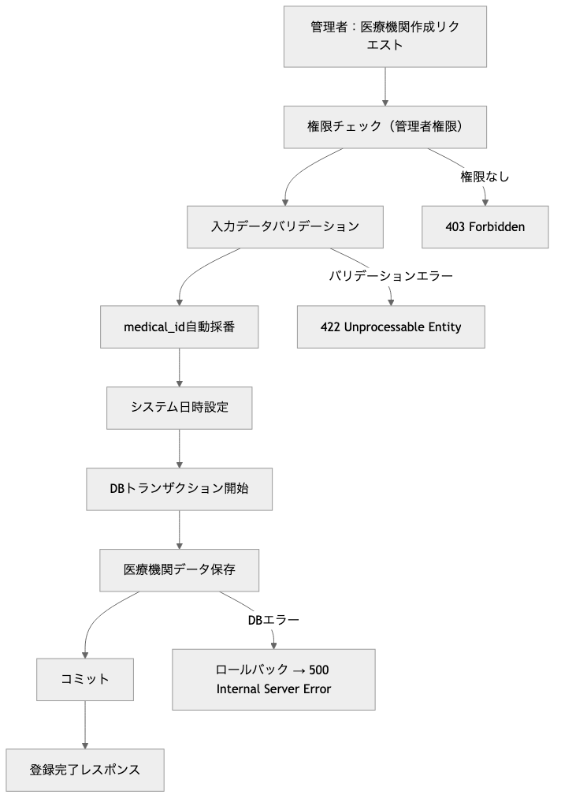
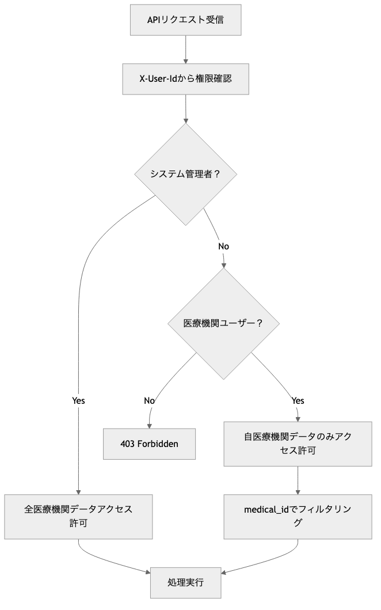

# OptiServe 医療機関管理モジュール プログラム仕様書 / Medical Facilities Management Module Program Specification

## 概要 / Overview

このモジュールは、OptiServeシステムにおける医療機関マスタの管理機能を提供します。
医療機関の新規登録、情報更新、一覧取得、個別取得などの機能を含み、権限管理を統合したCRUD APIを提供します。
医療機関の削除機能は意図的に提供されていません。

**[English]**
This module provides medical facility master management functionality for the OptiServe system.
It includes medical facility registration, information updates, list retrieval, and individual retrieval, offering CRUD APIs with integrated permission management.
Medical facility deletion functionality is intentionally not provided.

## 1. システム構成 / System Architecture

| 項目 / Item | 内容 / Content |
|-------------|----------------|
| 使用フレームワーク / Framework | FastAPI |
| 認証方式 / Authentication | X-User-Id ヘッダー + AuthManager |
| 権限管理 / Permission | システム管理者・医療機関ユーザー分離 |
| DB接続 / Database | SQLite（開発用）/ PostgreSQL（本番予定） |
| APIパス / API Path | `/api/v1/facilities` |
| データモデル / Data Model | SQLAlchemy ORM + Pydantic |
| ログ出力 / Logging | smds_core.logger.Logger（シングルトン） |

## 2. 関連ファイル / Related Files

| ファイル名 / File Name | 役割 / Role |
|------------------------|-------------|
| `routers/facilities.py` | APIエンドポイントの定義 / API endpoint definition |
| `schemas/mst_medical_facility.py` | Pydanticモデル定義 / Pydantic model definition |
| `models/pg_optigate/mst_medical_facility.py` | SQLAlchemy ORMモデル / SQLAlchemy ORM model |
| `utils/auth.py` | 認証・認可管理 / Authentication & authorization |

## 3. API仕様 / API Specifications

### 3.1 医療機関一覧取得 / Get Medical Facilities List

```http
GET /api/v1/facilities
X-User-Id: {current_user_id}
```

**パラメーター / Parameters:**
| Parameter | Type | Required | Description |
|-----------|------|----------|-------------|
| `skip` | int | ❌ | スキップ件数（デフォルト: 0） / Skip count |
| `limit` | int | ❌ | 取得件数（デフォルト: 100、最大: 100） / Limit count |

**レスポンス / Response:** `List[MedicalFacility]`

**使用例 / Examples:**
```
/facilities                    # 全件取得（最大100件）
/facilities?skip=0&limit=50    # 最初の50件
/facilities?skip=50&limit=50   # 次の50件
```

### 3.2 医療機関個別取得 / Get Medical Facility by ID

```http
GET /api/v1/facilities/{facility_id}
X-User-Id: {current_user_id}
```

**パラメーター / Parameters:**
| Parameter | Type | Required | Description |
|-----------|------|----------|-------------|
| `facility_id` | int | ✅ | 医療機関ID / Medical facility ID |

**レスポンス / Response:** `MedicalFacility`

### 3.3 医療機関新規登録 / Create Medical Facility

```http
POST /api/v1/facilities
X-User-Id: {current_user_id}
Content-Type: application/json
```

**リクエストボディ / Request Body:** `MedicalFacilityCreate`
**レスポンス / Response:** `MedicalFacility`

**権限要件 / Permission Requirement:** システム管理者のみ / System administrators only

### 3.4 医療機関情報更新 / Update Medical Facility

```http
PUT /api/v1/facilities/{facility_id}
X-User-Id: {current_user_id}
Content-Type: application/json
```

**パラメーター / Parameters:**
| Parameter | Type | Required | Description |
|-----------|------|----------|-------------|
| `facility_id` | int | ✅ | 医療機関ID / Medical facility ID |

**リクエストボディ / Request Body:** `MedicalFacilityCreate`
**レスポンス / Response:** `MedicalFacility`

**権限要件 / Permission Requirement:** システム管理者のみ / System administrators only

## 4. データモデル / Data Models

### 4.1 MedicalFacility（レスポンス用）/ MedicalFacility (Response)

| フィールド / Field | 型 / Type | 説明 / Description |
|-------------------|-----------|-------------------|
| `medical_id` | int | 医療機関ID（主キー・自動採番） / Medical facility ID (Primary Key, Auto-increment) |
| `medical_name` | str | 医療機関名 / Medical facility name |
| `address_postal_code` | str | 郵便番号 / Postal code |
| `address_prefecture` | str | 都道府県 / Prefecture |
| `address_city` | str | 市区町村 / City |
| `address_line1` | str | 住所1（町名・番地） / Address line 1 |
| `address_line2` | str | 住所2（建物名・部屋番号） / Address line 2 |
| `phone_number` | str | 電話番号 / Phone number |
| `reg_user_id` | str | 登録ユーザーID / Registration user ID |
| `regdate` | datetime | 登録日時 / Registration date |
| `update_user_id` | str | 更新ユーザーID / Update user ID |
| `lastupdate` | datetime | 最終更新日時 / Last update date |

### 4.2 MedicalFacilityCreate（登録・更新用）/ MedicalFacilityCreate (Creation & Update)

| フィールド / Field | 型 / Type | 必須 / Required | 説明 / Description |
|-------------------|-----------|-----------------|-------------------|
| `medical_name` | str | ✅ | 医療機関名 / Medical facility name |
| `address_postal_code` | str | ❌ | 郵便番号 / Postal code |
| `address_prefecture` | str | ❌ | 都道府県 / Prefecture |
| `address_city` | str | ❌ | 市区町村 / City |
| `address_line1` | str | ❌ | 住所1（町名・番地） / Address line 1 |
| `address_line2` | str | ❌ | 住所2（建物名・部屋番号） / Address line 2 |
| `phone_number` | str | ❌ | 電話番号 / Phone number |

## 5. 機能詳細 / Functional Details

### 5.1 業務フロー / Business Flow

1. 医療機関新規登録フロー / Medical Facility Registration Flow

    

2. 権限チェックフロー / Permission Check Flow

    

### 5.2 権限区分 / Permission Categories

| ユーザー種別 / User Type | 権限範囲 / Permission Scope |
|-------------------------|---------------------------|
| **システム管理者** / System Admin | 全医療機関の参照・作成・更新 / Full access to all medical facilities |
| **医療機関ユーザー** / Medical User | 自医療機関のみ参照可能 / View only own facility |
| **その他ユーザー** / Other Users | アクセス不可 / No access |

#### 操作権限詳細 / Detailed Operation Permissions

| 操作 / Operation | システム管理者 / System Admin | 医療機関ユーザー / Medical User |
|-----------------|-------------------------------|--------------------------------|
| 医療機関一覧取得 / List Facilities | 全件取得可能 / All facilities | 自医療機関のみ / Own facility only |
| 医療機関個別取得 / Get Facility | 全医療機関取得可能 / All facilities | 自医療機関のみ / Own facility only |
| 医療機関新規登録 / Create Facility | 可能 / Allowed | 不可 / Not allowed |
| 医療機関情報更新 / Update Facility | 可能 / Allowed | 不可 / Not allowed |
| 医療機関削除 / Delete Facility | **機能自体が存在しない** / **Function does not exist** | **機能自体が存在しない** / **Function does not exist** |

#### 権限チェック実装 / Permission Check Implementation

- **AuthManagerメソッド利用 / Using AuthManager Methods**

  ```python
  # 一覧取得時の自動フィルタリング
  filtered_query = AuthManager.filter_by_medical_permission(
      query, current_user_id, db, MstMedicalFacility.medical_id
  )

  # 個別取得・更新時の権限チェック
  AuthManager.require_medical_permission(current_user_id, facility_id, db)

  # 管理者権限が必要な操作
  AuthManager.require_admin_permission(current_user_id, db)
  ```

### 5.3 バリデーション / Validation

記述無し

**[English]**
No description

### 5.4 エラーハンドリング / Error Handling

#### HTTPステータスコード / HTTP Status Codes

| ステータス / Status | 条件 / Condition | レスポンス例 / Response Example |
|-------------------|------------------|-------------------------------|
| 200 OK | 成功 / Success | 正常なレスポンスデータ / Normal response data |
| 401 Unauthorized | 認証エラー / Authentication error | `"ユーザーID {user_id} が存在しません"` |
| 403 Forbidden | 権限エラー / Permission error | `"医療機関ID {facility_id} への操作権限がありません"` |
| 404 Not Found | 医療機関未存在 / Medical facility not found | `"Medical facility not found"` |
| 422 Unprocessable Entity | バリデーションエラー / Validation error | Pydanticバリデーション詳細 / Pydantic validation details |
| 500 Internal Server Error | システムエラー / System error | `"Internal server error: {error_details}"` |

### 5.5 データベース連携 / Database Integration

#### 認証・認可 / Authentication & Authorization

- **X-User-Id ヘッダー**: 全APIで必須
- **AuthManager**: 統一認証・認可システム
- **医療機関分離**: 医療機関ユーザーは自組織データのみアクセス可能

#### データ保護 / Data Protection

- **削除機能廃止**: 医療機関データの誤削除防止
- **更新履歴**: reg_user_id, update_user_id による変更追跡
- **トランザクション**: エラー時の自動ロールバック

#### 入力サニタイゼーション / Input Sanitization

- **Pydanticバリデーション**: 全入力値の型・形式チェック
- **SQLインジェクション対策**: SQLAlchemy ORMによる安全なクエリ実行

#### 使用テーブル / Used Tables

- **`mst_medical_facility`**: 医療機関マスタテーブル

#### 主キー / Primary Key

- **`medical_id`**: 自動インクリメント（AUTO_INCREMENT）
- **採番**: データベースエンジンによる自動採番

#### 必須フィールド / Required Fields

- **`medical_name`**: 医療機関名（業務上の必須項目）
- **システム管理フィールド**: `reg_user_id`, `regdate`, `update_user_id`, `lastupdate`

## 6. セキュリティ考慮事項 / Security Considerations

記述無し

**[English]**
No description

## 7. パフォーマンス考慮事項 / Performance Considerations

以下の項目は一部実装済みの機能もありますが、本格的なプロダクション環境での運用を想定し、将来的に検討・実装すべきパフォーマンス改善案を記載しています。

**[English]**
While some of the following items are partially implemented, this section outlines performance improvement measures that should be considered and implemented for full-scale production environment operation.

### 7.1 ページング / Pagination

- **デフォルト制限**: limit=100, skip=0
- **最大制限**: limit <= 100 で大量データアクセス制御
- **インデックス**: medical_id（主キー）での高速検索

### 7.2 権限フィルタリング / Permission Filtering

- **AuthManager.filter_by_medical_permission**: 権限に基づく自動フィルタリング
- **SQLレベルフィルタ**: アプリケーションレベルではなくデータベースレベルでの絞り込み

### 7.3 検索最適化 / Search Optimization

- **医療機関名検索**: 必要に応じてLIKE検索・全文検索対応可能
- **地域検索**: 都道府県・市区町村での絞り込み対応可能

## 8. テスト項目 / Test Cases

### 8.1 正常系 / Normal Cases

1. **医療機関一覧取得**: フィルタなし・ページング
2. **医療機関個別取得**: 存在する医療機関IDでの取得
3. **医療機関新規登録**: 管理者による正常登録
4. **医療機関情報更新**: 管理者による情報更新

### 8.2 異常系 / Error Cases

1. **権限エラー**: 医療機関ユーザーが他機関データアクセス
2. **権限エラー**: 一般ユーザーが作成・更新操作
3. **未存在エラー**: 存在しない医療機関IDでの取得・更新
4. **バリデーションエラー**: 不正な入力データ
5. **認証エラー**: 不正なX-User-Id・存在しないuser_id

### 8.3 権限テスト / Permission Tests

1. **システム管理者**: 全操作の成功確認
2. **医療機関ユーザー**: 自機関のみアクセス確認・作成更新の拒否確認
3. **権限なしユーザー**: アクセス拒否確認

### 8.4 ログテスト / Logging Tests

1. **正常処理**: INFO・DEBUGログの適切な出力確認
2. **エラー処理**: ERRORログと例外詳細の出力確認
3. **トランザクション**: ロールバック時のログ出力確認

## 9. 今後の拡張予定 / Future Enhancements

### 9.1 機能拡張 / Functional Extensions

1. **高度な検索**: 医療機関名部分一致・地域絞り込み・タグ分類
2. **医療機関分類**: 診療科目・病床数・医療機関種別
3. **関連データ**: 診療実績・設備情報・認定情報

### 9.2 パフォーマンス改善 / Performance Improvements

1. **キャッシュ**: 医療機関情報のRedisキャッシュ
2. **検索インデックス**: 医療機関名・住所での高速検索
3. **地理情報**: 位置情報による近隣検索

### 9.3 セキュリティ強化 / Security Enhancements

1. **データ変更履歴**: 詳細な監査ログ
2. **承認フロー**: 医療機関情報変更の承認プロセス
3. **データバックアップ**: 定期的なデータバックアップ・復旧機能

## 10. 運用考慮事項 / Operational Considerations

### 10.1 データメンテナンス / Data Maintenance

- **医療機関削除**: 論理削除ではなく、機能自体を廃止
- **データクリーニング**: 重複・不正データの定期チェック
- **マスタ同期**: 外部医療機関データベースとの同期

### 10.2 監視・アラート / Monitoring & Alerts

- **API使用量**: 医療機関別のアクセス頻度監視
- **エラー率**: 権限エラー・システムエラーの監視
- **レスポンス時間**: API応答性能の監視

## 11. 関連資料 / Related Documents

- [ユーザー管理API仕様書](api_users.md)
- [ユーザー組織リンクAPI仕様書](api_user_entity_links.md)
- [認証API仕様書](api_auth.md)
- [データベース設計書](../database/pg_optigate/mst_medical_facility.yaml)
- [医療機関管理テスト仕様](../../tests/test_user_api.py)
