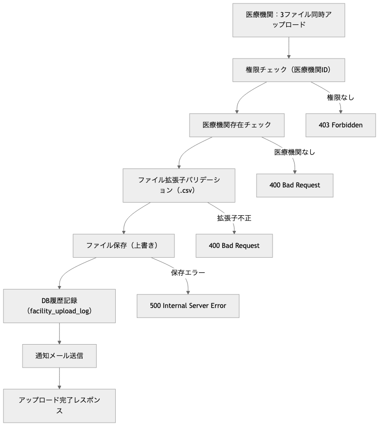
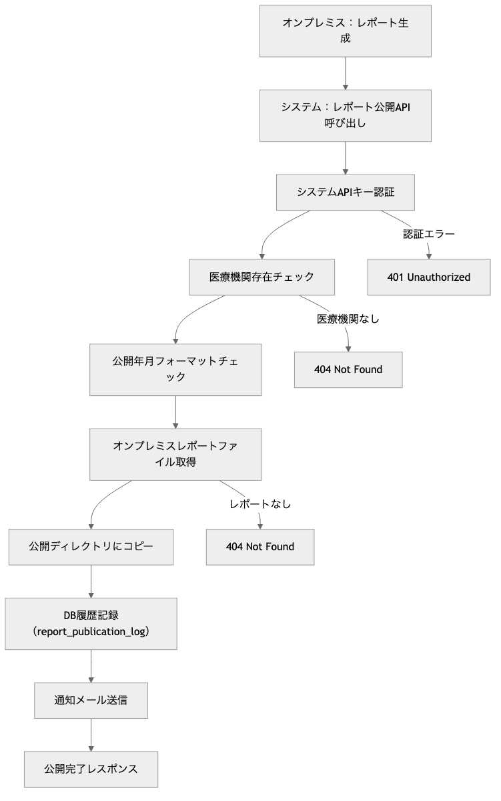
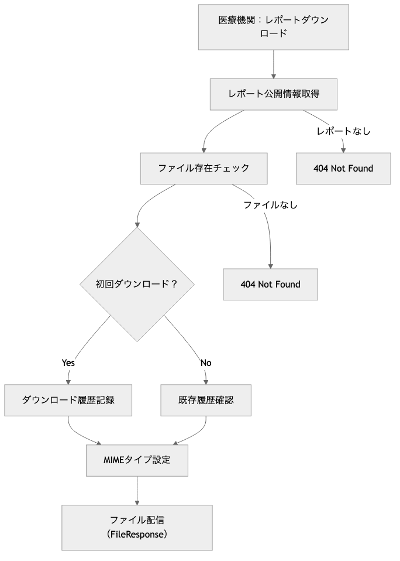

# OptiServe ファイル管理モジュール プログラム仕様書 / File Management Module Program Specification

## 概要 / Overview

このモジュールは、OptiServeシステムにおける月次ファイルアップロード・レポートダウンロード機能を提供します。
医療機関からの月次データファイル（医療機器台帳・貸出履歴・故障履歴）の一括アップロードと、システム生成レポート（分析レポート・故障リスト・未実績リスト）の配信機能を含み、通知機能と統合したファイル管理APIを提供します。

**[English]**
This module provides monthly file upload and report download functionality for the OptiServe system.
It includes bulk upload of monthly data files from medical facilities (equipment ledger, rental history, failure history) and distribution of system-generated reports (analysis report, failure list, unachieved list), offering file management APIs integrated with notification functionality.

## 1. システム構成 / System Architecture

| 項目 / Item | 内容 / Content |
|-------------|----------------|
| 使用フレームワーク / Framework | FastAPI |
| 認証方式 / Authentication | X-User-Id ヘッダー + AuthManager + システムAPIキー |
| 権限管理 / Permission | 医療機関ユーザー・システム用API分離 |
| ファイルストレージ / File Storage | ローカルファイルシステム（将来AWS S3対応予定） |
| DB接続 / Database | SQLite（開発用）/ PostgreSQL（本番予定） |
| APIパス / API Path | `/api/v1/files` |
| データモデル / Data Model | SQLAlchemy ORM + Pydantic |
| 通知機能 / Notification | メール自動送信（実装予定） |
| ログ出力 / Logging | Python標準ライブラリlogging |

## 2. 関連ファイル / Related Files

| ファイル名 / File Name | 役割 / Role |
|------------------------|-------------|
| `routers/file_management.py` | APIエンドポイントの定義 / API endpoint definition |
| `schemas/facility_upload.py` | アップロード用Pydanticモデル / Upload Pydantic models |
| `schemas/report_publication.py` | レポート配信用Pydanticモデル / Report publication Pydantic models |
| `schemas/file_management.py` | ファイル管理共通スキーマ / Common file management schemas |
| `models/pg_optigate/facility_upload_log.py` | アップロードログテーブル / Upload log table |
| `models/pg_optigate/report_publication_log.py` | レポート公開ログテーブル / Report publication log table |
| `models/pg_optigate/user_entity_link.py` | ユーザー組織連携（通知先） / User entity link |
| `utils/auth.py` | 認証・認可管理 / Authentication & authorization |

## 3. API仕様 / API Specifications

### 3.1 ディレクトリ構造 / Directory Structure

```plaintext
files/
├── uploads/                              # 医療機関からのアップロード（1世代保管）
│   └── {medical_id}/
│       ├── equipment.csv                # 医療機器台帳（上書き保存）
│       ├── rental.csv                   # 貸出履歴（上書き保存）
│       └── failure.csv                  # 故障履歴（上書き保存）
└── reports/                             # システム生成レポート
    └── {medical_id}/
        └── {YYYY}/
            └── {MM}/                    # 月は0埋め2桁
                ├── analysis_report.pdf     # 分析レポート
                ├── failure_list.xlsx       # 故障リスト
                └── unachieved_list.xlsx    # 未実績リスト

data/
└── onpre_reports/                       # オンプレミス生成レポート（コピー元）
    └── {hpcode}/
        └── {YYYY}/
            └── {MM}/
                └── *.pdf, *.xlsx, *.pptx    # 各種レポートファイル
```

### 3.2 ファイル種別定義 / File Type Definition

#### アップロードファイル / Upload Files

| file_type | ファイル名 / File Name | 拡張子 / Extension | 説明 / Description |
|-----------|------------------------|-------------------|-------------------|
| 1 | equipment | .csv | 医療機器台帳 / Medical equipment ledger |
| 2 | rental | .csv | 貸出履歴 / Rental history |
| 3 | failure | .csv | 故障履歴 / Failure history |

#### レポートファイル / Report Files

| file_type | ファイル名 / File Name | 拡張子 / Extension | 説明 / Description |
|-----------|------------------------|-------------------|-------------------|
| 1 | analysis_report | .pdf | 分析レポート / Analysis report |
| 2 | failure_list | .xlsx | 故障リスト / Failure list |
| 3 | unachieved_list | .xlsx | 未実績リスト / Unachieved list |

### リクエスト仕様 / Request Specification

**Schema** `FacilityUpload`（アップロードファイル）

| フィールド / Field | 型 / Type | 説明 / Description |
|-------------------|-----------|-------------------|
| `uploadlog_id` | int | アップロードログID / Upload log ID |
| `medical_id` | int | 医療機関ID / Medical facility ID |
| `file_type` | int | ファイル種別（1-3） / File type |
| `file_name` | str | 元ファイル名 / Original file name |
| `upload_datetime` | datetime | アップロード日時 / Upload datetime |
| `upload_user_id` | str | アップロードユーザーID / Upload user ID |
| `download_datetime` | datetime | ダウンロード日時 / Download datetime |

**Schema**: `MonthlyFileStatus`（月次ファイル状況）

| フィールド / Field | 型 / Type | 説明 / Description |
|-------------------|-----------|-------------------|
| `target_month` | str | 対象月（YYYY-MM） / Target month |
| `equipment_uploaded` | bool | 医療機器台帳アップロード済み / Equipment uploaded |
| `rental_uploaded` | bool | 貸出履歴アップロード済み / Rental uploaded |
| `failure_uploaded` | bool | 故障履歴アップロード済み / Failure uploaded |
| `upload_datetime` | datetime | 最終アップロード日時 / Last upload datetime |

**Schema**: `AvailableReport`（利用可能レポート）

| フィールド / Field | 型 / Type | 説明 / Description |
|-------------------|-----------|-------------------|
| `publication_id` | int | レポート公開ID / Report publication ID |
| `publication_ym` | str | 公開年月（YYYY-MM） / Publication month |
| `file_type` | int | ファイル種別（1-3） / File type |
| `file_name` | str | ファイル名 / File name |
| `file_size` | int | ファイルサイズ（バイト） / File size |
| `publication_datetime` | datetime | 公開日時 / Publication datetime |
| `download_datetime` | datetime | ダウンロード日時 / Download datetime |
| `downloaded` | bool | ダウンロード済みフラグ / Downloaded flag |

**Schema**: `FileUploadResponse`（アップロードレスポンス）

| フィールド / Field | 型 / Type | 説明 / Description |
|-------------------|-----------|-------------------|
| `medical_id` | int | 医療機関ID / Medical facility ID |
| `target_month` | str | 対象月（YYYY-MM） / Target month |
| `upload_datetime` | str | アップロード日時（ISO形式） / Upload datetime |
| `uploaded_files` | List[FacilityUpload] | アップロードファイル一覧 / Uploaded files list |
| `notification_sent` | bool | 通知送信成功フラグ / Notification sent flag |

**Schema**: `MonthlyReportPublishResponse`（レポート公開レスポンス）

| フィールド / Field | 型 / Type | 説明 / Description |
|-------------------|-----------|-------------------|
| `medical_id` | int | 医療機関ID / Medical facility ID |
| `publication_ym` | str | 公開年月（YYYY-MM） / Publication month |
| `publish_datetime` | str | 公開日時（ISO形式） / Publish datetime |
| `published_reports` | List[ReportPublication] | 公開レポート一覧 / Published reports list |
| `notification_sent` | bool | 通知送信成功フラグ / Notification sent flag |

## 4. データモデル / Data Models

### 4.1 医療機関ファイル一括アップロード / Medical Facility File Upload

```http
POST /api/v1/files/upload-files/{medical_id}
X-User-Id: {current_user_id}
Content-Type: multipart/form-data
```

**パラメーター / Parameters:**

| Parameter | Type | Required | Description |
|-----------|------|----------|-------------|
| `medical_id` | int | ✅ | 医療機関ID / Medical facility ID |
| `upload_user_id` | str | ✅ | アップロードユーザーID（Form） / Upload user ID |
| `equipment_file` | UploadFile | ✅ | 医療機器台帳ファイル（CSV） / Equipment file |
| `rental_file` | UploadFile | ✅ | 貸出履歴ファイル（CSV） / Rental file |
| `failure_file` | UploadFile | ✅ | 故障履歴ファイル（CSV） / Failure file |

**レスポンス / Response:** `FileUploadResponse`

**権限要件 / Permission Requirement:** 医療機関ユーザー（自組織のみ） / Medical facility users (own organization only)

### 4.2 アップロード状況取得 / Get Upload Status

```http
GET /api/v1/files/upload-status/{medical_id}
X-User-Id: {current_user_id}
```

**パラメーター / Parameters:**

| Parameter | Type | Required | Description |
|-----------|------|----------|-------------|
| `medical_id` | int | ✅ | 医療機関ID / Medical facility ID |
| `months` | int | ❌ | 取得月数（デフォルト: 6） / Number of months |

**レスポンス / Response:** `List[MonthlyFileStatus]`

### 4.3 ダウンロード可能レポート一覧取得 / Get Available Reports

```http
GET /api/v1/files/reports/available/{medical_id}
X-User-Id: {current_user_id}
```

**パラメーター / Parameters:**

| Parameter | Type | Required | Description |
|-----------|------|----------|-------------|
| `medical_id` | int | ✅ | 医療機関ID / Medical facility ID |
| `months` | int | ❌ | 取得月数（デフォルト: 12） / Number of months |

**レスポンス / Response:** `List[AvailableReport]`

### 4.4 レポートファイルダウンロード / Download Report File

```http
GET /api/v1/files/reports/download/{publication_id}?user_id={user_id}
X-User-Id: {current_user_id}
```

**パラメーター / Parameters:**

| Parameter | Type | Required | Description |
|-----------|------|----------|-------------|
| `publication_id` | int | ✅ | レポート公開ID / Report publication ID |
| `user_id` | str | ✅ | ダウンロードユーザーID / Download user ID |

**レスポンス / Response:** `FileResponse`

### 4.5 システム用ファイル取得 / System File Fetch (Internal)

```http
GET /api/v1/files/system/fetch-uploaded/{medical_id}?file_type={file_type}
X-System-Key: {system_api_key}
```

**パラメーター / Parameters:**

| Parameter | Type | Required | Description |
|-----------|------|----------|-------------|
| `medical_id` | int | ✅ | 医療機関ID / Medical facility ID |
| `file_type` | int | ✅ | ファイル種別（1-3） / File type |

**レスポンス / Response:** `FileResponse`

**権限要件 / Permission Requirement:** システムAPIキー認証 / System API key authentication

### 4.6 月次レポート一括公開 / Publish Monthly Reports (System)

```http
POST /api/v1/files/reports/publish/{medical_id}
X-System-Key: {system_api_key}
Content-Type: application/x-www-form-urlencoded
```

**パラメーター / Parameters:**

| Parameter | Type | Required | Description |
|-----------|------|----------|-------------|
| `medical_id` | int | ✅ | 医療機関ID / Medical facility ID |
| `publication_ym` | str | ✅ | 公開年月（YYYY-MM） / Publication month |

**レスポンス / Response:** `MonthlyReportPublishResponse`

**権限要件 / Permission Requirement:** システムAPIキー認証 / System API key authentication

## 5. 機能詳細 / Functional Details

### 5.1 業務フロー / Business Flow

1. 月次ファイルアップロードフロー / Monthly File Upload Flow

    

2. システムレポート公開フロー / System Report Publication Flow

    

3. レポートダウンロードフロー / Report Download Flow

    

### 5.2 権限管理 / Permission Management

記述無し

**[English]**
No description

### 5.3 バリデーション / Validation

記述無し

**[English]**
No description

### 5.4 エラーハンドリング / Error Handling

#### HTTPステータスコード / HTTP Status Codes

| ステータス / Status | 条件 / Condition | レスポンス例 / Response Example |
|-------------------|------------------|-------------------------------|
| 200 OK | 成功 / Success | 正常なレスポンスデータ / Normal response data |
| 400 Bad Request | バリデーションエラー / Validation error | `"医療機器台帳ファイルはCSV形式である必要があります"` |
| 401 Unauthorized | 認証エラー / Authentication error | `"System API key is required for this endpoint"` |
| 403 Forbidden | 権限エラー / Permission error | `"医療機関ID {medical_id} への操作権限がありません"` |
| 404 Not Found | リソース未存在 / Resource not found | `"指定されたレポート公開ID {publication_id} は存在しません"` |
| 422 Unprocessable Entity | ファイル形式エラー / File format error | Pydanticバリデーション詳細 / Pydantic validation details |
| 500 Internal Server Error | システムエラー / System error | `"Internal server error: {error_details}"` |

#### ファイル関連エラー / File-Related Errors

| エラー種別 / Error Type | 検証内容 / Validation | エラーメッセージ例 / Error Message Example |
|------------------------|---------------------|-------------------------------------------|
| 拡張子エラー / Extension Error | CSV形式チェック | `"医療機器台帳ファイルはCSV形式である必要があります"` |
| ファイル未存在 / File Not Found | ファイル存在チェック | `"レポートファイルが見つかりません: analysis_report.pdf"` |
| ディレクトリエラー / Directory Error | パス作成失敗 | `"ファイル保存ディレクトリの作成に失敗しました"` |
| ファイルサイズエラー / File Size Error | サイズ制限チェック | `"ファイルサイズが制限を超えています（最大: 10MB）"` |

### 5.5 パス・ファイル生成機能 / Path and File Generation Functions

#### アップロードファイルパス / Upload File Path

```python
def get_upload_file_path(medical_id: int, file_type: int) -> Path:
    """
    アップロードファイルのパスを生成（医療機関単位・1世代保管）

    例: files/uploads/5/equipment.csv
    """
```

#### レポートファイルパス / Report File Path

```python
def get_report_file_path(medical_id: int, publication_ym: str, file_type: int) -> Path:
    """
    レポートファイルのパスを生成（年/月階層構造）

    例: files/reports/5/2025/03/analysis_report.pdf
    """
```

#### ファイルコピー機能 / File Copy Functions

```python
def copy_onpremise_reports_to_publication(hpcode: int, publication_ym: str) -> List[str]:
    """
    オンプレミスレポートを公開ディレクトリにコピー

    コピー元: data/onpre_reports/{hpcode}/{YYYY}/{MM}/
    コピー先: files/reports/{hpcode}/{YYYY}/{MM}/
    """
```

#### ディレクトリ管理 / Directory Management

```python
def ensure_directory_exists(path: Path):
    """
    ディレクトリが存在しない場合は作成
    parents=True: 親ディレクトリも同時作成
    exist_ok=True: 既存ディレクトリでもエラーにならない
    """
```

## 6. セキュリティ考慮事項 / Security Considerations

### 6.1 ユーザー認証 / User Authentication

| API | 認証方式 / Authentication | 権限範囲 / Permission Scope |
|-----|--------------------------|---------------------------|
| ファイルアップロード / File Upload | X-User-Id ヘッダー | 医療機関ユーザー（自組織のみ） |
| レポートダウンロード / Report Download | X-User-Id ヘッダー | 医療機関ユーザー（自組織のみ） |
| アップロード状況取得 / Upload Status | X-User-Id ヘッダー | 医療機関ユーザー（自組織のみ） |
| 利用可能レポート一覧 / Available Reports | X-User-Id ヘッダー | 医療機関ユーザー（自組織のみ） |

### 6.2 システム認証 / System Authentication

| API | 認証方式 / Authentication | 権限範囲 / Permission Scope |
|-----|--------------------------|---------------------------|
| システム用ファイル取得 / System File Fetch | X-System-Key ヘッダー | オンプレミスシステムのみ |
| 月次レポート公開 / Monthly Report Publish | X-System-Key ヘッダー | オンプレミスシステムのみ |

```python
SYSTEM_API_KEY = "optiserve-internal-system-key-2025"

def verify_system_key(x_system_key: str = Header(None, alias="X-System-Key")):
    """システム用APIキーの認証"""
    if not x_system_key or x_system_key != SYSTEM_API_KEY:
        raise HTTPException(status_code=401, detail="System API key is required")
```

### 6.3 ファイルアップロードセキュリティ / File Upload Security

- **拡張子制限**: CSV形式のみ許可
- **ファイルサイズ制限**: 必要に応じて実装予定
- **ファイル内容検証**: CSVヘッダー・フォーマット検証の実装予定
- **ウイルススキャン**: 将来的にウイルススキャン機能の実装予定

### 6.4 パストラバーサル対策 / Path Traversal Protection

```python
# ファイルパス生成時の安全な実装
def get_upload_file_path(medical_id: int, file_type: int) -> Path:
    # 事前定義されたファイル名のみ使用
    file_names = {1: "equipment", 2: "rental", 3: "failure"}
    file_extensions = {1: ".csv", 2: ".csv", 3: ".csv"}

    # パストラバーサル攻撃を防ぐため、固定的なパス構成
    filename = f"{file_names[file_type]}{file_extensions[file_type]}"
    return UPLOADS_PATH / str(medical_id) / filename
```

### 6.5 システムAPIキー管理 / System API Key Management

- **環境変数**: 本番環境では環境変数からキー取得
- **キーローテーション**: 定期的なAPIキー変更の実装予定
- **アクセスログ**: システムAPI使用履歴の記録

## 7. パフォーマンス考慮事項 / Performance Considerations

以下の項目は一部実装済みの機能もありますが、本格的なプロダクション環境での運用を想定し、将来的に検討・実装すべきパフォーマンス改善案を記載しています。

**[English]**
While some of the following items are partially implemented, this section outlines performance improvement measures that should be considered and implemented for full-scale production environment operation.

### 7.1 ファイルサイズ最適化 / File Size Optimization

- **アップロード制限**: 大容量ファイルの分割アップロード検討
- **ストリーミング**: 大容量ファイルのストリーミング処理
- **圧縮**: 必要に応じてファイル圧縮機能

### 7.2 同期処理最適化 / Synchronous Processing Optimization

- **バックグラウンド処理**: 重い処理の非同期化検討
- **キューイング**: ファイル処理キューの実装検討
- **並列処理**: 複数ファイルの並列処理最適化

### 7.3 ストレージ最適化 / Storage Optimization

- **世代管理**: アップロードファイルの世代管理（現在1世代のみ）
- **自動削除**: 古いファイルの自動削除機能
- **クラウド移行**: AWS S3への移行準備

## 8. テスト項目 / Test Cases

### 8.1 正常系 / Normal Cases

1. **ファイルアップロード**: 3ファイル同時正常アップロード
2. **レポートダウンロード**: 各ファイル種別の正常ダウンロード
3. **システムファイル取得**: オンプレミスシステムからの正常取得
4. **レポート公開**: システムからの正常レポート公開

### 8.2 異常系 / Error Cases

1. **権限エラー**: 他医療機関データへのアクセス試行
2. **ファイル形式エラー**: 非CSV形式ファイルのアップロード
3. **ファイル未存在**: 存在しないファイルのダウンロード試行
4. **システムキーエラー**: 不正なシステムAPIキーでのアクセス

### 8.3 境界値テスト / Boundary Tests

1. **ファイルサイズ**: 最大・最小ファイルサイズでのテスト
2. **パス長**: 長いファイル名・パスでのテスト
3. **文字エンコーディング**: 日本語ファイル名でのテスト

### 8.4 統合テスト / Integration Tests

1. **アップロード→システム取得**: 完全な連携フローテスト
2. **レポート公開→ダウンロード**: レポート配信フローテスト
3. **通知連携**: メール通知機能の統合テスト

## 9. 今後の拡張予定 / Future Enhancements

### 9.1 クラウド対応 / Cloud Support

1. **AWS S3統合**: ローカルファイルシステムからS3への移行
2. **CloudFront統合**: CDNによる高速ファイル配信
3. **IAM連携**: AWS IAMによる詳細な権限管理

### 9.2 機能拡張 / Functional Extensions

1. **ファイルバージョン管理**: 複数世代のファイル保持・管理
2. **ファイル暗号化**: 機密ファイルの暗号化保存
3. **ファイル共有**: 複数医療機関間でのファイル共有機能

### 9.3 運用改善 / Operational Improvements

1. **自動バックアップ**: 定期的なファイルバックアップ
2. **監視・アラート**: ファイル処理失敗時のアラート機能
3. **統計・レポート**: ファイル利用統計の可視化

### 9.4 通知タイプ / Notification Types

| 通知タイプ / Type | 送信タイミング / Trigger | 送信先 / Recipients |
|------------------|------------------------|-------------------|
| `upload` | ファイルアップロード完了時 / File upload completion | user_entity_link.notification_email_list |
| `report_published` | レポート公開時 / Report publication | user_entity_link.notification_email_list |

### 9.5 通知機能実装 / Notification Implementation

```python
async def send_notification_email(medical_id: int, notification_type: str, target_month: str):
    """
    通知メール送信（将来実装）

    1. user_entity_linkからnotification_email_listを取得
    2. 通知タイプに応じたメール内容を生成
    3. メール送信（TODO: 実際の実装）
    4. 送信結果をログ出力
    """
```

### 9.6 メール送信先取得 / Email Recipients Retrieval

```python
# user_entity_linkテーブルから通知先メールアドレスを取得
link = db.query(UserEntityLink).filter(
    UserEntityLink.entity_type == 1,
    UserEntityLink.entity_relation_id == medical_id
).first()

if link and link.notification_email_list:
    # notification_email_listは JSON配列形式
    # 例: ["admin@hospital.com", "manager@hospital.com"]
```

## 10. 運用考慮事項 / Operational Considerations

記述無し

**[English]**
No description

## 11. 関連資料 / Related Documents

- [ユーザー組織連携API仕様書](api_user_entity_links.md)
- [認証API仕様書](api_auth.md)
- [データベース設計書 - facility_upload_log](../database/pg_optigate/facility_upload_log.yaml)
- [データベース設計書 - report_publication_log](../database/pg_optigate/report_publication_log.yaml)
- [ファイル管理テスト仕様](../../tests/test_05_file_management_api.py)
