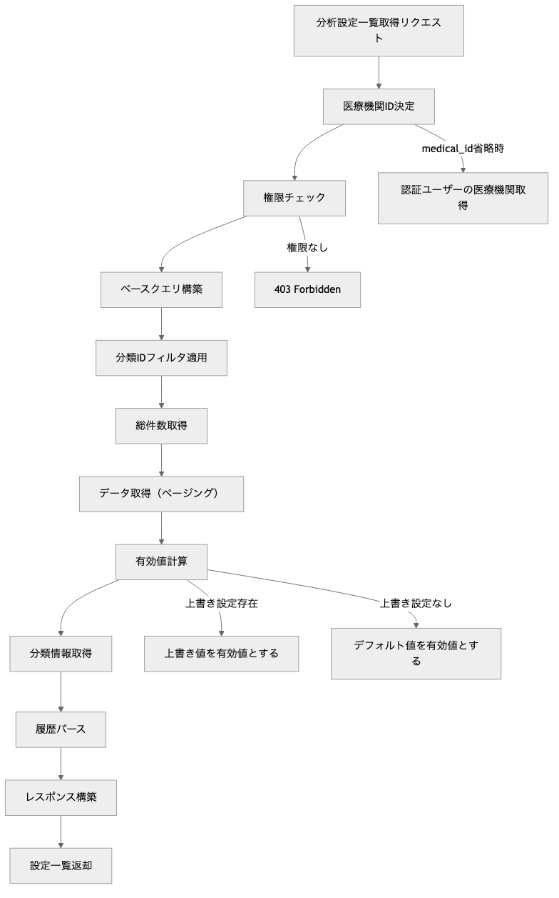
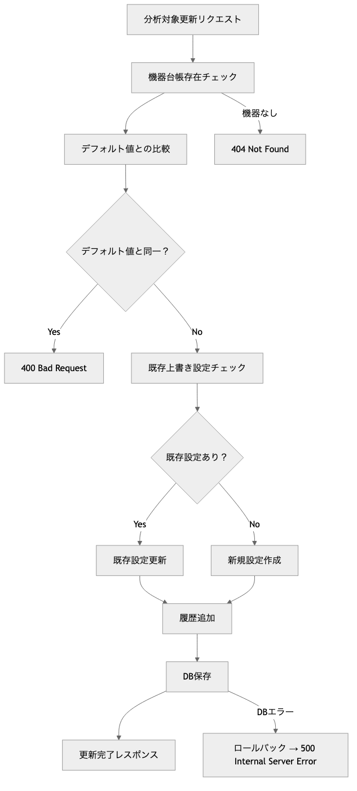
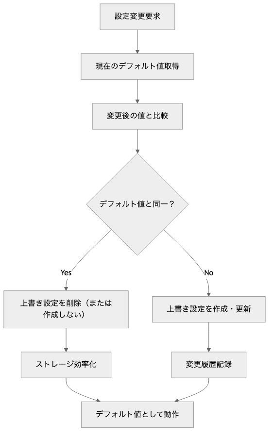
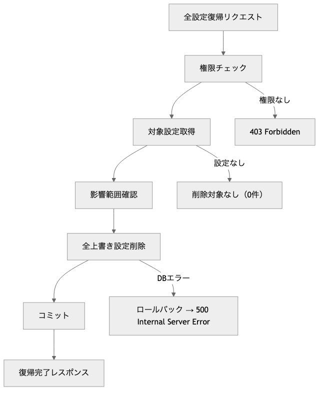

# OptiServe 医療機器分析設定管理モジュール プログラム仕様書 / Medical Equipment Analysis Settings Management Module Program Specification

## 概要 / Overview

このモジュールは、OptiServeシステムにおける医療機器分析設定の上書き管理機能を提供します。
機器台帳のデフォルト設定（分析対象フラグ・分類設定）に対する医療機関別の上書き設定を管理し、変更履歴の記録と差分管理による効率的な設定変更機能を含む、医療機器分析カスタマイズAPIを提供します。

**[English]**
This module provides override management functionality for medical equipment analysis settings in the OptiServe system.
It includes medical equipment analysis customization APIs that manage medical facility-specific override settings for equipment ledger default settings (analysis target flags and classification settings), featuring change history recording and efficient setting changes through differential management.

## 1. システム構成 / System Architecture

| 項目 / Item | 内容 / Content |
|-------------|----------------|
| 使用フレームワーク / Framework | FastAPI |
| 認証方式 / Authentication | X-User-Id ヘッダー + AuthManager |
| 権限管理 / Permission | 医療機関ユーザー（自組織のみアクセス） |
| DB接続 / Database | SQLite（開発用）/ PostgreSQL（本番予定） |
| APIパス / API Path | `/api/v1/medical-equipment-analysis-settings` |
| データモデル / Data Model | SQLAlchemy ORM + Pydantic |
| 設定管理方式 / Setting Management | 差分管理（デフォルト値との差分のみ保存） |
| 履歴管理 / History Management | JSON形式での変更履歴記録 |
| ログ出力 / Logging | Python標準ライブラリlogging |

## 2. 関連ファイル / Related Files

| ファイル名 / File Name | 役割 / Role |
|------------------------|-------------|
| `routers/medical_equipment_analysis.py` | APIエンドポイントの定義 / API endpoint definition |
| `schemas/medical_equipment_analysis.py` | Pydanticモデル定義 / Pydantic model definition |
| `models/pg_optigate/medical_equipment_ledger.py` | 医療機器台帳テーブル（デフォルト値） / Equipment ledger table |
| `models/pg_optigate/medical_equipment_analysis_setting.py` | 分析設定上書きテーブル / Analysis setting override table |
| `models/pg_optigate/mst_equipment_classification.py` | 機器分類マスタテーブル / Equipment classification master |
| `utils/auth.py` | 認証・認可管理 / Authentication & authorization |

## 3. API仕様 / API Specifications

### 3.1 上書き管理システム / Override Management System

```plaintext
# 基本的な機器台帳情報
medical_equipment_ledger (デフォルト値)
├── is_included: true          # 分析対象フラグ
├── classification_id: 123     # 機器分類ID
└── ...

# 上書き用の機器台帳情報
medical_equipment_analysis_setting (上書き値)
├── override_is_included: false     # デフォルトと異なる場合のみ保存
├── override_classification_id: 456 # デフォルトと異なる場合のみ保存
└── note: [履歴JSON]               # 変更理由と実施者の履歴

有効値 = 上書き設定が存在 ? 上書き値 : デフォルト値
```

### 3.2 履歴管理 / History Management

- 1レコードに対して複数の修正を想定して、json形式で管理

```json
[
  {
    "user_id": "100001",
    "timestamp": "2025-08-14 10:30:15",
    "note": "重要機器のため分析対象に追加"
  },
  {
    "user_id": "100002",
    "timestamp": "2025-08-20 14:20:30",
    "note": "院内ルールにより呼吸器分類に変更"
  }
]
```

### 3.3 設定優先順位 / Setting Priority

1. **上書き設定存在**: `medical_equipment_analysis_setting` の値を使用
2. **上書き設定なし**: `medical_equipment_ledger` のデフォルト値を使用
3. **デフォルト値と同一**: 上書き設定は作成・保存しない（効率化）

## 4. データモデル / Data Models

### 4.1 医療機器分析設定一覧取得 / Get Medical Equipment Analysis Settings

```http
GET /api/v1/medical-equipment-analysis-settings
X-User-Id: {current_user_id}
```

**パラメーター / Parameters:**

| Parameter | Type | Required | Description |
|-----------|------|----------|-------------|
| `medical_id` | int | ❌ | 医療機関ID（省略時は認証ユーザーの医療機関） / Medical facility ID |
| `classification_id` | int | ❌ | 分類IDでフィルタ / Filter by classification ID |
| `skip` | int | ❌ | スキップ件数（デフォルト: 0） / Skip count |
| `limit` | int | ❌ | 取得件数（デフォルト: 100、最大: 1000） / Limit count |

**レスポンス / Response:** `MedicalEquipmentAnalysisListResponse`

**フィルタ対象 / Filter Targets:**

- デフォルト分類 (`medical_equipment_ledger.classification_id`)
- 上書き分類 (`medical_equipment_analysis_setting.override_classification_id`)

### 4.2 分析対象フラグ更新 / Update Analysis Target Flag

```http
PUT /api/v1/medical-equipment-analysis-settings/{ledger_id}/analysis-target
X-User-Id: {current_user_id}
Content-Type: application/json
```

**パラメーター / Parameters:**

| Parameter | Type | Required | Description |
|-----------|------|----------|-------------|
| `ledger_id` | int | ✅ | 機器台帳ID / Equipment ledger ID |

**リクエストボディ / Request Body:** `AnalysisTargetUpdateRequest`
**レスポンス / Response:** `AnalysisTargetUpdateResponse`

### 4.3 分類上書き更新 / Update Classification Override

```http
PUT /api/v1/medical-equipment-analysis-settings/{ledger_id}/classification
X-User-Id: {current_user_id}
Content-Type: application/json
```

**パラメーター / Parameters:**

| Parameter | Type | Required | Description |
|-----------|------|----------|-------------|
| `ledger_id` | int | ✅ | 機器台帳ID / Equipment ledger ID |

**リクエストボディ / Request Body:** `ClassificationOverrideUpdateRequest`
**レスポンス / Response:** `ClassificationOverrideUpdateResponse`

### 4.4 全設定デフォルト復帰 / Restore All Settings to Default

```http
DELETE /api/v1/medical-equipment-analysis-settings?medical_id={medical_id}
X-User-Id: {current_user_id}
```

**パラメーター / Parameters:**

| Parameter | Type | Required | Description |
|-----------|------|----------|-------------|
| `medical_id` | int | ✅ | 医療機関ID / Medical facility ID |

**レスポンス / Response:** `DefaultRestoreResponse`

### 4.5 個別設定デフォルト復帰 / Restore Single Setting to Default

```http
DELETE /api/v1/medical-equipment-analysis-settings/{ledger_id}
X-User-Id: {current_user_id}
```

**パラメーター / Parameters:**

| Parameter | Type | Required | Description |
|-----------|------|----------|-------------|
| `ledger_id` | int | ✅ | 機器台帳ID / Equipment ledger ID |

**レスポンス / Response:** `DefaultRestoreResponse`

### 4.6 リクエスト仕様 / Request Specification

**Schema**: AnalysisTargetUpdateRequest（分析対象更新リクエスト）

| フィールド / Field | 型 / Type | 必須 / Required | 説明 / Description |
|-------------------|-----------|-----------------|-------------------|
| `override_is_included` | bool | ✅ | 上書きする分析対象フラグ / Analysis target flag to override |
| `note` | str | ✅ | 変更理由（最大500文字） / Change reason (max 500 chars) |

**Schema**: `ClassificationOverrideUpdateRequest`（分類上書き更新リクエスト）

| フィールド / Field | 型 / Type | 必須 / Required | 説明 / Description |
|-------------------|-----------|-----------------|-------------------|
| `override_classification_id` | int | ✅ | 上書きする分類ID / Classification ID to override |
| `note` | str | ✅ | 変更理由（最大500文字） / Change reason (max 500 chars) |

**Schema**: `NoteHistoryItem`（履歴項目）

| フィールド / Field | 型 / Type | 説明 / Description |
|-------------------|-----------|-------------------|
| `user_id` | str | 実施ユーザーID / User ID who made the change |
| `timestamp` | str | 実施日時 / Timestamp |
| `note` | str | 変更理由・補足 / Change reason and notes |

### 4.7 レスポンス仕様 / Response Specification

**Schema**: `MedicalEquipmentAnalysisResponse`（分析設定レスポンス）

| フィールド / Field | 型 / Type | 説明 / Description |
|-------------------|-----------|-------------------|
| `ledger_id` | int | 機器台帳ID / Equipment ledger ID |
| `medical_id` | int | 医療機関ID / Medical facility ID |
| `model_number` | str | 機器型番 / Equipment model number |
| `product_name` | str | 製品名 / Product name |
| `maker_name` | str | メーカー名 / Manufacturer name |
| `stock_quantity` | int | 在庫数量 / Stock quantity |
| `default_is_included` | bool | デフォルト分析対象フラグ / Default analysis target flag |
| `default_classification_id` | int | デフォルト分類ID / Default classification ID |
| `effective_is_included` | bool | 有効分析対象フラグ / Effective analysis target flag |
| `effective_classification_id` | int | 有効分類ID / Effective classification ID |
| `has_override` | bool | 上書き設定存在フラグ / Override setting exists flag |
| `override_is_included` | bool | 上書き分析対象フラグ / Override analysis target flag |
| `override_classification_id` | int | 上書き分類ID / Override classification ID |
| `classification_name` | str | 分類名 / Classification name |
| `classification_level` | int | 分類階層レベル / Classification hierarchy level |
| `note_history` | List[NoteHistoryItem] | 変更履歴 / Change history |
| `last_modified` | datetime | 最終変更日時 / Last modified datetime |
| `last_modified_user_id` | str | 最終変更ユーザーID / Last modified user ID |

**Schema**: `MedicalEquipmentAnalysisListResponse`（一覧レスポンス）

| フィールド / Field | 型 / Type | 説明 / Description |
|-------------------|-----------|-------------------|
| `items` | List[MedicalEquipmentAnalysisResponse] | 分析設定一覧 / Analysis settings list |
| `total_count` | int | 総件数 / Total count |
| `has_next` | bool | 次ページ有無 / Has next page flag |

**Schema**: `AnalysisTargetUpdateResponse（分析対象更新レスポンス）

| フィールド / Field | 型 / Type | 説明 / Description |
|-------------------|-----------|-------------------|
| `ledger_id` | int | 機器台帳ID / Equipment ledger ID |
| `override_is_included` | bool | 上書き分析対象フラグ / Override analysis target flag |
| `effective_is_included` | bool | 有効分析対象フラグ / Effective analysis target flag |
| `updated_at` | datetime | 更新日時 / Updated datetime |
| `message` | str | 更新結果メッセージ / Update result message |

**Schema**: `ClassificationOverrideUpdateResponse`（分類上書き更新レスポンス）

| フィールド / Field | 型 / Type | 説明 / Description |
|-------------------|-----------|-------------------|
| `ledger_id` | int | 機器台帳ID / Equipment ledger ID |
| `override_classification_id` | int | 上書き分類ID / Override classification ID |
| `effective_classification_id` | int | 有効分類ID / Effective classification ID |
| `classification_name` | str | 分類名 / Classification name |
| `updated_at` | datetime | 更新日時 / Updated datetime |
| `message` | str | 更新結果メッセージ / Update result message |

**Schema**: `DefaultRestoreResponse`（デフォルト復帰レスポンス）

| フィールド / Field | 型 / Type | 説明 / Description |
|-------------------|-----------|-------------------|
| `affected_count` | int | 影響件数 / Affected count |
| `ledger_ids` | List[int] | 対象機器台帳IDリスト / Target ledger ID list |
| `message` | str | 復帰結果メッセージ / Restore result message |

## 5. 機能詳細 / Functional Details

### 5.1 業務フロー / Business Flow

1. 分析設定一覧取得フロー / Analysis Settings List Retrieval Flow

    

2. 分析対象フラグ更新フロー / Analysis Target Flag Update Flow

    

3. 差分管理による効率化フロー / Efficiency Flow through Differential Management

    

4. 全設定デフォルト復帰フロー / Restore All Settings to Default Flow

    

### 5.2 権限管理 / Permission Management

| ユーザー種別 / User Type | 権限範囲 / Permission Scope |
|-------------------------|---------------------------|
| **システム管理者** / System Admin | 全医療機関の分析設定参照・変更可能 / View and modify all medical facilities |
| **医療機関ユーザー** / Medical User | 自医療機関の分析設定のみ参照・変更可能 / View and modify own facility only |
| **その他ユーザー** / Other Users | アクセス不可 / No access |

#### 操作権限詳細 / Detailed Operation Permissions

| 操作 / Operation | システム管理者 / System Admin | 医療機関ユーザー / Medical User |
|-----------------|-------------------------------|--------------------------------|
| 分析設定一覧取得 / List Settings | 全医療機関 / All facilities | 自医療機関のみ / Own facility only |
| 分析対象更新 / Update Analysis Target | 全機器 / All equipment | 自医療機関の機器のみ / Own facility equipment only |
| 分類上書き更新 / Update Classification Override | 全機器 / All equipment | 自医療機関の機器のみ / Own facility equipment only |
| 設定復帰 / Restore Settings | 全医療機関 / All facilities | 自医療機関のみ / Own facility only |

#### 権限チェック実装 / Permission Check Implementation

- 医療機関ID自動決定 / Automatic Medical ID Determination

```python
# medical_id指定時
if medical_id:
    AuthManager.require_medical_permission(current_user_id, medical_id, db)
    target_medical_id = medical_id
else:
    # 認証ユーザーの医療機関IDを取得
    target_medical_id = AuthManager.get_user_medical_id(current_user_id, db)
    if target_medical_id is None:
        raise HTTPException(status_code=403, detail="医療機関ユーザーまたはシステム管理者である必要があります")
```

- 機器レベル権限チェック / Equipment-Level Permission Check

```python
# 機器台帳の医療機関IDと権限チェック
ledger = db.query(MedicalEquipmentLedger).filter(
    MedicalEquipmentLedger.ledger_id == ledger_id
).first()

if not ledger:
    raise HTTPException(status_code=404, detail="指定された機器が見つかりません")

# 機器の医療機関IDに対する権限チェック
AuthManager.require_medical_permission(current_user_id, ledger.medical_id, db)
```

### 5.3 バリデーション / Validation

#### 差分管理バリデーション / Differential Management Validation

- デフォルト値同一チェック / Default Value Identity Check

```python
# 分析対象フラグの場合
if request.override_is_included == ledger.is_included:
    raise HTTPException(
        status_code=400,
        detail=f"デフォルト値（{ledger.is_included}）と同じ値は設定できません。デフォルト値を使用する場合は設定を削除してください。"
    )

# 分類IDの場合
if request.override_classification_id == ledger.classification_id:
    raise HTTPException(
        status_code=400,
        detail=f"デフォルト値（{ledger.classification_id}）と同じ分類は設定できません。デフォルト値を使用する場合は設定を削除してください。"
    )
```

#### 参照整合性バリデーション / Referential Integrity Validation

- 分類ID存在チェック / Classification ID Existence Check

```python
target_classification = db.query(MstEquipmentClassification).filter(
    MstEquipmentClassification.classification_id == request.override_classification_id
).first()

if not target_classification:
    raise HTTPException(status_code=400, detail="指定された分類IDが存在しません")
```

#### 入力値バリデーション / Input Value Validation

- 変更理由必須チェック / Change Reason Required Check
  - **note**: 必須入力、最大500文字
  - **空文字・空白のみ**: エラー
  - **文字数制限**: Pydanticバリデーションで実装

- ページネーション / Pagination
  - **skip**: `skip >= 0`
  - **limit**: `1 <= limit <= 1000`

### 5.4 エラーハンドリング / Error Handling

#### HTTPステータスコード / HTTP Status Codes

| ステータス / Status | 条件 / Condition | レスポンス例 / Response Example |
|-------------------|------------------|-------------------------------|
| 200 OK | 成功 / Success | 正常なレスポンスデータ / Normal response data |
| 400 Bad Request | バリデーションエラー / Validation error | `"デフォルト値（true）と同じ値は設定できません"` |
| 401 Unauthorized | 認証エラー / Authentication error | `"ユーザーID {user_id} が存在しません"` |
| 403 Forbidden | 権限エラー / Permission error | `"医療機関ユーザーまたはシステム管理者である必要があります"` |
| 404 Not Found | リソース未存在 / Resource not found | `"指定された機器が見つかりません"` |
| 422 Unprocessable Entity | Pydanticバリデーションエラー | Pydanticバリデーション詳細 |
| 500 Internal Server Error | システムエラー / System error | `"データ取得エラー: {error_details}"` |

#### 業務エラー / Business Errors

| エラー種別 / Error Type | 検証内容 / Validation | エラーメッセージ例 / Error Message Example |
|------------------------|---------------------|-------------------------------------------|
| デフォルト値同一 / Same as Default | デフォルト値との比較 | `"デフォルト値（true）と同じ値は設定できません。デフォルト値を使用する場合は設定を削除してください。"` |
| 機器未存在 / Equipment Not Found | 機器台帳存在チェック | `"指定された機器が見つかりません"` |
| 分類ID未存在 / Classification Not Found | 機器分類マスタ存在チェック | `"指定された分類IDが存在しません"` |
| 上書き設定未存在 / Override Setting Not Found | 上書き設定存在チェック | `"該当機器に上書き設定が存在しません"` |

#### 権限エラー / Permission Errors

| エラー種別 / Error Type | 条件 / Condition | エラーメッセージ例 / Error Message Example |
|------------------------|------------------|-------------------------------------------|
| 認証ユーザー権限不足 / Insufficient User Permission | 医療機関ユーザー以外 | `"医療機関ユーザーまたはシステム管理者である必要があります"` |
| 医療機関アクセス権限なし / No Medical Facility Access | 他医療機関データアクセス | `"医療機関ID {medical_id} への操作権限がありません"` |

### 5.5 データベース連携 / Database Integration

#### 外部結合最適化 / Outer Join Optimization

```python
# 効率的な左外部結合
base_query = db.query(
    MedicalEquipmentLedger,
    MedicalEquipmentAnalysisSetting,
    MstEquipmentClassification
).outerjoin(
    MedicalEquipmentAnalysisSetting,
    MedicalEquipmentLedger.ledger_id == MedicalEquipmentAnalysisSetting.ledger_id
).outerjoin(
    MstEquipmentClassification,
    MedicalEquipmentLedger.classification_id == MstEquipmentClassification.classification_id
)
```

#### 分類IDフィルタ最適化 / Classification ID Filter Optimization

```python
# デフォルト分類と上書き分類の両方でフィルタ
if classification_id:
    base_query = base_query.filter(
        or_(
            MedicalEquipmentLedger.classification_id == classification_id,
            MedicalEquipmentAnalysisSetting.override_classification_id == classification_id
        )
    )
```

#### インデックス設計 / Index Design

- 医療機器台帳 / Medical Equipment Ledger
  - **主キー**: `ledger_id` (自動インデックス)
  - **医療機関検索**: `medical_id` インデックス
  - **分類検索**: `classification_id` インデックス

- 分析設定上書き / Analysis Setting Override
  - **主キー**: `ledger_id` (自動インデックス)
  - **医療機関検索**: 機器台帳との結合で解決

#### データ効率化 / Data Efficiency

- 差分管理による効率化 / Efficiency through Differential Management
  - **ストレージ削減**: デフォルト値と同一の設定は保存しない
  - **クエリ効率化**: 上書き設定が存在する機器のみ結合
  - **メンテナンス簡素化**: デフォルト値変更時の影響を最小化

- JSON履歴の効率化 / JSON History Efficiency
  - **履歴圧縮**: 古い履歴の圧縮・アーカイブ検討
  - **履歴制限**: 履歴件数の上限設定検討
  - **インデックス**: JSON内容での検索が必要な場合のインデックス検討

### 5.6 履歴記録方式 / History Recording Method

#### 履歴アイテム作成 / History Item Creation

```python
def create_note_history_item(user_id: str, note: str) -> Dict[str, Any]:
    """履歴アイテムを作成"""
    return {
        "user_id": user_id,
        "timestamp": datetime.now().strftime("%Y-%m-%d %H:%M:%S"),
        "note": note
    }
```

#### 履歴追加 / History Appending

```python
def append_note_history(existing_note: str, new_item: Dict[str, Any]) -> str:
    """既存の履歴に新しいアイテムを追加"""
    try:
        history = json.loads(existing_note) if existing_note else []
    except (json.JSONDecodeError, TypeError):
        history = []

    history.append(new_item)
    return json.dumps(history, ensure_ascii=False)
```

#### 履歴表示 / History Display

- 履歴パース / History Parsing

```python
def parse_note_history(note_json: str) -> List[NoteHistoryItem]:
    """JSON形式の履歴をパース"""
    try:
        if not note_json:
            return []
        history_data = json.loads(note_json)
        return [NoteHistoryItem(**item) for item in history_data]
    except (json.JSONDecodeError, TypeError, ValueError):
        return []
```

#### 履歴活用例 / History Usage Examples

- 監査用途 / Audit Purposes
  - 誰が、いつ、なぜ設定を変更したかの追跡
  - 設定変更の承認プロセスでの利用
  - セキュリティインシデント時の調査

- 運用改善 / Operational Improvement
  - 頻繁に変更される設定の特定
  - 変更理由の分析による業務改善
  - ユーザー教育への活用

## 6. セキュリティ考慮事項 / Security Considerations

以下の項目は一部実装済みの機能もありますが、本格的なプロダクション環境での運用を想定し、将来的に検討・実装すべきパフォーマンス改善案を記載しています。

**[English]**
While some of the following items are partially implemented, this section outlines performance improvement measures that should be considered and implemented for full-scale production environment operation.

### 6.1 認証・認可 / Authentication & Authorization

- **X-User-Id ヘッダー**: 全APIで必須
- **AuthManager**: 統一認証・認可システム
- **医療機関分離**: 医療機関ユーザーは自組織データのみアクセス可能
- **機器レベル権限**: 機器ごとの医療機関権限チェック

### 6.2 データ保護 / Data Protection

- **変更履歴**: 全変更の追跡可能性
- **ユーザー記録**: 変更実施者の確実な記録
- **医療機関分離**: 完全なデータ分離
- **差分管理**: 意図しない設定変更の防止

### 6.3 入力サニタイゼーション / Input Sanitization

- **Pydanticバリデーション**: 全入力値の型・形式チェック
- **SQLインジェクション対策**: SQLAlchemy ORMによる安全なクエリ実行
- **JSONインジェクション対策**: 履歴データの安全な変換・保存

## 7. パフォーマンス考慮事項 / Performance Considerations

記述無し

**[English]**
No description

## 8. テスト項目 / Test Cases

### 8.1 正常系 / Normal Cases

1. **設定一覧取得**: フィルタ・ページング・有効値計算確認
2. **分析対象更新**: 新規・既存設定の両パターン確認
3. **分類上書き更新**: 分類変更・履歴記録確認
4. **個別復帰**: 上書き設定削除・デフォルト値復帰確認
5. **全件復帰**: 医療機関全設定の一括削除確認

### 8.2 異常系 / Error Cases

1. **デフォルト値同一エラー**: 同一値設定時のエラー確認
2. **存在しない機器**: 不正なledger_idでのエラー確認
3. **存在しない分類**: 不正なclassification_idでのエラー確認
4. **権限エラー**: 他医療機関データアクセス時のエラー確認
5. **上書き設定未存在**: 復帰対象なしでのエラー確認

### 8.3 権限テスト / Permission Tests

1. **システム管理者**: 全医療機関データアクセス確認
2. **医療機関ユーザー**: 自医療機関のみアクセス確認
3. **権限なしユーザー**: アクセス拒否確認
4. **medical_id自動決定**: 省略時の自動設定確認

### 8.4 差分管理テスト / Differential Management Tests

1. **デフォルト値同一**: 設定作成拒否確認
2. **有効値計算**: 上書き設定存在時・非存在時の正確な値計算
3. **履歴管理**: JSON形式履歴の正確な追加・パース
4. **設定削除効果**: デフォルト値への復帰確認

## 9. 今後の拡張予定 / Future Enhancements

### 9.1 設定管理機能拡張 / Setting Management Extensions

1. **一括変更**: 複数機器の設定一括変更機能
2. **設定テンプレート**: 機器種別ごとの設定テンプレート
3. **設定プロファイル**: 用途別設定プロファイル管理

### 9.2 履歴・監査機能 / History & Audit Features

1. **詳細監査ログ**: より詳細な変更内容記録
2. **承認ワークフロー**: 設定変更の承認プロセス
3. **変更統計**: 設定変更頻度・傾向の統計分析

### 9.3 自動化・最適化 / Automation & Optimization

1. **設定推奨**: 使用実績に基づく設定推奨機能
2. **異常検知**: 設定変更パターンの異常検知
3. **性能最適化**: 大量データでの性能最適化

## 10. 運用考慮事項 / Operational Considerations

記述無し

**[English]**
No description

## 11. 関連資料 / Related Documents

- [機器分類管理API仕様書](api_equipment_classifications.md)
- [ユーザー組織連携API仕様書](api_user_entity_links.md)
- [認証API仕様書](api_auth.md)
- [データベース設計書 - medical_equipment_ledger](../database/pg_optigate/medical_equipment_ledger.yaml)
- [データベース設計書 - medical_equipment_analysis_setting](../database/pg_optigate/medical_equipment_analysis_setting.yaml)
- [医療機器分析設定テスト仕様](../../tests/test_07_medical_equipment_analysis_api.py)
