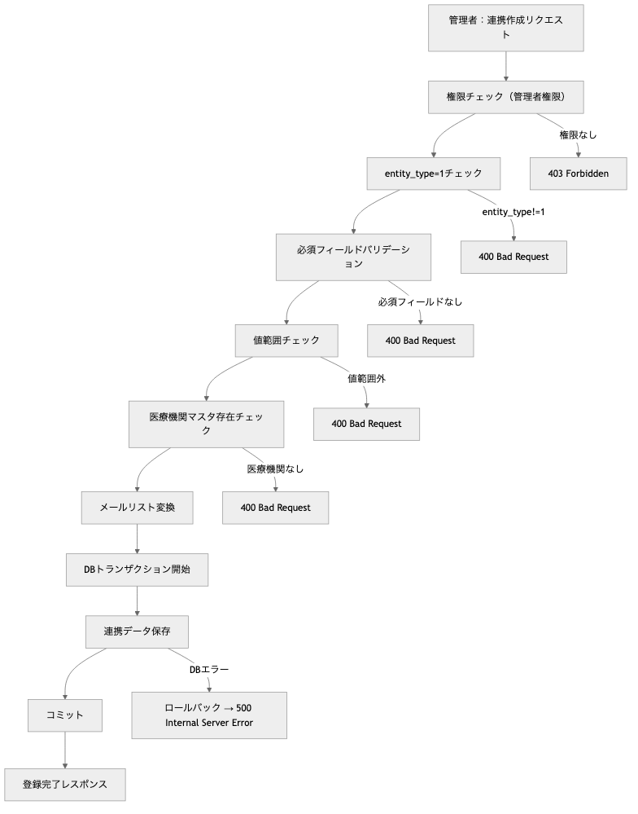
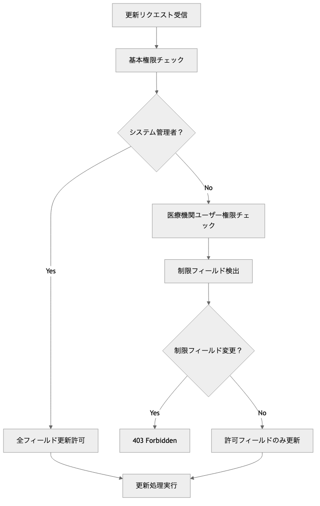

# OptiServe ユーザー組織連携管理モジュール プログラム仕様書 / User Entity Links Management Module Program Specification

## 概要 / Overview

このモジュールは、OptiServeシステムにおけるユーザーと組織（医療機関・ディーラー・メーカー）の連携情報管理機能を提供します。
現在は医療機関（entity_type=1）のみサポートし、連携情報の新規登録、情報更新、一覧取得、個別取得などの機能を含み、複合主キーと権限管理を統合したCRUD APIを提供します。

**[English]**
This module provides user-organization link information management functionality for the OptiServe system.
Currently supports only medical facilities (entity_type=1), and includes link information registration, updates, list retrieval, and individual retrieval, offering CRUD APIs with composite primary keys and integrated permission management.

## 1. システム構成 / System Architecture

| 項目 / Item | 内容 / Content |
|-------------|----------------|
| 使用フレームワーク / Framework | FastAPI |
| 認証方式 / Authentication | X-User-Id ヘッダー + AuthManager |
| 権限管理 / Permission | システム管理者・医療機関ユーザー・フィールドレベル制限 |
| DB接続 / Database | SQLite（開発用）/ PostgreSQL（本番予定） |
| APIパス / API Path | `/api/v1/user-entity-links` |
| データモデル / Data Model | SQLAlchemy ORM + Pydantic |
| 主キー構成 / Primary Key | 複合主キー（entity_type + entity_relation_id） |
| ログ出力 / Logging | smds_core.logger.Logger（シングルトン） |

## 2. 関連ファイル / Related Files

| ファイル名 / File Name | 役割 / Role |
|------------------------|-------------|
| `routers/user_entity_links.py` | APIエンドポイントの定義 / API endpoint definition |
| `schemas/user_entity_link.py` | Pydanticモデル定義 / Pydantic model definition |
| `models/pg_optigate/user_entity_link.py` | SQLAlchemy ORMモデル / SQLAlchemy ORM model |
| `models/pg_optigate/mst_medical_facility.py` | 医療機関マスタ（外部キー参照） / Medical facility master |
| `utils/auth.py` | 認証・認可管理 / Authentication & authorization |

## 3. API仕様 / API Specifications

### 3.1 ユーザー組織連携一覧取得 / Get User Entity Links List

```http
GET /api/v1/user-entity-links
X-User-Id: {current_user_id}
```

**パラメーター / Parameters:**

| Parameter | Type | Required | Description |
|-----------|------|----------|-------------|
| `skip` | int | ❌ | スキップ件数（デフォルト: 0） / Skip count |
| `limit` | int | ❌ | 取得件数（デフォルト: 100、最大: 100） / Limit count |

**レスポンス / Response:** `List[UserEntityLinkSchema]`

**使用例 / Examples:**

```plaintext
/user-entity-links                    # 全件取得（最大100件）
/user-entity-links?skip=0&limit=50    # 最初の50件
/user-entity-links?skip=50&limit=50   # 次の50件
```

### 3.2 ユーザー組織連携個別取得 / Get User Entity Link by Composite Key

```http
GET /api/v1/user-entity-links/{entity_type}/{entity_relation_id}
X-User-Id: {current_user_id}
```

**パラメーター / Parameters:**

| Parameter | Type | Required | Description |
|-----------|------|----------|-------------|
| `entity_type` | int | ✅ | 組織種別（1=医療機関） / Entity type |
| `entity_relation_id` | int | ✅ | 組織ID / Entity relation ID |

**レスポンス / Response:** `UserEntityLinkSchema`

**使用例 / Examples:**

```plaintext
/user-entity-links/1/6    # entity_type=1, entity_relation_id=6
```

### 3.3 ユーザー組織連携新規登録 / Create User Entity Link

```http
POST /api/v1/user-entity-links
X-User-Id: {current_user_id}
Content-Type: application/json
```

**リクエストボディ / Request Body:** `UserEntityLinkCreate`
**レスポンス / Response:** `UserEntityLinkSchema`

**権限要件 / Permission Requirement:** システム管理者のみ / System administrators only

### 3.4 ユーザー組織連携情報更新 / Update User Entity Link

```http
PUT /api/v1/user-entity-links/{entity_type}/{entity_relation_id}
X-User-Id: {current_user_id}
Content-Type: application/json
```

**パラメーター / Parameters:**

| Parameter | Type | Required | Description |
|-----------|------|----------|-------------|
| `entity_type` | int | ✅ | 組織種別（1=医療機関） / Entity type |
| `entity_relation_id` | int | ✅ | 組織ID / Entity relation ID |

**リクエストボディ / Request Body:** `UserEntityLinkCreate`
**レスポンス / Response:** `UserEntityLinkSchema`

## 4. データモデル / Data Models

### 4.1 UserEntityLinkSchema（レスポンス用）/ UserEntityLinkSchema (Response)

| フィールド / Field | 型 / Type | 説明 / Description |
|-------------------|-----------|-------------------|
| `entity_type` | int | 組織種別（1=医療機関, 2=ディーラー, 3=メーカー） / Entity type |
| `entity_relation_id` | int | 組織ID / Entity relation ID |
| `entity_name` | str | 組織名 / Entity name |
| `notification_email_list` | List[str] | 通知メールアドレスリスト / Notification email list |
| `count_reportout_classification` | int | レポート出力分類数 / Report output classification count |
| `analiris_classification_level` | int | 分析分類レベル（1-3） / Analysis classification level |
| `reg_user_id` | str | 登録ユーザーID / Registration user ID |
| `regdate` | datetime | 登録日時 / Registration date |
| `update_user_id` | str | 更新ユーザーID / Update user ID |
| `lastupdate` | datetime | 最終更新日時 / Last update date |

### 4.2 UserEntityLinkCreate（登録・更新用）/ UserEntityLinkCreate (Creation & Update)

| フィールド / Field | 型 / Type | 必須 / Required | 説明 / Description |
|-------------------|-----------|-----------------|-------------------|
| `entity_type` | int | ✅ | 組織種別（現在は1のみサポート） / Entity type |
| `entity_relation_id` | int | ✅ | 組織ID / Entity relation ID |
| `entity_name` | str | ✅ | 組織名 / Entity name |
| `notification_email_list` | str | ✅ | 通知メールアドレス（JSON文字列またはメール） / Notification emails |
| `count_reportout_classification` | int | ✅ | レポート出力分類数 / Report output classification count |
| `analiris_classification_level` | int | ✅ | 分析分類レベル（1-3） / Analysis classification level |

## 5. 機能詳細 / Functional Details

### 5.1 業務フロー / Business Flow

1. ユーザー組織連携新規登録フロー / User Entity Link Registration Flow

    

2. フィールドレベル権限チェックフロー / Field-Level Permission Check Flow

    

### 5.2 権限管理 / Permission Management

#### 権限区分 / Permission Categories

| ユーザー種別 / User Type | 権限範囲 / Permission Scope |
|-------------------------|---------------------------|
| **システム管理者** / System Admin | 全組織の参照・作成・更新（全フィールド） / Full access to all organizations |
| **医療機関ユーザー** / Medical User | 自組織のみ参照・更新（制限フィールドあり） / View and update own organization only |
| **その他ユーザー** / Other Users | アクセス不可 / No access |

#### 操作権限詳細 / Detailed Operation Permissions

| 操作 / Operation | システム管理者 / System Admin | 医療機関ユーザー / Medical User |
|-----------------|-------------------------------|--------------------------------|
| 連携一覧取得 / List Links | 全件取得可能 / All links | 自組織のみ / Own organization only |
| 連携個別取得 / Get Link | 全組織取得可能 / All organizations | 自組織のみ / Own organization only |
| 連携新規登録 / Create Link | 可能 / Allowed | 不可 / Not allowed |
| 連携情報更新 / Update Link | 全フィールド / All fields | 制限フィールドあり / Restricted fields |

#### フィールドレベル制限 / Field-Level Restrictions

- 医療機関ユーザーの更新制限 / Medical User Update Restrictions

  | フィールド / Field | システム管理者 / System Admin | 医療機関ユーザー / Medical User |
  |-------------------|-------------------------------|--------------------------------|
  | `entity_name` | 更新可能 / Updatable | 更新可能 / Updatable |
  | `notification_email_list` | 更新可能 / Updatable | 更新可能 / Updatable |
  | `count_reportout_classification` | 更新可能 / Updatable | **更新不可** / **Not updatable** |
  | `analiris_classification_level` | 更新可能 / Updatable | **更新不可** / **Not updatable** |

- 制限フィールド実装 / Restricted Fields Implementation

  ```python
  if not current_user_info.is_admin:
      restricted_fields = ['count_reportout_classification', 'analiris_classification_level']
      for field in restricted_fields:
          if field in update_data and update_data[field] != getattr(db_link, field):
              raise HTTPException(
                  status_code=403,
                  detail=f"医療機関ユーザーは{field}フィールドを変更できません（管理者権限が必要）"
              )
  ```

### 5.3 バリデーション / Validation

記述無し

**[English]**
No description

### 5.4 エラーハンドリング / Error Handling

#### HTTPステータスコード / HTTP Status Codes

| ステータス / Status | 条件 / Condition | レスポンス例 / Response Example |
|-------------------|------------------|-------------------------------|
| 200 OK | 成功 / Success | 正常なレスポンスデータ / Normal response data |
| 400 Bad Request | バリデーションエラー / Validation error | `"組織種別（entity_type）は1のみサポートしています"` |
| 401 Unauthorized | 認証エラー / Authentication error | `"ユーザーID {user_id} が存在しません"` |
| 403 Forbidden | 権限エラー / Permission error | `"医療機関ユーザーはcount_reportout_classificationフィールドを変更できません"` |
| 404 Not Found | 連携情報未存在 / Link not found | `"User entity link not found: entity_type=1, entity_relation_id=6"` |
| 422 Unprocessable Entity | Pydanticバリデーションエラー / Pydantic validation error | Pydanticバリデーション詳細 / Pydantic validation details |
| 500 Internal Server Error | システムエラー / System error | `"Internal server error: {error_details}"` |

#### 必須フィールド検証 / Required Field Validation

```python
# 必須フィールドチェック例
required_checks = [
    (link.entity_name, "組織名（entity_name）は必須です"),
    (link.notification_email_list, "通知メールリスト（notification_email_list）は必須です"),
    (link.count_reportout_classification, "レポート公開分類数（count_reportout_classification）は必須です"),
    (link.analiris_classification_level, "分析レポート分類レベル（analiris_classification_level）は必須です")
]
```

#### 値範囲検証 / Value Range Validation

| フィールド / Field | 検証ルール / Validation Rule | エラー例 / Error Example |
|-------------------|----------------------------|-------------------------|
| `entity_type` | 1のみ許可 / Only 1 allowed | `"組織種別（entity_type）は1のみサポートしています（医療機関タイプ）"` |
| `analiris_classification_level` | 1-3の範囲 / Range 1-3 | `"分析レポート分類レベル（analiris_classification_level）は1-3の値のみ有効です"` |
| `entity_relation_id` | 医療機関マスタ存在チェック / Medical facility existence check | `"医療機関ID（entity_relation_id） {id} は存在しません"` |

#### 外部キー整合性検証 / Foreign Key Integrity Validation

```python
# 医療機関マスタ存在チェック
medical_facility = db.query(MstMedicalFacility).filter(
    MstMedicalFacility.medical_id == link.entity_relation_id
).first()
if not medical_facility:
    raise HTTPException(
        status_code=400,
        detail=f"医療機関ID（entity_relation_id） {link.entity_relation_id} は存在しません"
    )
```

### 5.5 データベース連携 / Database Integration

#### 主キー構成 / Primary Key Structure

```sql
PRIMARY KEY (entity_type, entity_relation_id)
```

- **entity_type**: 組織種別（1=医療機関, 2=ディーラー, 3=メーカー）
- **entity_relation_id**: 組織ID（各組織マスタの主キー）

#### 現在サポート範囲 / Current Support Scope

| entity_type | 組織種別 / Entity Type | 参照先テーブル / Referenced Table | サポート状況 / Support Status |
|-------------|------------------------|----------------------------------|-------------------------------|
| 1 | 医療機関 / Medical Facility | mst_medical_facility.medical_id | ✅ サポート中 / Supported |
| 2 | ディーラー / Dealer | （未定義） / (Not defined) | ❌ 未サポート / Not supported |
| 3 | メーカー / Manufacturer | （未定義） / (Not defined) | ❌ 未サポート / Not supported |

### 5.6 メールアドレスリスト変換 / Email List Conversion

```python
def convert_email_list_for_db(email_list_str: str) -> list:
    """notification_email_listを文字列からDB用リスト形式に変換"""
```

#### 変換パターン / Conversion Patterns

| 入力形式 / Input Format | 変換結果 / Conversion Result | 例 / Example |
|------------------------|----------------------------|--------------|
| JSON文字列 / JSON String | パース後のリスト / Parsed list | `'["a@b.com","c@d.com"]'` → `["a@b.com","c@d.com"]` |
| 単一メール / Single Email | 1要素のリスト / Single element list | `'admin@hospital.com'` → `["admin@hospital.com"]` |
| 既存リスト / Existing List | そのまま / As is | `["a@b.com"]` → `["a@b.com"]` |

## 6. セキュリティ考慮事項 / Security Considerations

### 6.1 認証・認可 / Authentication & Authorization

- **X-User-Id ヘッダー**: 全APIで必須
- **AuthManager**: 統一認証・認可システム
- **医療機関分離**: 医療機関ユーザーは自組織データのみアクセス可能
- **フィールドレベル制御**: 業務重要フィールドの更新権限制限

### 6.2 データ保護 / Data Protection

- **削除機能廃止**: 連携データの誤削除防止
- **更新履歴**: reg_user_id, update_user_id による変更追跡
- **トランザクション**: エラー時の自動ロールバック
- **複合主キー**: entity_type + entity_relation_id による一意性保証

### 6.3 入力サニタイゼーション / Input Sanitization

- **Pydanticバリデーション**: 全入力値の型・形式チェック
- **SQLインジェクション対策**: SQLAlchemy ORMによる安全なクエリ実行
- **JSONインジェクション対策**: メールリストの安全な変換・保存

## 7. パフォーマンス考慮事項 / Performance Considerations

以下の項目は一部実装済みの機能もありますが、本格的なプロダクション環境での運用を想定し、将来的に検討・実装すべきパフォーマンス改善案を記載しています。

**[English]**
While some of the following items are partially implemented, this section outlines performance improvement measures that should be considered and implemented for full-scale production environment operation.

### 7.1 複合主キー最適化 / Composite Primary Key Optimization

- **インデックス**: (entity_type, entity_relation_id) での高速検索
- **権限フィルタ**: entity_relation_id による効率的な権限絞り込み

### 7.2 ページング / Pagination

- **デフォルト制限**: limit=100, skip=0
- **最大制限**: limit <= 100 で大量データアクセス制御

### 7.3 関連データ取得 / Related Data Retrieval

- **医療機関マスタ結合**: 必要に応じてJOINによる効率的なデータ取得
- **メールリスト処理**: DB保存時の効率的な変換処理

## 8. テスト項目 / Test Cases

### 8.1 正常系 / Normal Cases

1. **連携一覧取得**: フィルタなし・ページング
2. **連携個別取得**: 存在する複合キーでの取得
3. **連携新規登録**: 管理者による正常登録
4. **連携情報更新**: 管理者・医療機関ユーザーによる更新

### 8.2 異常系 / Error Cases

1. **権限エラー**: 医療機関ユーザーが他組織データアクセス
2. **権限エラー**: 医療機関ユーザーが制限フィールド変更
3. **権限エラー**: 一般ユーザーが作成操作
4. **未存在エラー**: 存在しない複合キーでの取得・更新
5. **バリデーションエラー**: entity_type!=1, 必須フィールド不足
6. **外部キーエラー**: 存在しない医療機関IDの指定

### 8.3 権限テスト / Permission Tests

1. **システム管理者**: 全操作・全フィールドの成功確認
2. **医療機関ユーザー**: 自組織のみアクセス・制限フィールド拒否確認
3. **権限なしユーザー**: アクセス拒否確認

### 8.4 データ変換テスト / Data Conversion Tests

1. **メールリスト変換**: JSON文字列・単一メール・既存リストの正常変換
2. **不正JSON**: パースエラー時の適切な処理
3. **空文字・null**: エラー処理の確認

## 9. 今後の拡張予定 / Future Enhancements

### 9.1 組織種別拡張 / Entity Type Extensions

1. **ディーラー対応**: entity_type=2 のサポート
2. **メーカー対応**: entity_type=3 のサポート
3. **マスタテーブル整備**: 各組織種別のマスタテーブル作成

### 9.2 機能拡張 / Functional Extensions

1. **通知機能**: メールリストを使った自動通知
2. **設定テンプレート**: 組織種別ごとのデフォルト設定
3. **一括更新**: 複数組織の設定一括変更

### 9.3 セキュリティ強化 / Security Enhancements

1. **詳細監査ログ**: フィールドレベルの変更履歴
2. **承認フロー**: 重要設定変更の承認プロセス
3. **アクセス制御**: より細かい権限管理

## 10. 運用考慮事項 / Operational Considerations

記述無し

**[English]**
No description

## 11. 関連資料 / Related Documents

- [ユーザー管理API仕様書](api_users.md)
- [医療機関管理API仕様書](api_facilities.md)
- [認証API仕様書](api_auth.md)
- [データベース設計書](../database/pg_optigate/user_entity_link.yaml)
- [医療機関マスタ設計書](../database/pg_optigate/mst_medical_facility.yaml)
- [ユーザー組織連携テスト仕様](../../tests/test_user_entity_links_api.py)
