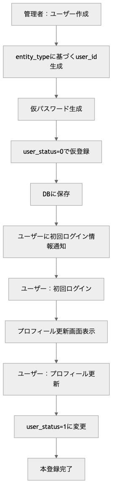
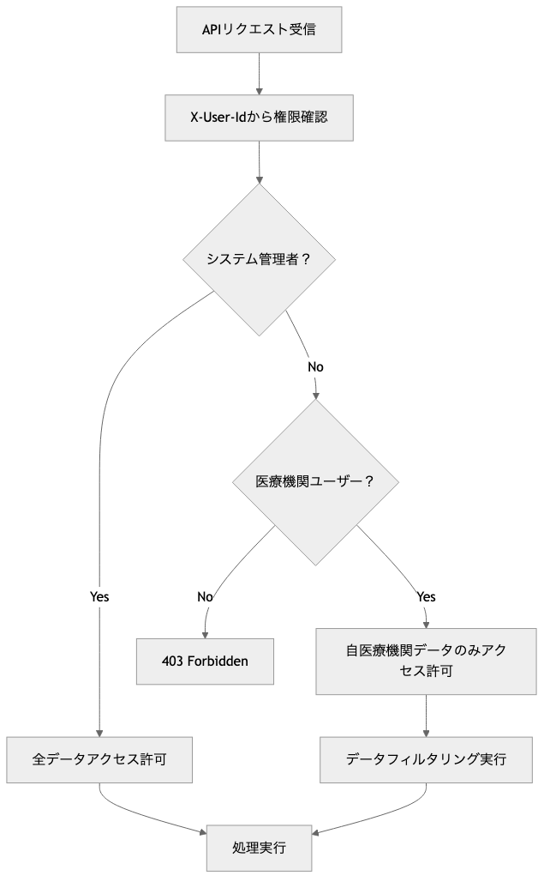

# OptiServe ユーザー管理モジュール プログラム仕様書 / Users Management Module Program Specification

## 概要 / Overview

このモジュールは、OptiServeシステムにおけるユーザー情報の管理機能を提供します。
ユーザーの新規登録、情報更新、一覧取得、個別取得、無効化処理などの機能を含み、権限管理を統合したCRUD APIを提供します。

**[English]**
This module provides user information management functionality for the OptiServe system.
It includes user registration, information updates, list retrieval, individual retrieval, and inactivation processes, offering CRUD APIs with integrated permission management.

## 1. システム構成 / System Architecture

| 項目 / Item | 内容 / Content |
|-------------|----------------|
| 使用フレームワーク / Framework | FastAPI |
| 認証方式 / Authentication | X-User-Id ヘッダー + AuthManager |
| 権限管理 / Permission | システム管理者・医療機関ユーザー分離 |
| DB接続 / Database | SQLite（開発用）/ PostgreSQL（本番予定） |
| APIパス / API Path | `/api/v1/users` |
| データモデル / Data Model | SQLAlchemy ORM + Pydantic |

## 2. 関連ファイル / Related Files

| ファイル名 / File Name | 役割 / Role |
|------------------------|-------------|
| `routers/users.py` | APIエンドポイントの定義 / API endpoint definition |
| `schemas/mst_user.py` | Pydanticモデル定義 / Pydantic model definition |
| `models/pg_optigate/mst_user.py` | SQLAlchemy ORMモデル / SQLAlchemy ORM model |
| `utils/auth.py` | 認証・認可管理 / Authentication & authorization |
| `utils/password.py` | パスワード生成ユーティリティ / Password generation utility |

## 3. API仕様 / API Specifications

### 3.1 ユーザー一覧取得 / Get Users List

```http
GET /api/v1/users
X-User-Id: {current_user_id}
```

**パラメーター / Parameters:**

| Parameter | Type | Required | Description |
|-----------|------|----------|-------------|
| `user_name` | str | ❌ | ユーザー名でフィルタリング / Filter by user name |
| `entity_type` | int | ❌ | 組織種別でフィルタリング / Filter by entity type |
| `entity_relation_id` | int | ❌ | 組織IDでフィルタリング / Filter by entity relation ID |
| `e_mail` | str | ❌ | メールアドレスでフィルタリング / Filter by email |
| `phone_number` | str | ❌ | 電話番号でフィルタリング / Filter by phone |
| `mobile_number` | str | ❌ | 携帯番号でフィルタリング / Filter by mobile |
| `user_status` | int | ❌ | ユーザーステータスでフィルタリング / Filter by status |
| `skip` | int | ❌ | スキップ件数（デフォルト: 0） / Skip count |
| `limit` | int | ❌ | 取得件数（デフォルト: 100、最大: 100） / Limit count |

**レスポンス / Response:** `List[User]`

### 3.2 ユーザー個別取得 / Get User by ID

```http
GET /api/v1/users/{user_id}
X-User-Id: {current_user_id}
```

**パラメーター / Parameters:**

| Parameter | Type | Required | Description |
|-----------|------|----------|-------------|
| `user_id` | str | ✅ | ユーザーID / User ID |

**レスポンス / Response:** `User`

### 3.3 ユーザー新規登録 / Create User

```http
POST /api/v1/users
X-User-Id: {current_user_id}
Content-Type: application/json
```

**リクエストボディ / Request Body:** `UserCreate`
**レスポンス / Response:** `User`

### 3.4 ユーザー情報更新 / Update User

```http
PUT /api/v1/users/{user_id}
X-User-Id: {current_user_id}
Content-Type: application/json
```

**パラメーター / Parameters:**

| Parameter | Type | Required | Description |
|-----------|------|----------|-------------|
| `user_id` | str | ✅ | ユーザーID / User ID |

**リクエストボディ / Request Body:** `UserUpdate`
**レスポンス / Response:** `User`

### 3.5 ユーザー無効化 / Inactivate User

```http
PUT /api/v1/users/{user_id}/inactive
X-User-Id: {current_user_id}
Content-Type: application/json
```

**パラメーター / Parameters:**

| Parameter | Type | Required | Description |
|-----------|------|----------|-------------|
| `user_id` | str | ✅ | ユーザーID / User ID |

**リクエストボディ / Request Body:** `UserInactive`
**レスポンス / Response:** `User`

## 4. データモデル / Data Models

### 4.1 User（レスポンス用）/ User (Response)

| フィールド / Field | 型 / Type | 説明 / Description |
|-------------------|-----------|-------------------|
| `user_id` | str | ユーザーID（主キー） / User ID (Primary Key) |
| `user_name` | str | ユーザー名 / User name |
| `entity_type` | int | 組織種別（1=医療機関, 2=ディーラー, 3=メーカー, 9=システム） / Entity type |
| `entity_relation_id` | int | 組織ID / Entity relation ID |
| `e_mail` | str | メールアドレス / Email address |
| `phone_number` | str | 電話番号 / Phone number |
| `mobile_number` | str | 携帯番号 / Mobile number |
| `user_status` | int | ユーザー状態（0=仮登録, 1=稼働中, 9=利用停止） / User status |
| `regdate` | datetime | 登録日時 / Registration date |
| `lastupdate` | datetime | 最終更新日時 / Last update date |

### 4.2 UserCreate（登録用）/ UserCreate (Creation)

| フィールド / Field | 型 / Type | 必須 / Required | 説明 / Description |
|-------------------|-----------|-----------------|-------------------|
| `user_name` | str | ✅ | ユーザー名 / User name |
| `entity_type` | int | ✅ | 組織種別 / Entity type |
| `entity_relation_id` | int | ✅ | 組織ID / Entity relation ID |
| `e_mail` | str | ✅ | メールアドレス / Email address |
| `phone_number` | str | ❌ | 電話番号 / Phone number |
| `mobile_number` | str | ❌ | 携帯番号 / Mobile number |

### 4.3 UserUpdate（更新用）/ UserUpdate (Update)

| フィールド / Field | 型 / Type | 必須 / Required | 説明 / Description |
|-------------------|-----------|-----------------|-------------------|
| `user_name` | str | ❌ | ユーザー名 / User name |
| `e_mail` | str | ❌ | メールアドレス / Email address |
| `phone_number` | str | ❌ | 電話番号 / Phone number |
| `mobile_number` | str | ❌ | 携帯番号 / Mobile number |
| `password` | str | ❌ | パスワード / Password |

### 4.4 UserInactive（無効化用）/ UserInactive (Inactivation)

| フィールド / Field | 型 / Type | 必須 / Required | 説明 / Description |
|-------------------|-----------|-----------------|-------------------|
| `reason_code` | int | ✅ | 無効化理由コード / Inactivation reason code |
| `note` | str | ✅ | 無効化理由詳細 / Inactivation reason note |

## 5. 機能詳細 / Functional Details

### 5.1 業務フロー / Business Flow

1. ユーザー新規登録フロー / User Registration Flow

    

2. 権限チェックフロー / Permission Check Flow

    

### 5.2 権限管理 / Permission Management

#### 権限区分 / Permission Categories

| ユーザー種別 / User Type | 権限範囲 / Permission Scope |
|-------------------------|---------------------------|
| **システム管理者** / System Admin | 全ユーザーの参照・作成・更新・無効化 / Full access to all users |
| **医療機関ユーザー** / Medical User | 自医療機関ユーザーのみ参照可能 / View only own facility users |
| **その他ユーザー** / Other Users | アクセス不可 / No access |

#### 操作権限詳細 / Detailed Operation Permissions

| 操作 / Operation | システム管理者 / System Admin | 医療機関ユーザー / Medical User |
|-----------------|-------------------------------|--------------------------------|
| ユーザー一覧取得 / List Users | 全件取得可能 / All users | 自医療機関のみ / Own facility only |
| ユーザー個別取得 / Get User | 全ユーザー取得可能 / All users | 自医療機関のみ / Own facility only |
| ユーザー新規登録 / Create User | 可能 / Allowed | 不可 / Not allowed |
| ユーザー情報更新 / Update User | 全ユーザー / All users | 自医療機関のみ / Own facility only |
| ユーザー無効化 / Inactivate User | 可能 / Allowed | 不可 / Not allowed |

### 5.3 バリデーション / Validation

#### 入力値検証 / Input Validation

- **email**: Pydanticによるメールアドレス形式チェック
- **entity_type**: 1, 2, 3, 9 のいずれかの値
- **pagination**: skip >= 0, 1 <= limit <= 100

#### ビジネスルール検証 / Business Rule Validation

- **ユーザーID採番**: 各entity_typeの範囲内での重複チェック
- **権限チェック**: AuthManagerによる医療機関アクセス権限確認
- **更新権限**: 更新対象ユーザーへのアクセス権限確認

### 5.4 エラーハンドリング / Error Handling

#### HTTPステータスコード / HTTP Status Codes

| ステータス / Status | 条件 / Condition | レスポンス例 / Response Example |
|-------------------|------------------|-------------------------------|
| 200 OK | 成功 / Success | 正常なレスポンスデータ / Normal response data |
| 400 Bad Request | 採番範囲上限到達 / ID range limit reached | `"{entity_type}のuser_id採番範囲が上限に達しました"` |
| 401 Unauthorized | 認証エラー / Authentication error | `"ユーザーID {user_id} が存在しません"` |
| 403 Forbidden | 権限エラー / Permission error | `"指定されたユーザーへのアクセス権限がありません"` |
| 404 Not Found | ユーザー未存在 / User not found | `"User not found"` |
| 422 Unprocessable Entity | バリデーションエラー / Validation error | Pydanticバリデーション詳細 / Pydantic validation details |
| 500 Internal Server Error | システムエラー / System error | サーバー内部エラー / Internal server error |

### 5.5 データベース連携 / Database Integration

記述無し

**[English]**
No description

### 5.6 ユーザーID採番ルール / User ID Assignment Rules

#### 採番範囲 / ID Ranges

| entity_type | 組織種別 / Entity Type | ID範囲 / ID Range | 説明 / Description |
|-------------|------------------------|-------------------|-------------------|
| 1 | 医療機関 / Medical Facility | 100001 - 199999 | 医療機関ユーザー / Medical facility users |
| 2 | ディーラー / Dealer | 200001 - 299999 | ディーラーユーザー / Dealer users |
| 3 | メーカー / Manufacturer | 300001 - 399999 | メーカーユーザー / Manufacturer users |
| 9 | システム / System | 900001 - 999999 | システム管理者 / System administrators |

#### 採番機能 / ID Generation Function

```python
def generate_next_user_id(entity_type: int, db: Session) -> str:
    """
    entity_typeに応じたuser_idを生成する
    - 各範囲内での最大user_idを数値として取得し、+1して文字列で返却
    - 初回の場合は各範囲の開始値を文字列で返却
    - 上限に達した場合はHTTPException(400)を発生
    """
```

## 6. セキュリティ考慮事項 / Security Considerations

### 6.1 認証・認可 / Authentication & Authorization

- **X-User-Id ヘッダー**: 全APIで必須
- **AuthManager**: 統一認証・認可システム
- **医療機関分離**: 医療機関ユーザーは自組織データのみアクセス可能

### 6.2 データ保護 / Data Protection

- **論理削除**: 物理削除ではなく user_status=9 による無効化
- **パスワード**: 初期パスワード自動生成
- **更新履歴**: reg_user_id, update_user_id による変更追跡

### 6.3 入力サニタイゼーション / Input Sanitization

- **Pydanticバリデーション**: 全入力値の型・形式チェック
- **SQLインジェクション対策**: SQLAlchemy ORMによる安全なクエリ実行

## 7. パフォーマンス考慮事項 / Performance Considerations

以下の項目は一部実装済みの機能もありますが、本格的なプロダクション環境での運用を想定し、将来的に検討・実装すべきパフォーマンス改善案を記載しています。

**[English]**
While some of the following items are partially implemented, this section outlines performance improvement measures that should be considered and implemented for full-scale production environment operation.

### 7.1 ページング / Pagination

- **デフォルト制限**: limit=100, skip=0
- **最大制限**: limit <= 100 で大量データアクセス制御
- **インデックス**: user_id（主キー）、entity_relation_id での高速検索

### 7.2 フィルタリング / Filtering

- **複数条件**: AND条件での組み合わせフィルタ
- **部分一致**: 必要に応じてLIKE検索対応可能
- **権限フィルタ**: 権限に基づく自動フィルタリング

## 8. テスト項目 / Test Cases

### 8.1 正常系 / Normal Cases

1. **ユーザー一覧取得**: フィルタなし・フィルタあり・ページング
2. **ユーザー個別取得**: 存在するユーザーIDでの取得
3. **ユーザー新規登録**: 各entity_typeでの正常登録
4. **ユーザー情報更新**: 部分更新・全項目更新
5. **ユーザー無効化**: 理由付きでの無効化

### 8.2 異常系 / Error Cases

1. **権限エラー**: 医療機関ユーザーが他機関データアクセス
2. **未存在ユーザー**: 存在しないuser_idでの取得・更新
3. **採番上限**: entity_type範囲上限での新規登録
4. **バリデーションエラー**: 不正なメールアドレス・entity_type
5. **認証エラー**: 不正なX-User-Id・存在しないuser_id

### 8.3 権限テスト / Permission Tests

1. **システム管理者**: 全操作の成功確認
2. **医療機関ユーザー**: 自機関のみアクセス確認
3. **権限なしユーザー**: アクセス拒否確認

## 9. 今後の拡張予定 / Future Enhancements

### 9.1 機能拡張 / Functional Extensions

1. **プロフィール画像**: ユーザーアバター機能
2. **ロール管理**: より細かい権限制御
3. **監査ログ**: ユーザー操作の詳細ログ

### 9.2 パフォーマンス改善 / Performance Improvements

1. **キャッシュ**: ユーザー情報のRedisキャッシュ
2. **インデックス最適化**: 検索パフォーマンス向上
3. **バッチ処理**: 大量ユーザー操作の最適化

### 9.3 セキュリティ強化 / Security Enhancements

1. **2要素認証**: SMS・メール認証
2. **パスワードポリシー**: 複雑度要件・有効期限
3. **アクセスログ**: 不正アクセス検知

## 10. 運用考慮事項 / Operational Considerations

記述無し

**[English]**
No description

## 11. 関連資料 / Related Documents

- [認証API仕様書](api_auth.md)
- [ユーザー組織リンクAPI仕様書](api_user_entity_links.md)
- [データベース設計書](../database/pg_optigate/mst_user.yaml)
- [ユーザー管理テスト仕様](../../tests/test_user_api.py)
