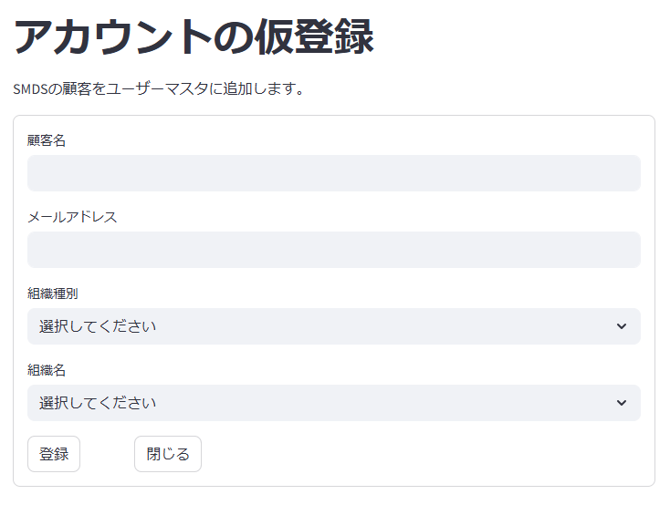

# プログラム仕様書（画面仕様書）

## 1. 画面名称

アカウントの仮登録

## 2. 機能概要

SMDSの顧客をユーザーマスタに追加する。
目的は初回ログインをしてもらう為のアカウント情報を登録すること。以後の詳細情報登録はユーザー自身が行う。

## 2-1. 補足情報

- プロトタイプ版のインフラとなるトヨクモサービスを利用する場合、連携できない可能性あり。
  - kintoneへのレコード追加とセットで、トヨクモサービスの管理画面でアカウント追加を行なう運用
- Product版では、同一のデータベースで管理を行なうので、この仕組が必要になる。

## 3. 対象ユーザー

- ユーザー区分：管理者（Kintone利用者）

<div style="page-break-before: always;"></div>

## 4. 利用目的（業務的な背景）

- 医療機関向けSaaSサービスの利用開始にあたり、初回ログイン用のアカウントを迅速かつ正確に発行するため。
- 管理者が医療機関ごとに仮アカウントを発行し、利用者自身による本登録・情報更新を促進することで、運用負荷を軽減するため。
- 医療機関の担当者情報を事前に把握した上で仮登録を行うことで、セキュリティとトレーサビリティを確保するため。
- アカウント発行の履歴管理や、未本登録ユーザーのフォローアップを容易にするため。

## 5. 入出力仕様

### 5.1 入力項目（画面フォーム）

| 項目ID       | 表示名       | 型       | 必須 | 入力制約           | 備考             |
|--------------|--------------|----------|------|--------------------|------------------|
| user_name | 顧客名     | 文字列   | Yes   | 50文字以内         | 部分一致検索     |
| e_mail    | メールアドレス | 文字列   | Yes   | メール形式         | メールアドレスとして妥当|
| entity_type  | 組織種別   | リスト   | Yes   | 選択値のみ | 1 : 医療機関<br>2 : ディーラー<br>3 : メーカー |
| entity_name  | 組織名   | リスト   | Yes   | 選択値のみ | 組織と紐付くマスタから名称をセットし選択 |
| 登録  | 登録   | ボタン   |  |  | 登録処理を実行 |
| 閉じる | 閉じる   | ボタン   |  |  | 画面を閉じる |

### 5.2 画面一覧フォーム

- 顧客一覧のリストはkintoneの画面をそのまま利用するので、作成しない。

<div style="page-break-before: always;"></div>

## 6. 処理概要（IPO形式）

### 入力（Input）

- 各項目を抜けた場合は、バリデーションチェックを行なう
- **entity_type** を選択後の動作
    1. **user_entity_link** の **entyty_type** にひもづく **entity_code** と **entitty_name** のリストを作成
    2. **entity_name** 情報を entity_nameリストにセット

### 更新処理（Process）

1. 入力値をバリデーションチェック
2. **e_mail** が既に **mst_user** テーブルに存在する場合は、エラーメッセージを表示
3. kintoneの **mst_user** テーブルに画面の情報を登録
    - **entity_code** は、選択された **entity_name** と紐付く内容をセット
    - **proc_type** は、0（本登録待ち）をセット
4. 登録が正常終了した時は、「登録は正常に行なわれました。」のメッセージを表示。
    - 登録が異常終了したときは、「登録に失敗しました。後ほど再度お試しください。」のメッセージを表示。

### 出力（Output）

- なし

<div style="page-break-before: always;"></div>

## 7. 画面操作・遷移フロー

| ユーザー操作           | アクション概要              | 遷移先／処理内容                      |
|------------------------|--------------------------|--------------------------------------|
| **登録** ボタンクリック | 1. 「登録します。よろしいですか？」の確認ダイアログを表示。<br>2. ユーザーが「はい」を選択した場合、更新処理を実行。 | 1. 画面初期化(入力項目を空欄に)<br>2. カーソルは **顧客名** にフォーカス |
| **閉じる** ボタンクリック | 1. 入力項目に値が存在する場合は、「終了して良いですか？」の確認ダイアログを表示<br>2. ユーザーが「はい」を選択した場合、画面を閉じる<br>3. ユーザーが「いいえ」を選択した場合、ダイアログを閉じて入力項目にフォーカスを当てる<br>4. 入力項目に値が存在しない場合は、ダイアログを表示せずに画面を閉じる | 画面を閉じてメニューに戻る |
| **クリア** ボタンクリック | 入力フォームを初期化     | 1. 画面初期化(入力項目を空欄に)<br>2. カーソルは **顧客名** にフォーカス |

<div style="page-break-before: always;"></div>

## 8. サンプルデータ

### 8.1 Input入力例 (json形式)

```json
{
  "user_name": "順天堂　太郎",
  "e_mail": "taro.juntendo@juntendo.ac.jp",
  "entity_type": 1,
  "entity_name": "順天堂医院"
}
```

### 8.2 Output出力例 (json形式)

```json
{
  "status": "success",
  "message": "登録は正常に行なわれました。",
  "data": {
    "user_id": "12345",
    "user_name": "順天堂　太郎",
    "entity_type": 1,
    "entity_code": 5,
    "password": null,
    "e_mail": "taro.juntendo@juntendo.ac.jp",
    "phone_number": null,
    "mobile_number": null,
    "proc_type": 0
  }
}
```

<div style="page-break-before: always;"></div>

## 9. 画面イメージ（モック）



## 10. バリデーションルール（詳細）

| 項目ID           | チェック内容    | エラー時メッセージ例              |
| -------------- | --------- | ----------------------- |
| user\_name | 最大50文字    | 「ユーザー名は50文字以内で入力してください」   |
| e\_mail      | メール形式    | 「メールアドレスの形式が正しくありません」 |
| e\_mail      | record exists    | 「メールアドレスは既に登録されています」 |

- メール形式の確認条件
  - **@** が1つ含まれていること
  - **@** の前（ローカルパート）及び後ろ（ドメインパート）に1～63桁の文字が存在すること
  - ローカルパートは英数字、アンダースコア、ハイフン、ピリオドが使用可能
  - ドメインパートは英数字、ハイフンが使用可能で、ピリオドで区切られた部分が1つ以上存在すること
  - **kintone** の仕組として独自のチェック機能があれば、そちらのルールを適用する

<div style="page-break-before: always;"></div>

## 11. 備考・特記事項

- 今後API連携予定あり（現時点ではサンプルデータ使用）
  - オンプレミスからkintone APIを利用
    - ユーザーマスタはオンプレ側に取得予定
    - それ以外のマスタ情報はkintone側に登録予定
- 本画面はPoC版（kintone）で先行開発
- 本番ではAWS上での独自システムを構築予定

## 12. テスト観点一覧（簡易）

| No. | テスト内容       | 入力値          | 期待結果              |
|:--:|:--|:--|:--|
| T01 | 新規登録   | `taro.juntendo@juntendo.ac.jp`  | 登録成功、メッセージ表示 |
| T02 | 重複エラー | `taro.juntendo@juntendo.ac.jp`  | 「メールアドレスは既に登録されています」 |
| T03 | 項目不足  | 空欄有りの状態で登録  | 不足している項目でエラー表示 |
| T04 | 名前桁数エラー | 50文字以上の名前 | 「ユーザー名は50文字以内で入力してください」 |
| T04 | メール形式エラー | `invalid-email-format`  | 「メールアドレスの形式が正しくありません」 |

以上
