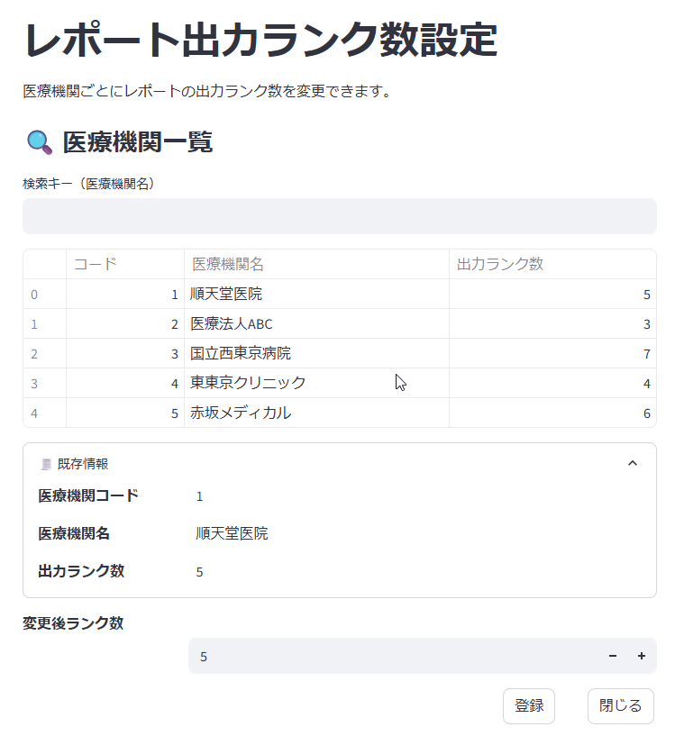

# プログラム仕様書（画面仕様書）

## 1. 画面名称

レポート出力ランク数設定

## 2. 機能概要

- 医療機関ユーザー単位で、レポート出力時のランク数を設定する画面。
  - システム的には、このランク数を変更した翌月作成のレポートから摘要される。

## 2-1. 補足情報

- OptiServer管理者のみが利用可能で、顧客自らランク数の設定を行なうことはできない。
- ランク数の変更は、営業や管理者からの指示により実施する。

## 3. 対象ユーザー

- ユーザー区分：管理者（Kintone利用者）

<div style="page-break-before: always;"></div>

## 4. 利用目的（業務的な背景）

- レポートに出力されるランク数を増やすことは、医療機関に対するサービス拡大となる。
- どのような運用ルールによって、ランク数の見直しを行なうかは今後検討予定。

## 5. 入出力仕様

### 5.1 入力項目（画面フォーム）

| 項目ID       | 表示名       | 型       | 必須 | 入力制約           | 備考             |
|--------------|--------------|----------|------|--------------------|------------------|
| 検索キー | 検索キー     | 文字列   | No   | | 医療機関名の検索 |
| 医療機関 | 医療機関| リスト   | | | 医療機関情報をリスト化<br>医療機関ID, 医療機関名, 出力ランク数を表示 |
| entity_code  | 医療機関コード | ラベル | | | リストから選択された行の医療機関コードを表示 |
| entity_name  | 医療機関名 | ラベル | | | リストから選択された行の医療機関名を表示 |
| rank_count  | 出力ランク数 | ラベル | | | リストから選択された行の出力ランク数を表示 |
| 変更後ランク数 | 変更後ランク数 | 数値 | Yes | 1～99の整数 | レポート出力ランク数を設定 |
| 登録  | 登録   | ボタン   |  |  | 登録処理を実行 |
| 閉じる | 閉じる   | ボタン   |  |  | 画面を閉じる |

### 5.2 画面一覧フォーム

- 入力用画面のフォーム内に一覧情報があるため、専用画面は存在しない。

<div style="page-break-before: always;"></div>

## 6. 処理概要（IPO形式）

### 入力（Input）

- **検索キー** 入力時の医療機関リストの対応
  - キーの内容が空欄の場合は、全ての医療機関を表示
  - キーの内容が入力されている場合は、キーに一致する医療機関名を持つ医療機関を表示
  - リアルタイムの結果反映が難しい場合、検索ボタンを配置し、クリックじにて検索・表示処理を行なっても問題無し。
  - 対象が1件しかない場合は、対象の医療機関をアクティブ（選択）にする。
- **医療機関** リストの選択
  - リストから医療機関を選択すると、以下の情報を表示
    - **entity_code**: 選択された医療機関のコード
    - **entity_name**: 選択された医療機関の名称
    - **rank_count**: 選択された医療機関の出力ランク数
- **変更後ランク数** 項目の設定
  - 特定の医療機関がラベルにセットされた場合、ラベルの rank_count の値を変更後ランク数にセット
  - テキストボックスの場合は数値で入力し、1～99の整数であることを確認
    - テキストボックスでなく、リストでのセレクトや数値のUpDown項目でも可能（推奨）

### 更新処理（Process）

1. 入力値をバリデーションチェック
2. kintoneの **user_entity_link** テーブルの出力数を更新
3. 登録が正常終了した時は、「登録は正常に行なわれました。」のメッセージを表示。
    - 登録が異常終了したときは、「登録に失敗しました。後ほど再度お試しください。」のメッセージを表示。

### 出力（Output）

- なし

<div style="page-break-before: always;"></div>

## 7. 画面操作・遷移フロー

| ユーザー操作           | アクション概要              | 遷移先／処理内容                      |
|------------------------|--------------------------|--------------------------------------|
| **登録** ボタンクリック | 1. 「登録します。よろしいですか？」の確認ダイアログを表示。<br>2. ユーザーが「はい」を選択した場合、更新処理を実行。 | 1. 検索項目を空欄にして、カーソルを **検索キー** にフォーカス |
| **閉じる** ボタンクリック | 1.変更前の医療機関情報がラベル項目にセットされ、変更後ランク数が変更前と異なる場合は、「変更内容を保存せずに閉じます。よろしいですか？」の確認ダイアログを表示。<br>2. ユーザーが「はい」を選択した場合、画面を閉じる。 | 画面を閉じる |

<div style="page-break-before: always;"></div>

## 8. サンプルデータ

### 8.1 Input入力例 (json形式)

```json
{
  "entity_type": 1,
  "entity_code": 5,
  "name": "順天堂医院",
  "rank_count": 5
}
```

### 8.2 Output出力例 (json形式)

```json
{
  "status": "success",
  "message": "登録は正常に行なわれました。",
  "data": {
    "entity_type": 1,
    "entity_code": 5,
    "name": "順天堂医院",
    "rank_count": 6
  }
}
```

<div style="page-break-before: always;"></div>

## 9. 画面イメージ（モック）



<div style="page-break-before: always;"></div>

## 10. バリデーションルール（詳細）

| 項目ID           | チェック内容    | エラー時メッセージ例              |
| -------------- | --------- | ----------------------- |
| 変更後ランク数 | 1～99の整数 | 「変更後ランク数は1～99の整数で入力してください」 |

## 11. 備考・特記事項

- 今後API連携予定あり（現時点ではサンプルデータ使用）
  - オンプレミスからkintone APIを利用
    - ユーザーマスタはオンプレ側に取得予定
    - それ以外のマスタ情報はkintone側に登録予定
- 本画面はPoC版（kintone）で先行開発
- 本番ではAWS上での独自システムを構築予定

## 12. テスト観点一覧（簡易）

| No. | テスト内容       | 入力値          | 期待結果              |
|:--:|:--|:--|:--|
| T01 | 変更成功   | ランク数を **5** から **6**に変更  | 登録成功、メッセージ表示 |

以上
