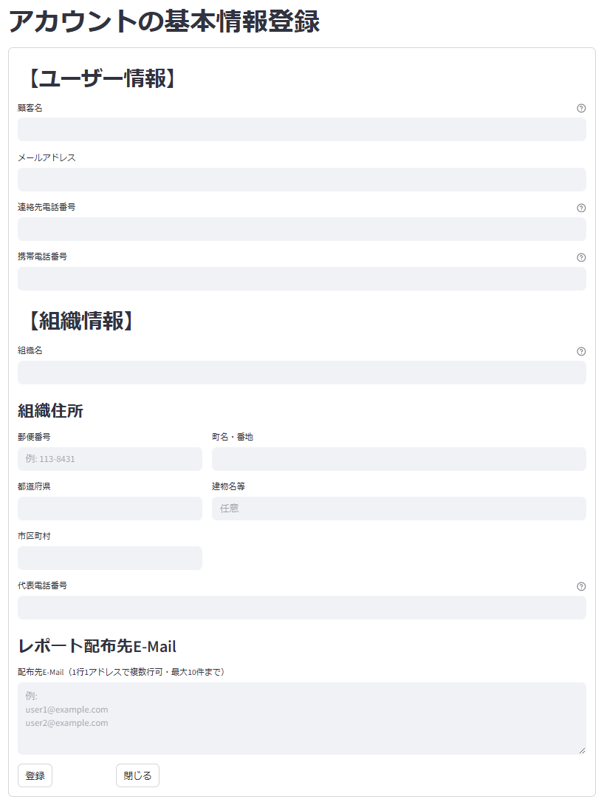

# プログラム仕様書（画面仕様書）

## 1. 画面名称

アカウントの基本情報登録

## 2. 機能概要

SMDSの顧客の基本情報を、顧客自らが更新する（追加・削除は無し）。
顧客が好きなタイミングで、担当者変更やレポート提出先の追加・変更等が行えるようになる。

## 2-1. 補足情報

- プロトタイプ版のインフラとなるトヨクモサービスを利用する場合、連携できない可能性あり。
  - kintoneへのレコード追加とセットで、トヨクモサービスの管理画面でアカウント追加を行なう運用
- Product版では、同一のデータベースで管理を行なうので、この仕組が必要になる。

## 3. 対象ユーザー

- ユーザー区分：顧客（医療機関ユーザー）（トヨクモ連携サービス上の画面）
- Product版では、医療機関以外にディーラー・メーカーの管理画面も提供し、顧客の組織種別に従い項目名が異なる。

<div style="page-break-before: always;"></div>

## 4. 利用目的（業務的な背景）

- 顧客が自身の電話番号やE-mailアドレス等の連絡先情報を、リアルタイムかつ安全に修正できるようにする
- 個人情報の更新申請や変更依頼を別メディア（電話・メール等）で受け付けず、情報漏洩リスクを低減する
- 顧客の利便性を高め、常に最新の連絡先情報をシステムに保持することで円滑なサポートや通知配信を実現する
- システム管理者によるアカウントの新規発行作業のみに集中し、日常的な情報メンテナンス業務の負担を削減する
- 顧客自身による情報更新履歴を保持することで、変更経緯の追跡や本人確認の信頼性を向上させる

## 5. 入出力仕様

### 5.1 入力項目（画面フォーム）

| 項目ID       | 表示名       | 型       | 必須 | 入力制約           | 備考             |
|--------------|--------------|----------|------|--------------------|------------------|
| user_name | 顧客名     | 文字列   | No | 50文字以内         |   |
| password | パスワード | 文字列 | No |  | PoC版は不要 |
| e_mail    | メールアドレス | 文字列   | No |  | |
| phone_number | 連絡先電話番号 | 文字列 | Yes/No | | 連絡先・携帯のどちらかは必要 |
| mobile_number | 携帯電話番号 | 文字列 | Yes/No | | 連絡先・携帯のどちらかは必要 |
| entity_type  | 組織種別   | ラベル  | |  | |
| entity_name  | 組織名   | ラベル  | |  | |
| entity_name | 組織名 | 文字列 | No | 50文字以内 | |
| entity_address_postal_code | 組織住所>郵便番号 | 文字列 | No | 999-9999のみ | |
| entity_address_prefecture | 組織住所>都道府県 | 文字列 | No | | |
| entity_address_city | 組織住所>市区町村 | 文字列 | No | | |
| entity_address_line1 | 組織住所>町名・番地 | 文字列 | No | | |
| entity_address_line2 | 組織住所>建物名等 | 文字列 | No | | |
| entity_phone_number | 代表電話番号 | 文字列 | No | | |
| 配布先_e_mail | レポート配布先E-Mail | 文字列複数行 | No | | データはJSON形式 |
| 登録  | 登録   | ボタン   |  |  | 登録処理を実行 |
| 閉じる | 閉じる   | ボタン   |  |  | 画面を閉じる |

### 5.2 画面一覧フォーム

- 表示対象が1ユーザー1件なので、一覧表は存在しない

<div style="page-break-before: always;"></div>

## 6. 処理概要（IPO形式）

### 入力（Input）

- 各項目を抜けた場合は、バリデーションチェックを行なう
  - 項目から抜けた時に値が存在しない場合は変更対象外と判断（登録した項目を削除することはできない）
- **組織住所**:
  - 全てが未入力であれば問題無いが、いずれかに入力された場合、「郵便番号」「都道府県」「市区町村」「町名・番地」の組み合わせで必須とする。全ての入力が行なわれていない場合は、「住所項目が不足しています。郵便番号から町名・番地までの入力を行なってください。」と表示し、郵便番号にカーソルを移動
- **配布先_e_mail**:
  - JSON形式のリスト情報を展開して、複数のメールアドレスを1行1アドレスで複数表表示させる
    - 最大件数を超える場合は「配布先メールアドレスの登録件数は○件です。」のメッセージを表示

#### Product版での対応予定

- **postal_code** が入力された場合、郵便番号データベースを利用して「都道府県」「市区町村」をセット
- **phone_number** が入力された場合、**postal_code** も登録されている場合は、電話番号と郵便番号の妥当性チェックを行ない、住所のエリアが異なる場合は「郵便番号と異なるエリアの電話番号ですがよろしいですか？」と確認を行なう。ただし、「はい」を指定した場合は、その電話番号をそのままセット
  - 電話番号の先号が **020/050/060/070/080/090/0120/0800/0570/0990/0180** の場合は、市区町村と紐付かない為、確認対象外

### 更新処理（Process）

1. 入力値をバリデーションチェック
2. **e_mail** が変更となった場合、ドメイン部が変更となった場合は、警告メッセージ「ドメインが変更となります、よろしいですか？」を表示し、「はい」が選択された場合のみ、変更とるす。「いいえ」が選択された場合は、 **e_mail** 項目にフォーカスをセット
    - **配布先_e_mail** にはユーザーのドメインと異なる場合があるので、警告は不要
3. 変更項目がある場合、「更新します。よろしいですか？」のメッセージを表示し「はい」を選択された場合、登録処理を実施。「いいえ」の場合は何もメッセージを閉じる
4. **mst_user** 及び **user_entity_link** の対象レコードの更新処理を実施
    - **配布先_e_mail** の情報はJSON形式のリストに変換してからセット
    - **電話番号** 系の項目はハイフン付きでセット
5. **proc_type** は **1:登録済み** をセット
5. 登録が正常終了した時は、「登録は正常に行なわれました。」のメッセージを表示。
    - 登録が異常終了したときは、「登録に失敗しました。後ほど再度お試しください。」のメッセージを表示。

### 出力（Output）

- なし

<div style="page-break-before: always;"></div>

## 7. 画面操作・遷移フロー

| ユーザー操作           | アクション概要              | 遷移先／処理内容                      |
|------------------------|--------------------------|--------------------------------------|
| **登録** ボタンクリック | 1. 「登録します。よろしいですか？」の確認ダイアログを表示。<br>2. ユーザーが「はい」を選択した場合、更新処理を実行。 | 1. 画面初期化(入力項目を空欄に)<br>2. カーソルは **顧客名** にフォーカス |
| **閉じる** ボタンクリック | 1. 入力項目に値が存在する場合は、「終了して良いですか？」の確認ダイアログを表示<br>2. ユーザーが「はい」を選択した場合、画面を閉じる<br>3. ユーザーが「いいえ」を選択した場合、ダイアログを閉じて入力項目にフォーカスを当てる<br>4. 入力項目に値が存在しない場合は、ダイアログを表示せずに画面を閉じる | 画面を閉じてメニューに戻る |

<div style="page-break-before: always;"></div>

## 8. サンプルデータ

### 8.1 Input入力例 (json形式)

```json
{
  "user_name": "順天堂　太郎",
  "e_mail": "taro.juntendo@juntendo.ac.jp",
  "entity_type": 1,
  "entity_name": "順天堂医院"
}
```

### 8.2 Output出力例 (json形式)

```json
{
  "status": "success",
  "message": "登録は正常に行なわれました。",
  "mst_user": {
    "user_id": "12345",
    "user_name": "順天堂　太郎",
    "entity_type": 1,
    "entity_code": 5,
    "password": null,
    "e_mail": "taro.juntendo@juntendo.ac.jp",
    "phone_number": "03-3813-1234",
    "mobile_number": "090-1234-5678",
    "proc_type": 1
  },
  "user_entity_link": {
    "entity_type": 1,
    "entity_code": 5,
    "name": "サンプル順天堂医院",
    "address": {
      "postal_code": "113-8431",
      "prefucture": "東京都",
      "city": "文京区",
      "line1": "本郷3-1-3",
      "line2": null
    },
    "phone_number": "03-3813-3111",
    "notification_emails": ["user1@juntendo.ac.jp", "user2@juntendo.ac.jp", "dealer@yagami.co.jp"],
    "rank_count": 5
  }
}
```

<div style="page-break-before: always;"></div>

## 9. 画面イメージ（モック）

<div style="border:1px solid #888; padding:8px; border-radius:6px; display:inline-block;">
  
</div>

## 10. バリデーションルール（詳細）

| 項目ID           | チェック内容    | エラー時メッセージ例              |
| -------------- | --------- | ----------------------- |
| user\_name | 最大50文字    | 「ユーザー名は50文字以内で入力してください」   |
| e\_mail      | メール形式    | 「メールアドレスの形式が正しくありません」 |
| e\_mail      | record exists    | 「メールアドレスは既に登録されています」 |
| phone_number | 固定電話形式 | 「電話番号の形式が正しくありません」 |
| mobile_number | 携帯電話形式 | 「電話番号の形式が正しくありません」 |

- メール形式の確認条件
  - **@** が1つ含まれていること
  - **@** の前（ローカルパート）及び後ろ（ドメインパート）に1～63桁の文字が存在すること
  - ローカルパートは英数字、アンダースコア、ハイフン、ピリオドが使用可能
  - ドメインパートは英数字、ハイフンが使用可能で、ピリオドで区切られた部分が1つ以上存在すること
  - **kintone** の仕組として独自のチェック機能があれば、そちらのルールを適用する

- 電話番号の確認条件
  - 入力値が数値及びハイフンのみで構成されていること
  - 先頭が**020/070/080/090**の場合は携帯電話と判断して、11桁であること
  - 携帯電話以外の場合は、9-10桁であること

<div style="page-break-before: always;"></div>

## 11. 備考・特記事項

- 今後API連携予定あり（現時点ではサンプルデータ使用）
  - オンプレミスからkintone APIを利用
    - ユーザーマスタはオンプレ側に取得予定
    - それ以外のマスタ情報はkintone側に登録予定
- 本画面はPoC版（kintone）で先行開発
- 本番ではAWS上での独自システムを構築予定

## 12. テスト観点一覧（簡易）

| No. | テスト内容       | 入力値          | 期待結果              |
|-----|:--|:--|:--|
| T01 | 正常更新   |  | 登録成功、メッセージ表示<br>再表示時に修正項目が表示 |
| T02 | 重複エラー | `taro.juntendo@juntendo.ac.jp`  | 「メールアドレスは既に登録されています」 |
| T03 | 名前桁数エラー | 50文字以上の名前 | 「ユーザー名は50文字以内で入力してください」 |
| T04 | メール形式エラー | emailフォーマット外 | 「メールアドレスの形式が正しくありません」 |
| T05 | 連絡先電話番号エラー | 固定電話フォーマット外 | 「電話番号の形式が正しくありません」 |
| T06 | 連絡先携帯番号エラー | 携帯電話フォーマット外 | 「電話番号の形式が正しくありません」 |
| T07 | 組織名エラー | 50文字以上の名前 | 「組織名は50文字以内で入力してください」 |
| T08 | 組織住所エラー | 項目不足 | 「住所項目が不足しています。郵便番号から町名・番地までの入力を行なってください」 |
| T09 | 組織電話番号形式エラー | 電話番号フォーマット外 | 「電話番号の形式が正しくありません」 |
| T10 | 組織Eメール形式エラー | emailフォーマット外 |　「メールアドレスの形式が正しくありません」 |
| T11 | 電話番号必須エラー | 連絡先電話番号、連絡先携帯番号が空白 | 「連絡先の電話番号、もしくは携帯番号のいずれかを入力してください」 |

以上
