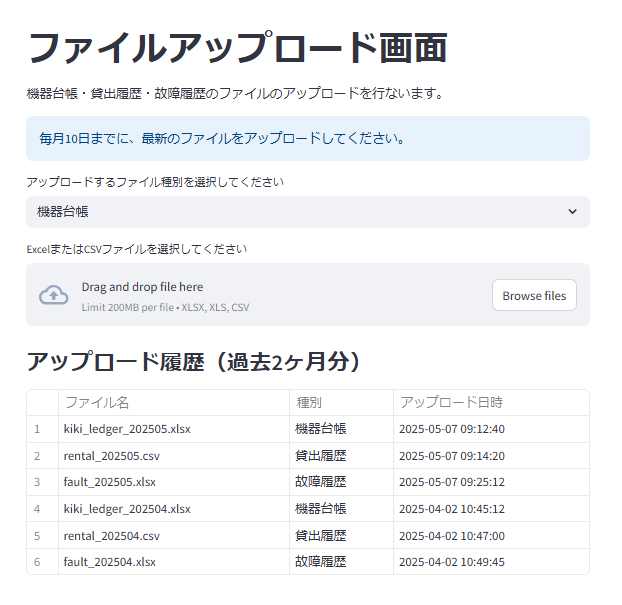

# プログラム仕様書（画面仕様書）

## 1. 画面名称

ファイルアップロード画面

## 2. 機能概要

この画面では、医療機関担当者が「機器台帳」「貸出履歴」「故障履歴」のExcelまたはCSVファイルをアップロードします。
また、過去2ヶ月分のアップロード履歴（ファイル名・種別・アップロード日時）を確認できます。

## 3. 対象ユーザー

- ユーザー区分：医療機関の担当者（ファイル提出者）

## 4. 利用目的（業務的な背景）

- 医療機器の運用管理・保守履歴・貸出状況の最新情報を定期的に収集するため
- 毎月10日までにアップロードを促すことで、情報のタイムリーな管理を実現
- ファイル提出の履歴を可視化し、提出忘れや二重提出などの防止に役立てる

<div style="page-break-before: always;"></div>

## 5. 入出力仕様

### 5.1 入力項目（画面フォーム）

| 項目ID           | 表示名      | 型    | 必須  | 入力制約                   | 備考               |
| -------------- | -------- | ---- | --- | ---------------------- | ---------------- |
| file\_type     | アップロード種別 | 選択肢  | Yes | 「機器台帳」「貸出履歴」「故障履歴」から選択 |                  |
| uploaded\_file | ファイル     | ファイル | Yes | xlsx/xls/csvのみ         | 最大1ファイル、10MB以下推奨 |

### 5.2 出力項目（一覧表示）

| 項目ID         | 表示名      | 型   | 表示形式                  | 備考             |
| ------------ | -------- | --- | --------------------- | -------------- |
| file\_name   | ファイル名    | 文字列 | 通常文字                  | アップロードされたファイル名 |
| file\_type   | 種別       | 文字列 | 通常文字                  | アップロード種別       |
| upload\_time | アップロード日時 | 日時  | yyyy-mm-dd hh\:mm\:ss | アップロード時刻       |

<div style="page-break-before: always;"></div>

## 6. 処理概要（IPO形式）

### 入力（Input）

- ユーザーによるファイル種別選択（必須）
- ファイル選択・アップロード（xlsx, xls, csv）
  - ドロップによるファイル選択が出来ない場合は、一般的なパスを選択してアップロードを行なう方式でも可
- データ保存履歴テーブルの最新6件を取得して表示

### 処理（Process）

- 入力ファイルの拡張子チェック（xlsx/xls/csvのみ許可）
- ファイルアップロードが成功した場合、データ保存履歴にレコードを追加
- データ保存履歴テーブルの最新6件を取得して画面を再表示
- フォーム未入力や不正ファイルの場合はエラーメッセージ表示

### 出力（Output）

- 過去2ヶ月分（直近3件）のアップロード履歴を想定して6件分を表形式で表示（1スタートのインデックス付き）

## 7. 画面操作・遷移フロー

| ユーザー操作      | アクション概要               | 遷移先／処理内容                |
| ----------- | --------------------- | ----------------------- |
| ファイル種別を選択する | ドロップダウンから種別を選択        | 種別が選択状態になる              |
| ファイルを選択する   | ファイルアップローダーからファイルを選択  | ファイル名がフォームに表示される        |
| ファイルアップロード  | ファイルを選択すると即座にアップロード処理 | 新しい履歴が表の先頭に追加、成功メッセージ表示 |

<div style="page-break-before: always;"></div>

## 8. サンプルデータ

### 8.1 JSON形式

```json
[
  {
    "file_name": "kiki_ledger_202505.xlsx",
    "file_type": "機器台帳",
    "upload_time": "2025-05-07 09:12:40"
  },
  {
    "file_name": "rental_202505.csv",
    "file_type": "貸出履歴",
    "upload_time": "2025-05-07 09:14:20"
  },
  {
    "file_name": "fault_202505.xlsx",
    "file_type": "故障履歴",
    "upload_time": "2025-05-07 09:25:12"
  }
]
```

### 8.2 Python辞書形式

```python
sample_history = [
    {"file_name": "kiki_ledger_202505.xlsx", "file_type": "機器台帳", "upload_time": "2025-05-07 09:12:40"},
    {"file_name": "rental_202505.csv", "file_type": "貸出履歴", "upload_time": "2025-05-07 09:14:20"},
    {"file_name": "fault_202505.xlsx", "file_type": "故障履歴", "upload_time": "2025-05-07 09:25:12"},
]
```

<div style="page-break-before: always;"></div>

## 9. 画面イメージ（モック）

<div style="border:1px solid #888; padding:8px; border-radius:6px; display:inline-block;">
  
</div>

<div style="page-break-before: always;"></div>

## 10. バリデーションルール（詳細）

| 項目ID           | チェック内容               | エラー時メッセージ例                      |
| -------------- | -------------------- | ------------------------------- |
| file\_type     | 選択必須                 | 「アップロード種別を選択してください」             |
| uploaded\_file | ファイル選択必須             | 「アップロードするファイルを選択してください」         |
| uploaded\_file | 拡張子がxlsx/xls/csvかを確認 | 「ファイル形式が無効です（xlsx, xls, csvのみ）」 |

## 11. 備考・特記事項

- 本画面はPoC版（Streamlit）として実装
- 履歴はセッション中のみ保存（本番ではDB連携を想定）
- 1ファイル最大10MBを推奨（実装時のファイルサイズ制限に注意）
- ファイル内容の詳細表示やダウンロード機能は実装しない
- 今後API連携・ユーザー識別機能の追加を検討

## 12. テスト観点一覧（簡易）

| No. | テスト内容             | 入力値                       | 期待結果                 |
| --- | ----------------- | ------------------------- | -------------------- |
| T01 | 機器台帳ファイルの正常アップロード | kiki\_ledger\_202505.xlsx | 履歴の先頭に新規追加、メッセージ表示   |
| T02 | 拡張子不正ファイルアップロード   | sample.txt                | エラー「ファイル形式が無効」       |
| T03 | ファイル未選択           | なし                        | エラー「ファイルを選択してください」   |
| T04 | 過去履歴が3件以上         | 4件目アップロード                 | 最新3件のみ表示、4件目は履歴から削除  |
| T05 | 過去2ヶ月分が全て正しく表示される | 履歴                        | 表のインデックスが1スタートで表示される |

以上
