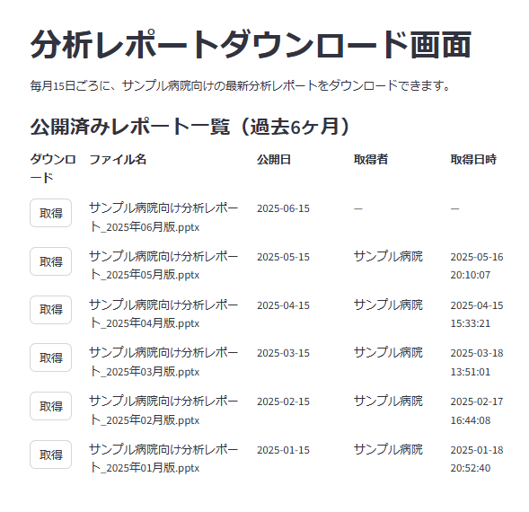

# プログラム仕様書（画面仕様書）

## 1. 画面名称

分析レポートダウンロード画面

## 2. 機能概要

この画面では、医療機関ユーザーが自組織向けに公開された「分析レポート」ファイルを、毎月15日ごろ以降にダウンロードできる。
過去6ヶ月分の公開ファイルの一覧が表示され、ファイル名、公開日、取得者、取得日時の情報を確認しながら、必要なレポートを取得できる。

## 3. 対象ユーザー

- ユーザー区分：医療機関の担当者（顧客・レポート取得者）

## 4. 利用目的（業務的な背景）

- 各医療機関向けに毎月作成・公開される分析レポートを、確実かつ適切なタイミングで配布するため
- ユーザーごとのダウンロード状況を把握し、取得漏れや再取得対応にも備える
- 公開日やダウンロード日時を明示し、利用者自身による管理・確認を容易にする

## 5. 入出力仕様

### 5.1 入力項目（画面フォーム）

| 項目ID          | 表示名   | 型   | 必須  | 入力制約      | 備考           |
| ------------- | ----- | --- | --- | --------- | ------------ |
| download\_btn | 取得ボタン | ボタン | Yes | 1レコード1ボタン | 押下で取得処理＋履歴記録 |

### 5.2 出力項目（一覧表示）

| 項目ID           | 表示名   | 型   | 表示形式                  | 備考                                |
| -------------- | ----- | --- | --------------------- | --------------------------------- |
| file\_name     | ファイル名 | 文字列 | 通常文字 | レポート公開履歴のファイル名 |
| upload_datetime | 公開日   | 日付  | yyyy-mm-dd | レポート公開履歴の更新日（日付のみ） |
| download_user_name | 取得者 | 文字列 | 通常文字 | レポート公開履歴の取得者をキーに顧客マスタを取得<br>未取得は「-」 |
| download\_datetime | 取得日時  | 日時  | yyyy-mm-dd HH\:MM\:SS | レポート公開履歴の取得日<br>未取得は「—」 |

## 6. 処理概要（IPO形式）

### 入力（Input）

- ユーザーは各レポート行の「取得」ボタンを押すことで、そのファイルの取得処理を実行
- 取得ボタンは常に押下可能で、ダウンロード済みかどうかに関わらずいつでも再取得可能

### 処理（Process）

- ボタン押下で、対象ファイルをローカルにダウンロード実行
- ダウンロード実行者（ログインユーザー）と取得日時をレポート公開履歴に更新
  - 再取得時は、既存の取得日時を上書き
- 画面の公開済みレポート一覧を再描画し、最新の取得状況を反映

### 出力（Output）

- 「ダウンロード」または「取得」ボタン、ファイル名、公開日、取得者、取得日時を横並びで表形式表示

## 7. 画面操作・遷移フロー

| ユーザー操作     | アクション概要             | 遷移先／処理内容                   |
| ---------- | ------------------- | -------------------------- |
| 取得ボタンクリック  | 対象レポートの取得処理＋取得日時を記録 | 取得日時が記録され画面再描画             |
| 画面再表示・リロード | 履歴・取得状況の保持          | レポート公開履歴の最新情報を取得して表示 |

## 8. サンプルデータ

### 8.1 JSON形式

```json
[
  {
    "file_name": "サンプル病院向け分析レポート_2025年05月版.pptx",
    "publish_date": "2025-05-15",
    "customer": "サンプル病院",
    "download_date": "2025-05-16 15:04:32"
  },
  {
    "file_name": "サンプル病院向け分析レポート_2025年04月版.pptx",
    "publish_date": "2025-04-15",
    "customer": "サンプル病院",
    "download_date": "2025-04-18 10:34:28"
  }
]
```

### 8.2 Python辞書形式

```python
sample_reports = [
    {
        "file_name": "サンプル病院向け分析レポート_2025年05月版.pptx",
        "publish_date": "2025-05-15",
        "customer": "サンプル病院",
        "download_date": "2025-05-16 15:04:32"
    },
    {
        "file_name": "サンプル病院向け分析レポート_2025年04月版.pptx",
        "publish_date": "2025-04-15",
        "customer": "サンプル病院",
        "download_date": "2025-04-18 10:34:28"
    }
]
```

## 9. 画面イメージ（モック）

<div style="border:1px solid #888; padding:8px; border-radius:6px; display:inline-block;">
  
</div>

## 10. バリデーションルール（詳細）

| 項目ID          | チェック内容    | エラー時メッセージ例        |
| ------------- | --------- | ----------------- |
| download\_btn | 取得ボタン押下可否 | 常時押下可能（バリデーション不要） |

## 11. 備考・特記事項

- 履歴はセッション中のみ保存（本番ではDB連携を想定）
- 取得日時は、公開日から5日以内の9:00〜21:00の範囲でランダム生成
- ダウンロード済みでも再取得可能
- 直近分は取得者・取得日時が「—」表示となる
- 本画面はPoC用途としてStreamlitベースで先行開発

## 12. テスト観点一覧（簡易）

| No. | テスト内容              | 入力値    | 期待結果               |
| --- | ------------------ | ------ | ------------------ |
| T01 | 取得ボタン押下（未取得）       | 最新レポート | 「-」が表示される     |
| T02 | 取得ボタン押下（既取得）       | 過去レポート | 取得日時が上書き更新される      |
| T03 | 履歴保持               | 画面再表示  | 各ファイルの取得日時が維持されている |
| T04 | 直近分のみ取得者・取得日時が「—」  |        | 直近分の列が「—」で表示される    |

以上
