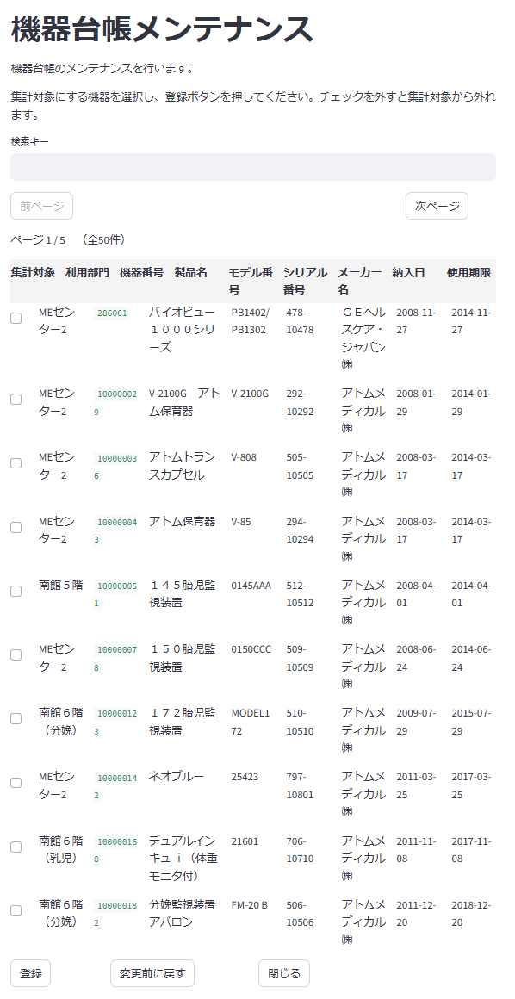

# プログラム仕様書（画面仕様書）

## 1. 画面名称

機器台帳メンテナンス

## 2. 機能概要

この画面では、あらかじめ提供した機器台帳情報から、集計対象から外す機器を選択・登録を行ないます。
集計対象外の機器を選択することで、集計結果をより正確にすることができます。

## 3. 対象ユーザー

- ユーザー区分：医療機関の担当者（顧客・レポート取得者）

## 4. 利用目的（業務的な背景）

- 分析内容をより正確にするための、不要な分母の除外
- 機器台帳側で削除出来ない情報を集計対象から外すためのメンテナンス
  - 機器台帳側で調整可能であれば、この画面でのメンテナンスは不要

<div style="page-break-before: always;"></div>

## 5. 入出力仕様

### 5.1 入力項目（一覧フォーム）

| 項目ID | 表示名 | 型 | 必須 | 入力制約 | 備考 |
|:--|:--|:--|:--|:---|:--|
| 検索キー | 検索キー | テキストボックス | No | 文字列 | 検索条件を入力 |
| 現在ページ数 | 現在ページ数 | ラベル | | 1以上の整数 | 例：1 |
| 総ページ数 | 総ページ数 | ラベル | | | データ件数 ÷ 1画面の表示数　（端数があれば+1） |
| tbl_hospital_me_list | 機器台帳一覧 | テーブル | | | 機器台帳情報を表示 |
| 次ページ | 次ページ | ボタン | | | 次のページのデータを表示 |
| 前ページ | 前ページ | ボタン | | | 前のページのデータを表示 |
| 登録 | 更新 | ボタン | | | 機器台帳情報の更新を行う |
| 変更前に戻す | 変更前に戻す | ボタン | | | 機器台帳情報の変更を取り消す |
| 閉じる | 閉じる | ボタン | | | 画面を閉じる |

機器台帳情報テーブルの列項目

| 項目ID | 表示名 | 型 | 必須 | 入力制約 | 備考 |
|:--|:--|:--|:--|:---|:--|
| is_used_in_analysis | 集計対象 | チェックボックス | No   | | external_data_usageの値をセット |
| grp_user | 利用部門 | ラベル | | | tbl_hospital_me_list.grp_userの値をセット |
| me_number | 機器番号 | ラベル | | | tbl_hospital_me_list.me_numberの値をセット |
| product_name | 製品名 | ラベル | | | tbl_hospital_me_list.product_nameの値をセット |
| model_number | モデル番号 | ラベル | | | tbl_hospital_me_list.model_numberの値をセット |
| serial_number | シリアル番号 | ラベル | | | tbl_hospital_me_list.serial_numberの値をセット |
| maker_name | メーカー名 | ラベル | | | tbl_hospital_me_list.maker_nameの値をセット |
| date_stocked | 納入日 | ラベル | | | tbl_hospital_me_list.date_stockedの値をセット |
| date_expiration | 使用期限 | ラベル | | | tbl_hospital_me_list.date_expirationの値をセット |

### 5.2 出力項目

- なし

<div style="page-break-before: always;"></div>

## 6. 処理概要（IPO形式）

### 入力（Input）

- 機器台帳一覧の初期表示:
  - 機器台帳情報の対象病院のデータが表示対象、表示列順のソート
  - 機器台帳情報と紐付く集計対象機器を取得し、集計対象として利用するかの項目からチェックボックスを反映
- 検索キー:
  - 利用部門、機器番号、製品名、モデル番号、シリアル番号、メーカー名を検索しマッチするものを表示
  - 検索ボタンが必要なら追加しても可
  - 項目別にフィルターを付ける等の対応も可

### 処理（Process）

- チェックボックスがオンの場合は、**external_data_usage** の **is_used_in_analysis** を **true** に設定
- チェックボックスがオフの場合は、**external_data_usage** の **is_used_in_analysis** を **false** に設定
- 機器台帳情報の更新:
  - チェックボックスの状態に応じて、**external_data_usage** の **is_used_in_analysis** を更新
- 機器台帳情報の更新後、成功メッセージを表示
- 機器台帳情報の更新に失敗した場合は、エラーメッセージを表示

### 出力（Output）

- 機器台帳一覧の初期表示を再実行

## 7. 画面操作・遷移フロー

| ユーザー操作           | アクション概要              | 遷移先／処理内容                      |
|------------------------|--------------------------|--------------------------------------|
| **登録** ボタンクリック | 1. 「登録します。よろしいですか？」の確認ダイアログを表示。<br>2. ユーザーが「はい」を選択した場合、更新処理を実行。 | 1. 検索項目を空欄にして、カーソルを **検索キー** にフォーカス |
| **閉じる** ボタンクリック | 1.変更前の医療機関情報がラベル項目にセットされ、変更後ランク数が変更前と異なる場合は、「変更内容を保存せずに閉じます。よろしいですか？」の確認ダイアログを表示。<br>2. ユーザーが「はい」を選択した場合、画面を閉じる。 | 画面を閉じる |
| **次ページ** ボタンクリック | 次のページのデータを表示 | 機器台帳一覧の表示を更新 |
| **前ページ** ボタンクリック | 前のページのデータを表示 | 機器台帳一覧の表示を更新 |
| **変更前に戻す** ボタンクリック | 変更前の医療機関情報をラベル項目にセットし、変更後ランク数を変更前と同じ値に戻す | 機器台帳一覧の表示を更新 |
| **検索キー** 入力 | 検索キーに入力された値に基づいて、機器台帳情報をフィルタリング | 機器台帳一覧の表示を更新 |

## 8. サンプルデータ

### 8.1 JSON形式

```json
  [
    {
      "hospital_id": 3,
      "hospital_seq": 472,
      "me_number": "0000286061",
      "grp_user": "MEセンター2",
      "serial_number": "478-10478",
      "date_purchase": "2008-11-27",
      "product_name": "バイオビュー１０００シリーズ",
      "model_number": "PB1402/PB1302",
      "maker_name": "ＧＥヘルスケア・ジャパン㈱",
      "date_expiration": "2014-11-27",
      "is_used_in_analysis": true
    },
    {
      "hospital_id": 3,
      "hospital_seq": 291,
      "me_number": "0100000029",
      "grp_user": "MEセンター2",
      "serial_number": "292-10292",
      "date_purchase": "2008-01-29",
      "product_name": "V-2100G　アトム保育器",
      "model_number": "V-2100G",
      "maker_name": "アトムメディカル㈱",
      "date_expiration": "2014-01-29",
      "is_used_in_analysis": false
    }
  ]
```

### 8.2 処理結果

```python
sample_data = [
    {
        "hospital_id": 3,
        "hospital_seq": 472,
        "me_number": "0000286061",
        "grp_user": "MEセンター2",
        "serial_number": "478-10478",
        "date_purchase": "2008-11-27",
        "product_name": "バイオビュー１０００シリーズ",
        "model_number": "PB1402/PB1302",
        "maker_name": "ＧＥヘルスケア・ジャパン㈱",
        "date_expiration": "2014-11-27",
        "is_used_in_analysis": false　　<-- 変更前と逆転
    },
    {
        "hospital_id": 3,
        "hospital_seq": 291,
        "me_number": "0100000029",
        "grp_user": "MEセンター2",
        "serial_number": "292-10292",
        "date_purchase": "2008-01-29",
        "product_name": "V-2100G　アトム保育器",
        "model_number": "V-2100G",
        "maker_name": "アトムメディカル㈱",
        "date_expiration": "2014-01-29",
        "is_used_in_analysis": true　　<-- 変更前と逆転
    }
]
```

<div style="page-break-before: always;"></div>

## 9. 画面イメージ（モック）

<div style="border:1px solid #888; padding:8px; border-radius:6px; display:inline-block;">
  
</div>

## 10. バリデーションルール（詳細）

- なし

## 11. 備考・特記事項

- 今後API連携予定あり（現時点ではサンプルデータ使用）
- 本画面はPoC版（kintone or Streamlit）で先行開発
- 本番ではTypeScript+Node.jsベースの再実装を想定

## 12. テスト観点一覧（簡易）

| No. | テスト内容                            | 入力値               | 期待結果                             |
|-----|---------------------------------------|----------------------|--------------------------------------|
| T01 | 集計対象 | チェックボックスをOn | `is_used_in_analysis`が`true`に更新される |
| T02 | 集計対象 | チェックボックスをOff | `is_used_in_analysis`が`false`に更新される |
| T03 | 検索キー入力 | "MEセンター2" | 検索結果に"MEセンター2"が含まれる |

以上
