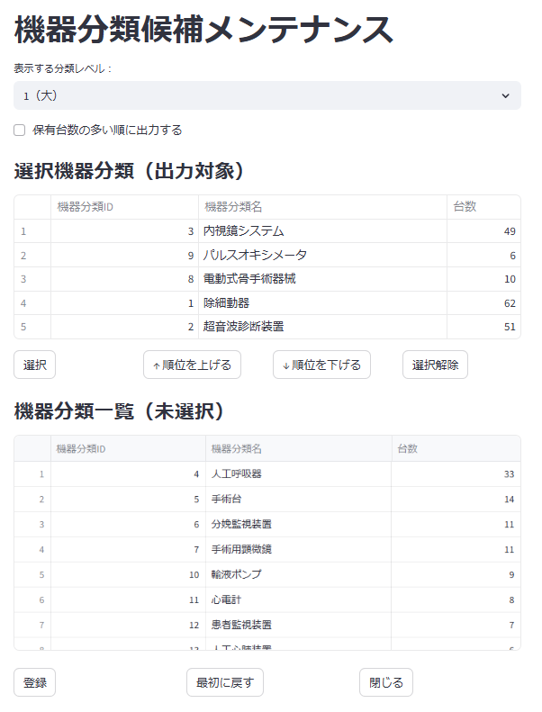

# プログラム仕様書（画面仕様書）

## 1. 画面名称

機器分類候補メンテナンス

## 2. 機能概要

この画面では、レポートの出力対象となる機器分類の候補を選択することができます。

## 3. 対象ユーザー

- 医療機関ユーザー（レポート管理者）

## 4. 利用目的（業務的な背景）

- 特定の機器分類をレポートで検証する

## 5. 入出力仕様

### 5.1 入力項目（画面フォーム）

| 項目ID       | 表示名       | 型       | 必須 | 入力制約           | 備考             |
|--------------|--------------|----------|------|--------------------|------------------|
| **level** | レベル | セレクタ | Yes | 1（大）/2（中）/3（小） | 対象病院に存在するレベルのみ     |
| **is_select**  | 選択フラグ | チェックボックス | No | - | 標準仕様に従う場合はチェック<br>※標準では機器分類の保有台数の上位から出力 |
| 選択機器分類 | 選択された機器分類 | リスト | Yes | - | 順位/id/機器分類名/保有台数<br>順位は user_entitiy_link.rank_count の数 |
| 選択ボタン | 選択 | ボタン | No | - | 選択された機器分類を選択機器分類リストに追加する |
| 順位を上げるボタン | 順位を上げる | ボタン | No | - | 選択機器分類の順位を上げる |
| 順位を下げるボタン | 順位を下げる | ボタン | No | - | 選択機器分類の順位を下げる |
| 選択解除ボタン | 選択解除 | ボタン | No | - | 選択機器分類リストから外す |
| 機器分類 | 機器分類 | リスト | Yes | - | 機器分類の一覧を表示<br>※選択された機器分類は除外 |
| 登録ボタン | 登録 | ボタン | Yes | - | 選択された選択機器分類を登録する |
| 最初に戻るボタン | 最初に戻る | ボタン | No | - | 入力フォームを初期化する |
| 閉じるボタン | 閉じる | ボタン | No | - | 画面を閉じる |

### 5.2 出力項目（一覧表示）

#### 選択機器分類リスト

| 項目ID       | 表示名       | 型       | 表示形式       | 備考             |
|--------------|--------------|----------|----------------|------------------|
| 順位 | 順位 | 数字 | 通常文字 | min : 1<br>max : user_entitiy_link.rank_count |
| **classification_id** | id | 数値 | 通常文字 |                  |
| **classification_name** | 機器分類名 | 文字列 | 通常文字 |                   |
| **count** | 保有台数 | 数値 | 通常文字 | 対象の機器分類で保有している機器台数 |

#### 機器分類一覧

| 項目ID       | 表示名       | 型       | 表示形式       | 備考             |
|--------------|--------------|----------|----------------|------------------|
| **classification_id** | id | 数値 | 通常文字 |                  |
| **classification_name** | 機器分類名 | 文字列 | 通常文字 |                   |
| **count** | 保有台数 | 数値 | 通常文字 | 対象の機器分類で保有している機器台数 |

## 6. 処理概要（IPO形式）

### 入力（Input）

- 初期表示:
  - **equipment_classification_report_selection** テーブルから、対象病院の情報を取得し、選択機器分類リストに表示
    - 取得したレコードの **level** を元に、機器分類のレベルを設定
    - 対象レコードが存在しない場合は、機器分類レベルを **1（大）** に設定
  - **equipment_classification** テーブルから、機器分類の一覧を取得し、機器分類リストに表示
    - 取得したレコードの **level** を元に、機器分類のレベルが一致するもののみを表示
  - **選択機器分類リスト** に空きがあれば、**選択ボタン** を有効化
  - レコードの有無、件数に関係無く、リストは user_entitiy_link.rank_count の数を表示
  - レコードが存在しない場合、**is_select** チェックボックスを有効にしておく
- **level** セレクタ:
  - レベルを選択すると、機器分類リストが更新され、選択機器分類リストに表示されている機器分類は除外される
  - レベルを変更した場合は、**選択ボタン** を有効化、選択機器分類リストが存在しないので、**順位を上げるボタン** 、 **順位を下げるボタン** 及び **選択解除ボタン** を無効化
- **is_select** チェックボックス:
  - チェック時は、「機器保有台数が多い順に機器分類を出力します。よろしいですか？」の確認ダイアログを表示し、「はい」を選択した場合は、選択機器分類は全件削除し、表示されていた情報は、機器分類リストに表示する
    - 選択機器分類が存在しない場合は、**選択ボタン** 、 **順位を上げるボタン** 、 **順位を下げるボタン** 及び **選択解除ボタン**  を無効化
  - チェックを外した場合は、**選択ボタン**を有効化

### 処理（Process）

- **選択機器分類** にレコードが存在している場合
  - リストが全て登録されている場合は、「登録します、よろしいですか？」の確認ダイアログを表示し、「はい」を選択した場合、リストの内容を **equipment_classification_report_selection** テーブルに登録
  - 空きがある場合は、「選択数が上限に達していませんが、よろしいですか？」の確認ダイアログを表示し、「はい」を選択した場合、リストの内容を **equipment_classification_report_selection** テーブルに登録
- **選択機器分類** にレコードが存在していない場合
  - **is_select** チェックボックスがチェックされている場合は、「機器保有台数が多い順に機器分類を出力します。よろしいですか？」の確認ダイアログを表示し、「はい」を選択した場合、 **equipment_classification_report_selection** テーブルに登録されているレコード情報を削除します
- 登録が完了したら、「登録が完了しました」とメッセージを表示し、初期表示の処理を行なう

### 出力（Output）

- なし

## 7. 画面操作・遷移フロー

| ユーザー操作           | アクション概要                     | 遷移先／処理内容                      |
|------------------------|------------------------------------|--------------------------------------|
| レベル選択             | 機器分類リストを更新               | 選択機器分類リストに表示されている機器分類は除外 |
| is_selectチェックボックス | 機器分類リストを更新               | 機器分類リストに表示されている機器分類は除外<br>選択機器分類リストが空の場合は、選択ボタンを無効化 |
| 選択ボタンクリック     | 選択機器分類に追加 | 対象の機器分類を選択機器分類の空いている行に追加し、選機器分類リスト側を削除する |
| 選択解除ボタンクリック | 選択機器分類から削除 | 対象の機器分類を選択機器分類リストから削除し、機器分類リスト側に戻す |
| 順位を上げるボタンクリック | 選択機器分類の順位を上げる | 対象の選択機器分類の順位を1つ上げる（最小値は1） |
| 順位を下げるボタンクリック | 選択機器分類の順位を下げる | 対象の選択機器分類の順位を1つ下げる（最大値は user_entitiy_link.rank_count） |
| 登録ボタンクリック       | 選択機器分類を登録                   | 選択機器分類リストの内容を **equipment_classification_report_selection** テーブルに登録 |
| 最初に戻るボタンクリック     | 入力フォームを起動時に戻す | 入力フィールドの情報を再取得 |
| 閉じるボタンクリック     | 画面を閉じる                       | 画面を閉じる |

## 8. サンプルデータ

### 8.1 JSON形式

```json
[
  {
    "equipment_classification": {
      "classification_id": 1,
      "hospital_id": 5,
      "level": 1,
      "classification_name": "除細動器",
      "parent_id": null,
      "public_classification_id": null
    },
    "保有台数": 62
  },
  {
    "equipment_classification": {
      "classification_id": 2,
      "hospital_id": 5,
      "level": 1,
      "classification_name": "超音波診断装置",
      "parent_id": null,
      "public_classification_id": null
    },
    "保有台数": 51
  },
  {
    "equipment_classification": {
      "classification_id": 3,
      "hospital_id": 5,
      "level": 1,
      "classification_name": "内視鏡システム",
      "parent_id": null,
      "public_classification_id": null
    },
    "保有台数": 49
  },
  {
    "equipment_classification": {
      "classification_id": 4,
      "hospital_id": 5,
      "level": 1,
      "classification_name": "人工呼吸器",
      "parent_id": null,
      "public_classification_id": null
    },
    "保有台数": 33
  },
  {
    "equipment_classification": {
      "classification_id": 5,
      "hospital_id": 5,
      "level": 1,
      "classification_name": "手術台",
      "parent_id": null,
      "public_classification_id": null
    },
    "保有台数": 14
  },
  {
    "equipment_classification": {
      "classification_id": 6,
      "hospital_id": 5,
      "level": 1,
      "classification_name": "分娩監視装置",
      "parent_id": null,
      "public_classification_id": null
    },
    "保有台数": 11
  },
  {
    "equipment_classification": {
      "classification_id": 7,
      "hospital_id": 5,
      "level": 1,
      "classification_name": "手術用顕微鏡",
      "parent_id": null,
      "public_classification_id": null
    },
    "保有台数": 11
  },
  {
    "equipment_classification": {
      "classification_id": 8,
      "hospital_id": 5,
      "level": 1,
      "classification_name": "電動式骨手術器械",
      "parent_id": null,
      "public_classification_id": null
    },
    "保有台数": 10
  }
]
````

### 8.2 選択機器分類

```json
[
  { "equipment_classification_report_selection": {
      "hospital_id": 5,
      "classification_id": 3,
      "display_order": 1 } },
  { "equipment_classification_report_selection": {
      "hospital_id": 5,
      "classification_id": 5,
      "display_order": 2 } },
  { "equipment_classification_report_selection": {
      "hospital_id": 5,
      "classification_id": 1,
      "display_order": 3 } },
  { "equipment_classification_report_selection": {
      "hospital_id": 5,
      "classification_id": 7,
      "display_order": 4 } },
  { "equipment_classification_report_selection": {
      "hospital_id": 5,
      "classification_id": 2,
      "display_order": 5 }
  }
]
```

<div style="page-break-before: always;"></div>

## 9. 画面イメージ（モック）

<div style="border:1px solid #888; padding:8px; border-radius:6px; display:inline-block;">
  
</div>

## 10. バリデーションルール（詳細）

| 項目ID           | チェック内容    | エラー時メッセージ例              |
| -------------- | --------- | ----------------------- |
||||

## 11. 備考・特記事項

- 今後API連携予定あり（現時点ではサンプルデータ使用）
- 本画面はPoC版（kintone or Streamlit）で先行開発
- 本番ではTypeScript+Node.jsベースの再実装を想定

## 12. テスト観点一覧（簡易）

| No. | テスト内容                              | 入力値例                                              | 期待結果                                          |
| --- | ---------------------------------- | ------------------------------------------------- | --------------------------------------------- |
| T01 | 初期表示で、選択機器分類が存在しない場合の表示            | `equipment_classification_report_selection` に該当なし | level=1が初期選択され、is\_select=ON、選択リストは空で選択ボタンが無効 |
| T02 | 初期表示で、選択機器分類が存在する場合の表示             | 該当データあり                                           | 登録済みの選択機器分類がリスト表示され、levelはその分類の値、ボタンが有効       |
| T03 | レベル変更による機器分類リストの更新                 | level=2                                           | 指定レベルの機器分類のみ表示、選択済み分類は除外                      |
| T04 | is\_selectチェックON時の確認ダイアログ表示とリスト初期化 | チェックON→「はい」選択                                     | 選択機器分類がクリアされ、未選択分類として表示                       |
| T05 | is\_selectチェックOFF時の選択ボタン有効化        | チェックOFF                                           | 選択ボタンが有効化される                                  |
| T06 | 機器分類選択後に「選択」ボタン押下                  | 任意分類を選択                                           | 選択リストに追加され、元リストから除外                           |
| T07 | 「選択解除」ボタンで分類を戻す                    | 任意の選択分類                                           | 機器分類一覧に戻され、順位リストから削除                          |
| T08 | 順位を上げる／下げるボタンの動作（中間順位）             | 順位=3 の分類を対象                                       | 順位2⇔3⇔4の間で順位が正しく移動                            |
| T09 | 順位上限（1）で「順位を上げる」ボタン押下              | 順位=1                                              | 順位変更なし（またはボタン非活性）                             |
| T10 | 順位下限（最大値）で「順位を下げる」ボタン押下            | 順位=max                                            | 順位変更なし（またはボタン非活性）                             |
| T11 | 「登録」ボタン押下（5件未満）                    | 選択分類数=3                                           | 確認ダイアログ表示後、登録される                              |
| T12 | 「登録」ボタン押下（5件ちょうど）                  | 選択分類数=5                                           | 確認ダイアログ表示後、登録される                              |
| T13 | 「登録」ボタン押下（0件、is\_select=ON）        | 全件削除                                              | 「機器保有台数が多い順に出力しますか？」確認後、登録テーブル削除              |
| T14 | 「最初に戻る」ボタンでフォームが初期化される               | 任意操作後                                             | 全項目初期化（レベル=1, is\_select=OFF, リスト初期状態）        |
| T15 | 登録完了後、初期状態に戻る                      | すべて登録後                                            | 成功メッセージ表示、初期状態に戻る                             |

以上
