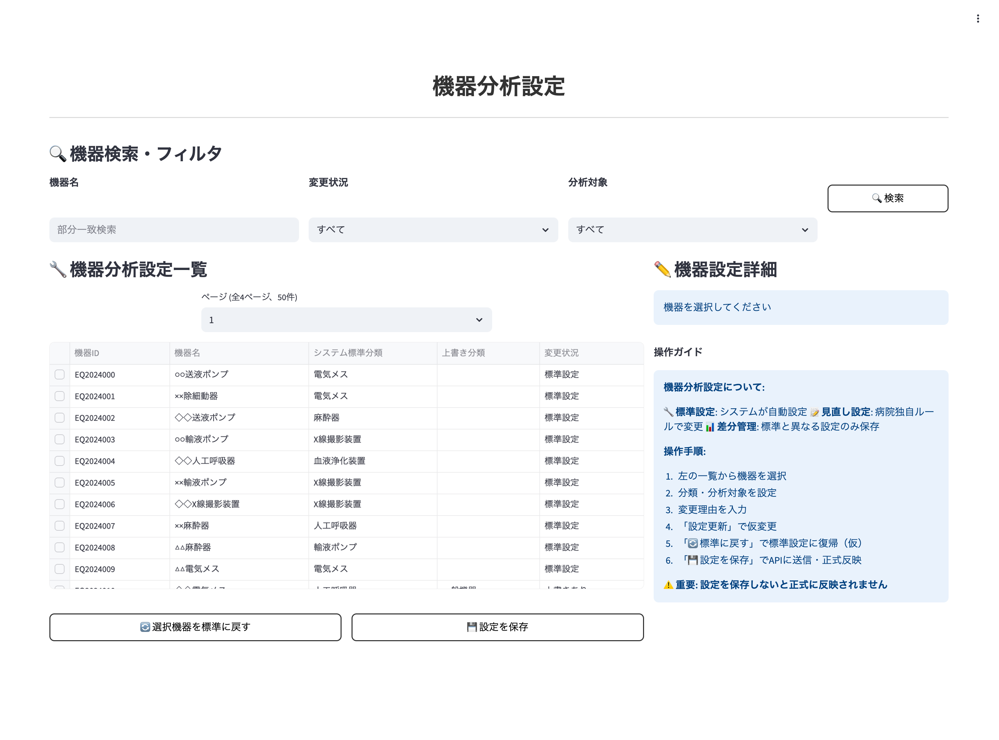
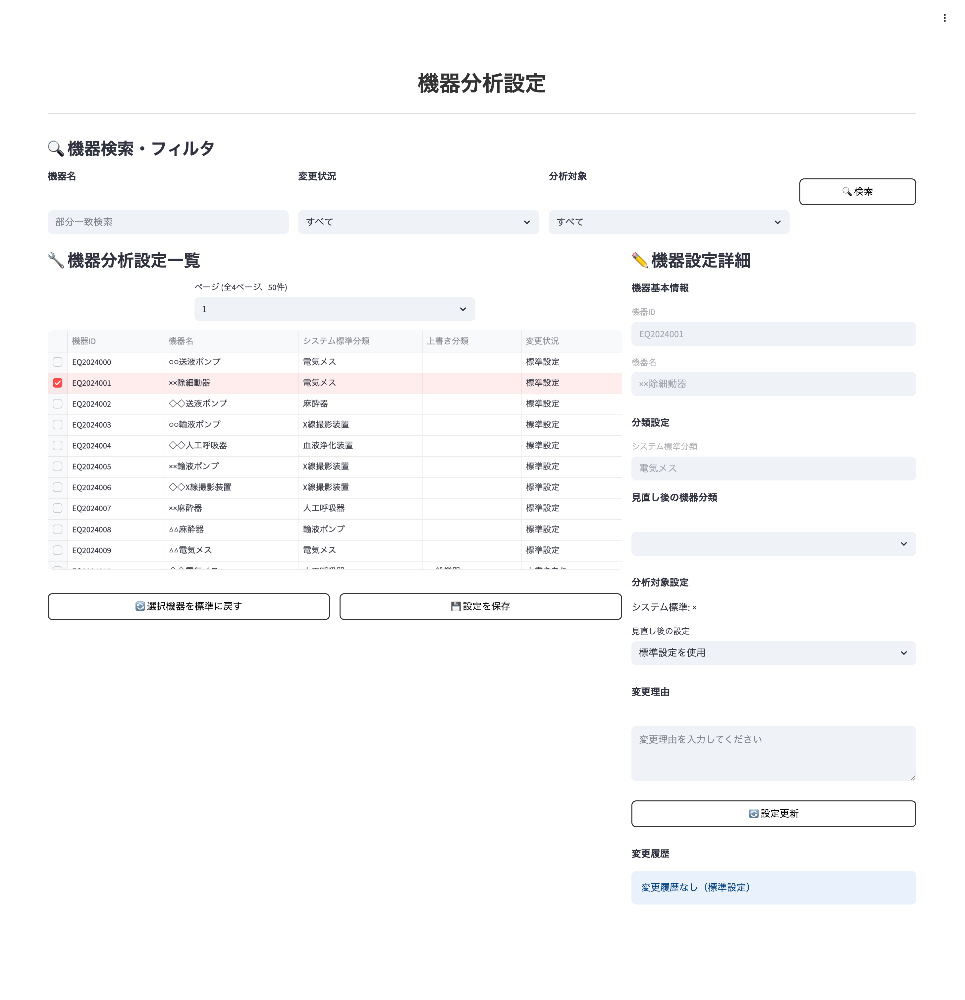

# 画面仕様書 / Screen Specification

- Revision

    | Rev | Date       | Auth       | Note    |
    |----:|------------|------------|---------|
    | 1.0 | 2025.08.25 | Claude     | 新規作成 |

## 1. 画面名称 / Screen Title

- 日本語: 機器分析設定画面
- English: Equipment Analysis Settings Screen

### 1-1. 機能ID / Functional Identifier

- 機能ID（日本語）: 機器分析設定管理
- Functional Name (English): equipment-analysis-settings
- 使用例（SPAルーティング）: `/equipment-analysis-settings` または `/medical-equipment/analysis-settings`

## 2. 機能概要 / Function Overview

[Japanese]

医療機器台帳のデフォルト設定に対する医療機関別の上書き設定を管理する画面です。機器ごとの分析対象フラグと分類上書き設定を管理し、デフォルト値と異なる設定のみを保存する差分管理システムを採用しています。各設定には変更履歴が記録され、変更理由と実施者を追跡可能です。

**主な機能**:
- システム標準の機器分類に対する医療機関独自ルールでの分類上書き設定
- 機器ごとの分析対象フラグの上書き設定
- デフォルト値との差分管理による効率的なストレージ利用
- 変更履歴の記録と追跡
- 一括および単一設定のデフォルト復帰機能

[English]

This screen manages medical facility-specific override settings for default settings in the medical equipment ledger. It manages analysis target flags and classification override settings for each equipment, using a differential management system that saves only settings different from default values. Each setting records change history for tracking reasons and implementers.

**Main Features**:
- Override medical facility-specific classification rules against system standard equipment classifications
- Override analysis target flag settings for each equipment
- Efficient storage usage through differential management with default values
- Recording and tracking of change history
- Bulk and single setting restoration to default functionality

## 3. 画面利用対象ユーザー / Target Users

- システム管理者 (user_id: "900001"-"999999"): 全医療機関の機器分析設定へのアクセス・管理可能
- 医療機関ユーザー (entity_type=1): 自医療機関の機器分析設定のみアクセス・管理可能

## 4. 運用概要 / Operational Usage

[Japanese]

システム標準の機器分類では適切な分析結果が得られない場合や、医療機関独自の運用ルールがある場合に、この画面で分類上書きや分析対象設定の変更を行います。

**典型的な運用シナリオ**:
1. **分類上書き**: 「人工呼吸器」として分類されている機器を、院内ルールにより「呼吸器」分類に変更
2. **分析対象除外**: 重要機器のため、通常の分析対象から除外したい場合
3. **設定の一括復帰**: システム更新時にデフォルト設定に戻したい場合

変更時には必ず理由を記録し、後からの追跡調査が可能です。デフォルト値と同じ設定は自動的に削除され、効率的なデータ管理を実現します。

[English]

When system standard equipment classifications do not provide appropriate analysis results, or when medical facilities have their own operational rules, this screen is used to change classification overrides and analysis target settings.

**Typical Operational Scenarios**:
1. **Classification Override**: Change equipment classified as "ventilator" to "respiratory equipment" classification according to facility rules
2. **Analysis Target Exclusion**: Exclude important equipment from regular analysis targets
3. **Bulk Setting Restoration**: Restore to default settings during system updates

Reasons must be recorded for all changes, enabling future tracking investigations. Settings identical to default values are automatically deleted, achieving efficient data management.

## 5. 処理の流れ / Processing Flow

[Japanese]

1. **機器分析設定一覧取得**
   - `GET /api/v1/medical-equipment-analysis-settings` でデータ取得
   - 認証ヘッダー `X-User-Id` が必須
   - skip/limitによるページング（デフォルト100件、最大1000件）
   - classification_idでのフィルタリング可能
   - システム管理者: 全医療機関データ、医療機関ユーザー: 自医療機関データのみ

2. **設定項目表示**
   - 機器台帳情報（型番、製品名、メーカー名等）
   - デフォルト設定（分析対象フラグ、分類ID）
   - 有効設定（実際に適用される値）
   - 上書き設定（設定されている場合）
   - 変更履歴（JSON形式で保存された履歴）

3. **分析対象フラグ上書き**
   - 対象機器の行を選択し、分析対象フラグを変更
   - 変更理由（note）を必須入力
   - `PUT /api/v1/medical-equipment-analysis-settings/{ledger_id}/analysis-target` で更新
   - デフォルト値と同じ値は設定不可（エラー表示）

4. **分類上書き**
   - 対象機器の行を選択し、分類IDを変更
   - 分類選択はドロップダウンまたは検索機能付きセレクト
   - 変更理由（note）を必須入力
   - `PUT /api/v1/medical-equipment-analysis-settings/{ledger_id}/classification` で更新

5. **デフォルト復帰処理**
   - 単一設定復帰: `DELETE /api/v1/medical-equipment-analysis-settings/{ledger_id}`
   - 全設定復帰: `DELETE /api/v1/medical-equipment-analysis-settings?medical_id={id}`
   - 復帰処理前に確認ダイアログを表示

[English]

1. **Retrieve Equipment Analysis Settings List**
   - Retrieve data via `GET /api/v1/medical-equipment-analysis-settings`
   - Authentication header `X-User-Id` is required
   - Pagination with skip/limit (default 100 records, max 1000)
   - Filtering by classification_id available
   - System administrators: All medical facility data, Medical facility users: Own facility data only

2. **Display Setting Items**
   - Equipment ledger information (model number, product name, manufacturer, etc.)
   - Default settings (analysis target flag, classification ID)
   - Effective settings (actually applied values)
   - Override settings (if configured)
   - Change history (history saved in JSON format)

3. **Analysis Target Flag Override**
   - Select target equipment row and change analysis target flag
   - Change reason (note) is required input
   - Update via `PUT /api/v1/medical-equipment-analysis-settings/{ledger_id}/analysis-target`
   - Setting same value as default is not allowed (error display)

4. **Classification Override**
   - Select target equipment row and change classification ID
   - Classification selection via dropdown or searchable select
   - Change reason (note) is required input
   - Update via `PUT /api/v1/medical-equipment-analysis-settings/{ledger_id}/classification`

5. **Default Restoration Processing**
   - Single setting restoration: `DELETE /api/v1/medical-equipment-analysis-settings/{ledger_id}`
   - All settings restoration: `DELETE /api/v1/medical-equipment-analysis-settings?medical_id={id}`
   - Display confirmation dialog before restoration processing

## 6. 入出力仕様 / Input/Output Specifications

### 6.1 一覧表示項目 / List Display Fields

| 項目名 | フィールド名 | 表示内容 | ソート可否 |
|--------|--------------|----------|------------|
| 機器台帳ID | ledger_id | 数値表示 | ○ |
| 型番 | model_number | 文字列表示 | ○ |
| 製品名 | product_name | 文字列表示 | ○ |
| メーカー名 | maker_name | 文字列表示 | ○ |
| 在庫数 | stock_quantity | 数値表示 | ○ |
| デフォルト分析対象 | default_is_included | true/false表示（○/×） | ○ |
| 有効分析対象 | effective_is_included | true/false表示（○/×） | ○ |
| デフォルト分類 | default_classification_id | 分類名表示 | - |
| 有効分類 | effective_classification_id | 分類名表示 | - |
| 上書き状態 | has_override | true/false表示（上書きあり/なし） | ○ |
| 最終更新日時 | last_modified | YYYY-MM-DD HH:mm形式 | ○ |

### 6.2 編集フォーム項目 / Edit Form Fields

| 項目名 | フィールド名 | 入力形式 | バリデーション |
|--------|--------------|----------|----------------|
| 分析対象上書き | override_is_included | チェックボックス | デフォルト値と同じは不可 |
| 分類上書き | override_classification_id | セレクトボックス | 存在する分類IDのみ |
| 変更理由 | note | テキストエリア | 必須、最大500文字 |

### 6.3 検索・フィルタ項目 / Search and Filter Fields

| 項目名 | フィールド名 | 入力形式 | 説明 |
|--------|--------------|----------|------|
| 分類ID | classification_id | セレクトボックス | 指定分類でフィルタ |
| 型番検索 | model_number | テキスト入力 | 部分一致検索 |
| 製品名検索 | product_name | テキスト入力 | 部分一致検索 |
| 上書き状態 | has_override | セレクトボックス | 上書きあり/なしでフィルタ |

## 7. バリデーション仕様 / Validation Rules

[Japanese]

### 7.1 分析対象フラグ上書き
- デフォルト値と同じ値は設定不可（400エラー）
- 変更理由（note）は必須入力
- noteは最大500文字以内

### 7.2 分類上書き
- 指定した分類IDが存在すること
- デフォルト値と同じ分類IDは設定不可（400エラー）
- 変更理由（note）は必須入力
- noteは最大500文字以内

### 7.3 検索・フィルタ
- ページング: skip >= 0, limit <= 1000
- 分類IDは数値のみ
- 検索文字列は最大100文字以内

[English]

### 7.1 Analysis Target Flag Override
- Cannot set same value as default (400 error)
- Change reason (note) is required input
- Note must be within 500 characters

### 7.2 Classification Override
- Specified classification ID must exist
- Cannot set same classification ID as default (400 error)
- Change reason (note) is required input
- Note must be within 500 characters

### 7.3 Search and Filter
- Pagination: skip >= 0, limit <= 1000
- Classification ID must be numeric only
- Search strings must be within 100 characters

## 8. API連携仕様 / API Integration

### 8.1 `GET /api/v1/medical-equipment-analysis-settings`

**認証**: `X-User-Id` ヘッダー必須
**権限**: システム管理者（全データ）、医療機関ユーザー（自医療機関のみ）
**パラメータ**:
- medical_id: 医療機関ID（省略時は認証ユーザーの医療機関）
- classification_id: 分類IDでフィルタ
- skip: スキップ件数（デフォルト: 0）
- limit: 取得件数（デフォルト: 100、最大: 1000）

### 8.2 `PUT /api/v1/medical-equipment-analysis-settings/{ledger_id}/analysis-target`

**認証**: `X-User-Id` ヘッダー必須
**リクエストボディ**:
```json
{
  "override_is_included": false,
  "note": "重要機器のため分析対象から除外"
}
```

### 8.3 `PUT /api/v1/medical-equipment-analysis-settings/{ledger_id}/classification`

**認証**: `X-User-Id` ヘッダー必須
**リクエストボディ**:
```json
{
  "override_classification_id": 456,
  "note": "院内ルールにより呼吸器分類に変更"
}
```

### 8.4 `DELETE /api/v1/medical-equipment-analysis-settings/{ledger_id}`

**認証**: `X-User-Id` ヘッダー必須
**機能**: 単一設定をデフォルトに復帰

### 8.5 `DELETE /api/v1/medical-equipment-analysis-settings`

**認証**: `X-User-Id` ヘッダー必須
**パラメータ**: medical_id（医療機関ID）
**機能**: 全設定をデフォルトに復帰

## 9. 画面遷移 / Screen Navigation

| 操作 | 説明 | 遷移先 |
|------|------|--------|
| 前へ | 前ページ表示 | 同画面（ページング） |
| 次へ | 次ページ表示 | 同画面（ページング） |
| 編集 | 設定変更フォーム表示 | 同画面（編集モード） |
| 保存 | 設定変更の保存 | 同画面（一覧表示） |
| キャンセル | 編集のキャンセル | 同画面（一覧表示） |
| デフォルト復帰 | 設定をデフォルトに戻す | 同画面（確認ダイアログ経由） |
| 全復帰 | 全設定をデフォルトに戻す | 同画面（確認ダイアログ経由） |

### 9.1 画面レイアウト構成 / Screen Layout Configuration

#### 9.1.1 画面全体表示



画面は以下の主要エリアで構成されています：

- **ヘッダー部**: 画面タイトル「機器分析設定」
- **検索・フィルタ部**: 機器名・変更状況・分析対象による絞り込み機能
- **機器分析設定一覧部**: 機器の一覧表示とページング機能
- **機器設定詳細部**: 選択された機器の詳細設定エリア（右側パネル）

#### 9.1.2 機器選択・編集表示



機器を選択すると右側パネルに以下の項目が表示されます：

- **機器基本情報**: 機器ID・機器名の表示
- **分類設定**: システム標準分類と見直し後の分類の設定
- **分析対象設定**: システム標準設定と見直し後の設定の選択
- **変更理由**: 設定変更時の理由入力エリア（テキストエリア）
- **操作ボタン**: 「設定更新」「変更履歴なし（標準設定）」

#### 9.1.3 主要な操作フロー

1. **機器検索・フィルタ**: 上部の検索フィールドで機器を絞り込み
2. **機器選択**: 一覧から機器をクリック選択（チェックボックス）
3. **設定変更**: 右側パネルで分類や分析対象フラグを変更
4. **変更理由入力**: 設定変更時は変更理由を必須入力
5. **設定保存**: 「設定更新」ボタンで変更を保存
6. **一括操作**: 「選択機器を標準に戻す」で複数機器の一括リセット

## 10. PoC制約事項 / Limitations for PoC Version

[Japanese]

- 変更履歴の詳細表示機能は簡易版（JSON表示のみ）
- 一括編集機能は未実装
- 分類階層の可視化機能は未実装
- エクスポート/インポート機能は未実装
- 変更通知機能は未実装

[English]

- Change history detailed display function is simplified (JSON display only)
- Bulk editing functionality is not implemented
- Classification hierarchy visualization is not implemented
- Export/import functionality is not implemented
- Change notification functionality is not implemented

## 11. フロントエンド開発者向け補足 / Notes for Frontend Developer

この画面は、Next.js等のフロントエンドSPAがFastAPIバックエンドとREST APIで接続する構成を想定しています。

### 🔌 接続情報 / Connection Details

| 項目 | 内容 |
|------|------|
| 接続先API | `http://192.168.99.118:8000`（PoC用）<br>※将来的にAWS上での実装を予定 |
| 通信方式 | REST（`fetch` や `axios` など） |
| データ形式 | JSON（リクエスト/レスポンス共通） |
| 認証 | `X-User-Id` ヘッダーによる認証が必要 |
| CORS | `Access-Control-Allow-Origin: *` を許可済（開発用途） |

### 📦 APIレスポンス構造例

```json
{
  "items": [
    {
      "ledger_id": 1001,
      "medical_id": 22,
      "model_number": "ABC-123",
      "product_name": "医療用監視装置",
      "maker_name": "○○メディカル",
      "stock_quantity": 5,
      "default_is_included": true,
      "default_classification_id": 101,
      "effective_is_included": false,
      "effective_classification_id": 102,
      "has_override": true,
      "override_is_included": false,
      "override_classification_id": 102,
      "classification_name": "監視装置（上書き）",
      "classification_level": 2,
      "note_history": [
        {
          "user_id": "100001",
          "timestamp": "2025-08-19T10:30:00",
          "note": "院内ルールにより監視装置分類に変更"
        }
      ],
      "last_modified": "2025-08-19T10:30:00",
      "last_modified_user_id": "100001"
    }
  ],
  "total_count": 1500,
  "has_next": true
}
```

### 🛠 axiosを使ったアクセス例

```typescript
import axios from 'axios';

const apiBase = 'http://192.168.99.118:8000/api/v1/medical-equipment-analysis-settings';

// 一覧取得
export const fetchAnalysisSettings = async (
  skip = 0, 
  limit = 100, 
  currentUserId: string,
  medicalId?: number,
  classificationId?: number
) => {
  const params = new URLSearchParams({
    skip: skip.toString(),
    limit: limit.toString(),
  });
  
  if (medicalId) params.append('medical_id', medicalId.toString());
  if (classificationId) params.append('classification_id', classificationId.toString());
  
  const res = await axios.get(`${apiBase}?${params.toString()}`, {
    headers: {
      'X-User-Id': currentUserId
    }
  });
  return res.data;
};

// 分析対象フラグ更新
export const updateAnalysisTarget = async (
  ledgerId: number,
  overrideIsIncluded: boolean,
  note: string,
  currentUserId: string
) => {
  const res = await axios.put(
    `${apiBase}/${ledgerId}/analysis-target`,
    {
      override_is_included: overrideIsIncluded,
      note: note
    },
    {
      headers: {
        'X-User-Id': currentUserId,
        'Content-Type': 'application/json'
      }
    }
  );
  return res.data;
};

// 分類上書き更新
export const updateClassification = async (
  ledgerId: number,
  overrideClassificationId: number,
  note: string,
  currentUserId: string
) => {
  const res = await axios.put(
    `${apiBase}/${ledgerId}/classification`,
    {
      override_classification_id: overrideClassificationId,
      note: note
    },
    {
      headers: {
        'X-User-Id': currentUserId,
        'Content-Type': 'application/json'
      }
    }
  );
  return res.data;
};
```

### 💡 UI実装のヒント

#### 差分管理の視覚的表現
- **デフォルト値と現在値の比較表示**: "デフォルト: ☑ → 現在: ☐"
- **上書き状態のアイコン表示**: 上書きありの行には特別なアイコンや背景色
- **変更履歴の展開/折りたたみ**: JSONデータを見やすい形式で表示

#### バリデーション表示
- **デフォルト値エラー**: "デフォルト値と同じ設定はできません"
- **必須入力エラー**: "変更理由は必須です"
- **文字数制限エラー**: "変更理由は500文字以内で入力してください"

#### 確認ダイアログ
- **デフォルト復帰確認**: "この設定をデフォルトに戻しますか？この操作は取り消せません。"
- **一括復帰確認**: "すべての上書き設定をデフォルトに戻しますか？この操作は取り消せません。"

### 🎨 カスタマイズ状況表示の実装例 / Customization Status Display Implementation

```tsx
import React from 'react';

interface EquipmentAnalysisRowProps {
  equipment: {
    ledger_id: number;
    model_number: string;
    product_name: string;
    maker_name: string;
    default_is_included: boolean;
    effective_is_included: boolean;
    default_classification_name?: string;
    effective_classification_name?: string;
    has_override: boolean;
  };
}

const EquipmentAnalysisRow: React.FC<EquipmentAnalysisRowProps> = ({ equipment }) => {
  const hasAnalysisTargetCustomization = equipment.default_is_included !== equipment.effective_is_included;
  const hasClassificationCustomization = equipment.default_classification_name !== equipment.effective_classification_name;

  return (
    <tr>
      <td>{equipment.model_number}</td>
      <td>{equipment.product_name}</td>
      <td>{equipment.maker_name}</td>
      <td>
        <div className="setting-comparison">
          <div className="system-setting">
            システム: {equipment.default_is_included ? '分析対象' : '対象外'}
          </div>
          <div className={`current-setting ${hasAnalysisTargetCustomization ? 'customized' : ''}`}>
            現在: {equipment.effective_is_included ? '分析対象' : '対象外'}
            {hasAnalysisTargetCustomization && <span className="custom-badge">カスタマイズ</span>}
          </div>
        </div>
      </td>
      <td>
        <div className="setting-comparison">
          <div className="system-setting">
            システム: {equipment.default_classification_name || '未設定'}
          </div>
          <div className={`current-setting ${hasClassificationCustomization ? 'customized' : ''}`}>
            現在: {equipment.effective_classification_name || '未設定'}
            {hasClassificationCustomization && <span className="custom-badge">カスタマイズ</span>}
          </div>
        </div>
      </td>
      <td>
        {equipment.has_override ? (
          <span className="status-badge customized">カスタマイズ済み</span>
        ) : (
          <span className="status-badge default">システム設定</span>
        )}
      </td>
    </tr>
  );
};
```

### 🧪 curlでの簡易テスト例

```bash
# 一覧取得
curl -X GET "http://192.168.99.118:8000/api/v1/medical-equipment-analysis-settings" \
  -H "X-User-Id: 900001"

# 分析対象フラグ更新
curl -X PUT "http://192.168.99.118:8000/api/v1/medical-equipment-analysis-settings/1001/analysis-target" \
  -H "Content-Type: application/json" \
  -H "X-User-Id: 900001" \
  -d '{
    "override_is_included": false,
    "note": "重要機器のため分析対象から除外"
  }'

# 分類上書き更新
curl -X PUT "http://192.168.99.118:8000/api/v1/medical-equipment-analysis-settings/1001/classification" \
  -H "Content-Type: application/json" \
  -H "X-User-Id: 900001" \
  -d '{
    "override_classification_id": 456,
    "note": "院内ルールにより呼吸器分類に変更"
  }'

# 単一設定デフォルト復帰
curl -X DELETE "http://192.168.99.118:8000/api/v1/medical-equipment-analysis-settings/1001" \
  -H "X-User-Id: 900001"
```

## 12. 処理メッセージ仕様 / Operation Messages

### 12.1 成功メッセージ / Success Messages

| タイミング | ステータス | 表示メッセージ | 備考 |
|------------|------------|----------------|------|
| 分析対象フラグ更新成功 | 200 OK | 分析対象フラグを更新しました。 | PUT analysis-target |
| 分類上書き更新成功 | 200 OK | 分類上書きを更新しました。 | PUT classification |
| 単一設定復帰成功 | 200 OK | 設定をデフォルトに復帰しました。 | DELETE single |
| 全設定復帰成功 | 200 OK | すべての設定をデフォルトに復帰しました。 | DELETE all |

### 12.2 エラーメッセージ / Error Messages

| タイミング | ステータス | 表示メッセージ | 備考 |
|------------|------------|----------------|------|
| 権限エラー | 403 | アクセス権限がありません。指定された機器の設定権限がありません。 | 他医療機関データアクセス・権限不足時 |
| 機器不存在 | 404 | 指定された機器が見つかりません。 | ledger_id不正・機器台帳未存在 |
| デフォルト値同一エラー | 400 | システム設定と同じ値です。カスタマイズが不要な場合は設定を削除してください。 | 差分管理による制限 |
| 存在しない分類ID | 400 | 指定された分類IDが存在しません。 | classification_id不正 |
| バリデーションエラー | 422 | 入力内容に不備があります。変更理由を入力してください。 | 必須項目未入力・入力検証エラー |
| サーバーエラー | 500 | サーバーでエラーが発生しました。後で再度お試しください。 | システム障害 |

### 12.3 フィールド別バリデーションメッセージ / Field-Specific Validation Messages

| フィールド / Field | エラーメッセージ / Error Message |
|-------------------|--------------------------------|
| override_is_included | 分析対象フラグを選択してください。システム設定と異なる値を設定する必要があります。 |
| override_classification_id | 機器分類を選択してください。システム設定と異なる分類を選択する必要があります。 |
| note | 変更理由は必須項目です。500文字以内で具体的な理由を入力してください。 |
| classification_not_found | 指定された機器分類が存在しません。正しい分類を選択してください。 |

### 12.4 業務メッセージ例 / Business Message Examples

| シナリオ / Scenario | メッセージ / Message |
|--------------------|---------------------|
| 差分管理による制限説明 | システム効率化のため、システム設定と異なる値のみカスタマイズ可能です。同じ値を設定する場合は「デフォルト復帰」をご利用ください。 |
| 変更履歴の重要性 | 設定変更時は必ず理由を記録してください。監査や運用改善に活用されます。 |
| カスタマイズの影響範囲 | この設定変更は分析レポートの対象機器や分類集計に影響します。慎重に設定してください。 |

### 12.5 API別メッセージまとめ / API-Specific Messages

| APIエンドポイント / API Endpoint | 成功時メッセージ / Success Message | 失敗時メッセージ / Error Message |
|----------------------------------|-----------------------------------|--------------------------------|
| `PUT /.../analysis-target` | 分析対象設定をカスタマイズしました。 | 分析対象設定の更新に失敗しました。入力内容を確認してください。 |
| `PUT /.../classification` | 機器分類をカスタマイズしました。 | 機器分類の更新に失敗しました。分類選択と理由を確認してください。 |
| `DELETE /.../{ledger_id}` | 設定をシステムデフォルトに復帰しました。 | デフォルト復帰に失敗しました。カスタマイズ設定が存在しない可能性があります。 |

### 12.6 表示方法の推奨 / Display Recommendations

[Japanese]
- カスタマイズ設定時は**確認ダイアログ**で設定変更内容を明示
- 成功メッセージは画面上部の**成功アラート**（緑色）で表示
- エラーメッセージは**エラーアラート**（赤色）で詳細情報を表示
- システム設定と現在設定の**比較表示**で変更内容を視覚的に分かりやすく
- カスタマイズ済み機器は**バッジ表示**で一目で識別可能に

[English]
- Display setting change details in **confirmation dialog** when customizing settings
- Display success messages with **success alert** (green) at the top of the screen
- Display error messages with **error alert** (red) showing detailed information
- Make changes visually clear with **comparison display** of system settings and current settings
- Make customized equipment immediately identifiable with **badge display**