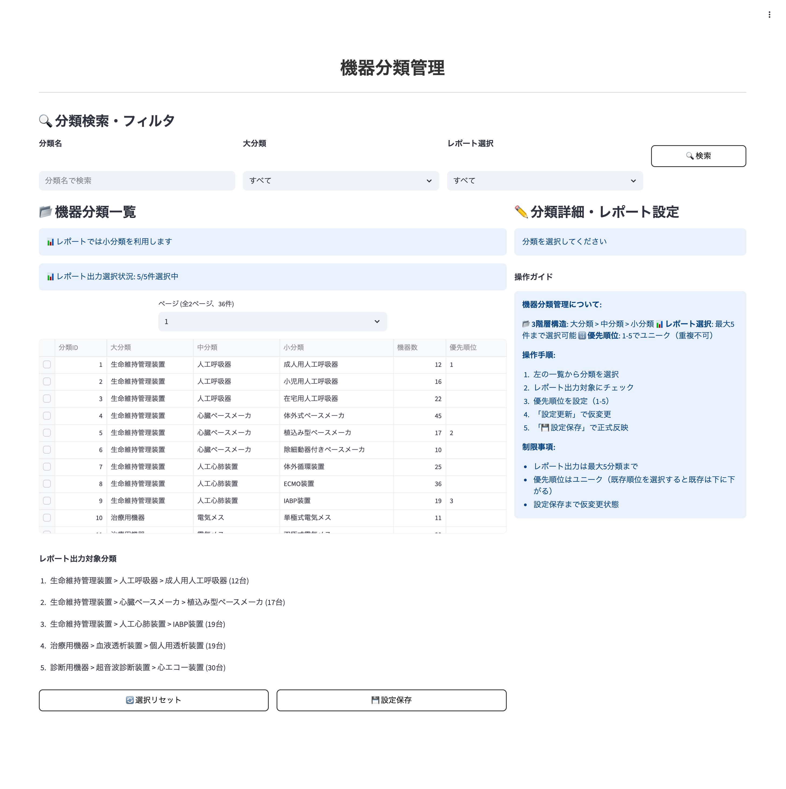
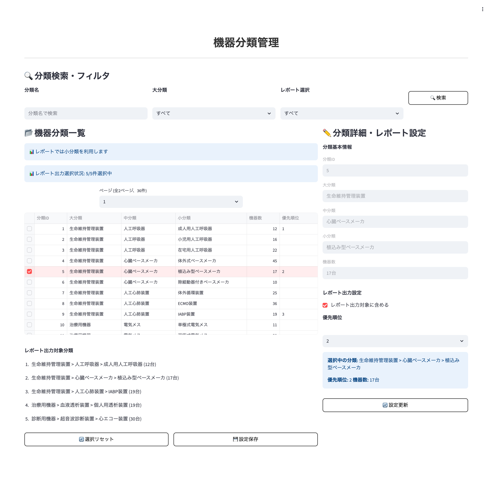

# 画面仕様書 / Screen Specification

- Revision

    | Rev | Date       | Auth       | Note        |
    |----:|------------|------------|-------------|
    | 1.0 | 2025-08-19 | Claude     | 初版作成 / Initial version |

## 1. 画面名称 / Screen Title

- 日本語: 機器分類管理画面
- English: Equipment Classification Management Screen

### 1-1. 機能ID / Functional Identifier

- 機能ID（日本語）: equipment-classification-management
- Functional Name (English): equipment-classification-management
- 使用例（SPAルーティング）: `/settings/equipment-classifications`

## 2. 機能概要 / Function Overview

[Japanese]

- 医療機関が保有する機器分類の3階層構造（大分類・中分類・小分類）を表示・管理する画面
- レポート出力時に優先的に表示する機器分類の選択・順位管理機能
- 選択可能な分類数の制限管理と現在の選択状況確認
- 階層構造での直感的な分類表示とレポート出力対象の効率的な設定

[English]

- Screen for displaying and managing 3-tier hierarchy (major, sub, detailed classifications) of equipment classifications owned by medical facilities
- Selection and priority management functionality for equipment classifications to be displayed preferentially in report output
- Limit management for selectable classification count and current selection status verification
- Intuitive classification display with hierarchical structure and efficient setting of report output targets

---

## 3. 画面利用対象ユーザー / Target Users

- システム管理者 (user_id: 900001-999999): 全医療機関の分類管理が可能
- 医療機関ユーザー (entity_type=1): 自医療機関の分類表示とレポート選択管理が可能

<div style="page-break-before: always;"></div>

## 4. 運用概要 / Operational Usage

[Japanese]

- 月次レポートで重要な機器分類を優先表示するための選択管理
- 例：「人工呼吸器」「透析装置」「手術機器」等の重要分類を上位表示
- 選択可能数は医療機関設定（デフォルト5件）で制限され、優先順位付きで管理
- 階層構造により、大分類から小分類まで体系的に分類を把握
- レポート出力の効率化とユーザビリティ向上を目的とした運用

[English]

- Selection management for priority display of important equipment classifications in monthly reports
- Example: Priority display of important classifications like "Ventilators," "Dialysis Equipment," "Surgical Equipment," etc.
- Selectable count is limited by medical facility settings (default 5) and managed with prioritization
- Systematic understanding of classifications from major to detailed levels through hierarchical structure
- Operation aimed at improving report output efficiency and usability

<div style="page-break-before: always;"></div>

## 5. 処理の流れ / Processing Flow

[Japanese]

1. **画面初期表示**: `GET /api/v1/equipment-classifications/{medical_id}` で機器分類の階層構造を取得・表示
2. **レポート選択確認**: `GET /api/v1/equipment-classifications/report-selection/{medical_id}` で現在の選択状況を取得
3. **階層展開**: 大分類→中分類→小分類の階層構造をツリー表示で展開・表示
4. **分類選択**: レポート出力対象として表示したい分類をチェックボックスで選択
5. **優先順位設定**: 選択した分類の表示順位をドラッグ&ドロップまたは順位入力で設定
6. **選択登録**: `POST /api/v1/equipment-classifications/report-selection/{medical_id}` で選択内容を一括登録
7. **選択削除**: `DELETE /api/v1/equipment-classifications/report-selection/{medical_id}` で全選択をクリア

[English]

1. **Initial screen display**: Retrieve and display hierarchical structure of equipment classifications via `GET /api/v1/equipment-classifications/{medical_id}`
2. **Report selection verification**: Retrieve current selection status via `GET /api/v1/equipment-classifications/report-selection/{medical_id}`
3. **Hierarchy expansion**: Expand and display major→sub→detailed classification hierarchical structure in tree view
4. **Classification selection**: Select classifications to be displayed as report output targets using checkboxes
5. **Priority setting**: Set display order of selected classifications using drag & drop or rank input
6. **Selection registration**: Bulk register selection content via `POST /api/v1/equipment-classifications/report-selection/{medical_id}`
7. **Selection deletion**: Clear all selections via `DELETE /api/v1/equipment-classifications/report-selection/{medical_id}`

<div style="page-break-before: always;"></div>

## 6. 入出力仕様 / Input / Output Specifications

### 6.1 機器分類表示項目 / Equipment Classification Display Fields

| 項目 / Item | 表示対象 / Display | フィールド / Field | ソート順 / Sort |
|-------------|-------------------|-------------------|-----------------|
| 分類名 / Classification Name | ○ | classification_name | 1 |
| 階層レベル / Hierarchy Level | ○ | classification_level | 1（昇順） |
| 親分類ID / Parent Classification ID | ○ | parent_classification_id | 2（昇順） |
| 分類ID / Classification ID | ○ | classification_id | - |
| レポート選択状況 / Report Selection Status | ○ | is_selected | - |

### 6.2 レポート選択設定項目 / Report Selection Setting Fields

| 項目 / Item | フィールド / Field | 要件 / Requirements |
|-------------|-------------------|---------------------|
| 選択分類IDリスト / Selected Classification IDs | classification_ids | 必須、選択順序がrank順 |
| 最大選択数 / Maximum Selection Count | max_count | 表示専用、user_entity_linkから取得 |
| 現在選択数 / Current Selection Count | current_count | 表示専用、選択数カウント |

### 6.3 レポート選択一覧表示項目 / Report Selection List Display Fields

| 項目 / Item | 表示対象 / Display | フィールド / Field | ソート順 / Sort |
|-------------|-------------------|-------------------|-----------------|
| 順位 / Rank | ○ | rank | 1（昇順） |
| 分類名 / Classification Name | ○ | classification_name | - |
| 分類ID / Classification ID | ○ | classification_id | - |
| 操作 / Operations | ○ | - | - |

---

## 7. バリデーション仕様 / Validation Rules

[Japanese]

- **選択数制限**: user_entity_link.count_reportout_classification で設定された最大数を超える選択は不可
- **分類ID存在チェック**: 選択した分類IDが機器分類マスタに存在することを確認
- **医療機関一致**: 選択した分類が認証ユーザーの医療機関に属することを確認
- **重複チェック**: 同じ分類IDを複数回選択することは不可
- **順位整合性**: 選択した分類数とrank順序の整合性確認（1から連続番号）

[English]

- **Selection Count Limit**: Cannot select more than maximum count set in user_entity_link.count_reportout_classification
- **Classification ID Existence Check**: Confirm selected classification IDs exist in equipment classification master
- **Medical Facility Match**: Confirm selected classifications belong to authenticated user's medical facility
- **Duplicate Check**: Cannot select same classification ID multiple times
- **Rank Consistency**: Verify consistency between number of selected classifications and rank order (consecutive numbers from 1)

<div style="page-break-before: always;"></div>

## 8. API連携仕様 / API Integration

### 8.1 `GET /api/v1/equipment-classifications/{medical_id}`

- **必須ヘッダー**: `X-User-Id: {user_id}`
- **パスパラメータ**: medical_id（医療機関ID）
- **クエリパラメータ**: 
  - skip: スキップ件数（デフォルト: 0）
  - limit: 取得件数（デフォルト: 100、最大: 1000）
- **レスポンス**: 機器分類一覧、階層構造情報
- **権限**: システム管理者（全医療機関）・医療機関ユーザー（自医療機関のみ）

### 8.2 `GET /api/v1/equipment-classifications/report-selection/{medical_id}`

- **必須ヘッダー**: `X-User-Id: {user_id}`
- **パスパラメータ**: medical_id（医療機関ID）
- **レスポンス**: 現在のレポート選択情報、最大選択数、選択順位
- **権限**: システム管理者（全医療機関）・医療機関ユーザー（自医療機関のみ）

### 8.3 `POST /api/v1/equipment-classifications/report-selection/{medical_id}`

- **必須ヘッダー**: `X-User-Id: {user_id}`
- **パスパラメータ**: medical_id（医療機関ID）
- **リクエストボディ**: 
  - classification_ids: 選択分類IDの配列（順序がrank順）
- **レスポンス**: 登録された選択情報、作成件数
- **権限**: システム管理者（全医療機関）・医療機関ユーザー（自医療機関のみ）

### 8.4 `DELETE /api/v1/equipment-classifications/report-selection/{medical_id}`

- **必須ヘッダー**: `X-User-Id: {user_id}`
- **パスパラメータ**: medical_id（医療機関ID）
- **レスポンス**: 削除結果、削除件数
- **権限**: システム管理者（全医療機関）・医療機関ユーザー（自医療機関のみ）

<div style="page-break-before: always;"></div>

## 9. 画面遷移 / Screen Navigation

| 操作 / Operation | 説明 / Description |
|------------------|-------------------|
| 階層展開 / Hierarchy Expansion | 大分類クリックで中分類を展開、中分類クリックで小分類を展開 |
| 分類選択 / Classification Selection | チェックボックスで分類を選択・選択解除 |
| 順位変更 / Rank Change | ドラッグ&ドロップまたは順位入力で表示順序を変更 |
| 選択登録 / Register Selection | 選択内容を確認後、一括登録実行 |
| 全選択クリア / Clear All Selections | 確認ダイアログ後、全選択をクリア |
| 選択状況確認 / Check Selection Status | 現在の選択数と最大選択数の確認 |

### 9.1 画面イメージ

#### 基本画面（分類一覧・検索）
<p style="border: 1px solid #ccc; display: inline-block;">
  
</p>

#### 詳細設定画面
<p style="border: 1px solid #ccc; display: inline-block;">
  
</p>

<div style="page-break-before: always;"></div>

## 10. PoC制約事項 / Limitations for PoC Version

[Japanese]

- 階層構造での一括選択機能（親分類選択で子分類も選択）は未実装
- 分類の動的追加・編集機能は未対応（参照のみ）
- 選択履歴管理機能は未実装
- 分類名での検索・フィルタ機能は簡易版
- レポート出力での実際の分類表示確認機能は未対応

[English]

- Bulk selection functionality in hierarchical structure (selecting child classifications when parent classification is selected) is not implemented
- Dynamic addition/editing functionality for classifications is not supported (view only)
- Selection history management functionality is not implemented
- Search and filter functionality by classification name is simplified version
- Functionality to verify actual classification display in report output is not supported

## 11. フロントエンド開発者向け補足 / Notes for Frontend Developer

この画面は、Next.js等のフロントエンドSPAがFastAPIバックエンドとREST APIで接続する構成を想定しています。

### 🔌 接続情報 / Connection Details

| 項目 / Item | 内容 / Content |
|-------------|---------------|
| 接続先API / API Endpoint | `http://192.168.99.118:8000/api/v1/equipment-classifications`（PoC用） |
| 通信方式 / Communication | REST（`fetch` や `axios` など） |
| データ形式 / Data Format | JSON（リクエスト／レスポンス共通） |
| 認証 / Authentication | `X-User-Id` ヘッダーによる認証が必要 |
| CORS | `Access-Control-Allow-Origin: *` を許可済（開発用途） |
| ステータスコード / Status Codes | `200 OK`, `400 Bad Request`, `403 Forbidden`, `404 Not Found`, `422 Validation Error`, `500 Internal Server Error` |

### 📦 APIレスポンス構造（例）

#### 機器分類一覧取得レスポンス
```json
{
  "total": 45,
  "skip": 0,
  "limit": 100,
  "items": [
    {
      "classification_id": 1,
      "medical_id": 22,
      "classification_name": "生命維持管理装置",
      "classification_level": 1,
      "parent_classification_id": null,
      "publication_classification_id": null,
      "regdate": "2025-07-22T10:00:00",
      "lastupdate": "2025-08-19T15:30:00"
    },
    {
      "classification_id": 2,
      "medical_id": 22,
      "classification_name": "人工呼吸器",
      "classification_level": 2,
      "parent_classification_id": 1,
      "publication_classification_id": null,
      "regdate": "2025-07-22T10:00:00",
      "lastupdate": "2025-08-19T15:30:00"
    }
  ]
}
```

#### レポート選択情報取得レスポンス
```json
{
  "medical_id": 22,
  "max_count": 5,
  "selections": [
    {
      "rank": 1,
      "classification_id": 2,
      "classification_name": "人工呼吸器"
    },
    {
      "rank": 2,
      "classification_id": 5,
      "classification_name": "透析装置"
    },
    {
      "rank": 3,
      "classification_id": 8,
      "classification_name": "手術機器"
    }
  ]
}
```

#### 選択登録レスポンス
```json
{
  "medical_id": 22,
  "created_count": 4,
  "selections": [
    {
      "rank": 1,
      "classification_id": 2,
      "classification_name": "人工呼吸器"
    },
    {
      "rank": 2,
      "classification_id": 5,
      "classification_name": "透析装置"
    },
    {
      "rank": 3,
      "classification_id": 8,
      "classification_name": "手術機器"
    },
    {
      "rank": 4,
      "classification_id": 12,
      "classification_name": "画像診断装置"
    }
  ]
}
```

### 🛠 axios使用例

```ts
import axios from 'axios';

const apiBase = 'http://192.168.99.118:8000/api/v1/equipment-classifications';

export const fetchEquipmentClassifications = async (
  currentUserId: number,
  medicalId: number,
  skip = 0,
  limit = 1000
) => {
  const res = await axios.get(`${apiBase}/${medicalId}?skip=${skip}&limit=${limit}`, {
    headers: {
      'X-User-Id': currentUserId.toString()
    }
  });
  return res.data;
};

export const fetchReportSelection = async (currentUserId: number, medicalId: number) => {
  const res = await axios.get(`${apiBase}/report-selection/${medicalId}`, {
    headers: {
      'X-User-Id': currentUserId.toString()
    }
  });
  return res.data;
};

export const createReportSelection = async (
  currentUserId: number,
  medicalId: number,
  classificationIds: number[]
) => {
  const res = await axios.post(`${apiBase}/report-selection/${medicalId}`, {
    classification_ids: classificationIds
  }, {
    headers: {
      'X-User-Id': currentUserId.toString(),
      'Content-Type': 'application/json'
    }
  });
  return res.data;
};

export const deleteReportSelection = async (currentUserId: number, medicalId: number) => {
  const res = await axios.delete(`${apiBase}/report-selection/${medicalId}`, {
    headers: {
      'X-User-Id': currentUserId.toString()
    }
  });
  return res.data;
};
```

### 🌳 階層構造表示の実装例

```tsx
import React, { useState, useEffect } from 'react';

interface ClassificationItem {
  classification_id: number;
  medical_id: number;
  classification_name: string;
  classification_level: number;
  parent_classification_id: number | null;
}

interface ClassificationTreeProps {
  classifications: ClassificationItem[];
  selectedIds: number[];
  onSelectionChange: (selectedIds: number[]) => void;
  maxSelectionCount: number;
}

const ClassificationTree: React.FC<ClassificationTreeProps> = ({
  classifications,
  selectedIds,
  onSelectionChange,
  maxSelectionCount
}) => {
  const [expandedNodes, setExpandedNodes] = useState<Set<number>>(new Set());

  // 階層構造を構築
  const buildTree = (items: ClassificationItem[], parentId: number | null = null) => {
    return items
      .filter(item => item.parent_classification_id === parentId)
      .sort((a, b) => a.classification_name.localeCompare(b.classification_name))
      .map(item => ({
        ...item,
        children: buildTree(items, item.classification_id)
      }));
  };

  const tree = buildTree(classifications);

  const handleToggleExpand = (classificationId: number) => {
    const newExpanded = new Set(expandedNodes);
    if (newExpanded.has(classificationId)) {
      newExpanded.delete(classificationId);
    } else {
      newExpanded.add(classificationId);
    }
    setExpandedNodes(newExpanded);
  };

  const handleSelectionChange = (classificationId: number, isSelected: boolean) => {
    let newSelection = [...selectedIds];
    
    if (isSelected) {
      if (newSelection.length < maxSelectionCount) {
        newSelection.push(classificationId);
      } else {
        alert(`最大${maxSelectionCount}件まで選択可能です`);
        return;
      }
    } else {
      newSelection = newSelection.filter(id => id !== classificationId);
    }
    
    onSelectionChange(newSelection);
  };

  const renderTreeNode = (node: any, level: number = 0) => {
    const hasChildren = node.children.length > 0;
    const isExpanded = expandedNodes.has(node.classification_id);
    const isSelected = selectedIds.includes(node.classification_id);

    return (
      <div key={node.classification_id} className={`tree-node level-${level}`}>
        <div className="node-content">
          <div className="node-expand" style={{ marginLeft: `${level * 20}px` }}>
            {hasChildren && (
              <button
                onClick={() => handleToggleExpand(node.classification_id)}
                className="expand-button"
              >
                {isExpanded ? '▼' : '▶'}
              </button>
            )}
          </div>
          
          <label className="node-label">
            <input
              type="checkbox"
              checked={isSelected}
              onChange={(e) => handleSelectionChange(node.classification_id, e.target.checked)}
            />
            <span className="classification-name">
              {node.classification_name}
              <small className="classification-id"> (ID: {node.classification_id})</small>
            </span>
          </label>
        </div>
        
        {hasChildren && isExpanded && (
          <div className="children">
            {node.children.map((child: any) => renderTreeNode(child, level + 1))}
          </div>
        )}
      </div>
    );
  };

  return (
    <div className="classification-tree">
      <div className="tree-header">
        <h3>機器分類選択</h3>
        <div className="selection-count">
          選択済み: {selectedIds.length} / {maxSelectionCount}
        </div>
      </div>
      
      <div className="tree-content">
        {tree.map((node: any) => renderTreeNode(node))}
      </div>
    </div>
  );
};
```

### 🎯 選択順位管理の実装例

```tsx
import React from 'react';
import { DragDropContext, Droppable, Draggable } from 'react-beautiful-dnd';

interface SelectionManagerProps {
  selections: Array<{
    classification_id: number;
    classification_name: string;
    rank: number;
  }>;
  onReorder: (newSelections: Array<{classification_id: number; classification_name: string; rank: number;}>) => void;
  onRemove: (classificationId: number) => void;
}

const SelectionManager: React.FC<SelectionManagerProps> = ({ selections, onReorder, onRemove }) => {
  const handleDragEnd = (result: any) => {
    if (!result.destination) return;

    const items = Array.from(selections);
    const [reorderedItem] = items.splice(result.source.index, 1);
    items.splice(result.destination.index, 0, reorderedItem);

    // rank を更新
    const newSelections = items.map((item, index) => ({
      ...item,
      rank: index + 1
    }));

    onReorder(newSelections);
  };

  return (
    <div className="selection-manager">
      <h3>レポート出力順位設定</h3>
      
      <DragDropContext onDragEnd={handleDragEnd}>
        <Droppable droppableId="selections">
          {(provided) => (
            <div
              {...provided.droppableProps}
              ref={provided.innerRef}
              className="selections-list"
            >
              {selections.map((selection, index) => (
                <Draggable
                  key={selection.classification_id}
                  draggableId={selection.classification_id.toString()}
                  index={index}
                >
                  {(provided) => (
                    <div
                      ref={provided.innerRef}
                      {...provided.draggableProps}
                      {...provided.dragHandleProps}
                      className="selection-item"
                    >
                      <div className="rank-number">{selection.rank}</div>
                      <div className="classification-name">{selection.classification_name}</div>
                      <button
                        onClick={() => onRemove(selection.classification_id)}
                        className="remove-button"
                      >
                        削除
                      </button>
                    </div>
                  )}
                </Draggable>
              ))}
              {provided.placeholder}
            </div>
          )}
        </Droppable>
      </DragDropContext>
    </div>
  );
};
```

<div style="page-break-before: always;"></div>

## 12. 処理メッセージ仕様 / Operation Messages

この画面では、ユーザーに対して各操作の結果を明示的に伝えるために、以下のようなメッセージを表示します。

### 12.1 共通メッセージ / Common Messages

| タイミング / Timing | ステータス / Status | 表示メッセージ / Message | 備考 / Notes |
|--------------------|--------------------|-----------------------|-------------|
| 選択登録成功 / Selection Registration Success | 200 OK | レポート出力分類を設定しました。 | 選択内容登録時 |
| 全選択削除成功 / All Selection Deletion Success | 200 OK | レポート出力分類の選択をクリアしました。 | 全選択削除時 |
| 選択数上限エラー / Selection Limit Error | 400 Bad Request | 選択可能な分類数を超えています（最大: {max_count}件）。 | 選択数制限時 |
| 権限エラー / Permission Error | 403 Forbidden | アクセス権限がありません。指定された医療機関の分類管理権限がありません。 | 権限不足時 |
| 医療機関不存在 / Medical Facility Not Found | 404 Not Found | 指定された医療機関が見つかりません。 | 医療機関未存在 |
| バリデーションエラー / Validation Error | 422 Unprocessable Entity | 選択内容に不備があります。存在しない分類IDが含まれています。 | 入力検証エラー |
| サーバーエラー / Server Error | 500 Internal Server Error | サーバーでエラーが発生しました。後で再度お試しください。 | システムエラー |

### 12.2 選択操作メッセージ例

| シナリオ / Scenario | メッセージ / Message |
|--------------------|---------------------|
| 選択数上限到達 | 最大{max_count}件まで選択可能です。他の分類を選択解除してから追加してください。 |
| 空選択での登録試行 | レポート出力する分類を1件以上選択してください。 |
| 階層構造での重複選択 | 同じ分類は重複選択できません。既に選択されています。 |
| 順位変更完了 | レポート出力順位を変更しました。 |

### 12.3 フィールド別バリデーションエラーメッセージ例

| フィールド / Field | エラーメッセージ / Error Message |
|-------------------|--------------------------------|
| classification_ids | 選択された分類IDが存在しません。正しい分類を選択してください。 |
| medical_id | 医療機関IDが指定されていません。 |
| selection_limit | 選択可能な分類数を超えています。現在の上限は{max_count}件です。 |
| classification_not_found | 指定された分類ID {classification_id} は存在しません。 |
| medical_facility_mismatch | 指定された分類は異なる医療機関のものです。 |

### 12.4 API別メッセージまとめ

| APIエンドポイント / API Endpoint | 成功時メッセージ / Success Message | 失敗時メッセージ / Error Message |
|----------------------------------|-----------------------------------|--------------------------------|
| `GET /.../equipment-classifications/{medical_id}` | - | 機器分類一覧の取得に失敗しました。 |
| `GET /.../report-selection/{medical_id}` | - | レポート選択情報の取得に失敗しました。 |
| `POST /.../report-selection/{medical_id}` | レポート出力分類を設定しました。 | レポート選択の登録に失敗しました。選択内容を確認してください。 |
| `DELETE /.../report-selection/{medical_id}` | レポート出力分類の選択をクリアしました。 | レポート選択のクリアに失敗しました。 |

### 12.5 業務ガイダンスメッセージ

| 状況 / Situation | ガイダンスメッセージ / Guidance Message |
|------------------|---------------------------------------|
| 初回利用時 | レポートで重要視したい機器分類を最大{max_count}件まで選択できます。選択した分類は月次レポートで優先的に表示されます。 |
| 選択数制限説明 | 選択可能数は医療機関設定により制限されています。より多くの分類を表示したい場合は管理者にお問い合わせください。 |
| 階層構造説明 | 大分類→中分類→小分類の階層構造で表示されています。▶マークをクリックして階層を展開してください。 |
| 順位設定説明 | 選択した分類は番号順でレポートに表示されます。ドラッグ&ドロップで順位を変更できます。 |

### 12.6 表示方法の推奨 / Display Recommendations

[Japanese]

- 階層構造は**ツリービュー**でインデント表示し、展開/折りたたみ可能に
- 選択数制限は画面上部に**進捗バー**形式で視覚的に表示
- 成功メッセージは画面上部の**成功アラート**（緑色）で表示
- エラーメッセージは**エラーアラート**（赤色）で詳細情報を表示
- 選択中分類は**ハイライト表示**で識別しやすく
- ドラッグ&ドロップ操作は**視覚的なフィードバック**で操作性向上

[English]

- Display hierarchical structure in **tree view** with indentation, expandable/collapsible
- Display selection count limit visually with **progress bar** format at top of screen
- Display success messages with **success alert** (green) at the top of the screen
- Display error messages with **error alert** (red) showing detailed information
- Make selected classifications easily identifiable with **highlight display**
- Improve operability of drag & drop operations with **visual feedback**

---

以上