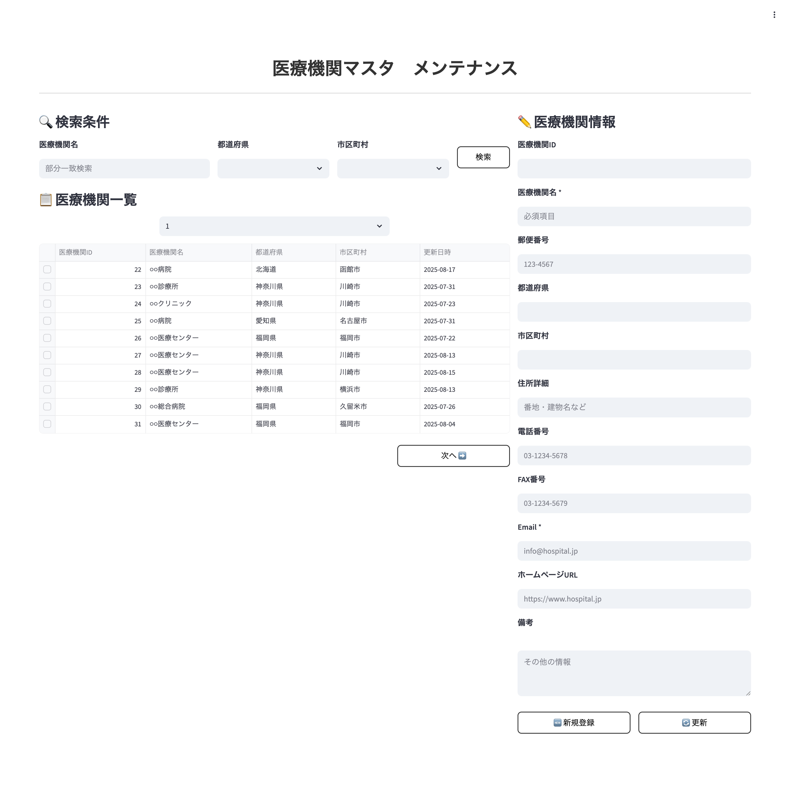

# 画面仕様書 / Screen Specification

- Revision

    | Rev | Date       | Auth       | Note        |
    |----:|------------|------------|-------------|
    | 1.0 | 2025-08-19 | Claude     | 初版作成 / Initial version |

## 1. 画面名称 / Screen Title

- 日本語: 医療機関マスタ管理画面
- English: Medical Facilities Management Screen

### 1-1. 機能ID / Functional Identifier

- 機能ID（日本語）: facilities-management
- Functional Name (English): facilities-management
- 使用例（SPAルーティング）: `/admin/facilities`

## 2. 機能概要 / Function Overview

[Japanese]

- 医療機関情報の登録・参照・更新を行う管理画面（システム管理者専用）
- システム管理者は全医療機関の情報を管理できます
- ページネーション対応による効率的な大量データ表示
- 検索・フィルタ機能による目的の医療機関情報の迅速な特定
- ※一般ユーザーは他の画面でuser_entity_linkを通じて医療機関情報を取得します

[English]

- Management screen for creating, viewing, and updating medical facility information (System administrators only)
- System administrators can manage all medical facilities
- Efficient large data display with pagination support
- Quick identification of target medical facility information through search and filter functions
- ※General users access medical facility information through user_entity_link in other screens

---

## 3. 画面利用対象ユーザー / Target Users

- システム管理者 (user_id: 900001-999999): 全医療機関の情報を管理可能
- ~~医療機関ユーザー (entity_type=1): 自医療機関の情報のみ参照・更新可能~~ ※フロントエンドでは一般ユーザー利用を制限

<div style="page-break-before: always;"></div>

## 4. 運用概要 / Operational Usage

[Japanese]

- 新規医療機関の契約時にシステム管理者が医療機関マスタを登録
- 医療機関の基本情報変更時（名称変更、住所変更等）の管理業務に活用（システム管理者のみ）
- システム運用上での医療機関検索・特定に使用
- ※一般ユーザーの連絡先情報等の更新は、user_entity_linkテーブルの情報で対応

[English]

- System administrators register medical facility masters when new medical institutions sign contracts
- Used for management tasks when basic facility information changes (name changes, address changes, etc.) (System administrators only)
- Used for medical facility search and identification in system operations
- ※Contact information updates by general users are handled through user_entity_link table information

<div style="page-break-before: always;"></div>

## 5. 処理の流れ / Processing Flow

[Japanese]

1. **画面初期表示**: `GET /api/v1/facilities` で医療機関一覧を取得（システム管理者のみアクセス可能）
2. **検索・フィルタ**: 医療機関名や地域等での絞り込み検索実行
3. **詳細表示**: 一覧から医療機関を選択し、詳細情報をフォームに表示
4. **新規登録**: 「新規登録」ボタンでフォーム初期化、必要情報入力後 `POST /api/v1/facilities` で登録
5. **情報更新**: 既存情報を編集後 `PUT /api/v1/facilities/{medical_id}` で更新実行
6. **結果表示**: 各操作の成功・失敗結果をユーザーに通知

[English]

1. **Initial screen display**: Retrieve medical facility list via `GET /api/v1/facilities` (System administrators only access)
2. **Search and filter**: Execute filtered search by facility name, region, etc.
3. **Detail display**: Select facility from list and display detailed information in form
4. **New registration**: Initialize form with "New Registration" button, register via `POST /api/v1/facilities` after inputting required information
5. **Information update**: Update via `PUT /api/v1/facilities/{medical_id}` after editing existing information
6. **Result display**: Notify users of success/failure results for each operation

<div style="page-break-before: always;"></div>

## 6. 入出力仕様 / Input / Output Specifications

### 6.1 入力フォーム項目 / Input Form Fields

| 項目 / Item | フィールド / Field | 要件 / Requirements |
|-------------|-------------------|---------------------|
| 医療機関名 / Facility Name | facility_name | 必須、最大200文字 |
| 郵便番号 / Postal Code | postal_code | 任意、7桁（ハイフンあり・なし両対応） |
| 都道府県 / Prefecture | prefecture | 任意、最大20文字 |
| 市区町村 / City | city | 任意、最大100文字 |
| 住所詳細 / Address Detail | address_detail | 任意、最大200文字 |
| 電話番号 / Phone Number | phone_number | 任意、電話番号形式 |
| FAX番号 / Fax Number | fax_number | 任意、電話番号形式 |
| メールアドレス / Email | email_address | 任意、メール形式 |
| ホームページURL / Website URL | website_url | 任意、URL形式 |
| 備考 / Notes | notes | 任意、最大1000文字 |

### 6.2 一覧表示項目 / List Display Fields

| 項目 / Item | 表示対象 / Display | フィールド / Field | ソート順 / Sort |
|-------------|-------------------|-------------------|-----------------|
| 医療機関ID / Medical ID | ○ | medical_id | 1 |
| 医療機関名 / Facility Name | ○ | facility_name | 2 |
| 都道府県 / Prefecture | ○ | prefecture | 3 |
| 市区町村 / City | ○ | city | 4 |
| 電話番号 / Phone Number | ○ | phone_number | - |
| 更新日時 / Last Update | ○ | lastupdate | 5 |

---

## 7. バリデーション仕様 / Validation Rules

[Japanese]

- **医療機関名**: 必須、1-200文字以内、特殊文字制限
- **郵便番号**: 7桁数字（ハイフンあり・なし両対応）、例: 123-4567 または 1234567
- **電話番号・FAX番号**: 電話番号形式、例: 03-1234-5678, 090-1234-5678
- **メールアドレス**: RFC準拠のメール形式
- **ホームページURL**: http:// または https:// で始まるURL形式
- **備考**: 最大1000文字以内

[English]

- **Facility Name**: Required, 1-200 characters, special character restrictions
- **Postal Code**: 7-digit number (with or without hyphen), e.g., 123-4567 or 1234567
- **Phone Number/Fax Number**: Valid phone number format, e.g., 03-1234-5678, 090-1234-5678
- **Email Address**: RFC-compliant email format
- **Website URL**: URL format starting with http:// or https://
- **Notes**: Maximum 1000 characters

<div style="page-break-before: always;"></div>

## 8. API連携仕様 / API Integration

### 8.1 `GET /api/v1/facilities`

- **必須ヘッダー**: `X-User-Id: {user_id}`
- **クエリパラメータ**:
  - skip: スキップ件数（デフォルト: 0）
  - limit: 取得件数（デフォルト: 100、最大: 1000）
  - facility_name: 医療機関名での部分一致検索
  - prefecture: 都道府県での完全一致検索
  - city: 市区町村での部分一致検索
- **レスポンス**: 医療機関一覧、総件数、次ページ有無
- **権限**: システム管理者のみ（全件取得可能）

### 8.2 `POST /api/v1/facilities`

- **必須ヘッダー**: `X-User-Id: {user_id}`
- **リクエストボディ**: 医療機関情報（facility_nameは必須）
- **レスポンス**: 登録された医療機関情報（medical_id含む）
- **権限**: システム管理者のみ

### 8.3 `PUT /api/v1/facilities/{medical_id}`

- **必須ヘッダー**: `X-User-Id: {user_id}`
- **パスパラメータ**: medical_id（更新対象の医療機関ID）
- **リクエストボディ**: 更新する医療機関情報
- **権限**: システム管理者のみ

### 8.4 `GET /api/v1/facilities/{medical_id}`

- **必須ヘッダー**: `X-User-Id: {user_id}`
- **パスパラメータ**: medical_id（取得対象の医療機関ID）
- **レスポンス**: 指定医療機関の詳細情報
- **権限**: システム管理者のみ

<div style="page-break-before: always;"></div>

## 9. 画面遷移 / Screen Navigation

| 操作 / Operation | 説明 / Description |
|------------------|-------------------|
| 検索実行 / Search | 条件入力後、一覧表示を更新 |
| 新規登録 / New Registration | フォーム初期化、入力後登録実行 |
| 詳細表示 / View Details | 一覧から選択、詳細情報をフォーム表示 |
| 情報更新 / Update Information | 詳細表示状態で編集、更新実行 |
| ページ移動 / Pagination | 前へ・次へボタンでページ遷移 |

### 9.1 画面イメージ

<p style="border: 1px solid #ccc; display: inline-block;">
  
</p>

<div style="page-break-before: always;"></div>

## 10. PoC制約事項 / Limitations for PoC Version

[Japanese]

- 論理削除機能は実装されていません（物理削除も不可）
- 一括登録・一括更新機能は未実装
- 医療機関画像・ロゴアップロード機能は未対応
- 詳細な住所検索（住所自動補完）は未実装

[English]

- Logical deletion functionality is not implemented (physical deletion also not possible)
- Bulk registration and bulk update features are not implemented
- Medical facility image/logo upload functionality is not supported
- Detailed address search (automatic address completion) is not implemented

## 11. フロントエンド開発者向け補足 / Notes for Frontend Developer

この画面は、Next.js等のフロントエンドSPAがFastAPIバックエンドとREST APIで接続する構成を想定しています。

### 🔌 接続情報 / Connection Details

| 項目 / Item | 内容 / Content |
|-------------|---------------|
| 接続先API / API Endpoint | `http://192.168.99.118:8000/api/v1/facilities`（PoC用） |
| 通信方式 / Communication | REST（`fetch` や `axios` など） |
| データ形式 / Data Format | JSON（リクエスト／レスポンス共通） |
| 認証 / Authentication | `X-User-Id` ヘッダーによる認証が必要 |
| CORS | `Access-Control-Allow-Origin: *` を許可済（開発用途） |
| ステータスコード / Status Codes | `200 OK`, `403 Forbidden`, `404 Not Found`, `422 Validation Error`, `500 Internal Server Error` |

### 📦 APIレスポンス構造（例）

```json
{
  "medical_id": 22,
  "facility_name": "○○総合病院",
  "postal_code": "123-4567",
  "prefecture": "東京都",
  "city": "新宿区",
  "address_detail": "西新宿1-1-1",
  "phone_number": "03-1234-5678",
  "fax_number": "03-1234-5679",
  "email_address": "info@hospital.jp",
  "website_url": "https://www.hospital.jp",
  "notes": "備考情報",
  "regdate": "2025-07-22T10:00:00",
  "lastupdate": "2025-08-19T15:30:00"
}
```

### 🛠 axios使用例

```ts
import axios from 'axios';

const apiBase = 'http://192.168.99.118:8000/api/v1/facilities';

export const fetchFacilities = async (currentUserId: number, skip = 0, limit = 100) => {
  const res = await axios.get(`${apiBase}?skip=${skip}&limit=${limit}`, {
    headers: {
      'X-User-Id': currentUserId.toString()
    }
  });
  return res.data;
};

export const createFacility = async (currentUserId: number, facilityData: any) => {
  const res = await axios.post(apiBase, facilityData, {
    headers: {
      'X-User-Id': currentUserId.toString(),
      'Content-Type': 'application/json'
    }
  });
  return res.data;
};
```

<div style="page-break-before: always;"></div>

## 12. 処理メッセージ仕様 / Operation Messages

この画面では、ユーザーに対して各操作の結果を明示的に伝えるために、以下のようなメッセージを表示します。

### 12.1 共通メッセージ / Common Messages

| タイミング / Timing | ステータス / Status | 表示メッセージ / Message | 備考 / Notes |
|--------------------|--------------------|-----------------------|-------------|
| 登録成功 / Registration Success | 200 OK | 医療機関情報を登録しました。 | 新規登録時 |
| 更新成功 / Update Success | 200 OK | 医療機関情報を更新しました。 | 情報更新時 |
| 権限エラー / Permission Error | 403 Forbidden | アクセス権限がありません。管理者にお問い合わせください。 | 権限不足時 |
| 医療機関不存在 / Facility Not Found | 404 Not Found | 指定された医療機関が見つかりません。 | データ不存在時 |
| バリデーションエラー / Validation Error | 422 Unprocessable Entity | 入力内容に不備があります。再確認してください。 | 入力検証エラー |
| サーバーエラー / Server Error | 500 Internal Server Error | サーバーでエラーが発生しました。後で再度お試しください。 | システムエラー |

### 12.2 フィールド別バリデーションエラーメッセージ例

| フィールド / Field | エラーメッセージ / Error Message |
|-------------------|--------------------------------|
| facility_name | 医療機関名は必須項目です。200文字以内で入力してください。 |
| postal_code | 郵便番号は7桁の数字で入力してください（例：123-4567）。 |
| phone_number | 電話番号の形式が正しくありません（例：03-1234-5678）。 |
| email_address | メールアドレスの形式が正しくありません。 |
| website_url | ホームページURLの形式が正しくありません（http://またはhttps://で始まる必要があります）。 |
| notes | 備考は1000文字以内で入力してください。 |

### 12.3 API別メッセージまとめ

| APIエンドポイント / API Endpoint | 成功時メッセージ / Success Message | 失敗時メッセージ / Error Message |
|----------------------------------|-----------------------------------|--------------------------------|
| `POST /api/v1/facilities` | 医療機関情報を登録しました。 | 入力に不備があります。 |
| `PUT /api/v1/facilities/{id}` | 医療機関情報を更新しました。 | 対象医療機関が見つかりません。 |
| `GET /api/v1/facilities` | - | データの取得に失敗しました。 |

### 12.4 表示方法の推奨 / Display Recommendations

[Japanese]

- メッセージは画面右下の**トースト通知**または上部への**アラート表示**が望ましい
- 重大エラー（500番台など）はモーダルでブロッキング表示してもよい
- バリデーションエラーは該当項目の**下部 or 横に赤字表示**（フィールド単位）

[English]

- Toast notifications at the bottom right of the screen or alert messages at the top are preferred
- For critical errors (e.g., 500 series), a blocking modal dialog may be used
- Validation errors should be displayed in red text below or beside the corresponding field

---

以上
