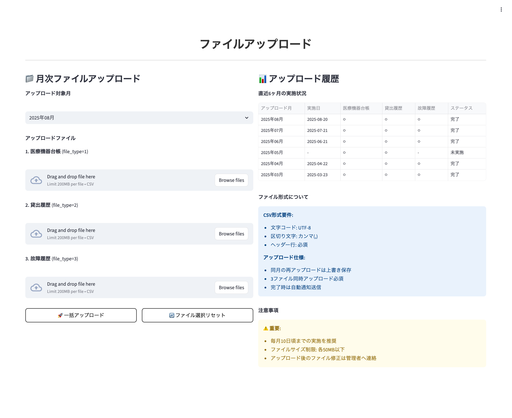

# 画面仕様書 / Screen Specification

- Revision

    | Rev | Date       | Auth       | Note        |
    |----:|------------|------------|-------------|
    | 1.0 | 2025-08-19 | Claude     | 初版作成 / Initial version |
    | 2.0 | 2025-08-25 | Claude     | user_id型変更・モック操作仕様統合・12章構成統一 |

## 1. 画面名称 / Screen Title

- 日本語: ファイルアップロード画面
- English: File Upload Screen

### 1-1. 機能ID / Functional Identifier

- 機能ID（日本語）: file-upload
- Functional Name (English): file-upload
- 使用例（SPAルーティング）: `/upload`

## 2. 機能概要 / Function Overview

[Japanese]

- 医療機関担当者が月次ファイル（機器台帳・貸出履歴・故障履歴）をアップロードする画面
- 3種類のファイルを同時にアップロードし、既存ファイルを上書き対応
- アップロード完了時に通知メール自動送信機能
- 直近6ヶ月のアップロード履歴表示による進捗管理

[English]

- Screen for medical facility representatives to upload monthly files (equipment ledger, rental history, failure history)
- Upload 3 types of files simultaneously with support for overwriting existing files
- Automatic notification email sending upon upload completion
- Progress management through display of upload history for the past 6 months

---

## 3. 画面利用対象ユーザー / Target Users

- 医療機関ユーザー (entity_type=1): 自医療機関のファイルアップロードのみ可能
- ※システム管理者はアクセス可能だが、医療機関指定が必要

<div style="page-break-before: always;"></div>

## 4. 運用概要 / Operational Usage

[Japanese]

- 毎月10日頃までに、前月分のデータファイルをアップロード
- 機器台帳・貸出履歴・故障履歴の3種類を同時にアップロード
- アップロード完了時に、user_entity_link.notification_email_listのメンバーへ自動通知
- 同一医療機関の再アップロードは上書き処理（1世代保管）
- アップロード履歴により提出状況を確認・管理

[English]

- Upload previous month's data files by around the 10th of each month
- Upload 3 types simultaneously: equipment ledger, rental history, and failure history
- Automatic notification to members of user_entity_link.notification_email_list upon upload completion
- Re-uploading by the same medical facility overwrites previous files (single generation storage)
- Check and manage submission status through upload history

<div style="page-break-before: always;"></div>

## 5. 処理の流れ / Processing Flow

[Japanese]

1. **画面初期表示**: `GET /api/v1/file-management/upload-history` で直近6ヶ月のアップロード履歴を取得・表示
2. **ファイル選択**: 3種類のファイル（機器台帳・貸出履歴・故障履歴）を選択
3. **ファイル検証**: 拡張子チェック（xlsx, xls, csv）、ファイルサイズチェック（10MB以下推奨）
4. **一括アップロード**: `POST /api/v1/file-management/upload` で3ファイル同時アップロード実行
5. **通知送信**: アップロード成功時に設定された通知先メールアドレスへ自動送信
6. **履歴更新**: 最新のアップロード履歴を取得して画面表示を更新
7. **結果表示**: アップロード結果・エラー内容をユーザーに通知

[English]

1. **Initial screen display**: Retrieve and display upload history for the past 6 months via `GET /api/v1/file-management/upload-history`
2. **File selection**: Select 3 types of files (equipment ledger, rental history, failure history)
3. **File validation**: Extension check (xlsx, xls, csv), file size check (10MB or less recommended)
4. **Batch upload**: Execute simultaneous upload of 3 files via `POST /api/v1/file-management/upload`
5. **Notification sending**: Automatic sending to configured notification email addresses upon successful upload
6. **History update**: Retrieve latest upload history and update screen display
7. **Result display**: Notify users of upload results and error details

<div style="page-break-before: always;"></div>

## 6. 入出力仕様 / Input / Output Specifications

### 6.1 入力フォーム項目 / Input Form Fields

| 項目 / Item | フィールド / Field | 要件 / Requirements |
|-------------|-------------------|---------------------|
| 機器台帳ファイル / Equipment Ledger File | equipment_file | 必須、xlsx/xls/csv、最大10MB |
| 貸出履歴ファイル / Rental History File | rental_file | 必須、xlsx/xls/csv、最大10MB |
| 故障履歴ファイル / Failure History File | failure_file | 必須、xlsx/xls/csv、最大10MB |
| 対象年月 / Target Year-Month | target_date | 自動設定（前月）、手動変更可 |
| 備考 / Notes | notes | 任意、最大500文字 |

### 6.2 アップロード履歴表示項目 / Upload History Display Fields

| 項目 / Item | 表示対象 / Display | フィールド / Field | ソート順 / Sort |
|-------------|-------------------|-------------------|-----------------|
| アップロード日時 / Upload DateTime | ○ | upload_datetime | 1（降順） |
| 対象年月 / Target Year-Month | ○ | target_date | 2 |
| 機器台帳 / Equipment | ○ | equipment_status | - |
| 貸出履歴 / Rental | ○ | rental_status | - |
| 故障履歴 / Failure | ○ | failure_status | - |
| アップロード者 / Uploader | ○ | uploader_name | - |
| ファイルサイズ計 / Total File Size | ○ | total_file_size | - |

---

## 7. バリデーション仕様 / Validation Rules

[Japanese]

- **ファイル形式**: xlsx, xls, csvのみ許可
- **ファイルサイズ**: 各ファイル最大10MB（推奨）
- **ファイル必須**: 3種類すべてのファイル選択が必須
- **ファイル名**: 日本語文字・特殊文字を含む場合の適切な処理
- **対象年月**: YYYY-MM形式、過去12ヶ月以内の日付
- **備考**: 最大500文字以内
- **同時アップロード**: 3ファイル全てが正常でない場合は全てキャンセル

[English]

- **File Format**: Only xlsx, xls, csv allowed
- **File Size**: Maximum 10MB per file (recommended)
- **File Requirement**: Selection of all 3 types of files is required
- **File Name**: Proper handling when including Japanese characters and special characters
- **Target Year-Month**: YYYY-MM format, date within the past 12 months
- **Notes**: Maximum 500 characters
- **Simultaneous Upload**: Cancel all if any of the 3 files is not normal

<div style="page-break-before: always;"></div>

## 8. API連携仕様 / API Integration

### 8.1 `GET /api/v1/file-management/upload-history`

- **必須ヘッダー**: `X-User-Id: {user_id}`
- **クエリパラメータ**: 
  - medical_id: 医療機関ID（省略時は認証ユーザーの医療機関）
  - months: 取得対象月数（デフォルト: 6）
- **レスポンス**: 指定期間のアップロード履歴一覧
- **権限**: システム管理者（全医療機関）・医療機関ユーザー（自医療機関のみ）

### 8.2 `POST /api/v1/file-management/upload`

- **必須ヘッダー**: `X-User-Id: {user_id}`, `Content-Type: multipart/form-data`
- **リクエストボディ**: 
  - medical_id: 医療機関ID（省略時は認証ユーザーの医療機関）
  - target_date: 対象年月（YYYY-MM形式）
  - equipment_file: 機器台帳ファイル
  - rental_file: 貸出履歴ファイル
  - failure_file: 故障履歴ファイル
  - notes: 備考（任意）
- **レスポンス**: アップロード結果、ファイル保存パス、通知送信結果
- **権限**: システム管理者・医療機関ユーザー（指定医療機関への権限要）

<div style="page-break-before: always;"></div>

## 9. 画面遷移 / Screen Navigation

| 操作 / Operation | 説明 / Description |
|------------------|-------------------|
| ファイル選択 / File Selection | 3種類のファイル選択ボタンで各ファイルを選択 |
| プレビュー表示 / Preview Display | 選択ファイルの詳細情報（名前・サイズ・形式）を表示 |
| 一括アップロード / Batch Upload | 3ファイル同時アップロード実行、進捗表示 |
| 履歴更新 / History Update | アップロード完了後、履歴一覧を自動更新 |
| エラー表示 / Error Display | 失敗時の詳細エラー情報表示 |

### 9.1 画面レイアウト / Screen Layout



**画面構成:**
- **月次ファイルアップロード部** (左側)
  - アップロード対象月：ドロップダウン選択（2025年08月など）
  - 3種類ファイル選択エリア：
    - 1. 医療機器台帳 (file_type=1) - "Drag and drop file here" / "Browse files"
    - 2. 貸出履歴 (file_type=2) - "Drag and drop file here" / "Browse files"  
    - 3. 故障履歴 (file_type=3) - "Drag and drop file here" / "Browse files"
  - アップロードボタン：一括アップロード・ファイル選択リセット
- **アップロード履歴部** (右側)
  - 直近6ヶ月の実施状況テーブル
  - CSV形式要件・アップロード仕様・注意事項表示

<div style="page-break-before: always;"></div>

## 10. PoC制約事項 / Limitations for PoC Version

[Japanese]

- ファイル内容の詳細検証（データ形式チェック）は未実装
- ファイルの一部エラー時の部分成功処理は未対応
- アップロード進捗の詳細表示（％表示）は簡易版
- 大容量ファイルのチャンクアップロード機能は未実装
- ファイルの事前プレビュー機能は未対応

[English]

- Detailed validation of file contents (data format checking) is not implemented
- Partial success processing when files have partial errors is not supported
- Detailed upload progress display (% display) is simplified version
- Chunk upload functionality for large files is not implemented
- File preview functionality is not supported

## 11. フロントエンド開発者向け補足 / Notes for Frontend Developer

この画面は、Next.js等のフロントエンドSPAがFastAPIバックエンドとREST APIで接続する構成を想定しています。

### 🔌 接続情報 / Connection Details

| 項目 / Item | 内容 / Content |
|-------------|---------------|
| 接続先API / API Endpoint | `http://192.168.99.118:8000/api/v1/file-management`（PoC用） |
| 通信方式 / Communication | REST（`fetch` や `axios` など）、multipart/form-data |
| データ形式 / Data Format | JSON（レスポンス）、multipart（ファイルアップロード） |
| 認証 / Authentication | `X-User-Id` ヘッダーによる認証が必要 |
| CORS | `Access-Control-Allow-Origin: *` を許可済（開発用途） |
| ステータスコード / Status Codes | `200 OK`, `403 Forbidden`, `422 Validation Error`, `413 Payload Too Large`, `500 Internal Server Error` |

### 📦 APIレスポンス構造（例）

```json
{
  "medical_id": 22,
  "target_date": "2025-07",
  "upload_datetime": "2025-08-19T15:30:00",
  "files": {
    "equipment": {
      "filename": "equipment_202507.xlsx",
      "size": 2048576,
      "status": "success"
    },
    "rental": {
      "filename": "rental_202507.csv",
      "size": 1024000,
      "status": "success"
    },
    "failure": {
      "filename": "failure_202507.xlsx",
      "size": 512000,
      "status": "success"
    }
  },
  "notification_sent": true,
  "notification_recipients": ["admin@hospital.jp", "manager@hospital.jp"],
  "message": "ファイルアップロードが完了しました"
}
```

### 🛠 axios使用例（ファイルアップロード）

```ts
import axios from 'axios';

const apiBase = 'http://192.168.99.118:8000/api/v1/file-management';

export const uploadFiles = async (
  currentUserId: string,
  medicalId: number,
  targetDate: string,
  equipmentFile: File,
  rentalFile: File,
  failureFile: File,
  notes?: string
) => {
  const formData = new FormData();
  formData.append('medical_id', medicalId.toString());
  formData.append('target_date', targetDate);
  formData.append('equipment_file', equipmentFile);
  formData.append('rental_file', rentalFile);
  formData.append('failure_file', failureFile);
  if (notes) {
    formData.append('notes', notes);
  }

  const res = await axios.post(`${apiBase}/upload`, formData, {
    headers: {
      'X-User-Id': currentUserId,  // user_idは文字列型
      'Content-Type': 'multipart/form-data'
    },
    onUploadProgress: (progressEvent) => {
      const percentCompleted = Math.round((progressEvent.loaded * 100) / progressEvent.total);
      console.log(`Upload Progress: ${percentCompleted}%`);
    }
  });
  return res.data;
};

export const fetchUploadHistory = async (currentUserId: string, months = 6) => {
  const res = await axios.get(`${apiBase}/upload-history?months=${months}`, {
    headers: {
      'X-User-Id': currentUserId  // user_idは文字列型
    }
  });
  return res.data;
};
```

### 📁 ファイル選択とプレビューの実装例

```tsx
import React, { useState } from 'react';

const FileUploadForm = () => {
  const [files, setFiles] = useState({
    equipment: null,
    rental: null,
    failure: null
  });

  const handleFileChange = (fileType: string, file: File) => {
    setFiles(prev => ({ ...prev, [fileType]: file }));
  };

  const validateFile = (file: File): string | null => {
    const allowedExtensions = ['xlsx', 'xls', 'csv'];
    const maxSize = 10 * 1024 * 1024; // 10MB
    
    const extension = file.name.split('.').pop()?.toLowerCase();
    if (!extension || !allowedExtensions.includes(extension)) {
      return 'ファイル形式はxlsx, xls, csvのみ対応しています';
    }
    
    if (file.size > maxSize) {
      return 'ファイルサイズは10MB以下にしてください';
    }
    
    return null;
  };

  return (
    <div>
      {/* ファイル選択UI */}
      <div>
        <label>機器台帳ファイル:</label>
        <input
          type="file"
          accept=".xlsx,.xls,.csv"
          onChange={(e) => e.target.files && handleFileChange('equipment', e.target.files[0])}
        />
        {files.equipment && (
          <div>
            <p>選択ファイル: {files.equipment.name}</p>
            <p>サイズ: {(files.equipment.size / 1024 / 1024).toFixed(2)} MB</p>
          </div>
        )}
      </div>
    </div>
  );
};
```

### 💡 UI操作詳細（モック画面との統合仕様）

#### ファイルアップロード操作：
- **対象月選択**: ドロップダウンで「2025年08月」等の年月を選択
- **ドラッグ&ドロップアップロード**: 各ファイルタイプごとに“Drag and drop file here”エリアでファイルをドラッグまたは“Browse files”ボタンで選択
- **ファイル制限**: “Limit 200MB per file • CSV”と表示される通り、CSV形式のみ、各200MB以下
- **選択確認**: ファイル選択後に「✓ [ファイル名] が選択されました」と表示
- **一括アップロード**: 3ファイルすべて選択後、「一括アップロード」ボタンで同時処理
- **リセット機能**: 「ファイル選択リセット」ボタンで選択状態をクリア

#### アップロード履歴管理：
- **履歴テーブル**: 直近6ヶ月の「アップロード月・実施日・医療機器台帳・貸出履歴・故障履歴・ステータス」を表示
- **ステータス表示**: 「完了」・「未実施」・「未実旨」状態を色分け表示
- **実施状況**: 各ファイル種別ごとに「○」（完了）または「-」（未実施）で表示

#### ガイダンス情報（モック画面右側表示）：
- **CSV形式要件**:
  - 文字コード: UTF-8
  - 区切り文字: カンマ(,)
  - ヘッダー行: 必須
- **アップロード仕様**:
  - 同月の再アップロードは上書き保存
  - 3ファイル同時アップロード必須
  - 完了時は自動通知送信
- **注意事項**:
  - 毎月10日頃までの実施を推奨
  - ファイルサイズ制限: 各250MB以下
  - アップロード後のファイル修正は管理者へ連絡

<div style="page-break-before: always;"></div>

## 12. 処理メッセージ仕様 / Operation Messages

この画面では、ユーザーに対して各操作の結果を明示的に伝えるために、以下のようなメッセージを表示します。

### 12.1 共通メッセージ / Common Messages

| タイミング / Timing | ステータス / Status | 表示メッセージ / Message | 備考 / Notes |
|--------------------|--------------------|-----------------------|-------------|
| アップロード成功 / Upload Success | 200 OK | ファイルアップロードが完了しました。関係者にメール通知を送信しました。 | 3ファイル全て成功時 |
| アップロード開始 / Upload Start | - | ファイルをアップロード中です。しばらくお待ちください。 | 処理中表示 |
| 履歴更新完了 / History Update Complete | 200 OK | 最新のアップロード履歴を取得しました。 | 履歴表示更新時 |
| 権限エラー / Permission Error | 403 Forbidden | アクセス権限がありません。指定された医療機関のファイルアップロード権限がありません。 | 権限不足時 |
| ファイルサイズエラー / File Size Error | 413 Payload Too Large | ファイルサイズが大きすぎます。10MB以下のファイルを選択してください。 | ファイルサイズ超過 |
| バリデーションエラー / Validation Error | 422 Unprocessable Entity | ファイルの形式または内容に問題があります。再確認してください。 | 入力検証エラー |
| サーバーエラー / Server Error | 500 Internal Server Error | サーバーでエラーが発生しました。後で再度お試しください。 | システムエラー |

### 12.2 ファイル別バリデーションエラーメッセージ例

| ファイル種別 / File Type | エラーメッセージ / Error Message |
|-------------------------|--------------------------------|
| equipment_file | 機器台帳ファイルが選択されていません。またはファイル形式が正しくありません。 |
| rental_file | 貸出履歴ファイルが選択されていません。またはファイル形式が正しくありません。 |
| failure_file | 故障履歴ファイルが選択されていません。またはファイル形式が正しくありません。 |
| file_extension | ファイル形式はxlsx, xls, csvのみ対応しています。 |
| file_size | ファイルサイズは10MB以下にしてください。 |
| target_date | 対象年月は過去12ヶ月以内の日付を指定してください。 |

### 12.3 API別メッセージまとめ

| APIエンドポイント / API Endpoint | 成功時メッセージ / Success Message | 失敗時メッセージ / Error Message |
|----------------------------------|-----------------------------------|--------------------------------|
| `POST /api/v1/file-management/upload` | ファイルアップロードが完了しました。 | ファイルのアップロードに失敗しました。ファイル形式とサイズを確認してください。 |
| `GET /api/v1/file-management/upload-history` | - | アップロード履歴の取得に失敗しました。 |

### 12.4 表示方法の推奨 / Display Recommendations

[Japanese]

- アップロード進行中は**プログレスバー**表示でユーザーに進捗を伝える
- 成功メッセージは画面上部の**成功アラート**（緑色）で表示
- エラーメッセージは**エラーアラート**（赤色）で詳細情報を表示
- ファイル選択エラーは該当ファイル選択欄の**下部に赤字表示**
- 通知メール送信結果も併せて表示し、処理の完全性を伝える

[English]

- Display progress to users with **progress bar** while upload is in progress
- Display success messages with **success alert** (green) at the top of the screen
- Display error messages with **error alert** (red) showing detailed information
- Display file selection errors in **red text below** the corresponding file selection field
- Also display notification email sending results to convey processing completeness

---

以上