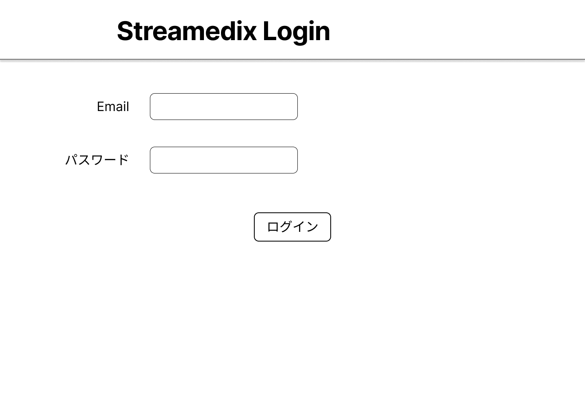

# 画面仕様書 / Screen Specification

- Revision

    | Rev | Date       | Auth       | Note        |
    |----:|------------|------------|-------------|
    | 1.0 | 2025-07-25 | ChatGPT    | 初版 Drafted |
    | 1.1 | 2025-08-19 | Claude     | API仕様との整合性確保のための修正 |


## 1. 画面名称 / Screen Title

- 日本語: ログイン画面
- English: Login Screen

### 1-1. 機能ID / Functional Identifier

- 機能ID（日本語）: login
- Functional Name (English): login
- 使用例（SPAルーティング）: `/login`


## 2. 機能概要 / Function Overview

[Japanese]

- メールアドレスとパスワードで認証を行うログイン画面。
- 認証成功時に「ユーザーマスタ」情報を取得し、画面遷移（本登録またはメニュー）を実行。
- 仮登録状態のユーザーは次画面で本登録を促される。

[English]

- Login screen that authenticates using email address and password.
- On successful authentication, retrieves "User Master" info and redirects user (to registration or main menu).
- If the user is temporarily registered, they are redirected to the registration screen.

---

## 3. 画面利用対象ユーザー / Target Users

- 全利用者（医療機関・ディーラー・メーカー・管理者）
- All users (Medical institutions, dealers, manufacturers, and administrators)

<div style="page-break-before: always;"></div>

## 4. 運用概要 / Operational Usage

[Japanese]

- 画面からメールアドレスとパスワードを入力してログイン操作を行う
- API経由でログイン処理を実行し、結果に応じた画面遷移を行う

[English]

- Users enter their email and password to log in from the screen.
- The system calls the login API and navigates to the appropriate screen based on the result.

<div style="page-break-before: always;"></div>

## 5. 処理の流れ / Processing Flow

[Japanese]

1. メールアドレス・パスワードを入力し、ログインボタンを押下
2. `/api/v1/auth/login` に対して POST 送信
3. 認証成功 → `next_action` に応じて画面遷移
4. 認証失敗 → メッセージ表示

[English]

1. Enter email and password, then click the login button.
2. Send POST request to `/api/v1/auth/login`.
3. On success → Navigate based on `next_action`.
4. On failure → Display error message.

<div style="page-break-before: always;"></div>

## 6. 入出力仕様 / Input / Output Specifications

### 6.1 入力フォーム項目 / Input Form Fields

| 項目         | フィールド   | 要件                     |
|--------------|--------------|--------------------------|
| メールアドレス | e_mail       | Email形式で必須入力     |
| パスワード     | password     | 任意文字列で必須入力     |

### 6.2 一覧表示項目 / List Display Fields

| 項目 | 表示対象 | フィールド | ソート順 |
|------|----------|------------|----------|
| なし | -        | -          | -        |

---

## 7. バリデーション仕様 / Validation Rules

[Japanese]

- メールアドレス：形式チェック（@を含む有効なメール形式）
- パスワード：空欄不可、8文字以上推奨

[English]

- Email: Format validation (must be valid email address)
- Password: Required field, recommended 8+ characters

<div style="page-break-before: always;"></div>

## 8. API連携仕様 / API Integration

### 8.1 `POST /api/v1/auth/login`

- 認証処理を行うログインAPI
- リクエスト：`LoginRequest (e_mail, password)`
- レスポンス：`LoginResponse (success, user_id, user_status, next_action, message)`
  - **Ver1.1修正**: entity_type, entity_relation_idは認証APIレスポンスに含まれません
- next_action:
  - `show_user_registration`：仮登録中
  - `show_main_menu`：通常ログイン成功
  - `inactive`：利用停止中
  - `error`：不正な状態

<div style="page-break-before: always;"></div>

## 9. 画面遷移 / Screen Navigation

| 操作   | 説明                                      |
|--------|-------------------------------------------|
| ログイン | メールアドレスとパスワードを送信、遷移処理を実施 |

### 9.1 画面イメージ

<p style="border: 1px solid #ccc; display: inline-block;">
  
</p>

<div style="page-break-before: always;"></div>

## 10. PoC制約事項 / Limitations for PoC Version

[Japanese]

- パスワードは平文のまま比較
- トークン認証は未実装
- セッション維持処理は未対応（今後対応）

[English]

- Password comparison is in plaintext.
- Token-based authentication is not implemented.
- Session management is not supported yet (to be implemented later).

<div style="page-break-before: always;"></div>

## 11. フロントエンド開発者向け補足 / Notes for Frontend Developer

- 接続先API: `http://192.168.99.118:8000/api/v1/auth/login`
- 通信方式: POST / JSON
- 認証: 現在は認証トークン不要（将来的にJWT等を予定）
- ステータスコード: 200（成功）, 422（バリデーション）, 404（該当なし）

```ts
import axios from 'axios';

const login = async (email: string, password: string) => {
  const res = await axios.post('http://192.168.99.118:8000/api/v1/auth/login', {
    e_mail: email,
    password: password
  });
  return res.data;
};
````

<div style="page-break-before: always;"></div>

## 12. 処理メッセージ仕様 / Operation Messages

### 12.1 共通メッセージ / Common Messages

| タイミング   | ステータス  | 表示メッセージ                      | 備考                  |
| ------- | ------ | ---------------------------- | ------------------- |
| 認証成功    | 200 OK | ログインに成功しました。                 | 通常ログイン（本登録済み）       |
| 仮登録状態   | 200 OK | 仮登録状態です。本登録を完了してください。        | 次画面へ誘導              |
| 利用停止状態  | 200 OK | アカウントが利用停止中です。管理者にお問い合わせください。 | **Ver1.1追加**: inactive状態への対応 |
| 認証失敗    | 401    | メールアドレス、またはパスワードが間違っています。    | **Ver1.1修正**: 401 Unauthorized |
| メールアドレス未登録 | 404 | メールアドレスが登録されていません。 | **Ver1.1追加**: 404 Not Found |
| 入力エラー   | 422    | 入力内容に不備があります。再確認してください。      | -                   |
| サーバーエラー | 500    | サーバーでエラーが発生しました。後で再度お試しください。 | -                   |

### 12.2 バリデーションエラー表示例

| フィールド    | メッセージ               |
| -------- | ------------------- |
| e\_mail  | メールアドレスの形式が正しくありません |
| password | パスワードを入力してください      |

### 12.3 API別メッセージまとめ

| API              | 成功時メッセージ     | 失敗時メッセージ                  |
| ---------------- | ------------ | ------------------------- |
| POST /auth/login | ログインに成功しました。 | メールアドレス、またはパスワードが間違っています。 |

### 12.4 表示方法の推奨 / Display Recommendations

[Japanese]

- 通知メッセージは画面下部右にトースト表示
- エラーはフィールド横またはモーダルで表示

[English]

- Show toast notifications at bottom-right
- Show errors beside field or in a modal

---

以上
