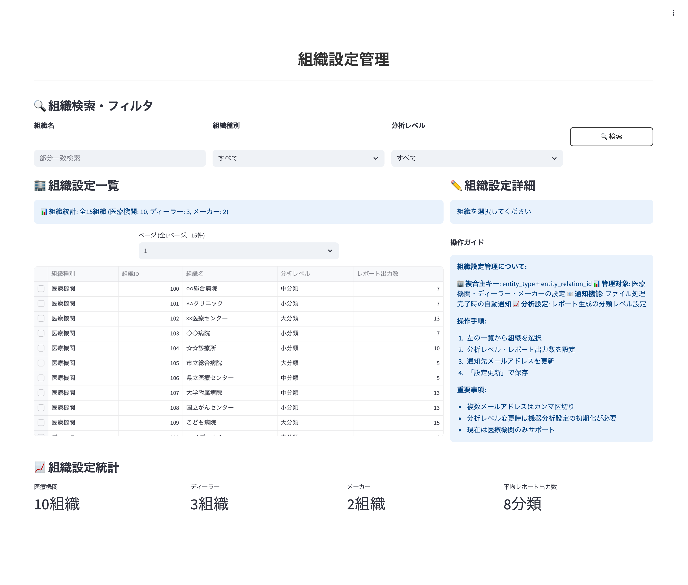
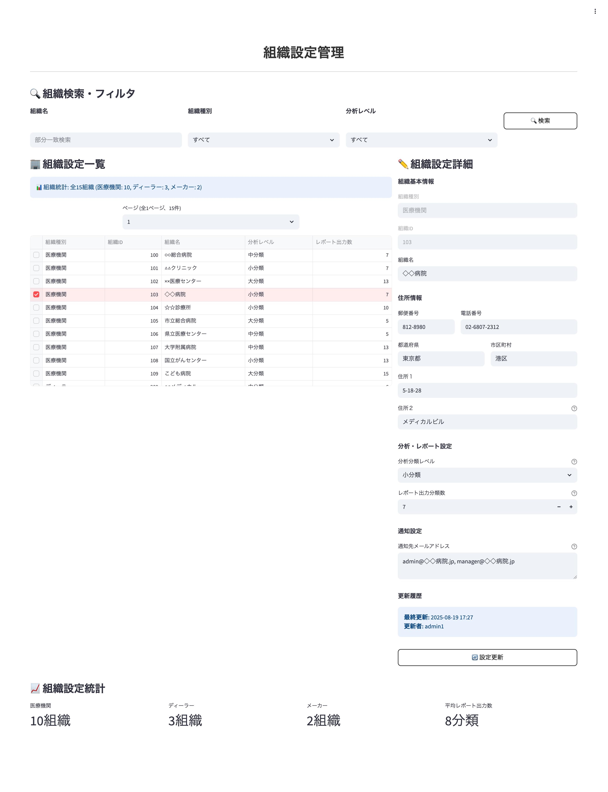

# 画面仕様書 / Screen Specification

- Revision

    | Rev | Date       | Auth       | Note        |
    |----:|------------|------------|-------------|
    | 1.0 | 2025-08-20 | Claude     | 初版作成 / Initial version |

## 1. 画面名称 / Screen Title

- 日本語: 組織設定管理画面
- English: Organization Settings Management Screen

### 1-1. 機能ID / Functional Identifier

- 機能ID（日本語）: organization-settings-management
- Functional Name (English): organization-settings-management
- 使用例（SPAルーティング）: `/admin/organization-settings`

## 2. 機能概要 / Function Overview

[Japanese]

- 組織（医療機関・ディーラー・メーカー）の設定情報を管理する画面
- 複合主キー（entity_type + entity_relation_id）による組織データの管理
- 通知設定・分析分類レベル・レポート出力設定・住所情報等の詳細管理
- user_entity_link テーブルに対応した組織情報のメンテナンス機能

[English]

- Management screen for organization (medical facilities, dealers, manufacturers) settings information
- Management of organization data using composite primary key (entity_type + entity_relation_id)
- Detailed management of notification settings, analysis classification levels, report output settings, address information, etc.
- Organization information maintenance functionality corresponding to user_entity_link table

---

## 3. 画面利用対象ユーザー / Target Users

- システム管理者 (user_id: 900001-999999): 全組織の設定情報を管理可能
- ※医療機関ユーザーは本画面にアクセス不可（権限制限）

<div style="page-break-before: always;"></div>

## 4. 運用概要 / Operational Usage

[Japanese]

- ユーザーマスタメンテナンス画面でのユーザー追加時に自動的に組織連携レコードを作成
- 各組織の住所情報・連絡先情報・通知先メール設定の管理
- 分析対象機器分類レベルの設定による、機器分析機能の制御
- レポート出力分類数の設定による、出力レポートの内容制御
- 組織設定情報の参照・更新による運用管理業務の支援

[English]

- Automatically creates organization link records when adding users in the User Master Maintenance screen
- Management of address information, contact information, and notification email settings for each organization
- Control of equipment analysis functions through setting analysis target equipment classification levels
- Content control of output reports through setting report output classification count
- Support for operational management tasks through viewing and updating organization settings information

<div style="page-break-before: always;"></div>

## 5. 処理の流れ / Processing Flow

[Japanese]

1. **画面初期表示**: `GET /api/v1/user-entity-links` で組織設定一覧を取得（管理者権限チェック）
2. **検索・フィルタ**: 組織名、entity_type、分析レベル等での絞り込み実行
3. **詳細表示**: 一覧から組織情報を選択し、詳細情報をフォームに表示
4. **新規作成**: 「新規作成」ボタンでフォーム初期化、必要情報入力後 `POST /api/v1/user-entity-links` で登録
5. **情報更新**: 既存情報を編集後 `PUT /api/v1/user-entity-links/{entity_type}/{entity_relation_id}` で更新実行
6. **結果表示**: 各操作の成功・失敗結果をユーザーに通知

[English]

1. **Initial screen display**: Retrieve organization settings list via `GET /api/v1/user-entity-links` (administrator permission check)
2. **Search and filter**: Execute filtering by organization name, entity_type, analysis level, etc.
3. **Detail display**: Select organization information from list and display detailed information in form
4. **New creation**: Initialize form with "New Creation" button, register via `POST /api/v1/user-entity-links` after inputting required information
5. **Information update**: Update via `PUT /api/v1/user-entity-links/{entity_type}/{entity_relation_id}` after editing existing information
6. **Result display**: Notify users of success/failure results for each operation

<div style="page-break-before: always;"></div>

## 6. 入出力仕様 / Input / Output Specifications

### 6.1 入力フォーム項目 / Input Form Fields

| 項目 / Item | フィールド / Field | 要件 / Requirements |
|-------------|-------------------|---------------------|
| 組織種別 / Entity Type | entity_type | 表示のみ、1:医療機関、2:ディーラー、3:メーカー |
| 組織ID / Organization ID | entity_relation_id | 表示のみ、整数 |
| 組織名 / Organization Name | entity_name | 必須、最大100文字 |
| 郵便番号 / Postal Code | postal_code | 任意、XXX-XXXX形式 |
| 都道府県 / Prefecture | prefecture | 任意、最大20文字 |
| 市区町村 / City | city | 任意、最大50文字 |
| 住所１ / Address 1 | address1 | 任意、最大100文字 |
| 住所２ / Address 2 | address2 | 任意、最大100文字（建物名・階数等） |
| 電話番号 / Phone Number | phone_number | 任意、ハイフン含む形式 |
| 分析分類レベル / Analysis Classification Level | analiris_classification_level | 必須、選択肢（1:大分類、2:中分類、3:小分類） |
| レポート出力分類数 / Report Classification Count | count_reportout_classification | 必須、整数（1-20、デフォルト:5） |
| 通知先メールアドレス / Notification Email List | notification_email_list | 任意、複数行テキスト（カンマ区切り） |

### 6.2 一覧表示項目 / List Display Fields

| 項目 / Item | 表示対象 / Display | フィールド / Field | ソート順 / Sort |
|-------------|-------------------|-------------------|-----------------|
| 組織種別 / Entity Type | ○ | entity_type_name | 1 |
| 組織ID / Organization ID | ○ | entity_relation_id | 2 |
| 組織名 / Organization Name | ○ | entity_name | - |
| 分析レベル / Analysis Level | ○ | analiris_classification_level_name | - |
| レポート出力数 / Report Count | ○ | count_reportout_classification | - |

---

## 7. バリデーション仕様 / Validation Rules

[Japanese]

- **組織名**: 必須、最大100文字以内
- **郵便番号**: 任意、XXX-XXXX形式（3桁-4桁）
- **都道府県**: 任意、最大20文字以内
- **市区町村**: 任意、最大50文字以内
- **住所１**: 任意、最大100文字以内
- **住所２**: 任意、最大100文字以内
- **電話番号**: 任意、一般的な電話番号形式
- **分析分類レベル**: 必須、1(大分類)・2(中分類)・3(小分類)から選択
- **レポート出力分類数**: 必須、1-20の範囲内、整数のみ
- **通知先メールアドレス**: 任意、カンマ区切り形式、各メールアドレスの形式チェック、最大10件

[English]

- **Organization Name**: Required, maximum 100 characters
- **Postal Code**: Optional, XXX-XXXX format (3 digits - 4 digits)
- **Prefecture**: Optional, maximum 20 characters
- **City**: Optional, maximum 50 characters
- **Address 1**: Optional, maximum 100 characters
- **Address 2**: Optional, maximum 100 characters
- **Phone Number**: Optional, general phone number format
- **Analysis Classification Level**: Required, select from 1(Major), 2(Sub), 3(Detailed)
- **Report Classification Count**: Required, within range 1-20, integers only
- **Notification Email List**: Optional, comma-separated format, format check for each email address, maximum 10 entries

<div style="page-break-before: always;"></div>

## 8. API連携仕様 / API Integration

### 8.1 `GET /api/v1/user-entity-links`

- **必須ヘッダー**: `X-User-Id: {user_id}`（システム管理者のみ）
- **クエリパラメータ**: 
  - skip: スキップ件数（デフォルト: 0）
  - limit: 取得件数（デフォルト: 100、最大: 100）
  - entity_type: 組織種別でフィルタ
  - entity_name: 組織名でフィルタ（部分一致）
- **レスポンス**: 組織設定一覧
- **権限**: システム管理者のみアクセス可能

### 8.2 `GET /api/v1/user-entity-links/{entity_type}/{entity_relation_id}`

- **必須ヘッダー**: `X-User-Id: {user_id}`（システム管理者のみ）
- **パスパラメータ**: entity_type（組織種別）, entity_relation_id（組織ID）
- **レスポンス**: 指定された組織の詳細設定情報
- **権限**: システム管理者のみアクセス可能

### 8.3 `POST /api/v1/user-entity-links`

- **必須ヘッダー**: `X-User-Id: {user_id}`（システム管理者のみ）
- **リクエストボディ**: 組織設定情報（entity_type, entity_relation_id, entity_nameは必須）
- **レスポンス**: 作成された組織設定情報
- **権限**: システム管理者のみ
- **注意**: 既存の複合主キー（entity_type + entity_relation_id）と重複する場合はエラー

### 8.4 `PUT /api/v1/user-entity-links/{entity_type}/{entity_relation_id}`

- **必須ヘッダー**: `X-User-Id: {user_id}`（システム管理者のみ）
- **パスパラメータ**: entity_type（組織種別）, entity_relation_id（組織ID）
- **リクエストボディ**: 更新する組織設定情報
- **レスポンス**: 更新された組織設定情報
- **権限**: システ管理者のみ

<div style="page-break-before: always;"></div>

## 9. 画面遷移 / Screen Navigation

| 操作 / Operation | 説明 / Description |
|------------------|-------------------|
| 検索実行 / Search | 条件入力後、一覧表示を更新 |
| 新規作成 / New Creation | フォーム初期化、入力後登録実行 |
| 詳細表示 / View Details | 一覧から選択、詳細情報をフォーム表示 |
| 情報更新 / Update Information | 詳細表示状態で編集、更新実行 |
| ページ移動 / Pagination | 前へ・次へボタンでページ遷移 |

### 9.1 画面イメージ

#### 基本画面（組織一覧・検索）
<p style="border: 1px solid #ccc; display: inline-block;">
  
</p>

#### 詳細設定画面
<p style="border: 1px solid #ccc; display: inline-block;">
  
</p>

<div style="page-break-before: always;"></div>

## 10. PoC制約事項 / Limitations for PoC Version

[Japanese]

- 現在は医療機関（entity_type=1）のみをサポート（ディーラー・メーカーは将来拡張）
- 通知機能は現状未対応（notification_email_listの設定のみ）
- 一括インポート・エクスポート機能は未実装
- 組織設定の履歴管理機能は未実装
- 住所の自動補完機能は未実装

[English]

- Currently supports only medical facilities (entity_type=1) (dealers and manufacturers will be expanded in the future)
- Notification functionality is currently not supported (only notification_email_list settings)
- Bulk import/export functionality is not implemented
- Organization settings history management functionality is not implemented
- Address auto-completion functionality is not implemented

## 11. フロントエンド開発者向け補足 / Notes for Frontend Developer

この画面は、Next.js等のフロントエンドSPAがFastAPIバックエンドとREST APIで接続する構成を想定しています。

### 🔌 接続情報 / Connection Details

| 項目 / Item | 内容 / Content |
|-------------|---------------|
| 接続先API / API Endpoint | `http://192.168.99.118:8000/api/v1/user-entity-links`（PoC用） |
| 通信方式 / Communication | REST（`fetch` や `axios` など） |
| データ形式 / Data Format | JSON（リクエスト／レスポンス共通） |
| 認証 / Authentication | `X-User-Id` ヘッダーによる認証が必要（システム管理者のみ） |
| CORS | `Access-Control-Allow-Origin: *` を許可済（開発用途） |
| ステータスコード / Status Codes | `200 OK`, `403 Forbidden`, `404 Not Found`, `422 Validation Error`, `500 Internal Server Error` |

### 📦 APIレスポンス構造（例）

```json
{
  "entity_type": 1,
  "entity_relation_id": 22,
  "entity_name": "○○総合病院",
  "postal_code": "123-4567",
  "prefecture": "東京都",
  "city": "中央区",
  "address1": "1-2-3",
  "address2": "医療ビル5F",
  "phone_number": "03-1234-5678",
  "notification_email_list": ["admin@hospital.jp", "manager@hospital.jp"],
  "count_reportout_classification": 10,
  "analiris_classification_level": 2,
  "reg_user_id": 900001,
  "regdate": "2025-08-19T10:00:00",
  "update_user_id": 900001,
  "lastupdate": "2025-08-20T15:30:00"
}
```

### 🛠 axios使用例

```ts
import axios from 'axios';

const apiBase = 'http://192.168.99.118:8000/api/v1/user-entity-links';

export const fetchOrganizationSettings = async (currentUserId: number, skip = 0, limit = 100) => {
  const res = await axios.get(`${apiBase}?skip=${skip}&limit=${limit}`, {
    headers: {
      'X-User-Id': currentUserId.toString()
    }
  });
  return res.data;
};

export const fetchOrganizationDetail = async (currentUserId: number, entityType: number, entityRelationId: number) => {
  const res = await axios.get(`${apiBase}/${entityType}/${entityRelationId}`, {
    headers: {
      'X-User-Id': currentUserId.toString()
    }
  });
  return res.data;
};

export const updateOrganizationSettings = async (currentUserId: number, entityType: number, entityRelationId: number, orgData: any) => {
  const res = await axios.put(`${apiBase}/${entityType}/${entityRelationId}`, orgData, {
    headers: {
      'X-User-Id': currentUserId.toString(),
      'Content-Type': 'application/json'
    }
  });
  return res.data;
};
```

### 🔗 複合主キー管理のポイント

```ts
// 複合主キー（entity_type + entity_relation_id）での更新処理例
const updateOrganizationSettings = async (currentUserId: number, orgData: any) => {
  const updateData = {
    entity_name: orgData.entity_name,
    postal_code: orgData.postal_code,
    prefecture: orgData.prefecture,
    city: orgData.city,
    address1: orgData.address1,
    address2: orgData.address2,
    phone_number: orgData.phone_number,
    notification_email_list: orgData.notification_email_list,
    count_reportout_classification: orgData.count_reportout_classification,
    analiris_classification_level: orgData.analiris_classification_level
  };
  
  const res = await axios.put(
    `${apiBase}/${orgData.entity_type}/${orgData.entity_relation_id}`, 
    updateData, 
    {
      headers: {
        'X-User-Id': currentUserId.toString(),
        'Content-Type': 'application/json'
      }
    }
  );
  return res.data;
};
```

### 📧 メールアドレス処理

```ts
// カンマ区切りメールアドレスの処理
const formatEmailList = (emailString: string): string[] => {
  return emailString.split(',').map(email => email.trim()).filter(email => email.length > 0);
};

const validateEmailList = (emailList: string[]): boolean => {
  const emailPattern = /^[^\s@]+@[^\s@]+\.[^\s@]+$/;
  return emailList.every(email => emailPattern.test(email)) && emailList.length <= 10;
};
```

<div style="page-break-before: always;"></div>

## 12. 処理メッセージ仕様 / Operation Messages

この画面では、ユーザーに対して各操作の結果を明示的に伝えるために、以下のようなメッセージを表示します。

### 12.1 共通メッセージ / Common Messages

| タイミング / Timing | ステータス / Status | 表示メッセージ / Message | 備考 / Notes |
|--------------------|--------------------|-----------------------|-------------|
| 作成成功 / Creation Success | 200 OK | 組織設定情報を作成しました。 | 新規作成時 |
| 更新成功 / Update Success | 200 OK | 組織設定情報を更新しました。 | 情報更新時 |
| 権限エラー / Permission Error | 403 Forbidden | アクセス権限がありません。システム管理者のみ利用可能です。 | 権限不足時 |
| データ不存在 / Data Not Found | 404 Not Found | 指定された組織設定情報が見つかりません。 | データ不存在時 |
| 重複エラー / Duplicate Error | 400 Bad Request | 同じ組織の設定情報が既に存在します。 | 複合主キー重複時 |
| バリデーションエラー / Validation Error | 422 Unprocessable Entity | 入力内容に不備があります。再確認してください。 | 入力検証エラー |
| サーバーエラー / Server Error | 500 Internal Server Error | サーバーでエラーが発生しました。後で再度お試しください。 | システムエラー |

### 12.2 フィールド別バリデーションエラーメッセージ例

| フィールド / Field | エラーメッセージ / Error Message |
|-------------------|--------------------------------|
| entity_name | 組織名は必須です。100文字以内で入力してください。 |
| postal_code | 郵便番号はXXX-XXXX形式で入力してください。 |
| prefecture | 都道府県は20文字以内で入力してください。 |
| city | 市区町村は50文字以内で入力してください。 |
| address1 | 住所１は100文字以内で入力してください。 |
| address2 | 住所２は100文字以内で入力してください。 |
| phone_number | 電話番号の形式が正しくありません。 |
| notification_email_list | 通知メールアドレスの形式が正しくありません。カンマ区切りで最大10件まで入力できます。 |
| count_reportout_classification | レポート出力分類数は1-20の範囲で入力してください。 |
| analiris_classification_level | 分析分類レベルを選択してください。 |

### 12.3 API別メッセージまとめ

| APIエンドポイント / API Endpoint | 成功時メッセージ / Success Message | 失敗時メッセージ / Error Message |
|----------------------------------|-----------------------------------|--------------------------------|
| `POST /api/v1/user-entity-links` | 組織設定情報を作成しました。 | 入力に不備があります。または既に同じ組織の設定が存在します。 |
| `PUT /api/v1/user-entity-links/{entity_type}/{entity_relation_id}` | 組織設定情報を更新しました。 | 対象の組織設定情報が見つかりません。 |

### 12.4 表示方法の推奨 / Display Recommendations

[Japanese]

- メッセージは画面右下の**トースト通知**または上部への**アラート表示**が望ましい
- 重大エラー（500番台など）はモーダルでブロッキング表示してもよい
- バリデーションエラーは該当項目の**下部 or 横に赤字表示**（フィールド単位）
- 住所情報のように関連フィールドが多い場合は、セクション単位でのエラー表示も考慮

[English]

- Toast notifications at the bottom right of the screen or alert messages at the top are preferred
- For critical errors (e.g., 500 series), a blocking modal dialog may be used
- Validation errors should be displayed in red text below or beside the corresponding field
- For related fields like address information, consider section-level error display

---

以上