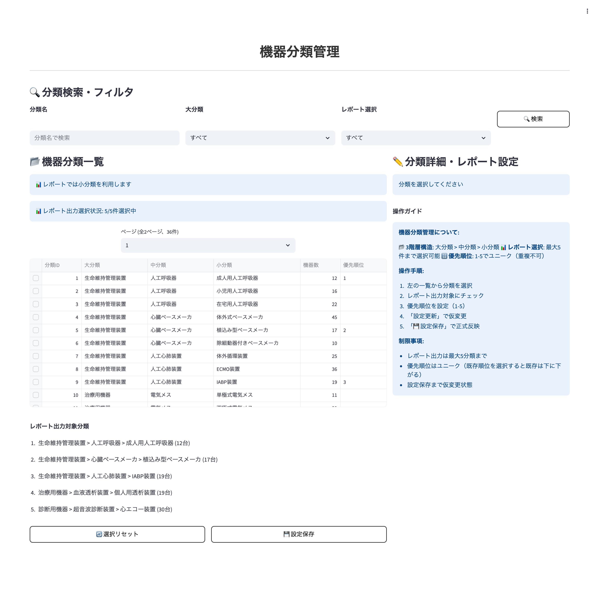
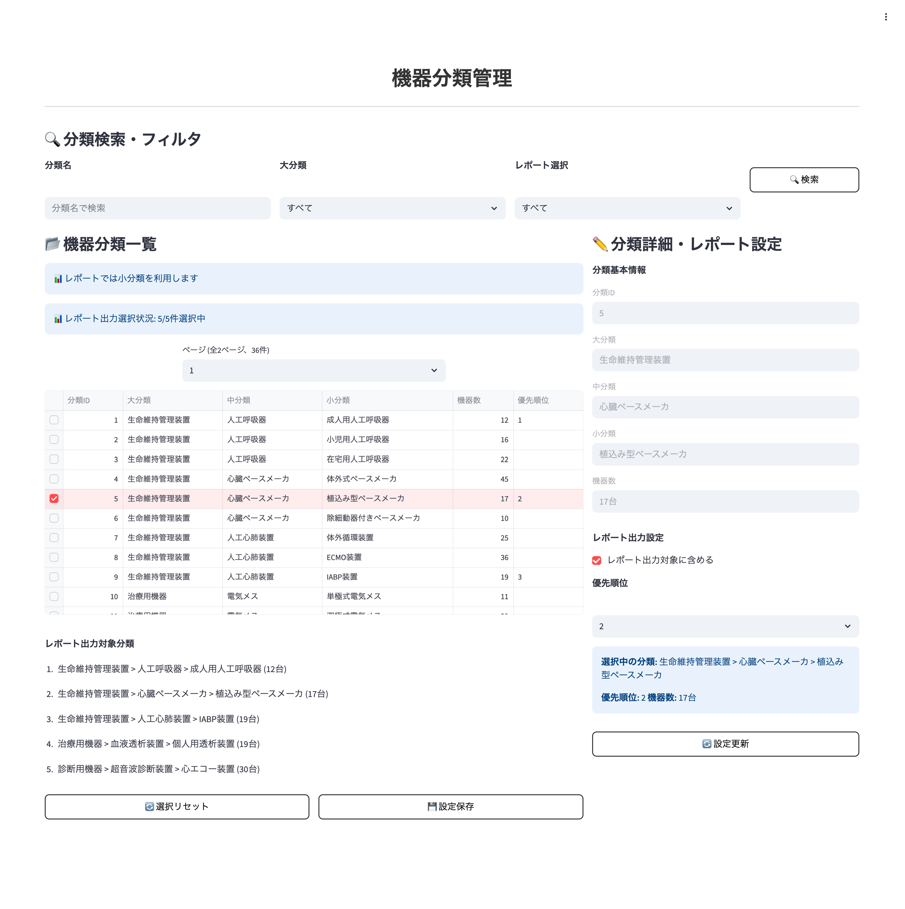

# 画面仕様書 / Screen Specification

- Revision

    | Rev | Date       | Auth       | Note    |
    |----:|------------|------------|---------|
    | 1.0 | 2025.08.25 | Claude     | 新規作成 |

## 1. 画面名称 / Screen Title

- 日本語: レポート分類選択設定画面
- English: Report Classification Selection Settings Screen

### 1-1. 機能ID / Functional Identifier

- 機能ID（日本語）: レポート分類選択設定管理
- Functional Name (English): report-classification-settings
- 使用例（SPAルーティング）: `/report-classification-settings` または `/equipment/report-selection`

## 2. 機能概要 / Function Overview

[Japanese]

レポート出力用の機器分類選択・優先順位設定を管理する画面です。医療機関がレポートに含めたい機器分類を選択し、優先順位を設定できます。選択可能数は`user_entity_link.count_reportout_classification`に基づいて制限されます。

**主な機能**:
- 機器分類のレポート出力対象選択・優先順位設定
- 最大選択数制限の管理（user_entity_link設定値による）
- 選択済み分類の優先順位変更（セレクトボックスによる数値指定）
- 選択情報の一括削除・リセット機能
- 3階層分類構造（大分類・中分類・小分類）への対応

[English]

This screen manages equipment classification selection and priority settings for report output. Medical facilities can select equipment classifications to include in reports and set their priorities. The selectable count is limited based on `user_entity_link.count_reportout_classification`.

**Main Features**:
- Selection and priority setting of equipment classifications for report output
- Management of maximum selection count limit (based on user_entity_link setting value)
- Priority change for selected classifications (drag & drop or order change buttons)
- Bulk deletion of selection information
- Support for 3-level classification hierarchy (major, medium, minor classifications)

## 3. 画面利用対象ユーザー / Target Users

- システム管理者 (user_id: "900001"-"999999"): 全医療機関のレポート分類選択設定へのアクセス・管理可能
- 医療機関ユーザー (entity_type=1): 自医療機関のレポート分類選択設定のみアクセス・管理可能

## 4. 運用概要 / Operational Usage

[Japanese]

医療機関向けレポート作成時に、どの機器分類をレポートに含めるかを事前に設定します。設定された分類は優先順位に基づいてレポートに出力されます。

**典型的な運用シナリオ**:
1. **初期設定**: 新規医療機関登録時に、重要な機器分類を選択・優先順位設定
2. **定期見直し**: 月次または四半期ごとに選択分類と優先順位の見直し
3. **レポート最適化**: レポートの見やすさを向上させるため、不要な分類の除外
4. **緊急対応**: 特定期間のみ重要度が変わる分類の優先順位調整

最大選択数は組織連携設定で管理され、通常5-15分類程度に設定されます。選択数が多すぎると読みにくいレポートになるため、適切な数に絞り込むことが重要です。

[English]

When creating reports for medical facilities, this pre-configures which equipment classifications to include in the reports. Selected classifications are output to reports based on their priority order.

**Typical Operational Scenarios**:
1. **Initial Setup**: Select and prioritize important equipment classifications during new medical facility registration
2. **Regular Review**: Review selected classifications and priorities monthly or quarterly  
3. **Report Optimization**: Remove unnecessary classifications to improve report readability
4. **Emergency Response**: Adjust priorities of classifications whose importance changes temporarily

Maximum selection count is managed in organization link settings, typically set to around 5-15 classifications. Too many selections make reports difficult to read, so it's important to narrow down to an appropriate number.

## 5. 処理の流れ / Processing Flow

[Japanese]

1. **機器分類一覧取得**
   - `GET /api/v1/equipment-classifications/{medical_id}` でデータ取得
   - 認証ヘッダー `X-User-Id` が必須
   - 階層構造（大分類→中分類→小分類）でソート表示
   - skip/limitによるページング（デフォルト100件、最大1000件）

2. **現在の選択情報取得**
   - `GET /api/v1/equipment-classifications/report-selection/{medical_id}` で現在の選択状況取得
   - 最大選択可能数（max_count）の確認
   - 既に選択済みの分類とその優先順位を表示

3. **分類選択・優先順位設定**
   - 左側: 利用可能分類一覧（階層表示）
   - 右側: 選択済み分類一覧（優先順位表示）
   - チェックボックスまたはドラッグ&ドロップで選択
   - 選択数が最大数に達したら追加選択を無効化

4. **優先順位変更**
   - ドラッグ&ドロップによる順序変更
   - 上下矢印ボタンによる順序変更
   - 数値入力による直接順序指定

5. **設定保存**
   - `POST /api/v1/equipment-classifications/report-selection/{medical_id}` で一括保存
   - classification_ids配列の順序が優先順位となる
   - 既存設定は完全に置き換えられる

6. **設定削除**
   - `DELETE /api/v1/equipment-classifications/report-selection/{medical_id}` で全削除
   - 削除前に確認ダイアログを表示

[English]

1. **Retrieve Equipment Classification List**
   - Retrieve data via `GET /api/v1/equipment-classifications/{medical_id}`
   - Authentication header `X-User-Id` is required
   - Display sorted by hierarchy (major→medium→minor classifications)
   - Pagination with skip/limit (default 100 records, max 1000)

2. **Retrieve Current Selection Information**
   - Retrieve current selection status via `GET /api/v1/equipment-classifications/report-selection/{medical_id}`
   - Confirm maximum selectable count (max_count)
   - Display already selected classifications and their priorities

3. **Classification Selection and Priority Setting**
   - Left side: Available classification list (hierarchical display)
   - Right side: Selected classification list (priority display)
   - Select via checkboxes or drag & drop
   - Disable additional selection when maximum count is reached

4. **Priority Change**
   - Order change by drag & drop
   - Order change by up/down arrow buttons
   - Direct order specification by numeric input

5. **Save Settings**
   - Bulk save via `POST /api/v1/equipment-classifications/report-selection/{medical_id}`
   - Order of classification_ids array becomes priority
   - Existing settings are completely replaced

6. **Delete Settings**
   - Delete all via `DELETE /api/v1/equipment-classifications/report-selection/{medical_id}`
   - Display confirmation dialog before deletion

## 6. 入出力仕様 / Input/Output Specifications

### 6.1 分類一覧表示項目 / Classification List Display Fields

| 項目名 | フィールド名 | 表示内容 | ソート可否 |
|--------|--------------|----------|------------|
| 選択 | - | チェックボックス | - |
| 分類ID | classification_id | 数値表示 | ○ |
| 階層レベル | classification_level | 1-3の数値（大中小） | ○ |
| 分類名 | classification_name | 階層インデント付き表示 | ○ |
| 分類コード | classification_code | 文字列表示 | ○ |
| 親分類 | parent_classification_id | 親分類名表示 | - |

### 6.2 選択済み分類表示項目 / Selected Classification Display Fields

| 項目名 | フィールド名 | 表示内容 | 操作 |
|--------|--------------|----------|------|
| 優先順位 | rank | 1から始まる連番 | ドラッグ&ドロップ、矢印ボタン |
| 分類名 | classification_name | 文字列表示 | - |
| 削除 | - | ×ボタン | 個別削除 |

### 6.3 設定項目 / Configuration Fields

| 項目名 | フィールド名 | 入力形式 | 説明 |
|--------|--------------|----------|------|
| 最大選択数 | max_count | 表示のみ | user_entity_link.count_reportout_classificationより取得 |
| 現在選択数 | current_count | 表示のみ | 選択済み分類の数 |
| 選択分類リスト | classification_ids | 配列 | 優先順位順の分類ID配列 |

### 6.4 検索・フィルタ項目 / Search and Filter Fields

| 項目名 | フィールド名 | 入力形式 | 説明 |
|--------|--------------|----------|------|
| 分類名検索 | classification_name | テキスト入力 | 部分一致検索 |
| 階層レベル | classification_level | セレクトボックス | 1:大分類、2:中分類、3:小分類 |
| 選択状態 | selection_status | セレクトボックス | 選択済み/未選択でフィルタ |

## 7. バリデーション仕様 / Validation Rules

[Japanese]

### 7.1 選択数制限
- 最大選択数（max_count）を超える選択は不可
- 重複する分類IDは選択不可
- 最低1つは選択必須

### 7.2 優先順位
- 優先順位は1から始まる連番
- 重複する優先順位は自動調整
- 空白の優先順位は許可しない

### 7.3 分類ID
- 存在する分類IDのみ選択可能
- 対象医療機関の分類のみ選択可能
- 数値形式のチェック

### 7.4 検索・フィルタ
- 検索文字列は最大100文字以内
- ページング: skip >= 0, limit <= 1000

[English]

### 7.1 Selection Count Limit
- Cannot select more than maximum count (max_count)
- Duplicate classification IDs cannot be selected
- At least one selection is required

### 7.2 Priority
- Priority starts from 1 as consecutive numbers
- Duplicate priorities are automatically adjusted
- Blank priorities are not allowed

### 7.3 Classification ID
- Only existing classification IDs can be selected
- Only classifications for target medical facility can be selected
- Numeric format check

### 7.4 Search and Filter
- Search strings must be within 100 characters
- Pagination: skip >= 0, limit <= 1000

## 8. API連携仕様 / API Integration

### 8.1 `GET /api/v1/equipment-classifications/{medical_id}`

**認証**: `X-User-Id` ヘッダー必須
**権限**: システム管理者（全データ）、医療機関ユーザー（自医療機関のみ）
**パラメータ**:
- skip: スキップ件数（デフォルト: 0）
- limit: 取得件数（デフォルト: 100、最大: 1000）

**レスポンス例**:
```json
{
  "total": 150,
  "skip": 0,
  "limit": 100,
  "items": [
    {
      "classification_id": 1001,
      "medical_id": 22,
      "classification_level": 1,
      "parent_classification_id": null,
      "classification_name": "手術器械",
      "classification_code": "SURGERY",
      "sort_order": 1
    }
  ]
}
```

### 8.2 `GET /api/v1/equipment-classifications/report-selection/{medical_id}`

**認証**: `X-User-Id` ヘッダー必須
**レスポンス例**:
```json
{
  "medical_id": 22,
  "max_count": 10,
  "selections": [
    {
      "rank": 1,
      "classification_id": 1003,
      "classification_name": "メス"
    },
    {
      "rank": 2,
      "classification_id": 1015,
      "classification_name": "内視鏡"
    }
  ]
}
```

### 8.3 `POST /api/v1/equipment-classifications/report-selection/{medical_id}`

**認証**: `X-User-Id` ヘッダー必須
**リクエストボディ**:
```json
{
  "classification_ids": [1003, 1015, 1027, 1041, 1052]
}
```

### 8.4 `DELETE /api/v1/equipment-classifications/report-selection/{medical_id}`

**認証**: `X-User-Id` ヘッダー必須
**機能**: 全選択情報を削除

## 9. 画面遷移 / Screen Navigation

| 操作 | 説明 | 遷移先 |
|------|------|--------|
| 前へ | 前ページ表示（分類一覧） | 同画面（ページング） |
| 次へ | 次ページ表示（分類一覧） | 同画面（ページング） |
| 選択追加 | 分類を選択リストに追加 | 同画面（選択リスト更新） |
| 選択削除 | 分類を選択リストから削除 | 同画面（選択リスト更新） |
| 優先順位変更 | ドラッグ&ドロップまたは矢印 | 同画面（順序更新） |
| 保存 | 選択情報の保存 | 同画面（成功メッセージ） |
| リセット | 編集中の変更を破棄 | 同画面（保存済み状態に戻る） |
| 全削除 | 全選択情報の削除 | 同画面（確認ダイアログ経由） |

### 9.1 画面レイアウト構成 / Screen Layout Configuration

#### 9.1.1 機器分類管理画面全体表示



画面は以下の主要エリアで構成されています：

- **ヘッダー部**: 画面タイトル「機器分類管理」
- **検索・フィルタ部**: 分類名・大分類・レポート選択による絞り込み機能
- **機器分類一覧部**: 3階層構造（大分類・中分類・小分類）の分類一覧とページング
- **分類詳細・レポート設定部**: 選択された分類の詳細情報とレポート設定（右側パネル）
- **レポート出力対象分類**: 選択された分類の一覧表示（下部）

#### 9.1.2 分類選択・レポート設定表示



分類を選択すると右側パネルに以下の項目が表示されます：

- **分類基本情報**: 分類ID・大分類・中分類・小分類の表示
- **機器数**: 対象分類に属する機器の数
- **レポート出力設定**: レポート出力対象に含むかどうかのチェックボックス
- **優先順位**: レポート出力時の優先順位設定セレクトボックス
- **選択中の分類表示**: 現在選択されている分類とその機器数
- **操作ボタン**: 「設定更新」ボタン

#### 9.1.3 主要な操作フロー

1. **分類検索・フィルタ**: 上部の検索フィールドで分類を絞り込み
2. **分類選択**: 一覧から分類をクリック選択（チェックボックス）
3. **レポート設定**: 右側パネルでレポート出力対象のチェックと優先順位を設定
4. **優先順位設定**: セレクトボックスで優先順位（数値）を指定
5. **設定保存**: 「設定更新」ボタンで変更を保存
6. **一括操作**: 「選択リセット」で全設定リセット、「設定保存」で一括保存

## 10. PoC制約事項 / Limitations for PoC Version

[Japanese]

- ドラッグ&ドロップによる並び替えは簡易版実装
- 分類階層の視覚的表現は基本的なインデント表示のみ
- 一括選択・解除機能は未実装
- 選択履歴の表示機能は未実装
- エクスポート/インポート機能は未実装

[English]

- Drag & drop sorting is implemented in simplified version
- Visual representation of classification hierarchy is basic indent display only
- Bulk selection/deselection functionality is not implemented
- Selection history display functionality is not implemented
- Export/import functionality is not implemented

## 11. フロントエンド開発者向け補足 / Notes for Frontend Developer

この画面は、Next.js等のフロントエンドSPAがFastAPIバックエンドとREST APIで接続する構成を想定しています。

### 🔌 接続情報 / Connection Details

| 項目 | 内容 |
|------|------|
| 接続先API | `http://192.168.99.118:8000`（PoC用）<br>※将来的にAWS上での実装を予定 |
| 通信方式 | REST（`fetch` や `axios` など） |
| データ形式 | JSON（リクエスト/レスポンス共通） |
| 認証 | `X-User-Id` ヘッダーによる認証が必要 |
| CORS | `Access-Control-Allow-Origin: *` を許可済（開発用途） |

### 📦 APIレスポンス構造例

```json
// 分類一覧取得レスポンス
{
  "total": 150,
  "skip": 0,
  "limit": 100,
  "items": [
    {
      "classification_id": 1001,
      "medical_id": 22,
      "classification_level": 1,
      "parent_classification_id": null,
      "classification_name": "手術器械",
      "classification_code": "SURGERY",
      "sort_order": 1
    },
    {
      "classification_id": 1002,
      "medical_id": 22,
      "classification_level": 2,
      "parent_classification_id": 1001,
      "classification_name": "切開器械",
      "classification_code": "SURGERY_CUT",
      "sort_order": 1
    }
  ]
}

// 選択情報取得レスポンス
{
  "medical_id": 22,
  "max_count": 10,
  "selections": [
    {
      "rank": 1,
      "classification_id": 1003,
      "classification_name": "メス"
    },
    {
      "rank": 2,
      "classification_id": 1015,
      "classification_name": "内視鏡"
    }
  ]
}
```

### 🛠 axiosを使ったアクセス例

```typescript
import axios from 'axios';

const apiBase = 'http://192.168.99.118:8000/api/v1/equipment-classifications';

// 分類一覧取得
export const fetchClassifications = async (
  medicalId: number,
  skip = 0,
  limit = 100,
  currentUserId: string
) => {
  const res = await axios.get(`${apiBase}/${medicalId}?skip=${skip}&limit=${limit}`, {
    headers: {
      'X-User-Id': currentUserId
    }
  });
  return res.data;
};

// 選択情報取得
export const fetchReportSelection = async (
  medicalId: number,
  currentUserId: string
) => {
  const res = await axios.get(`${apiBase}/report-selection/${medicalId}`, {
    headers: {
      'X-User-Id': currentUserId
    }
  });
  return res.data;
};

// 選択情報保存
export const saveReportSelection = async (
  medicalId: number,
  classificationIds: number[],
  currentUserId: string
) => {
  const res = await axios.post(
    `${apiBase}/report-selection/${medicalId}`,
    {
      classification_ids: classificationIds
    },
    {
      headers: {
        'X-User-Id': currentUserId,
        'Content-Type': 'application/json'
      }
    }
  );
  return res.data;
};

// 選択情報削除
export const deleteReportSelection = async (
  medicalId: number,
  currentUserId: string
) => {
  const res = await axios.delete(`${apiBase}/report-selection/${medicalId}`, {
    headers: {
      'X-User-Id': currentUserId
    }
  });
  return res.data;
};
```

### 💡 UI実装のヒント

#### 階層表示の実装
```typescript
// 分類階層のインデント表示
const renderClassificationWithIndent = (item: Classification) => {
  const indentLevel = item.classification_level - 1;
  const indent = '　'.repeat(indentLevel * 2); // 全角スペースでインデント
  
  return (
    <div style={{ paddingLeft: `${indentLevel * 20}px` }}>
      {indent}{item.classification_name}
    </div>
  );
};
```

#### ドラッグ&ドロップの実装（react-beautiful-dnd使用例）
```typescript
import { DragDropContext, Droppable, Draggable } from 'react-beautiful-dnd';

const handleDragEnd = (result: DropResult) => {
  if (!result.destination) return;
  
  const newSelections = Array.from(selections);
  const [removed] = newSelections.splice(result.source.index, 1);
  newSelections.splice(result.destination.index, 0, removed);
  
  // 優先順位を更新
  const updatedSelections = newSelections.map((item, index) => ({
    ...item,
    rank: index + 1
  }));
  
  setSelections(updatedSelections);
};
```

#### 選択数制限の視覚的フィードバック
```typescript
const isSelectionDisabled = (classificationId: number) => {
  const isAlreadySelected = selections.some(s => s.classification_id === classificationId);
  const reachedMaxCount = selections.length >= maxCount;
  
  return !isAlreadySelected && reachedMaxCount;
};

// 制限に達した時のスタイル
const checkboxStyle = isSelectionDisabled(item.classification_id) 
  ? { opacity: 0.5, cursor: 'not-allowed' } 
  : { cursor: 'pointer' };
```

#### 状態管理のヒント
```typescript
interface ClassificationSelection {
  rank: number;
  classification_id: number;
  classification_name: string;
}

interface ReportSelectionState {
  availableClassifications: Classification[];
  selections: ClassificationSelection[];
  maxCount: number;
  isLoading: boolean;
  hasUnsavedChanges: boolean;
}

// 未保存変更の検知
const hasUnsavedChanges = () => {
  const currentIds = selections.map(s => s.classification_id);
  const savedIds = originalSelections.map(s => s.classification_id);
  
  return JSON.stringify(currentIds) !== JSON.stringify(savedIds);
};
```

### 🧪 curlでの簡易テスト例

```bash
# 分類一覧取得
curl -X GET "http://192.168.99.118:8000/api/v1/equipment-classifications/22" \
  -H "X-User-Id: 900001"

# 選択情報取得
curl -X GET "http://192.168.99.118:8000/api/v1/equipment-classifications/report-selection/22" \
  -H "X-User-Id: 900001"

# 選択情報保存
curl -X POST "http://192.168.99.118:8000/api/v1/equipment-classifications/report-selection/22" \
  -H "Content-Type: application/json" \
  -H "X-User-Id: 900001" \
  -d '{
    "classification_ids": [1003, 1015, 1027, 1041, 1052]
  }'

# 選択情報削除
curl -X DELETE "http://192.168.99.118:8000/api/v1/equipment-classifications/report-selection/22" \
  -H "X-User-Id: 900001"
```

## 12. 処理メッセージ仕様 / Operation Messages

### 12.1 成功メッセージ / Success Messages

| タイミング | ステータス | 表示メッセージ | 備考 |
|------------|------------|----------------|------|
| 選択情報保存成功 | 200 OK | レポート分類選択を保存しました。 | POST report-selection |
| 選択情報削除成功 | 200 OK | レポート分類選択を削除しました。 | DELETE report-selection |
| 優先順位変更完了 | - | 優先順位を変更しました。 | UI内での並び替え完了 |
| 分類追加完了 | - | 分類を選択に追加しました。 | UI内での選択追加 |

### 12.2 エラーメッセージ / Error Messages

| タイミング | ステータス | 表示メッセージ | 備考 |
|------------|------------|----------------|------|
| 権限エラー | 403 | アクセス権限がありません。 | 他医療機関データアクセス |
| 医療機関不存在 | 404 | 医療機関が見つかりません。 | medical_id不正 |
| 存在しない分類ID | 400 | 指定された機器分類IDが存在しません。 | classification_id不正 |
| 重複分類ID | 400 | 同じ分類が既に選択されています。 | 重複選択エラー |
| 最大選択数超過 | 400 | 最大選択数（{max_count}）を超えています。 | 選択数制限エラー |
| バリデーションエラー | 422 | 入力内容に不備があります。 | 必須項目未入力など |
| サーバーエラー | 500 | サーバーでエラーが発生しました。 | システム障害 |

### 12.3 警告メッセージ / Warning Messages

| タイミング | 表示メッセージ | 説明 |
|------------|----------------|------|
| 未保存変更あり | 保存されていない変更があります。画面を離れますか？ | 画面遷移時の確認 |
| 全削除確認 | すべての選択を削除します。この操作は取り消せません。 | 全削除時の確認 |
| 最大選択数到達 | 最大選択数（{max_count}）に達しました。 | 選択数制限到達時 |

### 12.4 情報メッセージ / Information Messages

| タイミング | 表示メッセージ | 説明 |
|------------|----------------|------|
| 選択可能数表示 | あと{remaining}個選択できます。 | 残り選択可能数 |
| 検索結果なし | 検索条件に該当する分類がありません。 | 検索結果0件時 |
| データ読み込み中 | データを読み込んでいます... | ローディング表示 |

### 12.5 表示方法の推奨

[Japanese]
- 成功メッセージは画面右上のトースト通知で3秒間表示
- エラーメッセージは該当箇所の近くに赤字で表示
- 警告メッセージはモーダルダイアログで確認を求める
- 情報メッセージは画面上部に青色背景で表示

[English]
- Success messages should be displayed as toast notifications in the upper right corner for 3 seconds
- Error messages should be displayed in red text near the relevant area
- Warning messages should request confirmation via modal dialog
- Information messages should be displayed with blue background at the top of the screen