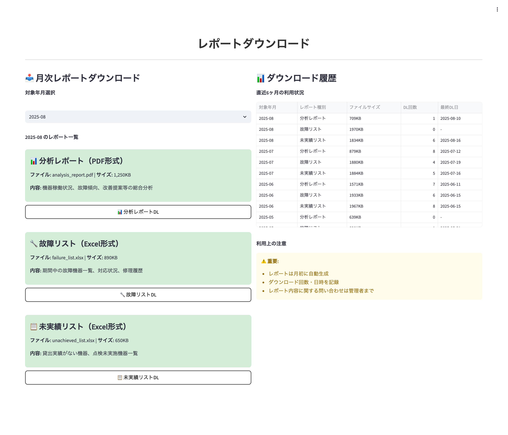

# 画面仕様書 / Screen Specification

- Revision

    | Rev | Date       | Auth       | Note        |
    |----:|------------|------------|-------------|
    | 1.0 | 2025-08-19 | Claude     | 初版作成 / Initial version |
    | 2.0 | 2025-08-25 | Claude     | user_id型変更・モック操作仕様統合・12章構成統一 |

## 1. 画面名称 / Screen Title

- 日本語: レポートダウンロード画面
- English: Report Download Screen

### 1-1. 機能ID / Functional Identifier

- 機能ID（日本語）: report-download
- Functional Name (English): report-download
- 使用例（SPAルーティング）: `/reports`

## 2. 機能概要 / Function Overview

[Japanese]

- 医療機関担当者がシステム生成レポート（分析レポート・故障リスト・未実績リスト）をダウンロードする画面
- 年月指定による過去レポートの取得機能（最新レポートがデフォルト）
- 直近6ヶ月のダウンロード履歴表示による進捗管理
- レポート公開時の自動通知確認機能

[English]

- Screen for medical facility representatives to download system-generated reports (analysis reports, failure lists, unachieved lists)
- Function to retrieve past reports by specifying year and month (latest reports as default)
- Progress management through display of download history for the past 6 months
- Automatic notification confirmation function when reports are published

---

## 3. 画面利用対象ユーザー / Target Users

- 医療機関ユーザー (entity_type=1): 自医療機関のレポートダウンロードのみ可能
- ※システム管理者はアクセス可能だが、医療機関指定が必要

<div style="page-break-before: always;"></div>

## 4. 運用概要 / Operational Usage

[Japanese]

- オンプレシステムで月初に自動生成されたレポートをダウンロード
- 分析レポート・故障リスト・未実績リストの3種類のレポートを提供
- レポート公開時に、user_entity_link.notification_email_listのメンバーへ自動通知
- 年月指定により過去のレポートも取得可能（データ保管期間内）
- ダウンロード履歴により確認状況を管理

[English]

- Download reports automatically generated at the beginning of each month by the on-premise system
- Provides 3 types of reports: analysis reports, failure lists, and unachieved lists
- Automatic notification to members of user_entity_link.notification_email_list when reports are published
- Past reports can also be retrieved by specifying year and month (within data retention period)
- Manage confirmation status through download history

<div style="page-break-before: always;"></div>

## 5. 処理の流れ / Processing Flow

[Japanese]

1. **画面初期表示**: `GET /api/v1/file-management/download-history` で直近6ヶ月のダウンロード履歴を取得・表示
2. **利用可能レポート取得**: `GET /api/v1/file-management/available-reports` で利用可能なレポート一覧を取得
3. **年月選択**: デフォルトは最新年月、ドロップダウンで過去の年月を選択可能
4. **レポート選択**: 3種類（分析レポート・故障リスト・未実績リスト）から希望レポートを選択
5. **ダウンロード実行**: `POST /api/v1/file-management/download` で指定レポートのダウンロード実行
6. **履歴更新**: ダウンロード完了後、最新のダウンロード履歴を取得して画面表示を更新
7. **結果表示**: ダウンロード結果・エラー内容をユーザーに通知

[English]

1. **Initial screen display**: Retrieve and display download history for the past 6 months via `GET /api/v1/file-management/download-history`
2. **Get available reports**: Retrieve list of available reports via `GET /api/v1/file-management/available-reports`
3. **Year-month selection**: Latest year-month as default, past year-months selectable from dropdown
4. **Report selection**: Select desired report from 3 types (analysis reports, failure lists, unachieved lists)
5. **Execute download**: Execute download of specified report via `POST /api/v1/file-management/download`
6. **History update**: Retrieve latest download history and update screen display after download completion
7. **Result display**: Notify users of download results and error details

<div style="page-break-before: always;"></div>

## 6. 入出力仕様 / Input / Output Specifications

### 6.1 入力フォーム項目 / Input Form Fields

| 項目 / Item | フィールド / Field | 要件 / Requirements |
|-------------|-------------------|---------------------|
| 対象年月 / Target Year-Month | target_date | 必須、YYYY-MM形式、利用可能期間内 |
| レポート種別 / Report Type | file_type | 必須、選択肢（1:分析レポート、2:故障リスト、3:未実績リスト） |

### 6.2 利用可能レポート表示項目 / Available Reports Display Fields

| 項目 / Item | 表示対象 / Display | フィールド / Field | ソート順 / Sort |
|-------------|-------------------|-------------------|-----------------|
| 対象年月 / Target Year-Month | ○ | target_date | 1（降順） |
| 分析レポート / Analysis Report | ○ | analysis_status | - |
| 故障リスト / Failure List | ○ | failure_status | - |
| 未実績リスト / Unachieved List | ○ | unachieved_status | - |
| 公開日時 / Published DateTime | ○ | published_datetime | 2 |
| 通知送信 / Notification Sent | ○ | notification_sent | - |

### 6.3 ダウンロード履歴表示項目 / Download History Display Fields

| 項目 / Item | 表示対象 / Display | フィールド / Field | ソート順 / Sort |
|-------------|-------------------|-------------------|-----------------|
| ダウンロード日時 / Download DateTime | ○ | download_datetime | 1（降順） |
| 対象年月 / Target Year-Month | ○ | target_date | 2 |
| レポート種別 / Report Type | ○ | file_type | - |
| ファイル名 / File Name | ○ | filename | - |
| ファイルサイズ / File Size | ○ | file_size | - |
| ダウンロード者 / Downloader | ○ | downloader_name | - |

---

## 7. バリデーション仕様 / Validation Rules

[Japanese]

- **対象年月**: YYYY-MM形式、利用可能なレポートが存在する年月のみ選択可
- **レポート種別**: 1(分析レポート)・2(故障リスト)・3(未実績リスト)から選択必須
- **ファイル存在チェック**: 指定した年月・種別のレポートファイルが存在することの確認
- **アクセス権限**: 指定医療機関のレポートへのアクセス権限の確認
- **ダウンロード制限**: 同一レポートの重複ダウンロード制限（必要に応じて）

[English]

- **Target Year-Month**: YYYY-MM format, only year-months with available reports selectable
- **Report Type**: Required selection from 1(Analysis Report), 2(Failure List), 3(Unachieved List)
- **File Existence Check**: Confirmation that report file exists for specified year-month and type
- **Access Permission**: Confirmation of access permission to reports for specified medical facility
- **Download Restriction**: Restriction on duplicate downloads of the same report (if necessary)

<div style="page-break-before: always;"></div>

## 8. API連携仕様 / API Integration

### 8.1 `GET /api/v1/file-management/available-reports`

- **必須ヘッダー**: `X-User-Id: {user_id}`
- **クエリパラメータ**: 
  - medical_id: 医療機関ID（省略時は認証ユーザーの医療機関）
- **レスポンス**: 利用可能なレポート一覧（年月別・種別別の公開状況）
- **権限**: システム管理者（全医療機関）・医療機関ユーザー（自医療機関のみ）

### 8.2 `POST /api/v1/file-management/download`

- **必須ヘッダー**: `X-User-Id: {user_id}`
- **リクエストボディ**: 
  - medical_id: 医療機関ID（省略時は認証ユーザーの医療機関）
  - target_date: 対象年月（YYYY-MM形式）
  - file_type: レポート種別（1:分析レポート、2:故障リスト、3:未実績リスト）
- **レスポンス**: ファイルダウンロードまたはダウンロードURL、ダウンロード履歴情報
- **権限**: システム管理者・医療機関ユーザー（指定医療機関への権限要）

### 8.3 `GET /api/v1/file-management/download-history`

- **必須ヘッダー**: `X-User-Id: {user_id}`
- **クエリパラメータ**: 
  - medical_id: 医療機関ID（省略時は認証ユーザーの医療機関）
  - months: 取得対象月数（デフォルト: 6）
- **レスポンス**: 指定期間のダウンロード履歴一覧
- **権限**: システム管理者（全医療機関）・医療機関ユーザー（自医療機関のみ）

<div style="page-break-before: always;"></div>

## 9. 画面遷移 / Screen Navigation

| 操作 / Operation | 説明 / Description |
|------------------|-------------------|
| 年月選択 / Year-Month Selection | ドロップダウンで対象年月を選択、利用可能レポート表示を更新 |
| レポート種別選択 / Report Type Selection | 3種類から希望するレポート種別を選択 |
| ダウンロード実行 / Execute Download | 選択したレポートのダウンロード実行、進捗表示 |
| 履歴更新 / History Update | ダウンロード完了後、履歴一覧を自動更新 |
| エラー表示 / Error Display | 失敗時の詳細エラー情報表示 |

### 9.1 画面レイアウト / Screen Layout



**画面構成:**
- **月次レポートダウンロード部** (左側)
  - 対象年月選択：ドロップダウンで「2025-08」等を選択
  - レポート一覧：3種類のレポートを個別表示
    - 分析レポート（PDF形式）: 機器稼働状況、故障傾向、改善提案等の総合分析
    - 故障リスト（Excel形式）: 期間中の故障機器一覧、対応状況、修理履歴
    - 未実績リスト（Excel形式）: 貸出実績がない機器、点検未実施機器一覧
  - ダウンロードボタン：種別ごとの個別ダウンロードボタン
- **ダウンロード履歴部** (右側)
  - 直近6ヶ月の利用状況テーブル
  - 利用上の注意・重要事項表示

<div style="page-break-before: always;"></div>

## 10. PoC制約事項 / Limitations for PoC Version

[Japanese]

- レポートの詳細プレビュー機能は未実装
- 一括ダウンロード機能（複数レポート同時）は未対応
- レポートの自動更新通知機能は簡易版
- ダウンロード済みレポートの差分確認機能は未実装
- レポート内容の検索・フィルタ機能は未対応

[English]

- Detailed report preview functionality is not implemented
- Bulk download functionality (multiple reports simultaneously) is not supported
- Automatic report update notification functionality is simplified version
- Difference checking functionality for downloaded reports is not implemented
- Report content search and filter functionality is not supported

## 11. フロントエンド開発者向け補足 / Notes for Frontend Developer

この画面は、Next.js等のフロントエンドSPAがFastAPIバックエンドとREST APIで接続する構成を想定しています。

### 🔌 接続情報 / Connection Details

| 項目 / Item | 内容 / Content |
|-------------|---------------|
| 接続先API / API Endpoint | `http://192.168.99.118:8000/api/v1/file-management`（PoC用） |
| 通信方式 / Communication | REST（`fetch` や `axios` など） |
| データ形式 / Data Format | JSON（レスポンス）、ファイルダウンロード時はBinary |
| 認証 / Authentication | `X-User-Id` ヘッダーによる認証が必要 |
| CORS | `Access-Control-Allow-Origin: *` を許可済（開発用途） |
| ステータスコード / Status Codes | `200 OK`, `403 Forbidden`, `404 Not Found`, `422 Validation Error`, `500 Internal Server Error` |

### 📦 APIレスポンス構造（例）

#### 利用可能レポート一覧
```json
{
  "available_reports": [
    {
      "target_date": "2025-07",
      "reports": {
        "analysis": {
          "file_type": 1,
          "filename": "analysis_report_202507.pdf",
          "file_size": 1024000,
          "published_datetime": "2025-08-01T09:00:00",
          "status": "available"
        },
        "failure": {
          "file_type": 2,
          "filename": "failure_list_202507.xlsx",
          "file_size": 512000,
          "published_datetime": "2025-08-01T09:00:00",
          "status": "available"
        },
        "unachieved": {
          "file_type": 3,
          "filename": "unachieved_list_202507.xlsx",
          "file_size": 256000,
          "published_datetime": "2025-08-01T09:00:00",
          "status": "available"
        }
      }
    }
  ]
}
```

#### ダウンロード実行結果
```json
{
  "medical_id": 22,
  "target_date": "2025-07",
  "file_type": 1,
  "filename": "analysis_report_202507.pdf",
  "download_url": "https://s3.amazonaws.com/reports/22/2025-07/analysis_report_202507.pdf",
  "download_datetime": "2025-08-19T15:30:00",
  "file_size": 1024000,
  "message": "レポートダウンロードが完了しました"
}
```

### 🛠 axios使用例（レポートダウンロード）

```ts
import axios from 'axios';

const apiBase = 'http://192.168.99.118:8000/api/v1/file-management';

export const fetchAvailableReports = async (currentUserId: string, medicalId?: number) => {
  const params = medicalId ? `?medical_id=${medicalId}` : '';
  const res = await axios.get(`${apiBase}/available-reports${params}`, {
    headers: {
      'X-User-Id': currentUserId  // user_idは文字列型
    }
  });
  return res.data;
};

export const downloadReport = async (
  currentUserId: string,
  medicalId: number,
  targetDate: string,
  fileType: number
) => {
  const res = await axios.post(`${apiBase}/download`, {
    medical_id: medicalId,
    target_date: targetDate,
    file_type: fileType
  }, {
    headers: {
      'X-User-Id': currentUserId,  // user_idは文字列型
      'Content-Type': 'application/json'
    }
  });
  
  // ダウンロードURLの場合は別途ファイル取得
  if (res.data.download_url) {
    const fileRes = await axios.get(res.data.download_url, {
      responseType: 'blob'
    });
    
    // ブラウザでファイルダウンロード実行
    const url = window.URL.createObjectURL(new Blob([fileRes.data]));
    const link = document.createElement('a');
    link.href = url;
    link.setAttribute('download', res.data.filename);
    document.body.appendChild(link);
    link.click();
    link.remove();
    window.URL.revokeObjectURL(url);
  }
  
  return res.data;
};

export const fetchDownloadHistory = async (currentUserId: string, months = 6) => {
  const res = await axios.get(`${apiBase}/download-history?months=${months}`, {
    headers: {
      'X-User-Id': currentUserId  // user_idは文字列型
    }
  });
  return res.data;
};
```

### 📅 年月選択UIの実装例

```tsx
import React, { useState, useEffect } from 'react';

const ReportDownloadForm = () => {
  const [availableReports, setAvailableReports] = useState([]);
  const [selectedDate, setSelectedDate] = useState('');
  const [selectedType, setSelectedType] = useState(1);

  useEffect(() => {
    // 利用可能レポート一覧を取得
    fetchAvailableReports(currentUserId).then(data => {
      setAvailableReports(data.available_reports);
      if (data.available_reports.length > 0) {
        setSelectedDate(data.available_reports[0].target_date); // 最新を選択
      }
    });
  }, []);

### 💡 UI操作詳細（モック画面との統合仕様）

#### レポートダウンロード操作：
- **対象年月選択**: ドロップダウンで「2025-08」等を選択（最新がデフォルト）
- **レポート情報表示**: 各レポートのカード形式表示でファイル名・サイズ・内容説明を確認
- **ダウンロード実行**: 「📈 分析レポートDL」・「🔧 故障リストDL」・「📋 未実績リストDL」ボタンで個別ダウンロード
- **ダウンロード確認**: 完了時に「✓ [filename] をダウンロードしました」メッセージと「ダウンロード記録をDBに保存しました」確認

#### レポート詳細情報（モック画面のカード表示）：
- **分析レポート（PDF形式）**:
  - ファイル: analysis_report.pdf | サイズ: 1,250KB
  - 内容: 機器稼働状況、故障傾向、改善提案等の総合分析
- **故障リスト（Excel形式）**:
  - ファイル: failure_list.xlsx | サイズ: 890KB
  - 内容: 期間中の故障機器一覧、対応状況、修理履歴
- **未実績リスト（Excel形式）**:
  - ファイル: unachieved_list.xlsx | サイズ: 650KB
  - 内容: 貸出実績がない機器、点検未実施機器一覧

#### ダウンロード履歴管理：
- **履歴テーブル**: 直近6ヶ月の「対象年月・レポート種別・ファイルサイズ・DL回数・最終DL日」を表示
- **利用状況**: ダウンロード回数で利用状況を把握、最終ダウンロード日で確認状況を管理

#### 利用上の注意（モック画面右下表示）：
- **重要事項**:
  - レポートは月初に自動生成
  - ダウンロード回数・日時を記録
  - レポート内容に関する問い合わせは管理者まで

  const reportTypes = [
    { value: 1, label: '分析レポート' },
    { value: 2, label: '故障リスト' },
    { value: 3, label: '未実績リスト' }
  ];

  return (
    <div>
      <div>
        <label>対象年月:</label>
        <select value={selectedDate} onChange={(e) => setSelectedDate(e.target.value)}>
          {availableReports.map(report => (
            <option key={report.target_date} value={report.target_date}>
              {report.target_date}
            </option>
          ))}
        </select>
      </div>
      
      <div>
        <label>レポート種別:</label>
        <select value={selectedType} onChange={(e) => setSelectedType(Number(e.target.value))}>
          {reportTypes.map(type => (
            <option key={type.value} value={type.value}>
              {type.label}
            </option>
          ))}
        </select>
      </div>
      
      <button onClick={() => handleDownload(selectedDate, selectedType)}>
        ダウンロード
      </button>
    </div>
  );
};
```

<div style="page-break-before: always;"></div>

## 12. 処理メッセージ仕様 / Operation Messages

この画面では、ユーザーに対して各操作の結果を明示的に伝えるために、以下のようなメッセージを表示します。

### 12.1 共通メッセージ / Common Messages

| タイミング / Timing | ステータス / Status | 表示メッセージ / Message | 備考 / Notes |
|--------------------|--------------------|-----------------------|-------------|
| ダウンロード成功 / Download Success | 200 OK | レポートダウンロードが完了しました。 | ダウンロード成功時 |
| ダウンロード開始 / Download Start | - | レポートを準備中です。しばらくお待ちください。 | 処理中表示 |
| 履歴更新完了 / History Update Complete | 200 OK | 最新のダウンロード履歴を取得しました。 | 履歴表示更新時 |
| 権限エラー / Permission Error | 403 Forbidden | アクセス権限がありません。指定された医療機関のレポートダウンロード権限がありません。 | 権限不足時 |
| レポート不存在 / Report Not Found | 404 Not Found | 指定された年月のレポートが見つかりません。 | ファイル不存在 |
| バリデーションエラー / Validation Error | 422 Unprocessable Entity | 指定された年月またはレポート種別が正しくありません。 | 入力検証エラー |
| サーバーエラー / Server Error | 500 Internal Server Error | サーバーでエラーが発生しました。後で再度お試しください。 | システムエラー |

### 12.2 レポート種別別メッセージ例

| レポート種別 / Report Type | 成功時メッセージ / Success Message |
|---------------------------|--------------------------------|
| 分析レポート（file_type: 1） | 分析レポートのダウンロードが完了しました。 |
| 故障リスト（file_type: 2） | 故障リストのダウンロードが完了しました。 |
| 未実績リスト（file_type: 3） | 未実績リストのダウンロードが完了しました。 |

### 12.3 バリデーションエラーメッセージ例

| 項目 / Field | エラーメッセージ / Error Message |
|-------------|--------------------------------|
| target_date | 対象年月を選択してください。または指定された年月のレポートは利用できません。 |
| file_type | レポート種別を選択してください。 |
| file_not_found | 指定されたレポートファイルが見つかりません。レポートが公開されているかご確認ください。 |

### 12.4 API別メッセージまとめ

| APIエンドポイント / API Endpoint | 成功時メッセージ / Success Message | 失敗時メッセージ / Error Message |
|----------------------------------|-----------------------------------|--------------------------------|
| `POST /api/v1/file-management/download` | レポートダウンロードが完了しました。 | レポートのダウンロードに失敗しました。年月とレポート種別を確認してください。 |
| `GET /api/v1/file-management/available-reports` | - | 利用可能レポート一覧の取得に失敗しました。 |
| `GET /api/v1/file-management/download-history` | - | ダウンロード履歴の取得に失敗しました。 |

### 12.5 表示方法の推奨 / Display Recommendations

[Japanese]

- レポート準備中は**プログレスインジケーター**で処理状況を表示
- 成功メッセージは画面上部の**成功アラート**（緑色）で表示
- エラーメッセージは**エラーアラート**（赤色）で詳細情報を表示
- 利用可能レポートの有無は**視覚的アイコン**（✓/×）で分かりやすく表示
- ダウンロード完了時は**ファイル保存ダイアログ**の表示を確認

[English]

- Display processing status with **progress indicator** while preparing reports
- Display success messages with **success alert** (green) at the top of the screen
- Display error messages with **error alert** (red) showing detailed information
- Display availability of reports with **visual icons** (✓/×) for easy understanding
- Confirm display of **file save dialog** when download is complete

---

以上