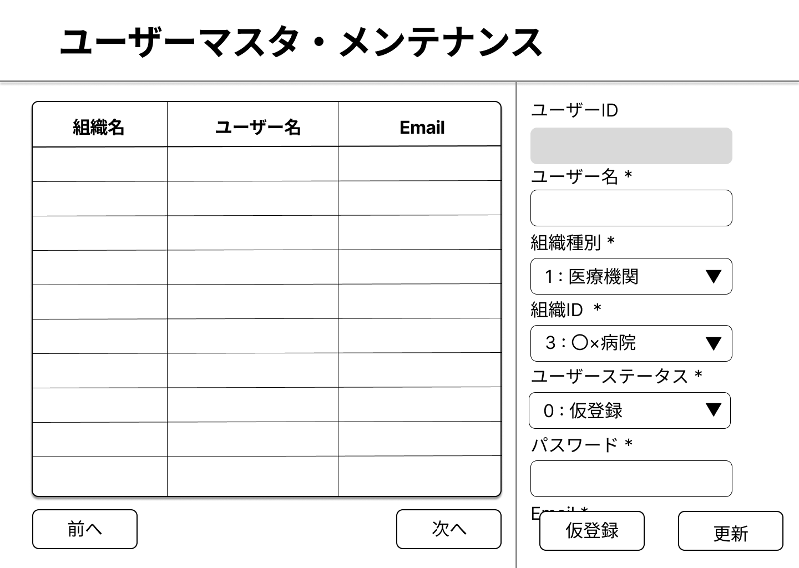

# 画面仕様書 / Screen Specification

- Revision

    | Rev | Date       | Auth       | Note    |
    |----:|------------|------------|---------|
    | 1.00| 2025.07.22 | H.Miyazawa | 新規作成 |
    | 1.1 | 2025.08.19 | Claude     | API仕様との整合性確保のための修正 |
    | 2.0 | 2025.08.25 | Claude     | user_id型変更・モック操作仕様統合・12章構成統一 |

## 1. 画面名称 / Screen Title

- 日本語: ユーザーマスタ・メンテナンス
- English: User Master Maintenance

### 1-1. 機能ID / Functional Identifier

- 機能ID（日本語）: ユーザーマスタ・メンテナンス
- Functional Name (English): user-maintenance
- 使用例（SPAルーティング）: `/user-maintenance` または `/admin/users`

## 2. 機能概要 / Function Overview

[Japanese]

- ログインしたユーザーの権限により利用できる機能が異なる
  - **Ver1.1修正**: user_id範囲による権限判定に変更
  - システム管理者 (user_id: "900001"-"999999")
    1. ユーザーの新規作成（仮登録）
    2. 全ての医療機関ユーザーの更新処理
    3. 特定ユーザーの退会（非利用）の更新処理
  - 医療機関ユーザー (entity_type=1)
    2. 自医療機関のユーザーのみの更新処理
        - 管理者の2の更新処理と機能は同じだけど、api経由で取得するときの条件が異なる

[English]

- Available features depend on the privileges of the logged-in user:
  - **Ver1.1 Update**: Permission determination changed to user_id range-based
  - System Administrator (user_id: "900001"-"999999"):
    1. Create a new user (Provisional Registration)
    2. Update all medical facility user records
    3. Mark specific users as inactive (deactivate)
  - Medical Facility Users (entity_type=1):
    2. Can update users within their own medical facility only.
        - Same function as Administrator's #2, but filtered by API access conditions.

<div style="page-break-before: always;"></div>

## 3. 画面利用対象ユーザー / Target Users

- ログインしたすべてのユーザー (All logged-in users)

## 4. 運用概要 / Operational Usage

[Japanese]

- 管理者がアカウント追加を依頼された段階で仮登録を実行
- ユーザーは自らログインして詳細情報をメンテナンス可能
- 同一entity内では他アカウントのメンテナンスも可能
- 退会処理は営業指示により管理者が実行

- 補足：仮登録について
  - 「仮登録」の“仮”は、技術的な制限状態ではなく、**業務上の利用準備中ステータス**を意味します
  - 登録後、DB上では正式なユーザーレコードとして保存されます（user_status = 0）
  - この状態では、「ユーザーマスタ・メンテナンス画面」以外の画面からは表示・利用されません
  - ユーザーが自らログインして情報を更新（user_status = 1）すると、初めて他の機能が利用可能となります

[English]

- Administrators perform provisional registration when requested to add a new account.
- Users can log in and maintain their own profile information.
- Within the same entity, users may manage other accounts.
- Deactivation is handled by administrators upon request from the sales team.

- Note: About "Provisional Registration"
  - The term “provisional” refers to an operational status, not a technical system restriction.
  - The record is saved in the user master table upon registration.
  - Within the OptiServe system, the only screen accessible during provisional status is the User Master Maintenance screen. Once the user completes and updates their basic information, the system recognizes the user as "registered", and other features become available.

<div style="page-break-before: always;"></div>

## 5. 処理の流れ / Processing Flow

[Japanese]

1. `GET /api/v1/users` でユーザー一覧を取得
    - **Ver1.1修正**: 認証ヘッダー `X-User-Id` が必須
    - システム管理者の場合は条件なしの全件
    - 医療機関ユーザーの場合は自医療機関のユーザーのみ
    - skip/limit による20件単位のページング（最大100件まで取得可能）
    - 次ボタン、前ボタンでの20件単位のレコード表示
      - skip=0の場合は前ボタンは非アクティブ

2. 特定の行を選択することでメンテナンスフォーム側にデータをセット

    - リストで選択可能な行は１行のみ
    - 更新項目と入力チェック

      | 項目名 | フィールド名 | 入力チェック・補足 |
      |--------|-------|---------|
      |ユーザー名|user_name|50文字以内|
      |ユーザーステータス|user_status|0:仮登録, 1:稼働中, 9:利用停止<br>管理者権限のみ変更可能|
      |パスワード|password|別途ルールを記載|
      |電話番号|phone_number|電話番号として適切|
      |携帯番号|mobile_number|携帯番号として適切|

    - **更新**ボタンをクリックしたら、`PUT /api/v1/users/{user_id}` Update User apiでの更新処理
    - 結果を表示

3. [管理者のみ] メンテナンスフォームのユーザーステータスで　**利用停止** を選択した場合は、次の項目をアクティブにして、必須入力とする

    - 更新項目と入力チェック

      | 項目名 | フィールド名 | 更新対象 | 入力チェック・補足 |
      |--------|-------|---------|------|
      |理由コード|inactive_reason_code|リスト選択|1:組織退会, 2:組織の担当者変更, 3:処理ミス, 99:その他|
      |無効化理由|inactive_reason_note|編集可|255文字以内|

    - **更新**ボタンをクリックしたら、`PUT /api/v1/users/{user_id}/inactive` Inactive User apiでの更新処理
    - 結果を表示

4. [管理者のみ] **仮登録** ボタンをクリックしたら、メンテナンスフォームを初期化して表示
    - 仮登録（新規登録）は更新時と連携する組織IDが異なる
      - 仮登録：facilities API で医療機関一覧を取得
      - 稼働中：user_entity_link API で登録済みの関連組織を取得
    - 更新項目と入力チェック

    | 項目名 | フィールド名 | 更新対象 | 補足 |
    |--------|-------|---------|------|
    |ユーザー名|user_name|編集可|必須項目|
    |組織の種別|entity_type|リスト選択|1: 医療機関, 2: ディーラー, 3: メーカー, 9:管理者権限|
    |連携する組織ID|entity_relation_id|リスト選択|取得した組織IDと組織名をリストに登録し、独自の入力は不可|
    |メールアドレス|e_mail|編集可|必須項目|

    - **更新**ボタンをクリックしたら、`POST /api/v1/users` Create User apiでの登録処理
    - 登録成功後、user_entity_linkが存在しない場合は自動で作成処理を実行

[English]

1. Retrieve user list via `GET /api/v1/users`

    - For administrators: retrieve all records with no conditions
    - For non-administrators: retrieve users with the same entity_type & entity_relation_id as the logged-in user
    - Pagination by skip/limit in increments of 20 records
    - Use "Next" and "Previous" buttons to paginate
        - If skip = 0, "Previous" button is disabled

2. Selecting a row sets data into the maintenance form

    - Only one row can be selected at a time
    - Editable fields and validation:

      | Label             | Field Name        | Validation & Notes                                      |
      |------------------|-------------------|----------------------------------------------------------|
      | User Name         | user_name          | Max 50 characters                                        |
      | User Status       | user_status        | 0: Provisional, 1: Active, 9: Inactive<br>Only admins can edit |
      | Password          | password           | Refer to password rules                                 |
      | Phone Number      | phone_number       | Must be a valid phone number                            |
      | Mobile Number     | mobile_number      | Must be a valid mobile number                           |

    - On clicking **Update**, perform update via `PUT /api/v1/users/{user_id}` (Update User API)
    - Display the result message

3. [Admin only] If the **User Status** is set to "Inactive" in the maintenance form:

    - Activate the following fields and make them required:

      | Label            | Field Name            | Required | Validation & Notes                            |
      |------------------|------------------------|----------|-----------------------------------------------|
      | Reason Code      | inactive_reason_code   | Yes      | Dropdown: 1: Left Organization, 2: Role Change, 3: Mistake, 99: Other |
      | Reason Description | inactive_reason_note | Yes      | Max 255 characters                            |

    - On clicking **Update**, perform deactivation via `PUT /api/v1/users/{user_id}/inactive` (Inactive User API)
    - Display the result message

4. [Admin only] On clicking **Provisional Registration**, initialize and display the maintenance form

    - Provisional registration (new user) has different organization ID handling compared to updates
      - Provisional registration: Retrieve organization list from facilities API
      - Active users: Retrieve registered related organizations from user_entity_link API
    - Editable fields and validation:

      | Label             | Field Name          | Editable | Notes                                      |
      |------------------|---------------------|----------|--------------------------------------------|
      | User Name         | user_name           | Yes      | Required                                   |
      | Entity Type       | entity_type         | Dropdown | 1: Medical Institution, 2: Dealer, 3: Manufacturer, 9: Administrator |
      | Related Entity ID | entity_relation_id  | Dropdown | Register retrieved organization IDs and names in list; custom input not allowed |
      | Email Address     | e_mail              | Yes      | Required                                   |

    - On clicking **Update**, perform registration via `POST /api/v1/users` (Create User API)
    - After successful registration, automatically create user_entity_link if it doesn't exist

<div style="page-break-before: always;"></div>

## 6. 入出力仕様 / Input / Output Specifications

### 6.1 入力フォーム項目 / Input Form Fields

| 項目      | フィールド                | 要件                   |
| ------- | -------------------- | -------------------- |
| ユーザーID  | user\_id            | 文字列型（自動採番）        |
| ユーザー名   | user\_name           | 最大50文字               |
| パスワード   | password             | 8文字以上 + 英大文/小文/数字/記号 |
| 電話番号    | phone\_number        | 固定電話形式               |
| 携帯番号    | mobile\_number       | 携帯形式                 |
| 組織種別    | entity\_type         | リスト選択                |
| 組織ID    | entity\_relation\_id | 数値                   |
| メールアドレス | e\_mail              | メール形式                |
| 理由コード | inactive_reason_code | リスト選択                    |
| 無効化理由 | inactive_reason_note | 最大255文字                   |

### 6.2 一覧表示項目 / List Display Fields

| 項目        | 表示対象 | フィールド    | ソート順 |
| -------     |:--:|------------------ |:--:|
|連携する組織ID| × | entity_relation_id |1|
|組織の種別    | 〇 | entity_type       |2|
|ユーザーID    | ○ | user_id            |3|
|ユーザー名    | 〇 | user_name         ||
|メールアドレス| 〇 | e_mail            ||
|ステータス    | 〇 |user_status       |4|

## 7. バリデーション仕様 / Validation Rules

[Japanese]

- ユーザー名: 50文字以内
- パスワード: 大文字/小文字/数字/記号を含む8文字以上
- 電話/携帯番号: 適切な形式をチェック
- メール: 合理性チェック、重複登録を抵遮
- 無効化理由: 255文字以内

[English]

- User Name: Must be within 50 characters
- Password: Minimum 8 characters, and must include at least one uppercase letter, one lowercase letter, one number, and one special character
- Phone Number / Mobile Number: Must match a valid format (e.g., with or without hyphens, starting digits checked)
- Email Address:
  - Must be in valid email format (e.g., user@example.com)
  - Duplicate email addresses are not allowed (must be unique)
- Inactive Reason (note): Must be within 255 characters

## 8. API連携仕様 / API Integration

### 8.1 `GET /api/v1/users`

- **Ver1.1修正**: 認証ヘッダー `X-User-Id` が必須
- 条件によりユーザー情報を取得
- skip/limitによるページング対応（最大100件）
- クエリパラメータ: user_name, entity_type, entity_relation_id, e_mail等でフィルタリング可能

### 8.2 `POST /api/v1/users`

- **Ver1.1修正**: 認証ヘッダー `X-User-Id` が必須、管理者権限が必要
- 新規登録(仮登録)、自動でuser_idが採番される
- ユーザーステータス : user\_status
  - 0 : 仮登録をセット
- 仮パスワードは自動生成される

### 8.3 `PUT /api/v1/users/{user_id}`

- **Ver1.1修正**: 認証ヘッダー `X-User-Id` が必須
- ユーザーステータス : user_status
  - 1: 稼働中をセット（更新時に自動設定）

### 8.4 `PUT /api/v1/users/{user_id}/inactive`

- **Ver1.1修正**: 認証ヘッダー `X-User-Id` が必須、管理者権限が必要
- ユーザーステータス : user_status
  - 9: 利用停止（利用終了）
- 無効化理由コード : reason_code
  - 1:組織退会, 2:組織の担当者変更, 3:処理ミス, 99:その他 から選択
- 無効化理由メモ : note（最大文字数制限あり）

<div style="page-break-before: always;"></div>

## 9. 画面遷移 / Screen Navigation

| 操作  | 説明                        |
| --- | ------------------------- |
| 前へ  | 表示されているリストの前情報があれば表示<br>Display the previous page of the list if available |
| 次へ  | 表示されているリストの次情報があれば表示<br>Display the next page of the list if available |
| 更新  | 一覧から行を選択し更新フォームを表示<br>Select a row from the list and display the update form |
| 仮登録 | 新規登録用フォームを表示<br>Display the form for provisional (new) registration |

### 9.1 画面レイアウト / Screen Layout



**画面構成:**
- **検索・フィルタ部**: 組織名・ユーザー名・メール検索、組織種別・ステータス絞り込み
- **一覧表示部**: ページング対応（前へ・次へボタン）、行選択可能なユーザーテーブル
- **編集フォーム部**: 選択行の詳細情報表示・編集、権限別機能制御
- **操作ボタン**: 仮登録（新規ユーザー作成）・更新ボタン配置

**UIレイアウトの特徴:**
- 左側：ユーザー一覧テーブル（組織名・ユーザー名・Email列表示）
- 右側：選択ユーザーの詳細編集フォーム
- フォーム項目：ユーザーID（読み取り専用）・ユーザー名・組織種別・組織ID・ユーザーステータス・パスワード・メールアドレス
- 下部：仮登録・更新の操作ボタン

<div style="page-break-before: always;"></div>

## 10. PoC制約事項 / Limitations for PoC Version

[Japanese]

- 組織名称の選択・登録機能はAPI完成後に追加予定
- ログイン情報は仮の値で設定
- user_entity_link情報のメンテナンスはAPI完成後に追加予定
- パスワードのエンコーディングは行わない

[English]

- The feature for selecting and registering organization names will be implemented after the related API is completed.
- Login information is currently set with provisional (temporary) values.
- Maintenance functionality for `user_entity_link` will be added after the API implementation.
- Password encoding is not applied in this PoC version.

## 11. フロントエンド開発者向け補足 / Notes for Frontend Developer

この画面は、Next.js等のフロントエンドSPAがFastAPIバックエンドとREST APIで接続する構成を想定しています。

### 🔌 接続情報 / Connection Details

| 項目             | 内容 |
|------------------|------|
| 接続先API        | `http://192.168.99.118:8000`（PoC用）<br>※将来的にAWS上での実装を予定 |
| 通信方式         | REST（`fetch` や `axios` など） |
| データ形式       | JSON（リクエスト／レスポンス共通） |
| 認証             | **Ver1.1修正**: `X-User-Id` ヘッダーによる認証が必要<br>将来的にはJWTトークン or Cookieベースセッション等を検討予定 |
| CORS             | `Access-Control-Allow-Origin: *` を許可済（開発用途） |
| ステータスコード | `200 OK`, `403 Forbidden`, `422 Validation Error`, `404 Not Found` など |

### 🏢 組織情報表示処理 / Organization Information Display

仮登録時の「連携する組織ID」フィールドでは、以下の処理を実装してください：

1. **組織名表示**: `GET /api/v1/facilities?medical_id={entity_relation_id}` で医療機関名を取得
2. **フィールド右側表示**: entity_relation_id入力フィールドの右側に医療機関名を表示
3. **リアルタイム更新**: entity_relation_id値変更時に医療機関名を再取得・表示更新
4. **エラー処理**: 該当する医療機関が見つからない場合は「医療機関が見つかりません」等を表示

### 📦 APIレスポンス構造（共通例）

```json
{
  "user_id": "100001",
  "user_name": "テスト太郎",
  "entity_type": 1,
  "entity_relation_id": 100,
  "e_mail": "test@example.com",
  "phone_number": "03-1234-5678",
  "mobile_number": "090-1234-5678",
  "user_status": 1,
  "regdate": "2025-07-22T10:00:00",
  "lastupdate": "2025-07-22T10:05:00"
}
```

### 🛠 axiosを使ったアクセス例（一覧取得）

```ts
import axios from 'axios';

const apiBase = 'http://192.168.99.118:8000/api/v1/users';

export const fetchUsers = async (skip = 0, limit = 20, currentUserId: string) => {
  const res = await axios.get(`${apiBase}?skip=${skip}&limit=${limit}`, {
    headers: {
      'X-User-Id': currentUserId  // user_idは文字列型
    }
  });
  return res.data;
};
```

### 🔁 ユーザーステータスの状態遷移（user\_status）

| 値 | 状態   | 説明             |
| - | ---- | -------------- |
| 0 | 仮登録  | 管理者による初回登録     |
| 1 | 有効   | ユーザー自身による情報更新後 |
| 9 | 退会済み | 管理者が退会処理を実行    |

### 🔗 user_entity_link自動作成処理 / Automatic user_entity_link Creation

仮登録時にuser_entity_linkが存在しない場合の自動作成処理：

```javascript
// 1. ユーザー作成後の処理例
const createUserWithEntityLink = async (userData) => {
  // ユーザー作成
  const userResponse = await createUser(userData);

  // user_entity_link存在確認
  const entityLinkCheck = await getUserEntityLinks({
    user_id: userResponse.user_id,
    entity_type: userData.entity_type
  });

  // 存在しない場合は作成
  if (entityLinkCheck.length === 0) {
    await createUserEntityLink({
      user_id: userResponse.user_id,
      entity_type: userData.entity_type,
      entity_relation_id: userData.entity_relation_id,
      // デフォルト値設定
      notification_email_list: userData.e_mail,
      analiris_classification_level: 2, // 中分類レベル
      count_reportout_classification: 10
    });
  }

  return userResponse;
};
```

### 📂 状態管理のヒント（フロント側）

フロントエンドでは以下のようなステータスごとの制御を推奨します：

- `user_status === 0` → 登録内容の再確認を促すラベル表示（例：「仮登録状態」）
- `user_status === 9` → 編集不可、背景グレーアウト等の非アクティブ表示
- `user_status === 1` → 編集・退会の操作を有効化

### 💡 UI操作詳細（モック画面との統合仕様）

#### 検索・フィルタ機能：
- **組織名・ユーザー名・メール検索**: 部分一致検索による絞り込み（画面上部の検索欄で実行）
- **組織種別フィルタ**: 医療機関・ディーラー・メーカー・管理者権限での絞り込み
- **ステータスフィルタ**: 稼働中・仮登録・利用停止での絞り込み
- **ページネーション**: 前へ・次へボタンによるページ遷移

#### ユーザー選択・編集（モック画面レイアウト準拠）：
- **テーブル選択**: 左側の一覧テーブル（組織名・ユーザー名・Email列）から1行のみ選択可能
- **詳細フォーム**: 右側パネルに選択ユーザーの詳細情報を表示・編集
- **フォーム項目**:
  - ユーザーID（グレーアウト・読み取り専用）
  - ユーザー名 *（必須・編集可能）
  - 組織種別 *（ドロップダウン選択・1:医療機関がデフォルト）
  - 組織ID *（ドロップダウン選択・3:○×病院など組織リスト表示）
  - ユーザーステータス *（ドロップダウン・0:仮登録がデフォルト）
  - パスワード *（必須・編集可能）
  - メールアドレス *（必須・編集可能）

#### 権限別制御・操作ボタン：
- **仮登録ボタン**: システム管理者のみ利用可能な新規ユーザー作成機能
- **更新ボタン**: 選択ユーザーの情報更新実行
- **システム管理者**: 全機能利用可・ステータス変更可・仮登録機能利用可
- **医療機関ユーザー**: 同一医療機関内ユーザーのみ編集可・ステータス変更不可

### 🔐 今後の認証拡張（予定）

- 本PoCでは **認証は未実装** ですが、今後は以下のいずれかを採用予定です：

  - **JWTベースの認証**（`Authorization: Bearer <token>`）
  - **Cookie + セッション管理**（HTTPOnly Cookie でログイン状態を保持）

必要な場合は、認証APIやユーザー情報取得API（例：`GET /me`）を別途実装します。

### 🧪 curlでの簡易テスト例

```bash
# 仮登録 (Ver1.1修正: 認証ヘッダー追加)
curl -X POST http://192.168.99.118:8000/api/v1/users \
  -H "Content-Type: application/json" \
  -H "X-User-Id: 900001" \
  -d '{
    "user_name": "新規太郎",
    "entity_type": 1,
    "entity_relation_id": 100,
    "e_mail": "newuser@example.com"
  }'

# 医療機関情報取得（組織名表示用）
curl -X GET "http://192.168.99.118:8000/api/v1/facilities?medical_id=100" \
  -H "X-User-Id: 900001"

# user_entity_link存在確認
curl -X GET "http://192.168.99.118:8000/api/v1/user-entity-links?user_id=100001&entity_type=1" \
  -H "X-User-Id: 900001"

# ユーザー更新 (user_idは文字列型)
curl -X PUT http://192.168.99.118:8000/api/v1/users/100001 \
  -H "Content-Type: application/json" \
  -H "X-User-Id: 100001" \
  -d '{
    "user_name": "更新後太郎",
    "phone_number": "03-1111-2222"
  }'
```

## 12. 処理メッセージ仕様 / Operation Messages

この画面では、ユーザーに対して各操作の結果を明示的に伝えるために、以下のようなメッセージを表示します。ステータスコード、操作の成否、内容に応じて適切なフィードバックを行います。

This screen displays messages to clearly inform users of the result of each operation.
Appropriate feedback is provided based on the HTTP status code, success or failure, and the content of the action.

### 12.1 共通メッセージ / Common Messages

### 12.1 共通メッセージ / Common Messages

| タイミング (Timing) | ステータス (Status) | 表示メッセージ (Display Message) | 備考 (Notes) |
|---------------------|----------------------|-----------------------------------|--------------|
| 仮登録成功<br>Provisional registration successful | 200 OK | ユーザーを仮登録しました。<br>(User was provisionally registered.) | POST `/api/v1/users` |
| 更新成功<br>Update successful | 200 OK | ユーザー情報を更新しました。<br>(User information was updated.) | PUT `/api/v1/users/{user_id}` |
| 利用終了処理成功<br>Deactivation successful | 200 OK | ユーザーを利用終了に設定しました。<br>(User was marked as inactive.) | PUT `/api/v1/users/{user_id}/inactive` |
| **Ver1.1追加**: 権限エラー<br>Permission error | 403 | アクセス権限がありません。管理者にお問い合わせください。<br>(No access permission. Please contact administrator.) | 医療機関ユーザーが他医療機関のデータにアクセス |
| 対象ユーザーが存在しない<br>User not found | 404 | 対象ユーザーが見つかりません。<br>(The specified user was not found.) | ID指定ミスや削除済の可能性<br>May be due to an incorrect ID or deleted user |
| **Ver2.0更新**: ID採番上限<br>ID assignment limit | 400 | ユーザーID採番範囲が上限に達しました。<br>(User ID assignment range limit reached.) | 新規登録時の採番範囲上限エラー（文字列型） |
| バリデーションエラー<br>Validation error | 422 | 入力内容に不備があります。再確認してください。<br>(There are input errors. Please review and correct them.) | 入力形式ミスなど<br>Such as invalid input formats |
| サーバーエラー<br>Server error | 500 | サーバーでエラーが発生しました。後で再度お試しください。<br>(A server error occurred. Please try again later.) | 予期せぬシステム障害<br>Unexpected system error |

### 12.2 フィールド別バリデーションエラーメッセージ例

FastAPIのPydanticによる422エラー例をもとに、主要なフィールドごとの表示文言例です。

| フィールド (Field)  | エラーメッセージ (Error Message)                    |
|------------------|--------------------------------------------------|
| user_name        | ユーザー名は50文字以内で入力してください。     |
| password         | パスワードは8文字以上で、英大文字・小文字・数字・記号を含めてください。 |
| e_mail           | メールアドレスの形式が正しくありません。       |
| phone_number     | 電話番号の形式が正しくありません。             |
| mobile_number    | 携帯電話番号の形式が正しくありません。         |

### 12.3 API別メッセージまとめ / Response Message

| APIエンドポイント | 成功時メッセージ<br>Message of Success. | 失敗時の想定メッセージ<br>Message of Error.                    |
|--------------------|------------------|-------------------------------------------|
| `POST /users`      | ユーザーを仮登録しました。 | 入力に不備があります。<br>※バリデーション内容に応じて個別表示 |
| `PUT /users/{id}`  | ユーザー情報を更新しました。 | 対象ユーザーが見つかりません。 |
| `PUT /users/{id}/inactive` | ユーザーを利用終了に設定しました。 | 対象ユーザーが存在しません。<br>または入力に不備があります。 |

### 12.4 表示方法の推奨

[Japanese]

- メッセージは画面右下の**トースト通知**または上部への**アラート表示**が望ましい
- 重大エラー（500番台など）はモーダルでブロッキング表示してもよい
- バリデーションエラーは該当項目の**下部 or 横に赤字表示**（フィールド単位）

[English]

- Toast notifications at the bottom right of the screen or alert messages at the top are preferred.
- For critical errors (e.g., 500 series), a blocking modal dialog may be used.
- Validation errors should be displayed in red text below or beside the corresponding field.

以上
