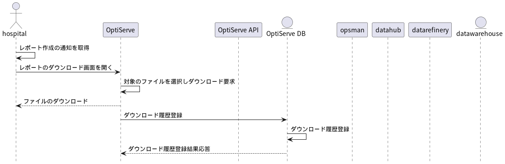

# 基本設計書）SMDS顧客管理ツール

**修正の履歴**

|Version|更新日|内容|
|:-:|:--|:--|
|1.0.0|2025-03-05|新規作成|
|1.1.0|2025-04-04|「3-8. 医療機関ユーザー＞機器台帳のメンテナンス」に<br>機器分類情報を追加|
|1.2.0|2025-06-18| PoC版の画面は別途画面仕様書を作成し、この仕様書の範囲外とした |

## 1. 目的と概要

### 1-1. 目的

本サービスは、SMDSの顧客がより満足度の高い情報を得る為のオンライン・プラットフォームを提供し顧客満足度を高める。また、顧客との取引管理の効率化を行うことで、運営側の作業時間短縮とミスの削減を目指す。

### 1-2. 概要

- SMDSプロジェクトは主に2つのフェーズに分かれる。この仕様書及び構築範囲はPhase1のみとなるが、その後のPhase2対応に向けて、現状明確になっている情報は記載しておく。ただし、情報は変更になる可能性もあので、参照にとどめること。

    - Phase1. 医療機関からの情報提供に対してレポートを作成して提供
    - Phase2(p2). 医療機関から集めた情報をメーカーに対して販売し、医療機関にポイントにてフィードバック

- 本サービスの利用者には「運用側スタッフ」「医療機関（ディーラー含む）」「医療器機販売メーカー」が存在し、それぞれで運用が異なる。

    - `運用側スタッフ`: アカウント管理、医療機関へのレポートの提供、(p2)顧客の掛け管理
    - `医療機関`: 医療機関の情報提供、提供してもらうレポートのカスタマイズ、(p2)ポイントの運用
    - (p2)`メーカー`: 提供してもらう医療機関の選択、請求・支払い管理

<div style="page-break-before: always;"></div>

## 2. システム構成

### 2-1. SMDS全体のシステム構成

- OptiServeはSMDSプロジェクト全体の中で、顧客との窓口部分を担当するサブシステムとなる。
- OptiServeと他サブシステム間はkintone APIを通じて行なわれるが、他サブシステムからOptiServeに対して問合せ・データ登録が行なわれるが、その逆のルートは存在しない。


システム構成図（project_smdsのドキュメントを参照）

### 2-2. システムアーキテクチャ

- 社外のアクセスも想定して、Kintoneを利用して構築。
- **Kintoneのメリット**
    - 社内実績あり
    - 基本的な機能はノーコードで構築可能（速やかなサービスイン）
- **Kintoneのデメリット**
    - 顧客数に応じてランニングコストが増える
    - Kintoneがローコードサービスのため、他のプラットフォームへの引越が出来ない

```text
サービスインを想定して、まずはKintoneで作成するが、仮に費用負担を望めない医療機関が100アカウントになった場合、年間のランニングコストは180万円となる為、現実的ではない。
その為、今後のアカウント数増を想定し、サービスイン後に、awsへのプラットフォーム引越し想定した見直しを進める必要あり。
```

### 2-3. システムフロー

#### 1. 医療器機ユーザー（もしくはメーカー）のログイン


<div style="page-break-before: always;"></div>

#### 2. ディーラーユーザーのログイン


<div style="page-break-before: always;"></div>

#### 3. 医療機関ユーザーの追加


<div style="page-break-before: always;"></div>

#### 4. ディーラーユーザーの追加


<div style="page-break-before: always;"></div>

#### 5. 担当ユーザーの変更

- kintoneの制約上、キーとなるメールアドレスの変更には管理者権限が必要となり、ユーザーが直接変更することは出来ない。その為、変更依頼をメールで依頼してもらい、管理者が対応する


<div style="page-break-before: always;"></div>

#### 6. 医療機関のファイルアップロード


<div style="page-break-before: always;"></div>

#### 7. 医療機関ユーザーのマスタメンテナンス


<div style="page-break-before: always;"></div>

#### 8. メーカーユーザーのマスタメンテナンス


<div style="page-break-before: always;"></div>

#### 9. レポートの作成と公開


<div style="page-break-before: always;"></div>

#### 10. レポートのダウンロード



<div style="page-break-before: always;"></div>

## 3. 機能設計

- 各機能別の画面を中心とした機能設計
- ログイン等はKintoneの標準機能をそのまま利用する為、対象外
- Phase1を対象とした

### 3-1. 管理者＞アカウントの仮登録

**001_管理者_アカウント仮登録.pdf** 参照

### 3-2. 管理者＞レポート出力ランク数設定

**002_管理者_レポート出力ランク数設定.pdf** 参照

<div style="page-break-before: always;"></div>

### 3-3. 管理者＞Tableau閲覧医療機関数設定

#### 画面設定：Tableau閲覧医療機関数設定

|項目名|種類|必須|入力制限|備考|
|:--|:--|:--:|:--|:--|
|検索キー|テキストボックス|任意|-|入力後は、メーカーコード、名称で検索（文字列は任意検索、正規表現は不要）し表示対象を絞る|
|メーカー情報|リスト|-|単行選択|メーカーコード、メーカー名、出力ランク数|
|メーカーコード|ラベル|-|-|リストで選択したものを表示|
|メーカー名|ラベル|-|-|リストで選択したものを表示|
|現在閲覧可能医療機関数|ラベル|-|-|リストで選択したものを表示|
|変更後閲覧可能医療機関数|数値|-|-||
|変更|ボタン|-|-|押下で閲覧医療機関数更新処理を行なう|
|閉じる|ボタン|-|-|押下でフォームを閉じる|

#### 処理：初期処理

1. ユーザーマスタに登録されているメーカーコードをキーとして`ComInfo`の情報を取得
2. メーカー情報リストに表示

#### 処理：閲覧医療機関数更新処理

1. `ComInfo`の`rankCount:出力ランク数`の情報を更新

<div style="page-break-before: always;"></div>

### 3-4. 医療機関ユーザー＞アカウントの基本情報登録

**003_顧客_アカウントの基本情報.pdf** 参照

<div style="page-break-before: always;"></div>

### 3-5. 医療機関ユーザー＞ディーラー権限の登録

#### 画面設定：ディーラー権限の登録

|項目名|種類|必須|入力制限|備考|
|:--|:--|:--:|:--|:--|
|ディーラーメールアドレス|テキストボックス|必須|メールアドレスとして成立|権限付与するメールアドレスを設定|
|付与権限|リストボックス|必須|1:ダウンロードサイト閲覧<br>2:マスタ情報の設定<br>3:全機能利用<br>9:無し|いずれかを選択|
|設定理由|複数テキストボックス|必須|-|理由は必ず記載する|
|登録ディーラー一覧|リストボックス|-|-|メールアドレス、権限をリスト表示、単行選択可能<br>選択時は入力フィールドに値をセット|
|新規|ボタン|-|-|押下で上記入力フィールドをクリア|
|更新|ボタン|-|-|押下でディーラー情報登録処理を実行|
|閉じる|ボタン|-|-|押下でフォームを閉じる

#### 処理：初期処理

1. `ディーラー権限マスタ`を取得
2. 取得した情報を付与権限リストにセット

#### 処理：ディーラー情報登録処理

1. メールアドレスの有効性チェック
    - ユーザーマスタに登録済み
    - ディーラーアカウントであること
2. `ディーラー権限マスタ`に登録（追加・更新）
    - 権限「なし」を選択した場合、レコードの削除は行なわずに理由とセットで残しておく

<div style="page-break-before: always;"></div>

### 3-6. 医療機関ユーザー＞データのアップロード

**004_顧客_ファイルアップロード.pdf** 参照

### 3-7. 医療機関ユーザー＞データのダウンロード

**005_顧客_レポートダウンロード.pdf** 参照

### 3-8. 医療機関ユーザー＞機器台帳のメンテナンス

**006_顧客_機器台帳メンテナンス.pdf** 参照

### 3-9. 医療機関ユーザー＞出力対象の機器分類のメンテナンス

**007_顧客_機器分類候補メンテナンス.pdf** 参照

<div style="page-break-before: always;"></div>

### 3-10. バックエンドサービス

バックエンドサービスはkintoneの機能ではなく、smds_datahub及びsmda_datarefineryが行なう。ここではOptiServeのAPI連携に関係するものだけを記載。

- kintone APIを利用してマスタ情報の更新処理(日次処理)
    - 医療機関マスタ
    - ディーラーマスタ
    - メーカーマスタ
    - 機器分類マスタ
    - 機器台帳情報
- kintone APIを利用してkintone側データの取得処理（月次処理）
    - データのクリーニング及び集計前に取得
    - 関連するデータは全て取得
- 医療機関アップロードファイルのダウンロード（日次処理）
    - 公開は月1回だが、月初から毎日チェックして存在したらダウンロード
    - ダウンロード後も上書き更新される可能性を考慮してチェックを継続
    - ダウンロードしたファイルはRAWテーブルに登録
    - ダウンロードしたファイルにエラーが存在する場合は通知
- レポートのアップロードと通知(月次処理)
    - レポート作成前にkintone側情報を取得
    - レポートのアップロードが終了したら対象者にメール通知を実施

<div style="page-break-before: always;"></div>

## 4. データ設計

作成されるデータには2種類が存在する。

1. 画面等と連動するKintone独自のデータ
2. smds_datahub, smds_datarefineryのデータからの同期処理で登録されるデータ（問合せのみ）

### 4-1. データベース設計

- 基本的なテーブル構成はER図参照
- 各テーブルには作成日、作成者、更新日、更新者等の項目は明記されていないので追加
- kintoneの構成的に必要なレコード情報あれば、追加・見直しを行なうこと

<div style="page-break-before: always;"></div>


<div style="page-break-before: always;"></div>


<div style="page-break-before: always;"></div>

### 4-2. データ容量

|データ内容|イニシャル件数|年間の増加件数|補足|
|:--|--:|--:|:--|
|アカウント情報|10|30|増えるならもっと増えてほしい|
|医療機関数|10|30|基本的にはアカウント情報と同程度<br>アカウントは1つの医療機関やディーラー、メーカーに対して複数登録可能|
|機器分類マスタ|50-500|0|1病院のみ500あるが、他は50前後<br>増加はほぼ無し|
|機器台帳（1病院あたり）|15,000|0|追加機器と破棄機器があるので<br>トータル数の大幅増は無い|

## 5. 運用プラットフォーム

- OptiServeはSaaSだが、そのプラットフォームはKintoneを想定している。
- kintoneは八神のドメインではなく、独自の契約を想定。
- ただし、Kintoneは1,500円/月人の費用が発生する為、アカウントが増えることでランニングコストが膨らむ。
- サービスインを優先してまずはKintoneで構築するが、同時にawsでのSaaSの構築も検討しておく

## 6. スケジュール

|期間(From)|機関(To)|作業|
|:--|:--|:--|
|2025-03|2025-03|概要設計|
|2025-03|2025-03|Kintone等実現性の調査|
|2025-04|2025-06|PoC版の作成(FrontEnd)|
|2025-07|2025-09|一部ユーザーを含めてのPoC検証<br>オンプレ連携部分は手作業を想定|
|2025-07|2025-09|オンプレ連携機能の作成|
|2025-10|2025-11|本番に向けた見直し|
|2025-12|-|（仮）運用開始|

以上
