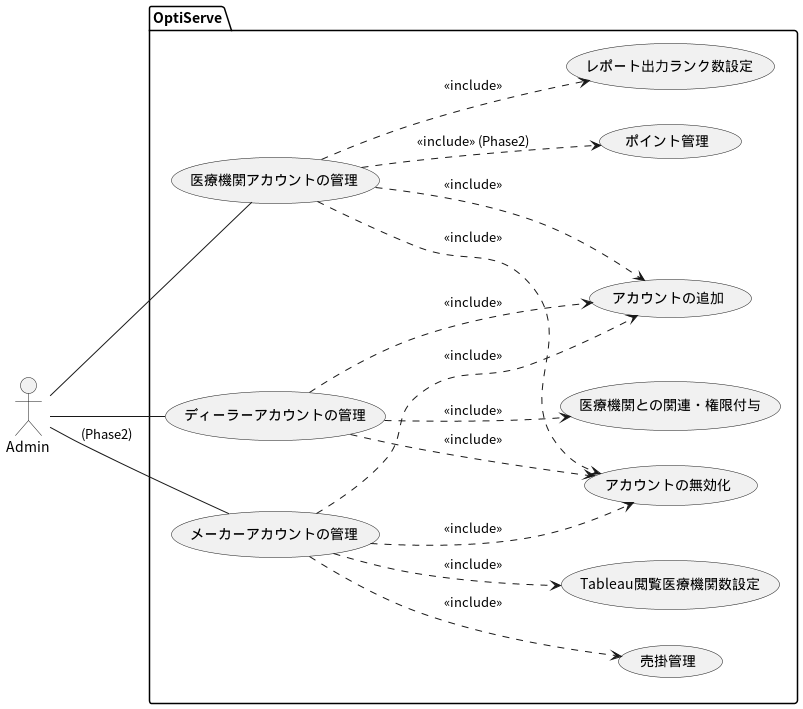
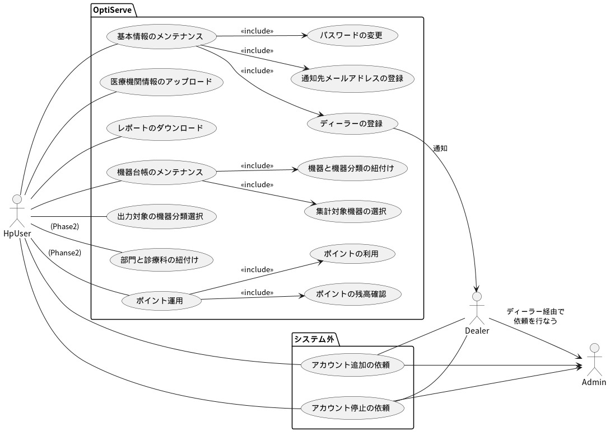
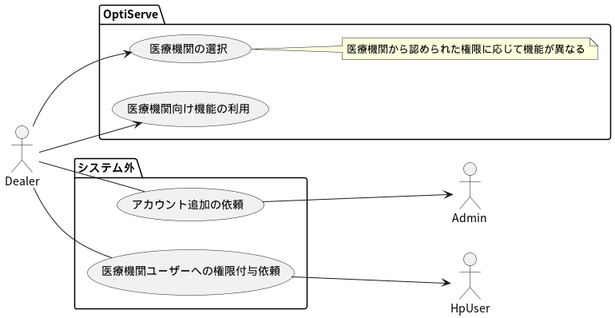
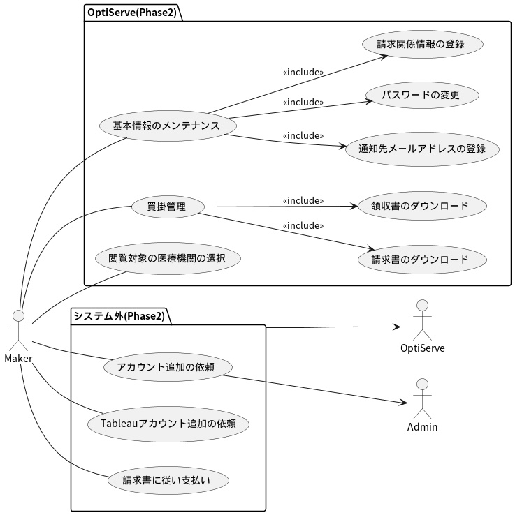

# 要件定義）SMDS顧客管理ツール

SMDSのメインストリームとしての顧客（メーカー・医療機関）への情報提供に伴い、顧客の管理及び顧客独自の提供内容のメンテナンスが発生します。  
本ドキュメントはそれらの要件やシナリオを整理していきます。

顧客の手に渡る情報の最適化（Optimaize）の為の機能を重点的に捕らえ、正式に決定するまではOptiServe（最適化のサービス提供の意）と名称を付けて情報を整理していきます

```text
【注意】
SMDSプロジェクトは大きく２段階のフェーズに分かれています。
Phase 1 : 医療機関側から提供される情報の充実と効率的なレポートの提供
Phase 2 : メーカーへの情報提供とポイント運用

要件定義書としてはPhase1を中心に記載しますが、概要としてPhase2の情報も記載しています。
Phase2部分に関しては(p2)と記載して明確にしています。
```

**更新の履歴**

|date|user|note|
|:--|:--|:--|
|2024.10.17|h.miyazawa|新規作成|
|2024.11.21|h.miyazawa|外部公開用に見直し|
|2025.03.04|h.miyazawa|ディラー情報及びデータ管理に関する情報の追加|

## 1. 目的と概要

### 1-1. 目的

本サービスは、SMDSの顧客がより満足度の高い情報を得る為のオンライン・プラットフォームを提供し顧客満足度を高める。また、顧客との取引管理の効率化を行うことで、運営側の作業時間短縮とミスの削減を目指す。

### 1-2. 概要

本サービスの利用者には「運用側スタッフ」「医療機関（ディーラー含む）」「医療器機販売メーカー」が存在し、それぞれで運用が異なる。

- `運用側スタッフ`:アカウント管理、医療機関へのレポートの提供、(p2)顧客の掛け管理
- `医療機関`:医療機関の情報提供、提供してもらうレポートのカスタマイズ、(p2)ポイントの運用
- (p2)`メーカー`:提供してもらう医療機関の選択、請求・支払い管理

### 1-3. 経緯

SMDSシステムのPocとして、医療機関向けレポート及びメーカー公開用の分析情報ダッシュボードの公開を行った。  
この時レポート等を閲覧いただいた関係者からは下記の意見が出た。

- 提供する情報の柔軟性（病院によって見たい内容が異なる）
- 他の病院との比較
- 価格に関する比較
- 情報に応じては集計値でなく、個別の情報の必要性

また、作成側としても下記意見が出た。

- 分母となる病院数をとにかく増やす必要があるが、この時自社スタッフや営業（ディーラー含む）の作業ボリュームが増えるのは現実的でない
- データのクリーニングで必要なグループ化は内部で全て行うのは不可能（提供側に対応してもらいたい）
- 病院や商品の提供以外の情報を集めて、分析内容を増やす（地域性や規模による分析）
- 医療機器管理システム以外の情報も集められるなら多く集めたい

これらのPoc経て顧客管理と成果物生成に伴うカスタマイズを行う為のインターフェースが必要と判断し、今回の要件定義書で検討するWebサービスの作成に繋がる。  
また、プロジェクトの進め方として、分母を増やすことを優先するため、メーカーへの販売より医療機関側の機能充足を図る。

## 2. 機能要件の整理

### 2-1. 管理者・運用者向け機能要件

- **運用頻度**:
    - 不定期（顧客契約時）

- **ユースケース**:

    


- **補足情報**:
    - `レポート出力ランク数設定`のデフォルトは`5`だが契約に応じて出力数を変更する可能性あり。
    - `Tableau閲覧医療機関数設定`のデフォルトは`5`だが契約に応じて出力数を変更する可能性あり。
    - `アカウントの追加`の登録項目は最低限に抑え、基本的にはユーザーが登録する。
    - `アカウントの管理`ではアカウントの削除は無く、`停止`状態にしておく。
    - 医療機関とディーラーの連携はN:Nの関係となる

### 2-2. 医療機関向け機能要件

- **運用頻度**:
    - データの送受信は月1回。
    - アカウント情報やカスタマイズは不定期だが、修正結果が反映されるのは月に1回なので、頻繁な更新は無いと思慮。

- **ユースケース**:

    

- **補足説明**:
    - ディーラーの作成は`管理者`が行なうが、医療機関との紐付けは`医療機関`が行なう。
    - ディーラー単意に権限の付与を行なう。権限により作業範囲が異なる。
        - ダウンロードサイト閲覧可能
            - 医療機器情報（台帳・貸出実績・故障実績）のアップロード
            - 医療機関向けレポートのダウンロード
        - マスタ情報の設定可能
            - マスタ関連のメンテナンス
        - 全機能利用可能（作業代行）
            - 医療機関管理者と同画面の利用
    - マスタの元となる機器台帳等の追加作業はシステム側で行なわれるので作業範囲外

### 2-5. ディーラー向け機能要求(Dealer)

- **運用頻度**:
    - 付与された権限に応じて異なるが、頻繁な更新は無いと思慮。

- **ユースケース**:

    

- **補足情報**:
    - 医療機関から付与される権限に応じて利用できる機能が異なる
        - ダウンロードサイト閲覧可能
            - 医療機器情報（台帳・貸出実績・故障実績）のアップロード
            - 医療機関向けレポートのダウンロード
        - マスタ情報の設定可能
            - マスタ関連のメンテナンス
        - 全機能利用可能（作業代行）
            - 医療機関管理者と同画面の利用
    - ログインすると、連携対処の医療機関の一覧が表示され、選択することで、医療機関と権限に応じた機能が利用可能となる

### 2-4. (p2)メーカー向け機能要求(Maker)

- **運用頻度**:
    - 買掛管理は月1回程度、アカウント情報やカスタマイズは不定期だが、修正結果が反映されるのは月に1回なので、頻繁な更新は無いと思慮する。

- **ユースケース**:

    

### 2-5. バックエンドサービス

- **システム前提**:
    - バックエンドのサービスはKintone側で構築せず、オンプレ側での構築を想定。
    - 必要な情報に更新があれば、毎日のバッチ処理でKintoneに提供。
    - バッチがメインとなるため、最大でも１日１度の更新となる。

- **機能一覧**:
    - 医療機関がアップロードした機器台帳・貸出実績・故障実績の取得
    - 医療機関向けレポートのアップロードと通知
    - 機器台帳情報のアップロード
    - 機器分類マスタのアップロード
    - 診療科マスタのアップロード
    - カスタマイズされた機器分類マスタの取得
    - カスタマイズされた診療科マスタの取得
    - カスタマイズされた部門マスタの取得
    - (p2)部門と診療科の連携情報マスタの取得
    - (p2)売掛買掛管理（別途検討）
    - (p2)メーカー向け請求書の発行
    - (p2)医療機関向けのポイント発生情報の発行

### 2-5. その他（機能・非機能）

- システムはSaaSでの提供とし、インターネット回線を利用して社外からのアクセスを可能とすること
- パスワードN回間違いによるロック等、基本的なセキュリティ対策が可能であること
- パスワードは管理者側でもアクセス不可とし、パスワード再設定はログイン画面から各ユーザーが行なう
    - 利用するサービスにこの機能が無い場合は運用を見直す
- サービスの利用はWindowsPC上のChrome及びEdgeからの接続が可能であること
    - スマートフォンのサイズは必須としない
- 作成したレポートや請求書等は7年程度保管する
    - クラウド上の保管コストが高い場合、一定期間を経過したものは、オンプレのみに保管して依頼に応じてメールで送付する等の提供でも問題無し
- ログ情報で上位レベルの場合、オンプレ側にもログ情報の提供を行なう
    - オンプレ側のシステムコンソールでOptiServeの状況も確認可能とする

## 3. データ容量について

OptiServeで管理するデータ容量について想定されるボリュームを整理する。  
Pocで取得した情報から想定した件数なので、増減する可能性あり。

|データ内容|イニシャル件数|年間の増加件数|補足|
|:--|--:|--:|:--|
|アカウント情報|10|20|増えるならもっと増えてほしい|
|診療科マスタ|700|0|SMDS標準としては100程度に絞りたい<br>厚生労働省の規制が無く現在700程度が登録|
|機器分類マスタ|50-500|0|1病院のみ500あるが、他は50前後<br>増加はほぼ無し|
|機器台帳（1病院あたり）|15,000|0|追加機器と破棄機器があるので<br>トータル数の大幅増は無い|

ファイルサイズについても下記程度。

|ファイル|サイズ(MB)|頻度|
|:--|--:|:--|
|医療機器台帳|3MB|月1回提供|
|貸出実績|10MB|↑|
|故障実績|1MB|↑|
|医療機関向けレポート関係|1MB|↑|

## 4. 運用プラットフォームについて

- OptiServeはSaaSだが、そのプラットフォームはKintoneを想定している。
- kintoneは八神のドメインではなく、独自の契約を想定。
- ただし、Kintoneは1,500円/月人の費用が発生する為、アカウントが増えることでランニングコストが膨らむ。
- サービスインを優先してまずはKintoneで構築するが、同時にawsでのSaaSの構築も検討しておく

## 5. スケジュール

|期間(From)|機関(To)|作業|
|:--|:--|:--|
|2025-03|2025-03|概要設計|
|2025-03|2025-03|Kintone等実現性の調査|
|2025-04|2025-06|PoC版の作成(FrontEnd)|
|2025-07|2025-09|一部ユーザーを含めてのPoC検証<br>オンプレ連携部分は手作業を想定|
|2025-07|2025-09|オンプレ連携機能の作成|
|2025-10|2025-11|本番に向けた見直し|
|2025-12|-|（仮）運用開始|

以上
