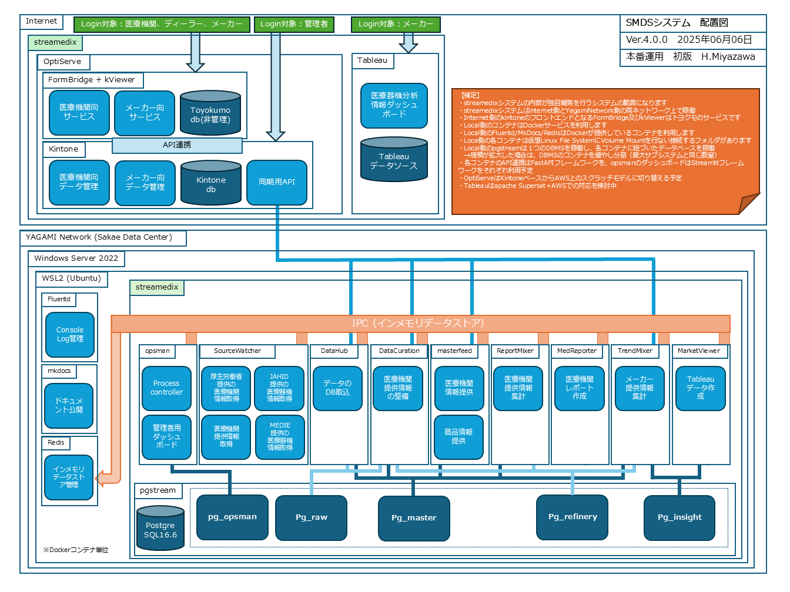

# AWS構築支援依頼

## 1. 本会議の目的（ゴール）

- プロジェクト全体における「OptiServe」サブシステムの役割を明確に共有
- 現在のOptiServeの開発・構築状況と課題を説明し、AWS移行に伴う支援を相談
- Phase 1における具体的なお願い事項を明示し、見積作成を依頼
- 将来的なPhase 2以降を見据え、技術的なパートナーとしての関係構築を検討

> 👥 本会議の最終ゴール：
> アイレット様に本プロジェクトの背景・構成・依頼範囲を把握いただき、
> **今後の段取りと見積作成が可能な状態にすること**

---

## 2. プロジェクトの概要（streamedix構想）

### ■ SMDS（Seiei Medical Data Service）プロジェクトとは

- 医療機関から、以下のようなデータ提供を受ける構想です：
  - 機器台帳（MEシステム等）
  - 機器貸出実績
  - 故障・不具合履歴
- 本番運用時には、**これらの情報を毎月自動収集**する形で運用
- データ提供は無償だが、**分析レポートを無償提供**することで医療機関側に価値を還元

> ※ 個人情報は一切含まれていません（機器単位・施設単位の情報）

### ■ メーカー・ディーラーとの関係性

- 医療機関から収集した情報を元に、**メーカー向けに集計・分析**
  - メーカーとは**サブスクリプション契約**を締結し、契約内容に応じて情報公開
  - 販売実績に応じて、**医療機関にもポイント等で還元**（＝買掛の仕組みが必要）
- 医療機関とメーカーの間には、**ディーラー（代理店）**が存在
  - ディーラーには、医療機関側の情報閲覧等の限定的権限を付与予定

---

### ■ streamedix（仮）システムの概要

- 本プロジェクトを実現するための統合業務基盤が「**streamedix（仮称）**」
- 現時点では以下のPoCが完了済み：
  - 医療機関向けのレポート出力機能（プロトタイプ）
  - メーカー向けの分析結果公開（Tableau 利用／今後は Apache Superset へ移行予定）
- 今後、以下のような**複数のサブシステム群**で業務を支援する構成を想定：

- OptiServeはその中核となる**社外連携APIプラットフォーム**
- 各サブシステム間は、FastAPI + PostgreSQL ベースのマイクロサービス構成を採用予定
- 最終的にはAWS上での統合運用を前提とし、現在はPoC環境（ローカルDocker）にて検証中

## 3. OptiServeの開発状況と構成

OptiServeは、医療機関・ディーラー・メーカーをつなぐ**社外連携APIプラットフォーム**としてstreamedixの中核を担う重要なサブシステムです。

### 🔹 現在の技術スタック

| 区分 | 使用技術 | 備考 |
|------|-----------|------|
| バックエンド | Python + FastAPI | 自社内で実装中 |
| フロントエンド | Next.js（TypeScript） | 新人エンジニア（インドネシア）が担当 |
| データベース | PostgreSQL | Dockerコンテナで運用中 |
| 開発環境 | Windows Server 2022 + WSL Ubuntu + Docker | ローカル環境にてPoC完了 |

### 🔹 フェーズ別の構築計画とリスク

| フェーズ | 主なユーザー | 提供機能 | 技術的リスク |
|----------|--------------|------------|----------------|
| Phase 1 | 医療機関 | マスタメンテ・レポート設定画面（10画面程度） | 低（自社開発可能、技術的に単純） |
| Phase 2 | メーカー・ディーラー・医療機関 | 売掛・買掛・ポイント連携、分析販売、権限制御 | 中〜高（開発規模拡大、セキュリティ・運用設計で支援が必要） |

#### ▪️ Phase 1 概要（現フェーズ）

- 対象は**医療機関のみ**
- 提供機能は、レポート出力のための**マスタ設定・管理画面**
- 開発対象は画面10枚程度、技術的な製造リスクは低く、**自社で対応可能**

#### ▪️ Phase 2 概要（将来計画）

- メーカー向けに販売を行うにあたり、**売掛（請求管理）**の仕組みが必要
- メーカーによるデータ購入に応じ、医療機関へ**ポイント還元（買掛）**を行う構想
- ボリュームベースや契約条件に応じた複雑な**取引ロジックや運用設計**が必要
- 対象ユーザーが増え、**セキュリティ（認可/権限）とインフラ拡張性の確保が課題**

> 💡 特記事項：医療機関から提供される情報には、**個人情報は含まれていません**。

### 🔹 想定する技術的サポート範囲

- **Phase 1**：インフラ構成・AWS移行に関する最小限の技術支援を希望
  - 小規模からスタートし、まずはクラウド環境での運用成功事例を作りたいと考えています
- **Phase 2**：会計系機能・権限設計・スケーラブルな構成に向けた全面的な構築支援も視野
  - 2026年4月頃に新人エンジニア（インドネシア籍）がもう1名参加予定ですが、対応リソースは依然として限られており、開発ボリュームに対して支援が不可欠と考えています

### 📆 今後のスケジュール（予定）

なお、Phase1に関しては以下のスケジュールで進行中です。

| 時期 | マイルストーン | 補足 |
|------|----------------|------|
| 2025年8月末 | 設計完了 | バックエンド・フロントエンド・AWS構成の初期設計含む |
| 2025年9月末 | PoC完了 | ローカル（Docker環境）にて基本機能を動作検証 |
| 2025年12月末 | AWSデプロイ完了・検証終了 | 本番相当環境での運用検証までを完了予定 |

Phase 2 は2026年末を目指していますが詳細スケジュールは未定です。

## 4. 自社体制とスキル範囲

本プロジェクトは現在、社内の少数精鋭チームにて進行中です。開発効率向上のため、ChatGPT等の生成AIツールも適宜活用しています。

### 🔹 担当者（宮澤）の経歴

- **SIer勤務：約15年**
  - PG／SE／PMとして従事
  - UNIX／Windows環境下でのバックエンド開発を中心に経験
  - 使用言語：C / C++ / SQL
- **商社 調達部門：約15年**
  - 社内業務改革の一環として、調達〜在庫管理〜販売管理までのシステムを自ら構築
  - 使用言語：C# / Python / VBA / SQL
- **セイエイ・エル・サンテ入社（2024年〜）**
  - streamedixプロジェクトにて、システム設計・開発・PoCを担当
  - 使用言語：Python（FastAPI）

### 🔹 担当領域別スキル整理

| 区分 | 担当者 | スキル・経験 |
|------|--------|---------------|
| システム設計 | 宮澤 | 要件定義〜DB設計、全体構成設計、ドキュメント整備 |
| バックエンド | 宮澤 | Python + FastAPI、PostgreSQL、Docker構成、UNIXベースの運用経験 |
| フロントエンド | ディオン | Next.js（TypeScript）、UI実装中心。業務開発は初経験。大学でAWS/Webの基礎学習あり |

> ⚠️ 現在はクラウド（AWS）構築経験が社内に無く、インフラ設計・セキュリティ構成・運用管理において外部支援が必要と判断しています。

## 5. アイレット様にお願いしたい内容（Phase 1：今回の見積依頼）

今回のご相談は、**OptiServeをAWS上に移行・構築するための最小構成に関する技術支援**と、**見積作成を目的とした範囲明確化**です。
将来的な拡張（Phase 2）も視野に入れつつ、まずは以下の項目について支援をお願いしたいと考えています。

### 🔹 技術支援・作業依頼の対象（見積対象）

- 現行ローカル構成（WSL Ubuntu + Docker）を踏まえた、**AWS構成案のご提案**
  - 例：EC2またはECS Fargate、RDS（PostgreSQL）、IAM構成など
  - コストを意識した段階的な構成を歓迎（将来拡張可能性を意識）
- **セキュリティ設計のアドバイス**
  - IAMポリシー、ネットワーク構成（VPC / サブネット / SG）、ログイン認証周り
  - アプリとインフラの責任分界を踏まえたベストプラクティスの共有
- **初期構築フェーズのフォロー（必要に応じて作業も含む）**
  - Dockerベースのアプリケーションを、AWS上で動作させる環境整備
  - ローカルからAWSへの「引越し」手順の確認と支援
- **実装面に関する助言・進捗会議への参加（月2回予定）**
  - コードレビュー・インフラ適合性の壁打ち
  - 作業状況の共有と早期の課題検知にご協力いただきたい

> 💬 我々としては、まずは「最小限の構成でクラウドサービスを成功させる」ことが重要と考えており、**コスト・拡張性・運用容易性の観点から適切なAWS構成を共に検討したい**と考えています。

---

## 6. 将来的に依頼する可能性のある内容（Phase 2）

Phase 1 にて OptiServe の基盤構築が完了した後、2026年以降を目途に以下のような拡張を計画しています。
これらは、**システム規模・複雑性・関係者の多様化**に伴い、社内開発体制だけでは十分に対応できない可能性があると考えており、必要に応じて Phase 2 における構築・運用支援をご相談させていただきたいと考えています。

### 🔹 Phase 2 で検討中の主な拡張要素

- **売掛／買掛管理機能の実装**
  - メーカーへのデータ販売に伴う請求（売掛）処理
  - 医療機関へのポイント付与に伴う支払い管理（買掛）
  - 会計処理との連携を見据えた設計・権限管理が必要

- **ポイント制度の導入と運用ロジックの構築**
  - データ提供ボリュームや契約条件に応じて、医療機関にポイントを還元
  - 複雑な計算ロジックや契約ベースの分配比率などをシステム化

- **ユーザー／権限管理の強化**
  - 医療機関・ディーラー・メーカーの各立場に応じた**アクセス権制御**
  - ロールベースアクセス制御（RBAC）や複数組織管理などへの対応

- **本番運用に向けた可用性・監視体制の構築**
  - 冗長構成、スケーラビリティの確保（Auto Scaling, ALBなど）
  - CloudWatch や GuardDuty など AWS標準監視ツールの活用

- **CI/CD（継続的デプロイ）体制の構築**
  - GitHub Actions や AWS Codeシリーズを活用した自動化の支援

> 💬 これらの機能は段階的に実装予定ですが、**当社チームのみでフルスケールの本番環境を構築・運用するには限界があると想定**しており、今後も適切なタイミングでご相談させていただければ幸いです。

## 7. 最後に（我々の考え）

本プロジェクトにおいて、私たちは **自社で可能な範囲は自力で開発・構築を進めたい**という強い意思を持っています。
そのために、ChatGPTやClaudeなどの生成AIも積極的に活用しながら、少人数でも最大限の成果を出せるよう努力しています。

一方で、社会に公開・提供するシステムとしては、**安定性・セキュリティ・信頼性**の担保が不可欠です。
特に、AWS環境への構築や本番運用に関する知見・経験については、**実績ある外部パートナーの支援が必要**であると認識しています。

今回は、AWS様からのご紹介というご縁もあり、**クラウド構築のプロフェッショナル集団であるアイレット様**に、ぜひご支援いただきたいと考えています。

もちろん、見積内容やご提案の内容によっては、貴社と慎重に相談しながら最適な形を模索できればと思っております。
まずはPhase1における技術支援のご協力をお願いできれば幸いです。

> 💬 streamedixの成功は、医療現場とメーカーの双方にとって意義ある変革になると信じています。

> 医療現場では、現場単位での最適化は進んでいるものの、**医療DXとしての全体最適・データ活用が進んでいない実情**があります。
> 私たちは、まずは**無償で始められるデータ活用の第一歩**として、streamedixを通じたレポート提供を行うことで、**医療機関がリスクなくデータドリブンに触れるきっかけ**を提供したいと考えています。

> また、メーカー側にとっても、**大規模病院に対する自社診療科単位での独自調査は進んでいる一方で、中小病院の全体像を把握できていない**という課題があります。
> streamedixは、そうした未可視領域に対して**横断的な分析結果を届けることで、メーカーの戦略立案やサービス改善に役立つ情報資源を提供するプラットフォーム**でもあります。

> 限られた体制ではありますが、**ともに社会に価値を提供する仲間として、今後の協力関係を築いていけることを心から楽しみにしています。**

## 8. 今後の進め方（ご相談ベース）

- 本日お伝えした内容を踏まえ、ご検討のうえ以下の点をご相談させていただければ幸いです。
  - Phase 1における見積作成の可否・おおよそのスケジュール
  - ご提案いただける技術構成や運用方針（必要に応じて再打ち合わせ）
  - 今後の連携方法（進捗会議や窓口の調整など）

以上
