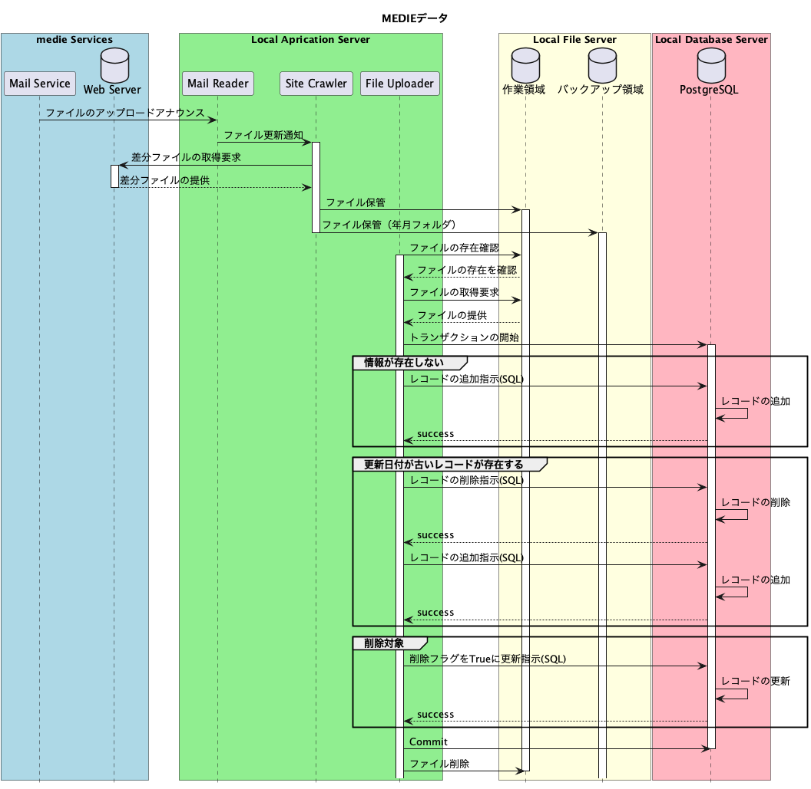

# 設計情報：Kintoneサービスファイル・アクセス権限管理

ファイルのアップロードからバックアップまでの領域とアクセス権限について定義。  
各権限の全てはインフラでコントロール出来るわけではないので、プログラム側でも意識して開発。  

**更新の履歴**

|date|user|note|
|:--|:--|:--|
|2024.07.22|h.miyazawa|新規作成|

## 1. インフラ・フォルダとアクセス権限

### 1-1. アプリやサービス群

※ アプリはあくまでもカテゴリーでプログラム単位では無い。

|No.|アプリ・サービス名|アプリ・サービス内容|
|--:|:--|:--|
|1|kintone|kintoneのアプリ本体|
|2|kintone UpLoader|API経由でファイルサーバの情報をkintoneにアップロード|
|3|kintone DownLoader|API経由でkintoneのデータをファイルサーバにダウンロード|
|4|kintone Batch|APIを利用してkintone側でバッチ処理を実施|
|5|Database Uploader|提供された情報をオンプレDBに登録・更新するアプリ群|
|6|Database Summary|提唱されたデータから集計し必要の資料を作成するアプリ群 ファイルアクセス権限の場合は医療機関向けレポートが対象|

### 1-2. アプリ・サービス群とフォルダへのアクセス権  

- C:Create(作成)
- R:Read(問合せ)
- U:Upload(更新)
- D:Delete(削除)

|No.|インフラ|フォルダ|kintone|kintone UpLoader|kintone DownLoader|kintone Batch|Database Uploader|Cleaner Summary|
|--:|:--|:--|:-:|:-:|:-:|:-:|:-:|:-:|
|1|kintone|医療機関提供情報|CRD|CRD|CRD|×|×|×|
|2|kintone|医療機関向けレポート|CRD|CRD|×|×|×|×|
|3|kintone|請求書・領収書|R|×|×|CRUD|×|×|
|4|FileServer|医療機関提供情報|×|×|CR|×|RD|×|
|5|FileServer|医療機関提供情報バックアップ|×|×|CR|×|×|×|
|6|FileServer|医療機関向けレポート|×|RD|×|×|×|CRU|
|7|FileServer|医療機関向けレポートバックアップ|×|×|×|×|×|CR|
|8|FileServer|Medieデータ|×|×|×|×|CRD|×|
|9|FileServer|Medieデータバックアップ|×|×|×|×|CR|×|
|10|FileServer|JAHIDデータ|×|×|×|×|CRD|×|
|11|FileServer|JAHIDデータバックアップ|×|×|×|×|CR|×|
|12|FileServer|厚労省データ|×|×|×|×|CRD|×|
|13|FileServer|厚労省データバックアップ|×|×|×|×|CR|×|

## 2. マスタデータの取込の流れ

マスタデータとなるMedieデータ、JAHIDデータ、厚労省データは提供方法が異なるものの、その後の処理の流れは同一となる。そのシーケンス図を例として定義。

### 2-1. 医療機関提供データ

### 2-2. MEDIEデータ

以上
