# PostgreSQLのStoredProcedureでkintone連携を行う

**修正の履歴**

|Version|更新日|内容|
|:-:|:--|:--|
|1.00|2024.07.16|新規作成|

## 1. 概要

SMDSにてデータ整備の基本はローカルデータセンタのPostgreSQLとなる。ただしこの情報をリアルタイムにkintoneと連携しクラウド側でも利用する必要がある。その為、ポスグレ側のデータ更新イベントを利用してkintone連携を行う。　　
※kintoneの更新イベントをリアルタイムにポスグレに連携する方法は無いので、こちらは別のプログラムを作成する  

### 1-1. 仕組み

ポスグレ側の対象のテーブルにトリガーイベントを登録。  
トリガーで実行するストアドプロシージャをPython(実際はPl/Python)を利用することで、直接REST　APIを利用してデータ操作を実施。  
ストアドプロシージャは追加・更新・削除に対応。

## 2. サンプルの構成

kintone,PostgreSQLの設定は下記となる。

### 2-1. kintoneアプリ名

ポスグレ連携テスト

### 2-2. PostgreSQL側テーブル名

msthospital  
※　今回は検証用にpostgresDBを利用した

### 2-3. 列情報

|kintone\nフィールド名|kintone\nフィールドタイプ|kintone\nフィールドコード|postgresql\n列名|postgresql\n型|
|:--|:--|:--|:--|:--|
|管理番号|数値|serial_id|serial_id|serial|
|病院名|文字列1行|hpname|hpname|text|
|登録者|文字列1行|reguser|reguser|text|
|登録日|日付|regdate|regdate|date|

## 3. kintone側アプリ設定

### 3-1. アプリ作成

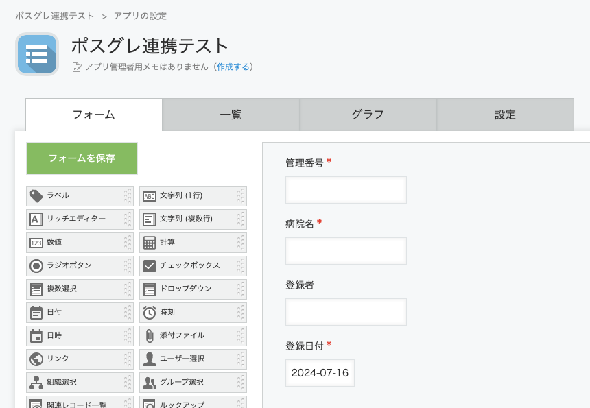

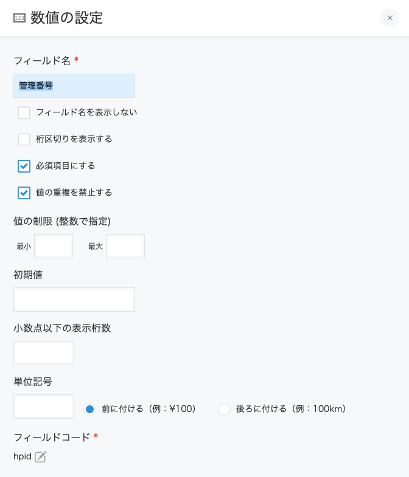

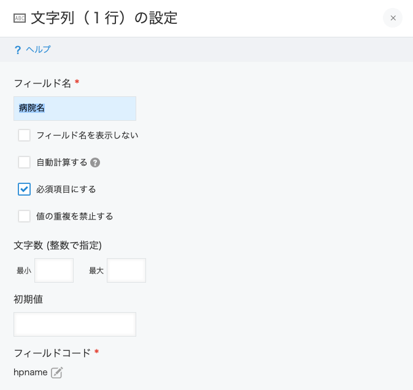

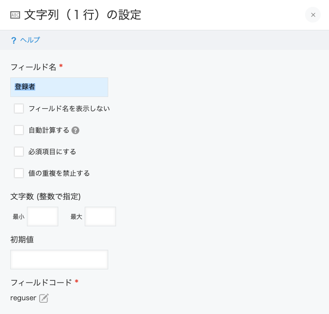

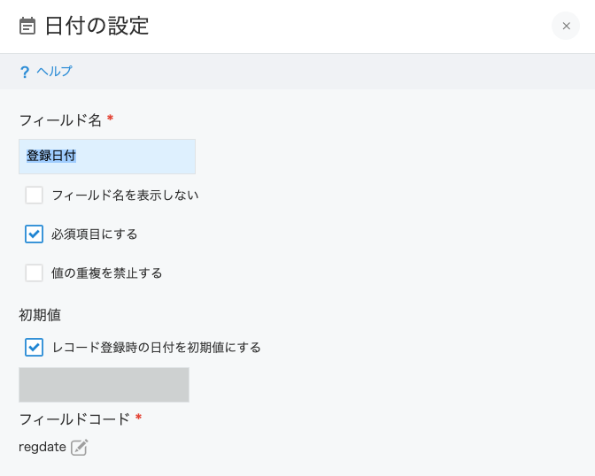

### 3-2. APIトークン取得

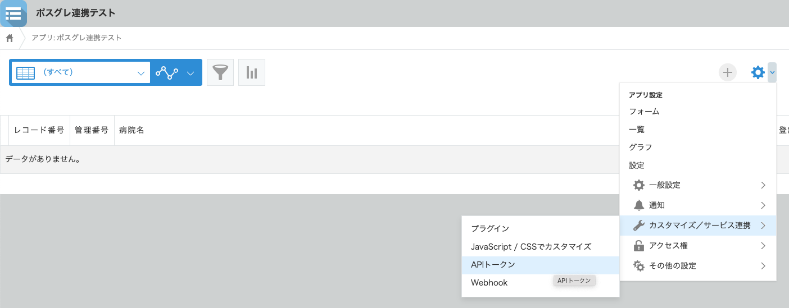

APIトークンは「生成する」ボタンをクリックすると生成される。  
アクセス権はアプリ管理以外はチェックを入れる。

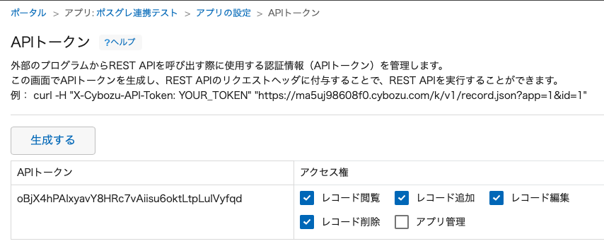

### 3-3. アプリID取得

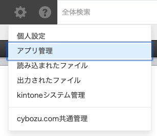

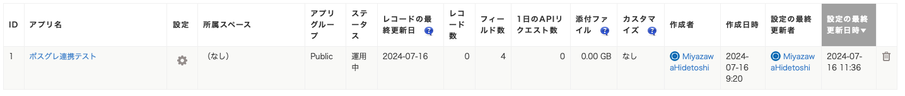

## 4. PostgreSQL側設定

### 4-1. テーブル

```SQL
create table msthospital (
    hpid serial,
    hpname text,
    reguser text,
    regdate date
);
```

### 4-2. PostgreSQL側トリガーファンクション登録

kintone側アプリを作成し、必要なトークンやID情報を取得したら、その情報を利用してポスグレ側のトリガーファンクションを作成。
plpytyon3uの登録に関しては後述。

**SMDS/sql/ctruns_relay_to_kintone.sql**  

```SQL
CREATE OR REPLACE FUNCTION relay_to_kintone() RETURNS TRIGGER AS $$

import urllib
import requests
import json

# 連携するアプリID
app = 1

# 連携するドメイン
domain = 'ma5uj98608f0.cybozu.com'

# 連携するアプリのAPIトークン
token = 'oBjX4hPAIxyavY8HRc7vAiisu6oktLtpLuIVyfqd'

# PostgreSQLのserial列名
relay_column = 'hpid'

class Kintone:
    # initialize
    def __init__(self, app, domain, token, relay_column):
        self.app = app
        self.domain = domain
        self.token = token
        self.relay_column = relay_column

    # 更新、削除のためにkintoneのレコード番号を取得
    def get_record_id(self):
        url = 'https://' + self.domain + '/k/v1/records.json'

        headers = {
            'X-Cybozu-API-Token': self.token,
            'Content-Type': 'application/json'
        }

        data = {
            'app': self.app,
            'query': self.relay_column + ' = "' + str(TD['old'][self.relay_column]) + '"',
            'fields': ['$id'],
            'totalCount': 'true'
        }

        res = requests.get(url, headers=headers, data=json.dumps(data))

        total_count = res.json()['totalCount']
        if total_count == '1':
            return res.json()['records'][0]['$id']['value']
        else:
            message = self.relay_column + ': ' + str(TD['old'][self.relay_column])
            message += 'が' + str(total_count) + '件あります'
            plpy.fatal(message)

    # レコードの登録
    def insert_record(self):
        url = 'https://' + self.domain + '/k/v1/record.json'

        headers = {
            'X-Cybozu-API-Token': self.token,
            'Content-Type': 'application/json'
        }

        # 列名やフィールドタイプなどが異なる場合は要書き換え
        data = {
            'app': app,
            'record': {
                self.relay_column: { 'value': TD['new'][self.relay_column] },
                'hpname': { 'value': TD['new']['hpname'] },
                'reguser': { 'value': TD['new']['reguser'] },
                'regdate': { 'value': TD['new']['regdate'] }
            }
        }

        res = requests.post(url, headers=headers, data=json.dumps(data))

        message = self.relay_column + ': ' + str(TD['new'][self.relay_column])
        if res.status_code == 200:
            message += 'を登録しました'
            plpy.info(message)
        else:
            message += 'の登録に失敗しました'
            plpy.error(message)

    # レコードの更新
    def update_record(self, update_id):
        url = 'https://' + self.domain + '/k/v1/record.json'

        headers = {
            'X-Cybozu-API-Token': self.token,
            'Content-Type': 'application/json'
        }


        # 列名やフィールドタイプなどが異なる場合は要書き換え
        data = {
            'app': self.app,
            'id': update_id,
            'record': {
                'hpname': { 'value': TD['new']['hpname'] },
                'reguser': { 'value': TD['new']['reguser'] },
                'regdate': { 'value': TD['new']['regdate'] }
            }
        }

        res = requests.put(url, headers=headers, data=json.dumps(data))

        message = self.relay_column + ': ' + str(TD['new'][self.relay_column])
        if res.status_code == 200:
            message += 'を更新しました'
            plpy.info(message)
        else:
            message += 'の更新に失敗しました'
            plpy.error(message)

    # レコードの削除
    def delete_record(self, delete_id):
        url = 'https://' + domain + '/k/v1/records.json'

        headers = {
            'X-Cybozu-API-Token': self.token,
            'Content-Type': 'application/json'
        }

        data = {
            'app': self.app,
            'ids': [delete_id]
        }

        res = requests.delete(url, headers=headers, data=json.dumps(data))

        message = self.relay_column + ': ' + str(TD['old'][self.relay_column])
        if res.status_code == 200:
            message += 'を削除しました'
            plpy.info(message)
        else:
            message += 'の削除に失敗しました'
            plpy.error(message)


kintone = Kintone(app, domain, token, relay_column)

if TD['event'] == 'INSERT':
    kintone.insert_record()
elif TD['event'] == 'UPDATE':
    update_id = kintone.get_record_id()
    kintone.update_record(update_id)
elif TD['event'] == 'DELETE':
    delete_id = kintone.get_record_id()
    kintone.delete_record(delete_id)

return 'OK'

$$ LANGUAGE plpython3u;
```

### 4-3. トリガー登録

```SQL
CREATE TRIGGER kintone_trigger
    AFTER INSERT OR UPDATE OR DELETE ON msthospital
    FOR EACH ROW EXECUTE PROCEDURE relay_to_kintone();
```

これで関数登録と、トリガー利用の設定が完了。  
下図はpgAdminの登録画面。  

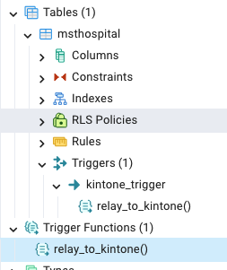

これで両環境のセットアップは完了。  
PostgreSQL側でデータ追加・更新・削除を実施すると、kintone側のアプリにリアルタイムに反映される。  

## 5. (補足)PostgreSQLのPL/Python登録

開発環境macへのPostgreSQLのセットアップはbrewでなくEDBのインストーラを利用しているので、追加環境の登録もインストーラから実施する。  

### 5-1. StackBuilderを利用したセットアップ

アプリからApplication StackBuilderを起動

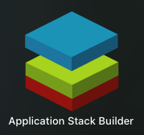

対象のDBを選択

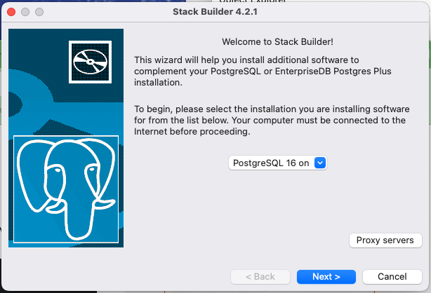

EDB Language Packを選択

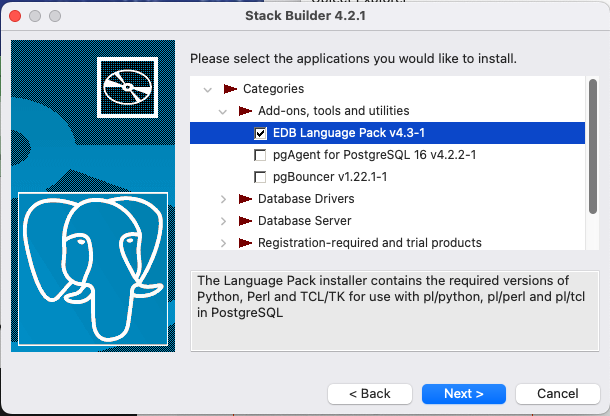

ダウンロード先は、/Library以下の正しい場所でなく、インストーラのダウンロード先なので、デフォルトでOK（変更しようとしたけど、変更出来なかった）

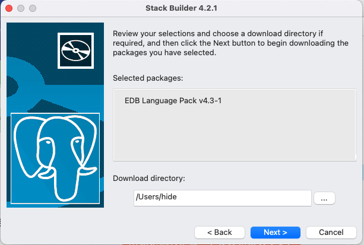

ここからは流れに任せて進めて問題無し

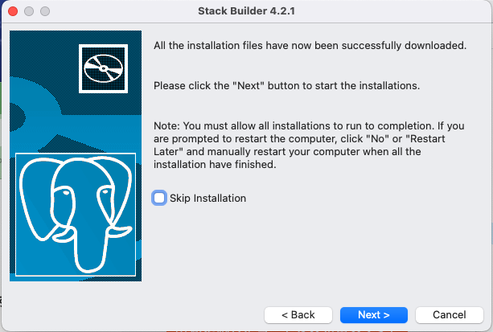

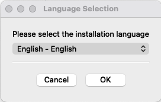

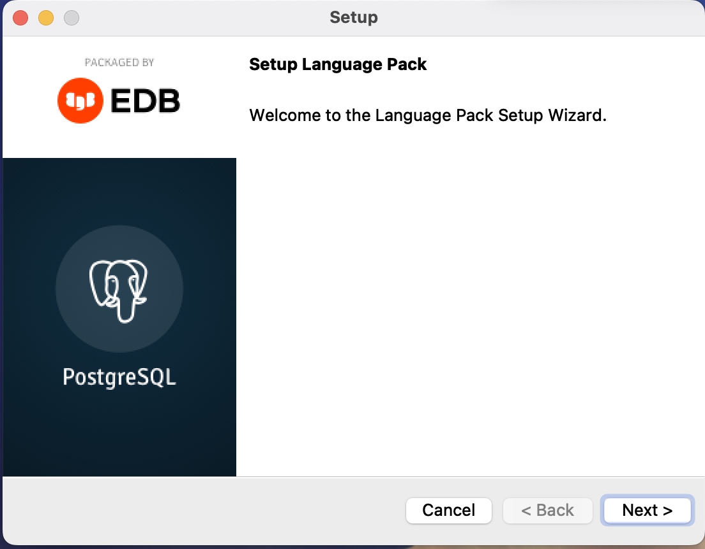

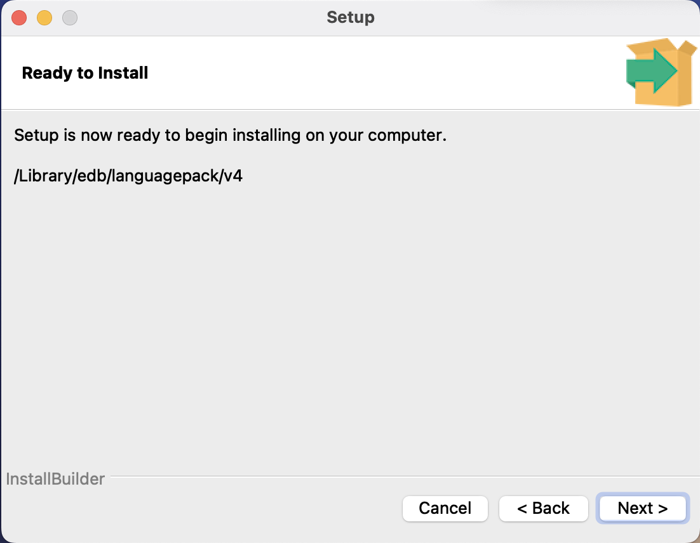

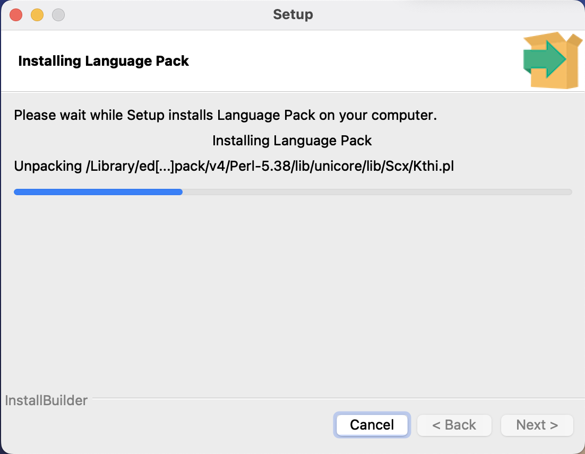

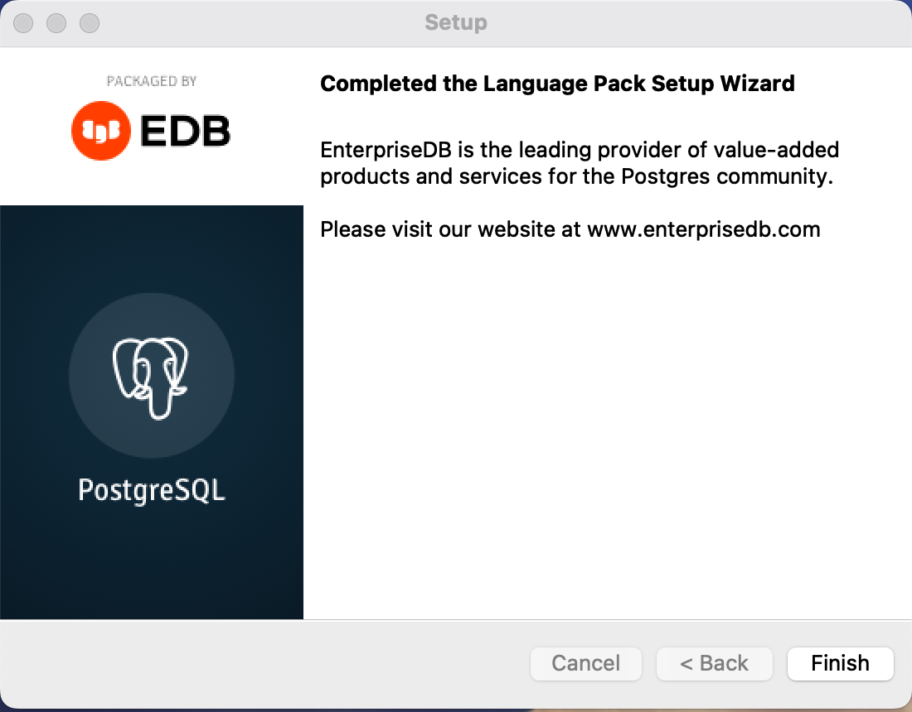

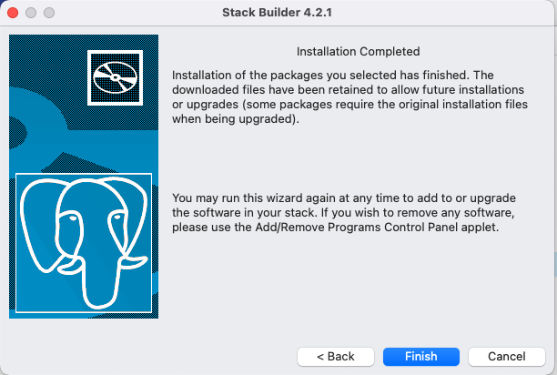

正しくセットアップが行われると、pgAdminでも確認できる

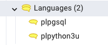

### 5-2. 登録したｐｌｐｙｔｈｏｎを対象ＤＢに登録

言語パックはDB単位に登録されるので、対象のDB下でコマンドによる登録が必要

```SQL
create extension plpython3u;
```

<処理結果>

```TEXT
CREATE EXTENSION
Query returned successfully in 1 secs 284 msec.
```

登録確認もSQLで対応可能

```SQL
select * from pg_language;
```

<処理結果>

|oid|lanname|lanowner|lanispl|lanpltrusted|lanplcallfoid|laninline|lanvalidator|lanacl|
|--:|:--|--:|:--|:--|--:|--:|--:|:--|
|12|internal|10|false|false|0|0|2246||
|13|c|10|false|false|0|0|2247||
|14|sql|10|false|true|0|0|2248||
|13808|plpgsql|10|true|true|13805|13806|13807||
|23786|plpython3u|10|true|false|23783|23784|23785||

### 5-3. 登録時に発生した障害対応

insertからのトリガーでファンクションが実行した時点でエラーが発生

```text
insert into msthospital (hpname, reguser, regdate)
    values ('テスト病院', 'h.miyazawa@seiei-ashd.co.jp', current_date);


ERROR:  ModuleNotFoundError: No module named 'requests'
CONTEXT:  Traceback (most recent call last):
  PL/Python function "relay_to_kintone", line 4, in <module>
    import requests
PL/Python function "relay_to_kintone" 

SQL state: 38000
```

requestsモジュールが存在しないというエラーだが、通常利用しているpythonではライブラリーは存在しており、この保管場所はポスグレ用に独立している。  
対策として、ポスグレ用のpythonにライブラリ登録を行う必要がある。

保管先はセットアップ時に指定されていたパス情報から探したもの。  

```shell
% pwd
/Library/edb/languagepack/v4/Python-3.11/bin

% sudo ./python3 -m pip install requests -t /Library/edb/languagepack/v4/Python-3.11/lib/python3.11
```

作業後にライブラリの中にrequestsが登録されたら正常に処理されるようになった。

## 6. credit

下記サイトがとても参考になった。  
[https://qiita.com/YoshihikoTakeuchi/items/a6af7b5adfbf8bafb7fd](https://qiita.com/YoshihikoTakeuchi/items/a6af7b5adfbf8bafb7fd)

以上
